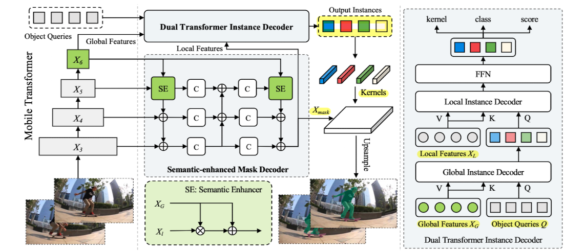
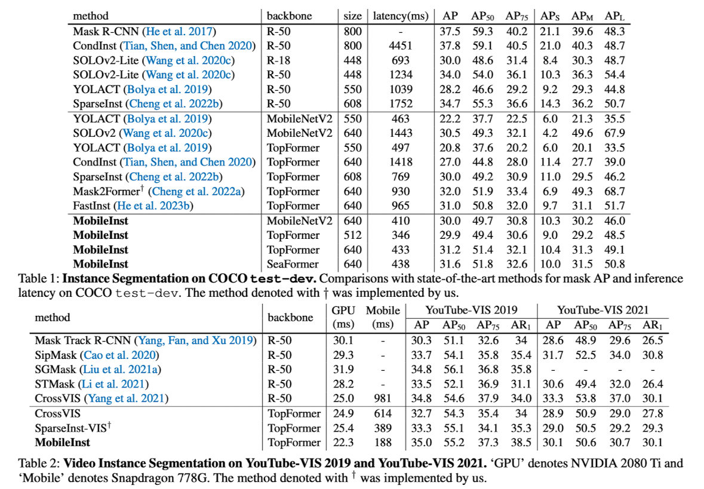

> This post summarizes the paper "MobileInst: Video Instance Segmentation on the Mobile," presented at AAAI 2024.

### Introduction

Performing instance segmentation on video data in mobile environments is important but remains a challenging task. Mask inference for each instance on a per-frame basis demands substantial computation and memory, and tracking those instances/objects is also far from trivial. To address this, the paper proposes MobileInst, a method specifically designed for video instance segmentation in mobile settings.

1. [*Architecture*] It adopts mobile vision transformer architectures (e.g., TopFormer, SeaFormer) that leverage multi-level semantic features.
2. [*Efficiency*] It proposes a query-based (e.g., DETR) dual-transformer instance decoder and a semantic-enhanced mask decoder.
3. [*Object tracking*] It employs kernel reuse and kernel association methods.

### MobileInst

##### Overall Architecture

MobileInst first leverages a mobile transformer architecture to utilize multi-level pyramid features. Following the previously proposed TopFormer (Zhang et al.) and SeaFormer (Wan et al.), the architecture consists of connected conv blocks and transformer blocks, extracting both local and global features for joint utilization.

1. Given an input image, local features ($X_3,X_4, X_5$) and global features ($X_6$) are extracted.
2. The global features are passed to the Dual Transformer Instance Decoder, while the multi-level features (local & global) are passed to the Semantic-Enhanced Mask Decoder.

##### Dual Transformer Instance Decoder

The dual transformer, which structurally follows the mobile transformer backbone, adopts the object query approach of query-based detectors like DETR. The object queries proposed in DETR improve inference efficiency by eliminating hand-designed, heuristic post-processing methods such as NMS and RPN, unlike previous dense detector approaches. (For more details on DETR, please refer to [this earlier post](https://yuhodots.github.io/deeplearning/23-08-19/#detr-detection-transformer).)

The reasons for using object queries in the instance segmentation task are as follows:

1. Since queries are trained to capture visual instances in the foreground of an image, they are guaranteed to encode instance features.
2. Since each query is trained to match a single object, N query predictions correspond to N instance predictions.
3. The same object query across different adjacent frames tends to capture/represent the same instance.

However, using the original 6-stage decoder is computationally expensive, and simply reducing the number of layers leads to performance degradation. Therefore, the original DETR decoder structure is modified into a 2-stage dual decoder consisting of a global instance decoder and a local instance decoder.

- Global instance decoder: Performs attention with the global features as key and value, and the object queries as queries. Through this step, the high-level semantics and coarse localization information contained in the global features are channeled into the object queries.
- Local instance decoder: Performs attention with local features as key and value, and the object queries as queries. Here, the local features used are the mask features output by the semantic-enhanced mask decoder (downsampled to 1/64 for efficiency).

##### Semantic-enhanced Mask Decoder

To handle objects at multiple scales, top-down and bottom-up multi-scale fusion is employed, similar to FPN. The authors claim that a module called the semantic enhancer is introduced to enrich contextual information by sufficiently mixing global features. However, since the meaning and novelty of this module are not clearly discussed, I personally consider it to have little structural difference from FPN.

In the figure, C denotes a 3x3 convolution, and the output $X_\text{mask}$ is at 1/8 scale. The final segmentation mask is obtained through $X_\text{mask}$ and the kernel.

##### Tracking with Kernel Reuse and Association

As briefly mentioned in the DETR paper, the same query tends to represent the same region/object. This means the mask kernel can serve as a mechanism for tracking the same instance. Instead of computing kernels anew for every frame, the authors introduce a kernel reuse method that uses the same kernel from the previous frame for adjacent frames.
$$
\begin{aligned}
M^t & =K^t \cdot X_{\text {mask }}^t \\
M^{t+i} & =K^t \cdot X_{\text {mask }}^{t+i}, i \in(0, \ldots, T-1)
\end{aligned}
$$
However, this approach is not guaranteed to work properly for long-time sequences or frames with abrupt changes. To address this, the query matching method proposed in MinVIS (Huang, Yu, and Anadkumer) is applied to kernels (i.e., kernel association). (*TODO: add details on query matching*)

##### Temporal Training via Query Passing

A training method is also proposed to ensure the model sufficiently leverages temporal information not only during inference but also during training. Since kernels from adjacent frames will be reused during inference, the training process is designed to encourage the model to learn this behavior from the start.

1. Frames $t$ and $t+\delta$ are randomly sampled.
2. Global features from time $t$ are used, while local features and mask features from time $t+\delta$ are used to produce the mask output.
3. This mask output is compared against the target mask at time $t+\delta$ to compute the loss and train the model.

##### Loss Function

The loss function directly adopts the bipartite matching loss from DETR and the image/video instance segmentation loss from SparseInst (Cheng et al).
$$
\mathcal{L}=\lambda_c \cdot \mathcal{L}_{c l s}+\lambda_{m a s k} \cdot \mathcal{L}_{m a s k}+\lambda_{o b j} \cdot \mathcal{L}_{o b j}
$$

### Experiments

Experiments were conducted on COCO test-dev and YouTube-VIS datasets.

