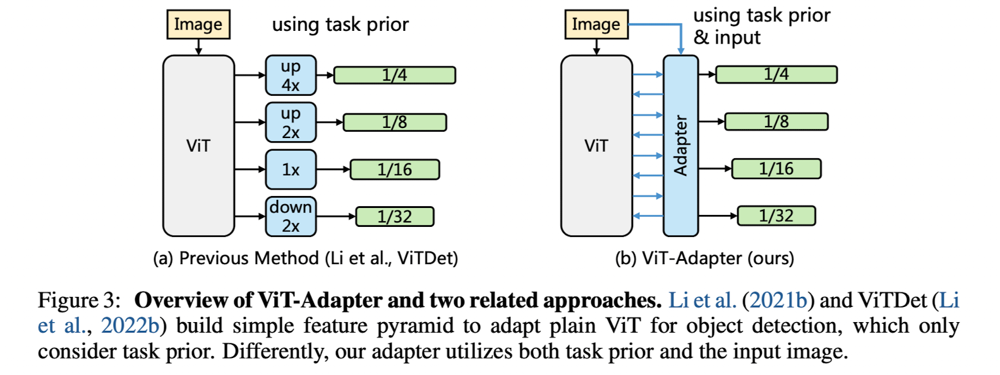
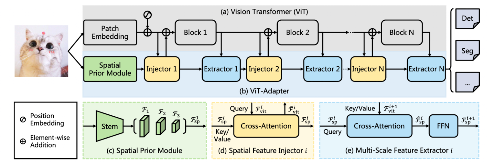
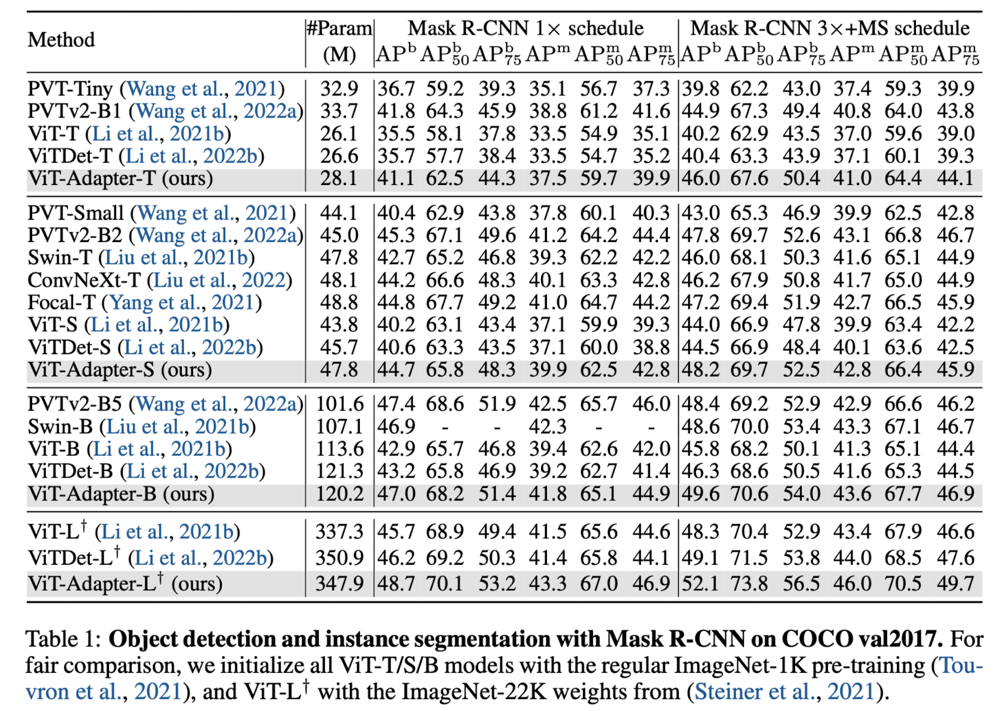
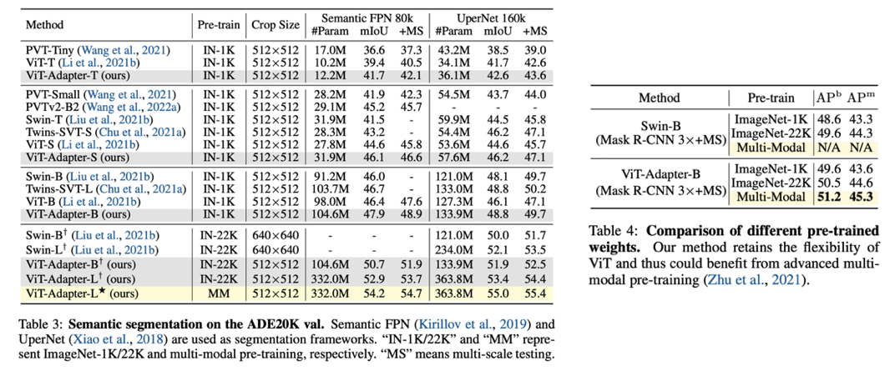

> This post summarizes the Vision Transformer Adapter for Dense Predictions paper, selected as a Spotlight at ICLR 2023.

### Introduction

Since the advent of ViT, transformer architectures have been actively adopted across various vision tasks. However, plain (vanilla) ViT does not perform particularly well on dense prediction tasks such as object detection and image segmentation. This is because extracting multi-resolution features and spatial features effectively is crucial for dense prediction tasks, yet ViT lacks image-related prior knowledge. As a result, models with image-related inductive biases, such as SwinT, are commonly used for vision-specific tasks.

However, SwinT-like models have the drawback of requiring full model fine-tuning during transfer learning, and they are limited to using only SwinT-based pre-trained weights during the pre-training stage. The authors of this paper therefore propose ViT Adapter, a structure that improves performance on vision-specific tasks while preserving the flexibility of ViT. By keeping the ViT architecture intact, there are no assumptions about the input data format, which enables leveraging various multi-modal data during pre-training and, consequently, learning semantic-rich representations.

### Related Works

##### ViTDet

One approach that uses the ViT architecture for dense prediction is ViTDet. However, it lacks a mechanism for injecting features into ViT, and it only utilizes ViT's intermediate features rather than using the input image as input to a new module, which distinguishes it from ViT Adapter.

For an explanation of ViT, please refer to [this earlier post](https://yuhodots.github.io/deeplearning/23-05-27/).

##### Adapter

Adapter is one of the early methods of Parameter Efficient Fine-Tuning (PEFT), proposed in 2019. It adds a small number of weights to the Transformer architecture so that fine-tuning only a subset of weights can achieve an effect comparable to fine-tuning the entire LLM. In even earlier work, this approach was also applied to inference learning tasks.

### Vision Transformer Adapter

##### Overall Architecture

The overall structure of ViT Adapter is as follows.

1. An image is fed into the Spatial Prior Module. This produces spatial feature maps at three target resolutions. These feature maps are flattened and concatenated before being passed to the next layer, the Spatial Feature Injector.
2. In the Spatial Feature Injector, cross-attention is performed between the ViT features and the spatial features, and the resulting features are injected back into the ViT.
3. In the next layer, the Multi-Scale Feature Extractor, cross-attention between the ViT features and spatial features is performed again to enhance the spatial features.
4. This process is repeated N times, and the final features are split back into three target resolutions and reshaped accordingly.
5. The resulting multi-resolution features are then used for the dense prediction task.

##### Spatial Prior Module

The Spatial Prior Module is designed to extract local semantics (spatial priors) using a CNN architecture.

1. It directly adopts the standard convolutional stem structure from ResNet.
2. The input image is passed through the conv stem to obtain features at 1/8, 1/16, and 1/32 resolutions. Each feature is then projected to a uniform D-dimensional space using 1x1 convolutions.
3. The feature maps at these three resolutions are flattened and concatenated before being passed to the next layer.

$$
\mathcal{F}_{\mathrm{sp}}^1 \in \mathbb{R}^{\left(\frac{H W}{8^2}+\frac{H W}{16^2}+\frac{H W}{32^2}\right) \times D}
$$

##### Feature Interaction 1. Spatial Feature Injector

The Spatial Feature Injector is a module designed to effectively channel spatial priors into the ViT.

1. Cross-attention is performed with the ViT features as query and $\mathcal{F}_{\mathrm{sp}}$ as key and value. (To reduce computational cost, deformable attention, a form of sparse attention, is used.)
2. The features obtained through cross-attention are injected back into the ViT via the formula below (i.e., element-wise addition).
3. For training stability, $\gamma$ is set as a learnable parameter initialized to 0.

$$
\hat{\mathcal{F}}_{\mathrm{vit}}^i=\mathcal{F}_{\mathrm{vit}}^i+\gamma^i \operatorname{Attention}\left(\operatorname{norm}\left(\mathcal{F}_{\mathrm{vit}}^i\right), \operatorname{norm}\left(\mathcal{F}_{\mathrm{sp}}^i\right)\right)
$$

##### Feature Interaction 2. Multi-Scale Feature Extractor

The Multi-Scale Feature Extractor is a module that enhances the spatial features using the updated ViT features.

1. In contrast to the Spatial Feature Injector, cross-attention is performed with $\mathcal{F}_{\mathrm{sp}}$ as query and the ViT features as key and value.
2. Deformable attention (sparse attention) is also used here.

The feature interaction (i.e., Spatial Feature Injector & Multi-Scale Feature Extractor) is repeated a total of 4 times. The features obtained from the final Multi-Scale Feature Extractor are split and reshaped back into feature maps at three resolutions.

### Experiments

The experimental setup was implemented based on MMDetection, and object detection and image segmentation performance were measured on the COCO dataset. Table 1 shows that, under the same pre-training conditions, ViT Adapter significantly outperforms ViT and ViTDet. Notably, in Tables 3 and 4, where ImageNet22k with multi-modal pre-training was applied, ViT Adapter demonstrated better performance than SwinT.

Since a CNN architecture is used in the Spatial Prior Module, high-pass filter characteristics can also be observed. (For a detailed comparison between CNNs and ViTs, see the paper "How Do Vision Transformers Work?")
