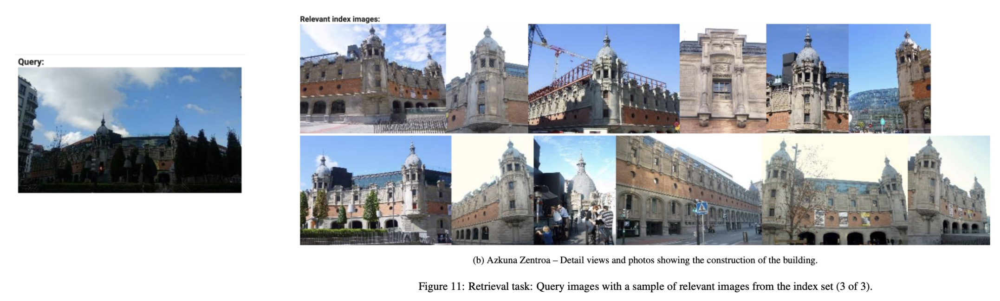
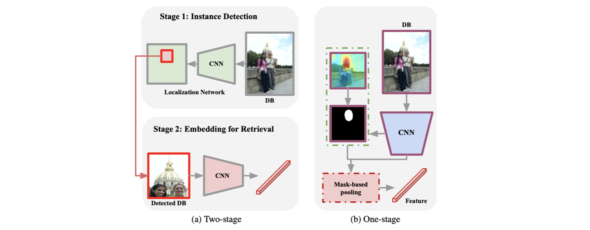
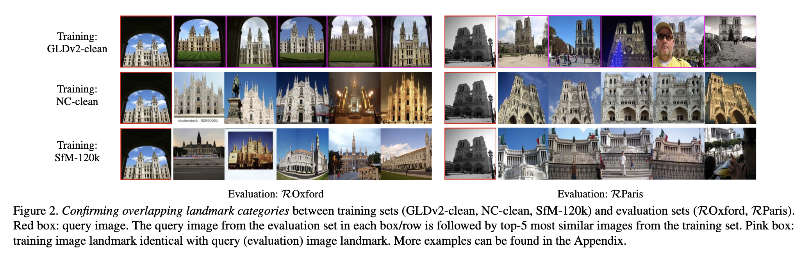
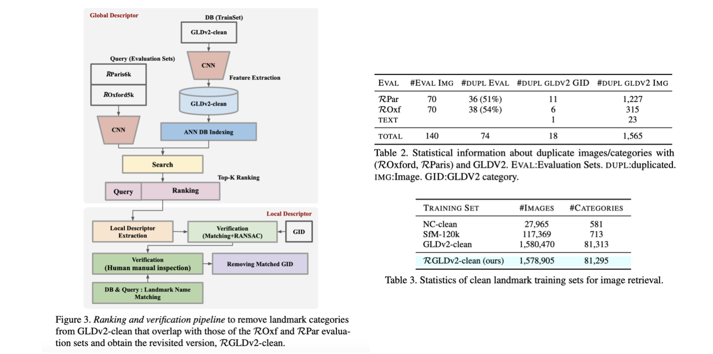
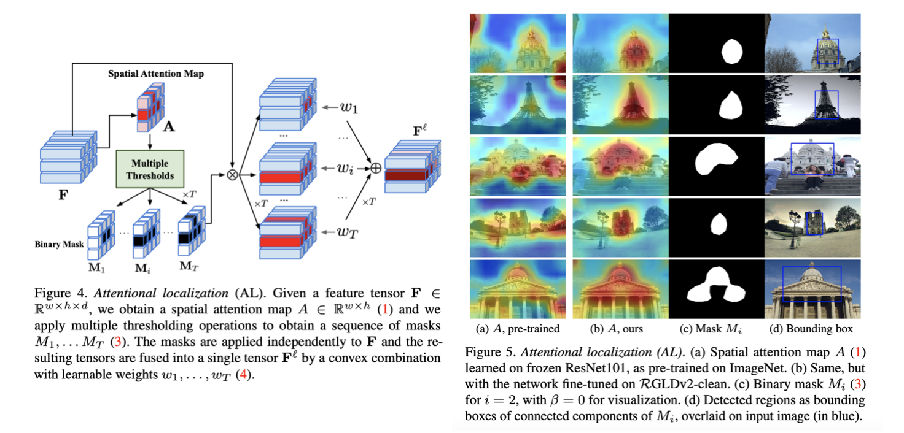
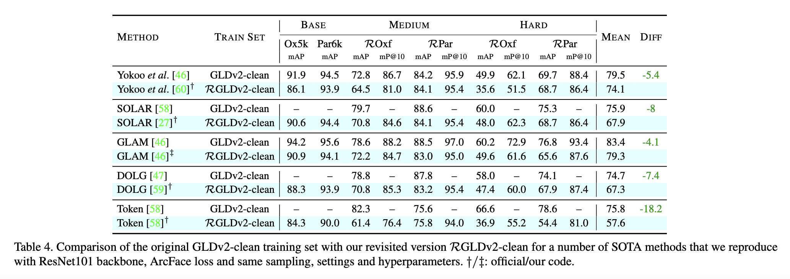
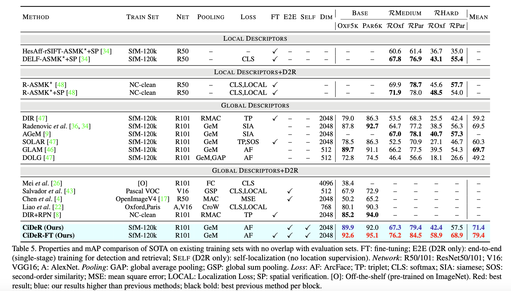
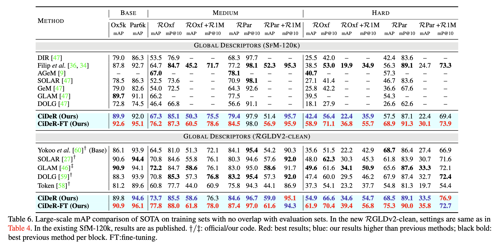

> This post summarizes the paper "On Train-Test Class Overlap and Detection for Image Retrieval," presented at CVPR 2024.

### Introduction

##### Image Retrieval

The image retrieval task involves detecting a specific object in a given query image and then finding other images in an internal database that match that object. As shown in the image below, the goal is to accurately retrieve related images for a given landmark.

##### Previous Works: Two-Stage Training Process

The most common approach for image retrieval is a two-stage training process. In this approach, instance detection is first performed on the given query image using a localization network. Then, embeddings are extracted from the detected (cropped) instance, and the most similar image embedding is retrieved from the database. Additionally, at the database retrieval stage, some methods use global descriptors -- image-level features -- rather than relying solely on the cropped image embedding.

This type of inference naturally requires training the localization network and feature extractor separately, and location supervision for objects (instances) in the image is also needed for training the feature extractor.

##### Contributions

The authors of this paper therefore question whether separately training a localization network and a feature extractor is truly necessary for the image retrieval task, and whether location supervision is indispensable. They propose CiDeR, an attention map-based end-to-end image retrieval method that eliminates the need for location supervision.

Additionally, they identify issues with the previously used benchmark dataset, Google Landmarks v2 (GLDv2), and release Revisiting Google Landmarks v2 (RGLDv2-clean) through data curation.

### Revisiting Google Landmarks v2

##### Training and Evaluation of Image Retrieval Task

The benchmark evaluation set for the image retrieval task is Revisited Oxford and Paris (ROxford, RParis), and the training set is Google Landmarks v2 (GLDv2). Benchmark training sets generally adhere to two criteria:

- Depict particular landmarks
- To not contain landmarks that overlap with those in the evaluation sets.

However, GLDv2 violates the second criterion with respect to ROxford and RParis, as can be seen in the figure below.

Therefore, models trained on GLDv2 may have already seen the evaluation set landmarks during training, potentially leading to inflated performance.

##### Identifying Overlapping Landmarks

The authors performed both model-based and human verification on the GLDv2 data.

1. Matching of train set images to eval queries using local features and descriptors (GID)
2. Three human reviewers manually inspected the images. If even one reviewer identified them as the same category, the entry was removed.
3. Additionally, GIDs containing Oxford or Paris were removed.

As a result, 18 overlapping GIDs with the evaluation set were found in GLDv2, and these were removed to create RGLDv2-clean.

### Single-Stage Pipeline for D2R

##### Motivation

The two-stage process commonly used in prior works has the following drawbacks:

- Location supervision is required for representation learning
- Detection and representation models must be trained separately rather than end-to-end
- Two forward passes are required, leading to high per-image search cost

Therefore, the authors replaced the localization step with spatial attention, creating an end-to-end learning process that does not require location supervision. This approach is termed attentional localization (AL) in the paper.

##### Attentional Localization (AL)

1. A spatial attention map is obtained by applying a 1x1 conv to the feature map.
2. T binary (bit) masks are generated according to T thresholds (T=2 in the experiments).
3. Feature fusion is performed via convex combination (weighted sum) of the binary masks and feature maps.
4. The resulting feature $\mathbf F^l$ is used for image retrieval.

##### Components

Rather than using the fused features as-is, all commonly used techniques from the image retrieval domain were incorporated.

First, features are extracted using a backbone network. The feature map is then updated using methods such as SENet, ASPP, or SKNet. Next, the proposed attentional localization is applied. Finally, a D-dimensional feature is extracted through GeM (Generalized Mean Pooling).

### Experiments

The first experiment shows how much the performance of existing prior works drops when the training set is changed to RGLDv2-clean.

The second experiment demonstrates the performance of the CiDeR method.

### References

Song, et al. "On Train-Test Class Overlap and Detection for Image Retrieval." CVPR 2024.
