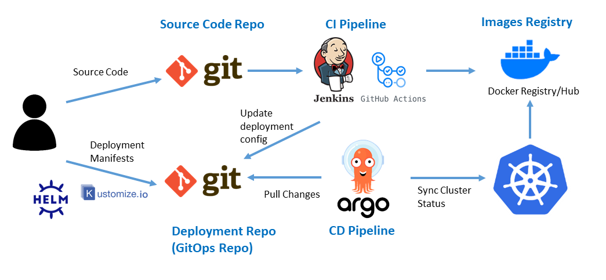

> This post covers basic concepts related to Git workflows and how to set up CI/CD using GitHub Actions, along with workflow YAML files. This is a work-in-progress post, and new content is added as I learn more.  

I'm running personal tests in the [yuhodots/workflows](https://github.com/yuhodots/workflows) repository. 

### GitFlow Workflow

- `master` branch: The branch where deployment-ready code resides. Direct commits are rare; it mainly receives merges from other branches
- `develop` branch: The branch that integrates features under development. All feature branches are merged into this branch
- `feature` branch: A branch for developing specific features or improvements. Typically branched off from the develop branch
- `release` branch: A branch for managing code that is ready for deployment. Used for pre-release testing and bug fixes. Branch names generally follow the `release/version-number` format. It branches off from the develop branch and, once complete, is **merged into both the master and develop branches**. Version tags are added during this process for version management

<i>Taken from https://nvie.com/posts/a-successful-git-branching-model</i>

1. When developing a new feature, create a Feature branch from the Develop branch
2. Once feature development is complete, merge the Feature branch into the Develop branch
3. When the next release version is ready, create a Release branch from the Develop branch
4. After completing final testing and bug fixes on the Release branch, merge it into both the Master and Develop branches. At this stage, proper use of GitHub Actions enables convenient CD
5. Once deployment is complete, add a version tag to the Master branch

### GitOps Automation with ArgoCD

- GitOps: Characterized by declarative deployment definitions / deployment version management using Git / automated operational reflection of changes / self-healing and anomaly detection
- SSOT: Single Source of Truth. The concept of using a single source for all data including databases, applications, etc. Ensures data accuracy, consistency, and reliability

##### CI Workflow

1. Create separate source code and manifest repositories, and create a basic Helm chart template in the manifest repo
2. Create a CI YAML file in the source code repo's .github/workflow directory
3. When code is merged into the develop or main branch of the source code repo, the CI process executes in the following order:
   1. Build the Dockerfile from the source code repo
   2. Upload the Docker image to AWS ECR
   3. Overwrite the Docker image tag uploaded to ECR in the manifest repo's Helm values file

##### CD with ArgoCD & Helm Chart

<i>Taken from https://picluster.ricsanfre.com/docs/argocd/</i>

1. Connect ArgoCD to the manifest repo
2. Separate Dev / Stage / Prod using values: Create separate Helm values files for development and production in the manifest repo, and write the CI YAML file so that different values file paths are overwritten depending on which branch is merged
3. Sync in ArgoCD
4. For secrets, choose among GitHub Secrets, Sealed Secret, or Infisical
