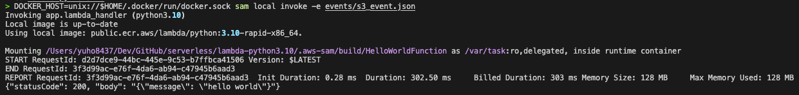
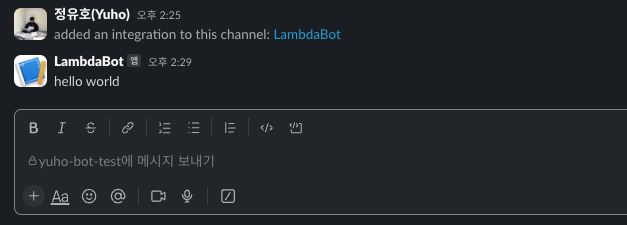
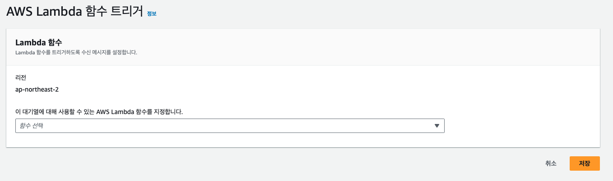

> This post documents how to receive events via AWS Lambda and AWS SQS, and send alert notifications to Slack for specific events. Lambda development was done using the AWS Toolkit for VSCode, and Slack notifications were implemented using a Slack webhook bot.

### AWS Serverless Application Model (SAM)

1. Install AWS SAM CLI: https://docs.aws.amazon.com/serverless-application-model/latest/developerguide/install-sam-cli.html
2. Install the VSCode AWS Toolkit plugin
3. Log in to AWS through the VSCode AWS Toolkit
4. Right-click on the Lambda section and select Create Lambda SAM Application
5. Write your code inside the `lambda_handler` function
6. Build: Add required packages to requirements and build the image using the `sam build` command. If no package installation is needed, the `--skip-pull-image` option can be used to skip the image pull. Running `sam build` creates the `.aws-sam` folder.

```
sam build (--skip-pull-image)
```

7. Test (invoke): After writing a sample event in `event.json`, you can test the local Lambda function. The function must be rebuilt before testing to apply any changes. Using the `sam local start-api` command launches a server at http://127.0.0.1:3000, enabling debugging via Postman.

```
sam local invoke -e events/event.json

# If you have an error when finding docker, run command below
DOCKER_HOST=unix://$HOME/.docker/run/docker.sock sam local invoke -e events/event.json
```



8. Deployment: Deployment settings can be configured in the `template.yaml` file.

```
sam deploy # Add --guided option for first-time deployment
```

9. Test events for Lambda can be referenced from [this repository](https://github.com/aws/aws-lambda-go/tree/main/events/testdata).
10. Role configuration is required. Refer to [Kakao Style's tech blog](https://devblog.kakaostyle.com/ko/2017-05-13-1-aws-serverless-1/).
    - SQS-related required permissions: `sqs:ReceiveMessage`, `sqs:DeleteMessage`, `sqs:GetQueueAttributes`
    - Lambda-related required permissions: `lambda:InvokeFunction`
    - CloudWatch-related required permissions: `logs:CreateLogGroup`, `logs:CreateLogStream`, `logs:PutLogEvents`
    - If S3 access is needed, assign a role such as AmazonS3FullAccess

### Slack Webhook Bot

1. Create a Slack App, then enable 'Activate Incoming Webhooks' in the 'Incoming Webhooks' section.
   - What is a WebHook?: https://docs.tosspayments.com/resources/glossary/webhook
   - Unlike a client calling a server, the server calls the client when a specific event occurs, which is why it is also called a 'reverse API.'
2. In the 'Incoming Webhooks' section, add the channel to use the webhook via 'Add New Webhook to Workspace.'
3. Check and copy the generated Webhook URL.
4. Test that it works correctly via curl. Then use the Webhook URL within the Lambda function.

```
curl -s -d "payload={'text':'hello world'}" "YOUR_WEBHOOK_URL"
```



### AWS Simple Queue Service (SQS)

1. Create an AWS SQS queue and configure the access policy.
   - A common pattern is to set up an SNS notification on a specific service (e.g., S3) and have the SQS queue subscribe to that SNS topic.
2. Set the Lambda function created above as the Lambda trigger for the SQS queue.
3. Save and verify the results.



4. If you want to inspect messages directly, go to 'Send and receive messages' in the SQS console, poll for messages, and check the results.

### Summary

1. A specific event occurs (e.g., SNS)
2. The event is delivered to Lambda via SQS
3. The lambda_handler in Lambda checks whether an alert is needed for the event
4. If an alert is needed, a message is sent to the Slack webhook URL
5. The alert is confirmed in the Slack channel
