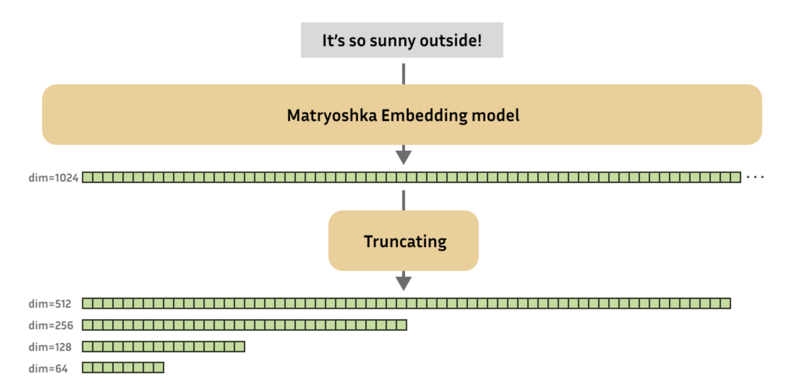
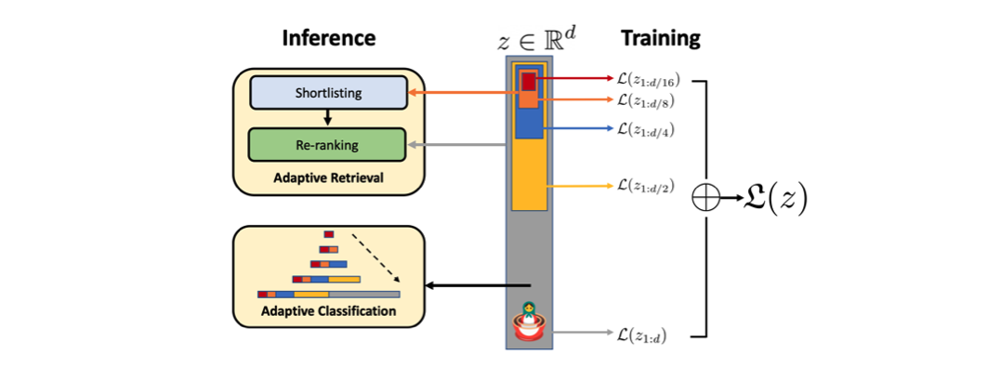
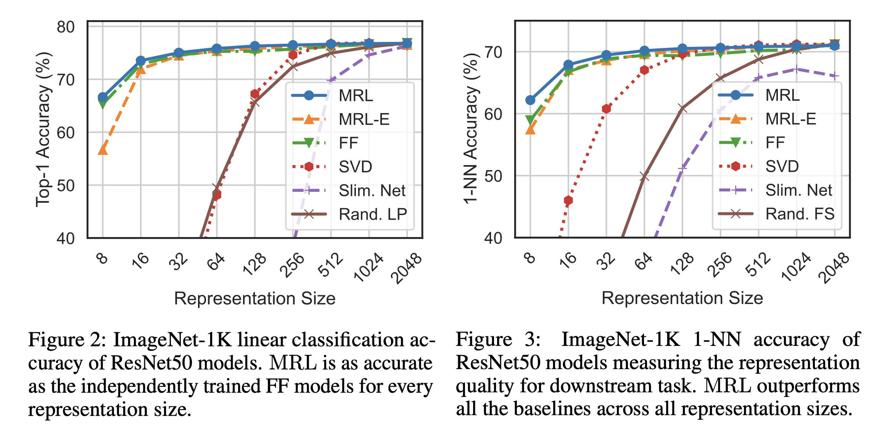
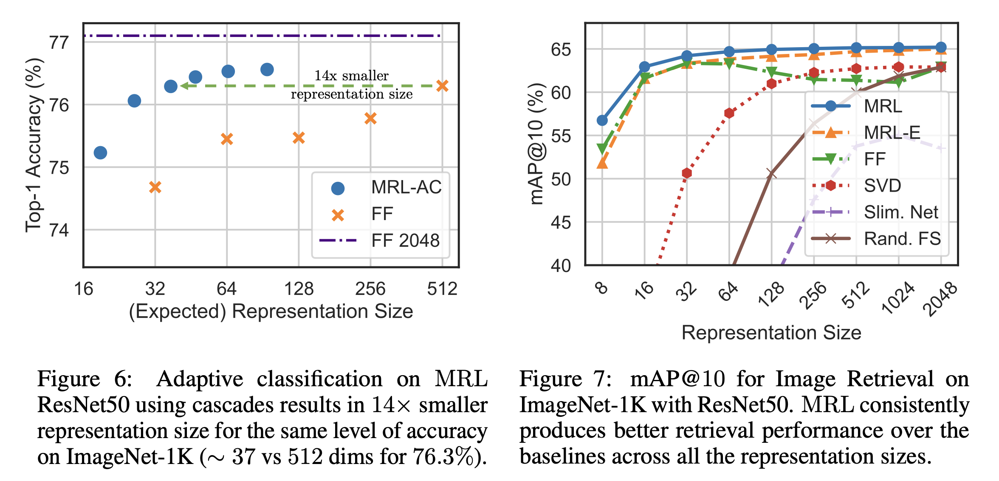

> This post summarizes the Matryoshka Representation Learning paper, presented at NeurIPS 2022.

When extracting embeddings for images or text, various pre-trained backbones are often used, and it is quite common to need to resize embeddings to a specific dimension depending on the use case. Simply selecting a subset of values is not feasible since it is unclear which dimension indices are informative. As a result, methods such as PCA (linear projection) or fine-tuning with an appended projection layer are typically employed. However, these approaches either fail to fully preserve the original performance or require additional training. This led me to a recurring question: "Could we simply choose the desired feature dimension at deployment time and use it directly?"

Recently, I had the opportunity to use NomicAI's nomic-embed-text-v1.5, which claims to maintain performance even when the desired embedding dimension is selected through simple slicing. Upon learning that the underlying method was Matryoshka Representation Learning, I read the paper and share a summary below.

### Introduction

Before diving in, the key contributions presented in the paper are as follows:

- Enables flexible representations for adaptive deployment
- Achieves up to 14x speedup in large-scale classification and retrieval while maintaining baseline performance
- The method seamlessly adapts to multiple modalities, including vision, language, and VLMs

The representative application areas for this paper are classification and retrieval. The retrieval domain, in particular, demands the ability to perform embedding search quickly, efficiently, and accurately even at web scale. The main bottlenecks in this context are the number of labels ($L$), the amount of data ($N$), and the embedding size ($d$).

Regarding the number of labels, commonly used methods include Approximate Nearest Neighbor Search (ANNS) and Hierarchical Navigable Small World (HNSW), which are hierarchy-based approaches. HNSW, in particular, is an $O(d\log(N))$ method whose performance is comparable to that of exact retrieval ($O(dN)$). (A brief explanation of HNSW can be found in [this earlier post](https://yuhodots.github.io/Operations/23-11-19/).)

The Matryoshka Representation Learning (hereafter MRL) proposed in this paper focuses on the embedding size $d$ and provides a good intermediate abstraction between high-dimensional vectors and search methods, thereby making retrieval techniques such as ANNS more efficient.

### Matryoshka Representation Learning

<i>Taken from, https://huggingface.co/blog/matryoshka</i>

The figure above intuitively illustrates the advantages of MRL. The figure below provides an intuitive view of how MRL is trained.

<i>Taken from, Aditya Kusupati, et al.</i>

MRL enables the first $m$ dimensions of the embedding vector $z$ for each data point $x$ to function independently. When $m$ is chosen from {8, 16, . . . , 1024, 2048}, an independent linear classifier $\mathbf W_m$ is created for each $m$ dimension, and the loss from each linear classifier's output is computed and aggregated (weighted sum). Ultimately, MRL is trained using the formula below, where the weight $c_m$ is fixed to 1 for all dimensions in the experiments.
$$
\min _{\{\mathbf{W}(m)\}_{m \in \mathcal{M}}, \theta_F} \frac{1}{N} \sum_{i \in[N]} \sum_{m \in \mathcal{M}} c_m \cdot \mathcal{L}\left(\mathbf{W}^{(m)} \cdot F\left(x_i ; \theta_F\right)_{1: m} ; y_i\right)
$$

Instead of maintaining separate $\mathbf W$ for each dimension, a weight-tying approach can be used where $W_m = W_{1:m}$, maintaining only a single weight and slicing it. This approach halves the number of linear classifier weights, reducing memory cost and proving effective for extremely large output spaces. This variant is termed MRL-E (Efficient Matryoshka Representation Learning) in the paper.

### Applications

<i>Taken from, Aditya Kusupati, et al.</i>

In the experiments, no separate hyperparameter search was performed; baseline hyperparameters were used as-is. Linear classification and 1-NN performance were measured on ImageNet 1K. In the first experiment, the FF (Fixed Feature) model (i.e., conventionally trained model) and MRL showed identical performance across all representation sizes. In the second experiment, MRL demonstrated advantages at lower dimensions. While MRL matches the performance of the FF model, it offers the advantage of freely choosing the dimension at deployment time, making it more practical.

<i>Taken from, Aditya Kusupati, et al.</i>

For the adaptive classification task, thresholds on the maximum softmax probability for each dimension are learned on the validation set and used to determine the MRL representation dimension. The same level of accuracy as the baseline was achieved with a model 14x smaller. In the retrieval task on ImageNet 1K, there was approximately a 3% performance improvement over the baseline, which was especially useful below 256 dimensions.

##### Further Analysis

To measure robustness, the authors also conducted experiments on datasets other than ImageNet 1K. On ImageNet-A, performance was on par with the baseline. When using ImageNet 1K as queries for retrieval on ImageNet V2, there was approximately a 3% improvement in mAP@10 over the baseline.

Experiments were also conducted on few-shot and long-tail datasets, showing roughly a 2% improvement on novel classes while maintaining performance on base classes.

### Conclusion

In my case, I used this approach to replace the text encoder component of CLIP with nomic text embedding v1.5 at 512 dimensions. Beyond this specific use case, I believe it could be highly useful for embedding search in applications such as RAG.

The ability to slice to the desired dimension at serving time without any adaptation or additional tuning is a surprisingly significant advantage, making it a quite practical approach for production environments.

### Reference

Kusupati, Aditya, et al. "Matryoshka representation learning." *Advances in Neural Information Processing Systems* 35 (2022): 30233-30249.
