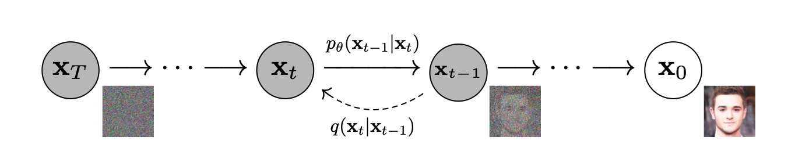
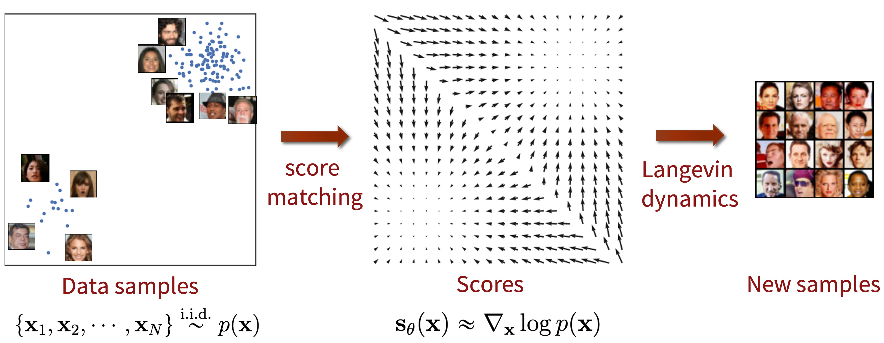
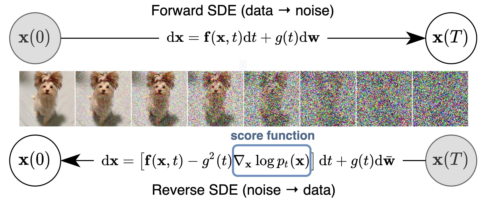
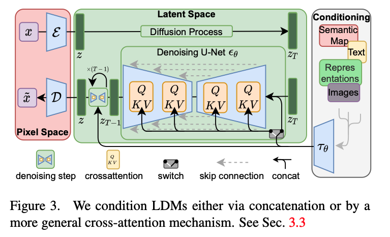

> A summary of the types, tasks, metrics, and related services of generative models.

### Types of Models

##### Diffusion Models

Diffusion models generate new data by learning to progressively restore data from noise.

**DDPM (Denoising Diffusion Probabilistic Models)** learns the process of gradually adding noise to data (forward process) and then reversing it to remove the noise (reverse process). During the reverse process, the model is trained by minimizing the difference between the actual data and the restored data at each step.

- Forward process: Gaussian noise is added to the data over multiple steps, making it progressively noisier. $\begin{gathered}
  q\left(\mathbf{x}_t \mid \mathbf{x}_{t-1}\right):=\mathcal{N}\left(\mathbf{x}_t ; \sqrt{1-\beta_t} \mathbf{x}_{t-1}, \beta_t \mathrm{I}\right),
  \mathbf{x}_t=\sqrt{1-\beta_t} \mathbf{x}_{t-1}+\sqrt{\beta_t} \epsilon
  \end{gathered}$

- Backward process: A trained denoising network is used to remove noise at each step, restoring the original data.

- Loss: The training objective is to minimize the denoising error at each step, using the variational lower bound of negative log-likelihood.

  $\begin{aligned}
  L_{V L B}= & \underbrace{-\log p_\theta\left(\mathbf{x}_0 \mid \mathbf{x}_1\right)}_{\mathbf{L}_0}+\underbrace{\mathbf{D}_{K L}\left(p\left(\mathbf{x}_T \mid \mathbf{x}_0\right) \| p_{\mathbf{x}_T}\right)}_{\mathbf{L}_T}
  +\underbrace{\sum_{t>1} \mathbf{D}_{K L}\left(p\left(\mathbf{x}_{t-1} \mid \mathbf{x}_t, \mathbf{x}_0\right) \| p_\theta\left(\mathbf{x}_{t-1} \mid \mathbf{x}_t\right)\right)}_{\mathbf{L}_{t-1}}
  \end{aligned}$

**NCSM (Noise Conditional Score Models)** restores data by estimating the score function. The goal is for the model to predict the gradient of the log-likelihood of the data at various noise levels.

- Score matching: The probability density function is estimated by learning the score function $\nabla_x\log p(x)$, which is the gradient of the log-likelihood.
- Langevin dynamics: A method of sampling data using the score function obtained from score matching.
- Loss: The score matching loss is optimized. $\sum_{i=1}^L \lambda(i) \mathbb{E}_{q_{\sigma_i}(\mathbf{x})}\left[\left\|\nabla_{\mathbf{x}} \log q_{\sigma_i}(\mathbf{x})-s_\theta(\mathbf{x}, i)\right\|^2\right]$

**SDE Generative Models** generalize the diffusion process to continuous-time stochastic processes. Both the forward and backward processes are expressed as differential equations describing how data changes over time under noise. Sampling is performed from the learned data distribution using the reverse SDE.

- Forward SDE: Similar to DDPM, data is mixed with noise through a continuous-time SDE.
- Backward SDE: The reverse process is modeled as another SDE that progressively restores data from noise.
- Loss: Similar to DDPM, but the formulation is adjusted for continuous-time processes.
- Training: Techniques from stochastic process theory are used to learn the reverse SDE.

The differences between each approach are as follows.

- Noise Modeling

  - DDPMs: Use a discrete-time diffusion process with fixed timesteps to add noise.
  - NCSMs: Use a score-based approach to estimate the gradient of the log-likelihood of noisy data.

  - SDE models: Use continuous-time stochastic processes to model noise addition and restoration.

- Mathematical Framework

  - DDPMs operate in discrete time, while SDE models extend to continuous time.

  - NCSMs focus on estimating the score function (the gradient of the log density), whereas DDPM and SDE models focus on noise perturbation and restoration.

- Sampling Procedure

  - DDPMs: Sample step by step by applying the trained denoising model in reverse.

  - NCSMs: Use Langevin dynamics to progressively update data through score estimation.

  - SDE models: Sampling proceeds along the continuous-time reverse SDE.

##### Generative Adversarial Networks (GANs)

GANs have a structure where two neural networks compete: the generator tries to create realistic data, while the discriminator tries to distinguish between real and generated data.

- Loss: $\begin{aligned}
  \min _G \max _D V(D, G)=
  \mathbb{E}_{\mathbf{x} \sim q_{\mathbf{x}}}[\log D(\mathbf{x})]+\mathbb{E}_{\mathbf{z} \sim p_{\mathbf{z}}(\mathbf{z})}[\log (1-D(G(\mathbf{z})))]
  \end{aligned}$
  - Generator loss: Encourages the generator to create data realistic enough to fool the discriminator.
  - Discriminator loss: Optimized to distinguish between real and generated data. Typically uses binary cross-entropy loss.
- Training: The generator and discriminator are trained alternately, and techniques such as batch normalization, feature matching, and gradient penalty are used to stabilize training.

##### Variational Autoencoders (VAEs)

VAEs are probabilistic generative models that assume data is generated from latent variables. The model learns a mapping from latent space to data space and optimizes the variational lower bound of data likelihood.

- Structure: A VAE consists of an encoder that maps data to the latent space and a decoder that maps latent variables back to the data space.
- Loss: $\begin{aligned}
  L(\theta, \phi ; \mathbf{x})= \underbrace{-\mathbf{D}_{K L}\left(p_\phi(\mathbf{z} \mid \mathbf{x}) \| p_\theta(\mathbf{z})\right)}_{L_{K L}}+ \underbrace{\mathbb{E}_{p_\phi(\mathbf{z} \mid \mathbf{x})}\left[\log p_\theta(\mathbf{x} \mid \mathbf{z})\right]}_{L_{\text {reconstruction }}}
  \end{aligned}$
  - Reconstruction loss: Measures how well the decoder reconstructs the data.
  - KL divergence loss: Measures how close the learned latent distribution is to the predefined distribution (typically Gaussian).
- Training: Trained using SGD to minimize the loss function, with the reparameterization trick to enable backpropagation through the sampling step.

##### Autoregressive Models

Autoregressive models generate data sequentially, where each step depends on previously generated outputs. These models estimate the joint probability of data as a product of conditional probabilities ($q(\mathbf{x})=\prod_{i=1}^N q\left(\mathbf{x}_i \mid \mathbf{x}_1, \ldots, \mathbf{x}_{n<i}\right)$). They primarily use recurrent neural networks (RNNs) or Transformers to model sequential data. For images, architectures such as PixelRNN or PixelCNN are commonly used.

##### Normalizing Flows

Normalizing flow is a model that applies a series of invertible and differentiable transformations to convert a simple distribution (e.g., Gaussian) into a complex distribution. This model enables exact likelihood computation and efficient sampling. It consists of a series of invertible transformations through which data is transformed.

### Generation Tasks

##### Unconditional Image Generation

Unconditional image generation creates images without any conditions. That is, images are generated without labels, text, or other guidance. The generative model first learns the distribution of the training data and then generates new samples similar to the training set. Representative examples include random face generation and artistic image synthesis using models such as GANs (Generative Adversarial Networks) and VAEs (Variational Autoencoders).

##### Conditional Image Generation

Conditional image generation creates images based on inputs or conditions such as class labels, text descriptions, or sketches. The model generates images according to the given conditions. In this case, the generation process is adjusted by specific inputs (labels, text, etc.), like in conditional GANs or conditional diffusion models. Tasks such as text-to-image and image-to-image mostly fall under conditional image generation.

##### Image-to-Image Translation

Image-to-image translation refers to the task of generating one type of image from another. The generated image maintains the same structure as the input image but belongs to a different domain.

- Pix2Pix: A GAN-based model trained on pairs of input images and corresponding target images.
- CycleGAN: A model that introduced cycle-consistency loss to translate images while preserving structure when paired data is unavailable.
- Examples include converting sketches into photorealistic images and style transfer such as converting summer photos into winter scenes.

##### Text-to-Image Generation

Text-to-image generation is the task of synthesizing images from text descriptions. The model learns the correspondence between natural language descriptions and visual representations to generate images based on text.

- DALL-E and Stable Diffusion are representative examples.
- Examples include generating images from complex scene descriptions and creating artistic works from abstract text prompts.

##### Super Resolution

The super resolution task aims to generate high-resolution images from low-resolution inputs. It is used to enhance image quality without losing detail.

- Super-Resolution GANs (SRGANs): A model that uses adversarial learning to generate visually sharper and more realistic high-resolution images.
- ESRGAN (Enhanced SRGAN): An improved version of SRGAN that enables sharper and more detailed image reconstruction through a more sophisticated generator.

##### Inpainting

Inpainting is the task of filling in missing parts of an image. The goal is for the model to naturally complete the entire image based on the surrounding information provided.

- Context Encoders: A model that learns contextual information from surrounding pixels to generate missing image regions.
- Partial Convolutions: A special convolution network designed for inpainting that ignores missing regions during training and focuses only on valid pixels.

##### Video Generation

Video generation extends image generation models to the temporal domain. This task involves coherently synthesizing a sequence of frames that compose a video, and may also include tasks such as video prediction and video-to-video translation. Examples include Video GANs and Stable Video Diffusion.

### Evaluation Metrics

Evaluating generative models is crucial for assessing how well they perform in terms of quality and diversity, particularly in text-to-image generation and image reconstruction tasks. Various specialized metrics are used for this purpose, each focusing on different aspects of the generated output, such as image quality, accuracy, and alignment with user prompts. Below are descriptions of the key evaluation metrics.

##### Text-to-Image Generation Metrics

**DrawBench** is a benchmark designed to evaluate models that generate images from text, assessing a model's ability to produce high-quality images from text descriptions. This benchmark provides a set of prompts with varying complexity and topics, aiming to evaluate how well the model understands text input and accurately translates it into images. Results are typically assessed by human evaluators who rate the relevance between the given text prompt and the generated image.

**PartiPrompts** focuses on the details of natural language understanding, aiming to verify that the model captures both explicit and implicit details from the text. Similar to DrawBench, this evaluation primarily involves qualitative assessment where human evaluators score the alignment between text and image output.

**CLIPScore** uses the CLIP model to score the similarity between generated images and their corresponding input text. By embedding images and text into the same latent space, it can evaluate how well the two align semantically. A higher CLIPScore indicates greater alignment between the input text and generated image.

**R-Precision** measures how accurately generated images correspond to the text. It is frequently used in CLIP-based models.

**FID-I (FID for Text-to-Image)** measures the distribution difference of features between real data and generated images when applying Frechet Inception Distance to text-to-image generation evaluation.

##### Image Reconstruction Metrics

**Peak Signal-to-Noise Ratio (PSNR)** is a standard metric for evaluating image reconstruction quality, measuring the ratio between the maximum possible signal of an image and the noise that corrupts it. PSNR is expressed in decibels (dB), with higher values indicating better image reconstruction quality. While PSNR is simple to compute, it does not always align well with human perception of image quality in complex generation tasks.

**Structural Similarity Index (SSIM)** measures image quality by comparing the structural similarity between two images. It generally focuses on evaluating the structural information between generated and reference images, which better aligns with human visual perception. SSIM is widely used particularly in image-to-image tasks like super-resolution and denoising, where structural accuracy is important.

**Multi-Scale Structural Similarity (MS-SSIM)** is an extension of SSIM that evaluates structural similarity at multiple resolutions. This method provides more accurate results for high-resolution image evaluation.

**Mean Squared Error (MSE)** is a common metric in image reconstruction tasks that measures the average squared difference in pixel values between the generated image and the target image. While easy to compute, it does not always reflect perceptual quality well in complex generation tasks.

**LPIPS (Learned Perceptual Image Patch Similarity)** unlike traditional metrics such as MSE and SSIM that rely on simple pixel-level comparisons, provides a similarity assessment closer to human perception by comparing images in the feature space.

##### Image Fidelity and Model Diversity

**Inception Score (IS)** evaluates both the quality and diversity of generated images. Using a pre-trained Inception network to classify the generated images, a higher IS indicates that the generated images are diverse (belonging to various classes) and high quality (each image can be clearly classified into a specific class). While IS is simple to compute, it can sometimes be misleading because it focuses on diversity and quality as classified by the Inception network rather than overall visual quality.

**Frechet Inception Distance (FID)** is one of the most widely used metrics for evaluating the similarity between generated and real images. It measures the distance between the feature distributions of real and generated images captured by the Inception network. A lower FID value indicates that the generated images are closer to the real data distribution. FID is more robust than IS and can better capture subtle differences in image quality and diversity.

**Precision and Recall** is a method that simultaneously evaluates the quality and diversity of generative models, where precision measures how close generated images are to real images (quality), and recall measures how well the generative model covers the real data distribution (diversity).

**Mode Score** is an evaluation metric proposed to address the limitations of the Inception Score (IS), aiming to more accurately evaluate the diversity and mode collapse of generated images. While Inception Score evaluates image quality and class diversity, it sometimes fails to properly reflect when a generative model does not adequately cover certain modes (i.e., parts of the data distribution). Mode collapse is a phenomenon where the generative model produces only some modes instead of diverse images, and Mode Score is a metric designed to capture this more clearly.

### GenAI Products

##### Text-to-Image

The architecture of text-to-image models typically combines a text encoder such as GPT or VLM (CLIP) with a generative model like a diffusion model.

**Midjourney** focuses on generating highly detailed images from text descriptions.

- Category: Text-to-Image Generation.
  - Used by artists for initial ideation and concept art generation
  - Marketing: Used for creating creative visual content in advertising and brand design
  - Gaming and film industry: Helps build game concept art and visual worlds for films

**DALL-E** generates images from text descriptions and can also perform inpainting tasks to edit parts of an image based on prompts.

- Category: Text-to-Image Generation, Inpainting
  - Prototype design: Product design visualization and rapid prototyping
  - Education: Creating educational materials that visually explain complex concepts
  - Medical visualization: Can help with data interpretation by visualizing text-based descriptions in the medical field

**Stable Diffusion** fundamentally generates images from text, modifies images, supports inpainting to fill in missing parts, and provides super resolution to enhance image resolution, making it applicable across various fields.

- Category: Text-to-Image Generation, Image-to-Image Translation, Inpainting, Super Resolution
  - Digital illustration: Used in commercial illustration and concept art work
  - Fashion design: Designing fashion items and visually confirming them
  - Social media content creation: Efficiently producing visual content for advertising and marketing campaigns

**NovelAI Image Generation** focuses on generating anime-style images from text prompts, and also provides inpainting capabilities.

- Category: Text-to-Image Generation, Inpainting
  - Animation storyboard production: Visually representing animation scenarios
  - Webtoon and comic creation: Easily implementing character designs or scene compositions
  - Illustration creation: Used by individual creators to quickly produce high-quality images

##### Video Generation

The following three generative models are notably prominent in video generation.

- Stable Video Diffusion: Video Generation

- OpenAI Sora: Video Generation, Text-to-Image Generation

- Runway Gen-3: Video Generation, Text-to-Image Generation, Image-to-Image Translation

### Stable Diffusion

The Stable Diffusion model is primarily composed of a U-Net, a VAE, and a text encoder.

- U-Net: The core network used in the denoising process. This architecture, which plays a crucial role in image generation, has an encoder-decoder structure.

  - Encoder: The input image or noise is progressively compressed into smaller spatial representations, extracting important features and gradually compressing them.

  - Decoder: The compressed representation is progressively expanded back to the original image size. The decoder is responsible for reconstructing the details contained in the image.

  - Skip Connections: Pathways connected between the encoder and decoder that enable better restoration while preserving the fine details of the original image.

- VAE (Variational Autoencoder): Stable Diffusion generates images in latent space. Instead of working directly in the high-dimensional image space, it works in a lower-dimensional latent space using a VAE. The VAE encoder compresses the input image into a latent space representation, and the VAE decoder restores it back to the original high-dimensional image from this latent space.

- Text Encoder: Primarily uses the CLIP model, which encodes text into the latent space and combines it with the U-Net. The text encoder converts the input text description into latent vectors to ensure that the text description is reflected in the image generation process.

The training of Stable Diffusion is based on DDPM, learning the process of gradually adding noise to data and then reversing it to restore the original.
