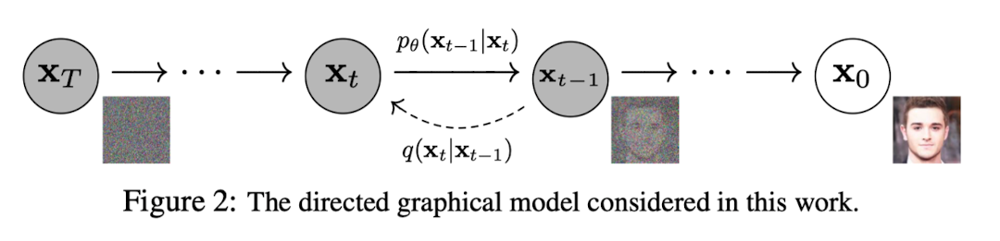
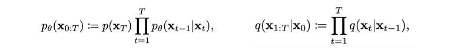
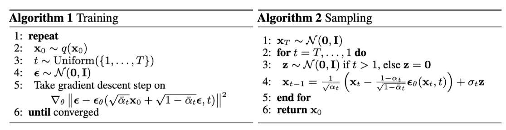
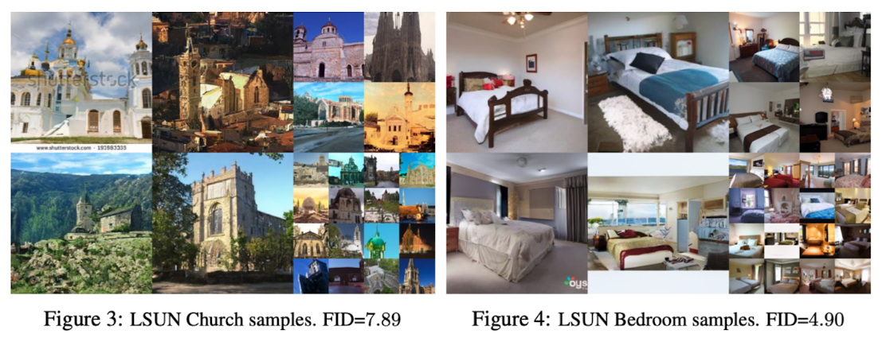
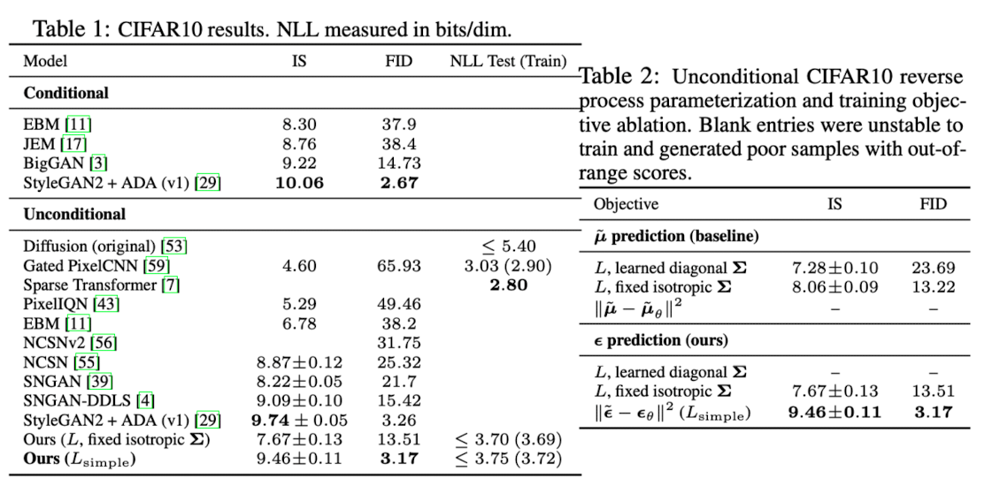
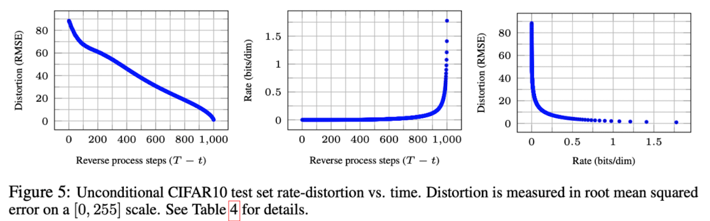
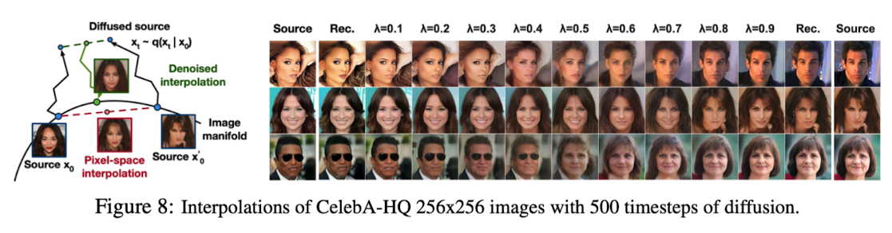

> A review of the Denoising Diffusion Probabilistic Models paper published in 2020.

DDPM is one of the most important papers that drove the transition of the generative modeling field from GAN-centric research to diffusion-based approaches prior to 2020.

Most generative models work by sampling random noise and transforming it into high-quality samples, and diffusion models are no different. As shown in the image above, noise is sequentially injected into the data denoted as $x_0$ to transform it into $\mathcal N(0, I)$, and the model then learns the reverse process. This way, the model can ultimately generate high-quality samples from random noise sampled from $\mathcal N(0, I)$.

### Background

In diffusion models, there are concepts called the forward process (diffusion process) $q$ and the backward process $p_\theta$, each expressed by the following equations.

- $x_{1:T}$: Intermediate states where noise is progressively added at each step from $x_0$ to $x_T$
- $p_\theta(x_{T}) = \mathcal N (x_T;0, I)$ is defined, and $p_\theta(x_{0:T})$ is defined as a Markov chain
- $x_1, \cdots, x_T$ are latent variables that exist in the same dimensional pixel space as $x_0$

Here, the goal of $p_\theta$ (the model) is to predict what $\mu$ and $\Sigma$ the distribution of $x_{t-1}$ should have given $x_t$. Therefore, the conditional probability $p_\theta$ can be expressed as follows:
$$
p_\theta\left(\mathbf{x}_{t-1} \mid \mathbf{x}_t\right):=\mathcal{N}\left(\mathbf{x}_{t-1} ; \boldsymbol{\mu}_\theta\left(\mathbf{x}_t, t\right), \mathbf{\Sigma}_\theta\left(\mathbf{x}_t, t\right)\right)
$$
Moving on to the model training phase, since all generative models aim to maximize the likelihood of $p_\theta(x_0)$, the loss can be set up to minimize $-\log p_\theta(x_0)$, which is expressed mathematically as follows. The detailed derivation can be found in Appendix A of the paper.
$$
\mathbb{E}\left[-\log p_\theta\left(\mathbf{x}_0\right)\right] \leq \mathbb{E}_q\left[-\log \frac{p_\theta\left(\mathbf{x}_{0: T}\right)}{q\left(\mathbf{x}_{1: T} \mid \mathbf{x}_0\right)}\right]=\mathbb{E}_q\left[-\log p\left(\mathbf{x}_T\right)-\sum_{t \geq 1} \log \frac{p_\theta\left(\mathbf{x}_{t-1} \mid \mathbf{x}_t\right)}{q\left(\mathbf{x}_t \mid \mathbf{x}_{t-1}\right)}\right]=: L
$$

$$
\mathbb{E}_q[\underbrace{D_{\mathrm{KL}}\left(q\left(\mathbf{x}_T \mid \mathbf{x}_0\right) \| p\left(\mathbf{x}_T\right)\right)}_{L_T}+\sum_{t>1} \underbrace{D_{\mathrm{KL}}\left(q\left(\mathbf{x}_{t-1} \mid \mathbf{x}_t, \mathbf{x}_0\right) \| p_\theta\left(\mathbf{x}_{t-1} \mid \mathbf{x}_t\right)\right)}_{L_{t-1}} \underbrace{-\log p_\theta\left(\mathbf{x}_0 \mid \mathbf{x}_1\right)}_{L_0}]
$$

In the loss equation above, we need to look more closely at $L_{t-1}$, which corresponds to the diffusion model. Here, $q(x_{t-1} | x_t, x_0)$, which $p_\theta(x_{t-1}|x_t)$ should resemble, is expressed as follows. Here, $\beta_t$ denotes the variance of the data at timestep $t$ in the forward process.
$$
\begin{aligned}
q\left(\mathbf{x}_{t-1} \mid \mathbf{x}_t, \mathbf{x}_0\right) & =\mathcal{N}\left(\mathbf{x}_{t-1} ; \tilde{\boldsymbol{\mu}}_t\left(\mathbf{x}_t, \mathbf{x}_0\right), \tilde{\beta}_t \mathbf{I}\right), \\
\text { where } \quad \tilde{\boldsymbol{\mu}}_t\left(\mathbf{x}_t, \mathbf{x}_0\right) & :=\frac{\sqrt{\bar{\alpha}_{t-1}} \beta_t}{1-\bar{\alpha}_t} \mathbf{x}_0+\frac{\sqrt{\alpha_t}\left(1-\bar{\alpha}_{t-1}\right)}{1-\bar{\alpha}_t} \mathbf{x}_t \quad \text { and } \quad \tilde{\beta}_t:=\frac{1-\bar{\alpha}_{t-1}}{1-\bar{\alpha}_t} \beta_t
\end{aligned}
$$
Once you accept that re-expressing $q(x_{t} | x_{t-1})$ in the form of $q(x_{t-1} | x_t, x_0)$ yields this result, the Background section is complete.

### Diffusion Models and Denoising Autoencoders

The DDPM authors revisit and reorganize the basic loss equation of diffusion models term by term.
$$
\mathbb{E}_q[\underbrace{D_{\mathrm{KL}}\left(q\left(\mathbf{x}_T \mid \mathbf{x}_0\right) \| p\left(\mathbf{x}_T\right)\right)}_{L_T}+\sum_{t>1} \underbrace{D_{\mathrm{KL}}\left(q\left(\mathbf{x}_{t-1} \mid \mathbf{x}_t, \mathbf{x}_0\right) \| p_\theta\left(\mathbf{x}_{t-1} \mid \mathbf{x}_t\right)\right)}_{L_{t-1}} \underbrace{-\log p_\theta\left(\mathbf{x}_0 \mid \mathbf{x}_1\right)}_{L_0}]
$$
Let us first examine the $L_T$ term. In the equation, $p(x_T)$ is fixed as $\mathcal N(x_T; 0, I)$, and $q(x_t|x_0)$ varies depending on $\beta_t$. In this paper, $\beta_t$ is set as a constant, so $L_T$ becomes irrelevant to parameter optimization and can be ignored.

Next, let us examine the $L_{t-1}$ term. Writing the distributions $q(x_{t-1}|x_t, x_0)$ and $p_\theta(x_{t-1}|x_t)$ as described in the Background section above:
$$
\begin{aligned}
q\left(\mathbf{x}_{t-1} \mid \mathbf{x}_t, \mathbf{x}_0\right) & =\mathcal{N}\left(\mathbf{x}_{t-1} ; \tilde{\boldsymbol{\mu}}_t\left(\mathbf{x}_t, \mathbf{x}_0\right), \tilde{\beta}_t \mathbf{I}\right), \\
\text { where } \quad \tilde{\boldsymbol{\mu}}_t\left(\mathbf{x}_t, \mathbf{x}_0\right) & :=\frac{\sqrt{\bar{\alpha}_{t-1}} \beta_t}{1-\bar{\alpha}_t} \mathbf{x}_0+\frac{\sqrt{\alpha_t}\left(1-\bar{\alpha}_{t-1}\right)}{1-\bar{\alpha}_t} \mathbf{x}_t \quad \text { and } \quad \tilde{\beta}_t:=\frac{1-\bar{\alpha}_{t-1}}{1-\bar{\alpha}_t} \beta_t
\end{aligned}
$$

$$
p_\theta\left(\mathbf{x}_{t-1} \mid \mathbf{x}_t\right):=\mathcal{N}\left(\mathbf{x}_{t-1} ; \boldsymbol{\mu}_\theta\left(\mathbf{x}_t, t\right), \mathbf{\Sigma}_\theta\left(\mathbf{x}_t, t\right)\right)
$$

The parameters we need to learn are ultimately $\mu_\theta$ and $\Sigma_\theta$, which predict the mean and covariance of $q(x_{t-1}|x_t, x_0)$ at timestep $t$. However, in the paper, $\Sigma_\theta$ is set as a time-dependent constant of the form $\sigma_t^2I$. This means the only parameter $L_{t-1}$ needs to learn is $\mu_\theta$. Therefore, rearranging this in L2 loss form yields:
$$
L_{t-1}=\mathbb{E}_q\left[\frac{1}{2 \sigma_t^2}\left\|\tilde{\boldsymbol{\mu}}_t\left(\mathbf{x}_t, \mathbf{x}_0\right)-\boldsymbol{\mu}_\theta\left(\mathbf{x}_t, t\right)\right\|^2\right]+C
$$
By further simplifying this equation, it can be reduced to the following form:
$$
\mathbb{E}_{\mathbf{x}_0, \boldsymbol{\epsilon}}\left[\frac{\beta_t^2}{2 \sigma_t^2 \alpha_t\left(1-\bar{\alpha}_t\right)}\left\|\boldsymbol{\epsilon}-\boldsymbol{\epsilon}_\theta\left(\sqrt{\bar{\alpha}_t} \mathbf{x}_0+\sqrt{1-\bar{\alpha}_t} \boldsymbol{\epsilon}, t\right)\right\|^2\right]
$$
A key point to note in this simplification process is that 'the problem has shifted from predicting the mean $\tilde\mu$ to predicting the noise $\epsilon$.' Once the equation has been simplified to this point, training and sampling become possible.

The $L_0$ term is similar to the $L_{t-1} (t>1)$ equation with $t=1$ substituted, so it is merged into the $L_{t-1}$ term. By applying equal weighting across all timesteps in the original $L_{t-1}$ term, the following simplified loss is obtained:
$$
L_{\text {simple }}(\theta):=\mathbb{E}_{t, \mathbf{x}_0, \boldsymbol{\epsilon}}\left[\left\|\boldsymbol{\epsilon}-\boldsymbol{\epsilon}_\theta\left(\sqrt{\bar{\alpha}_t} \mathbf{x}_0+\sqrt{1-\bar{\alpha}_t} \boldsymbol{\epsilon}, t\right)\right\|^2\right]
$$

### Experiments

For the experiments, $T=1000$ was set, and $\beta_t$ was configured to increase linearly from $\beta_1=10^{-4}$ to $\beta_T=0.02$. The backbone for the reverse process uses a U-Net, and the same U-Net model with shared parameters is used across all timesteps.

Quantitative results were evaluated using Inception Score (IS) and FID.

It is also possible to apply the forward process to two original images, then restore linearly interpolated noise between them.

### Reference

Ho, Jonathan, Ajay Jain, and Pieter Abbeel. "Denoising diffusion probabilistic models." *Advances in neural information processing systems* 33 (2020): 6840-6851.
