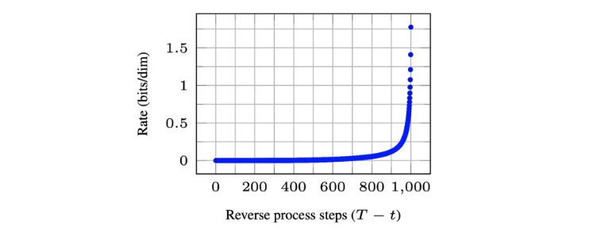
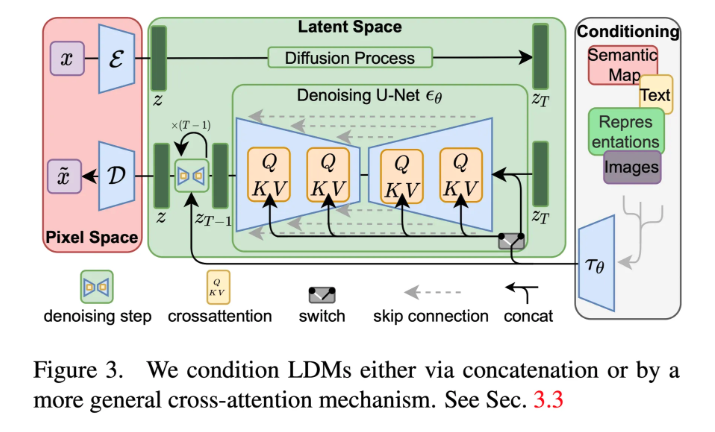
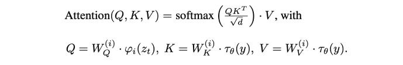
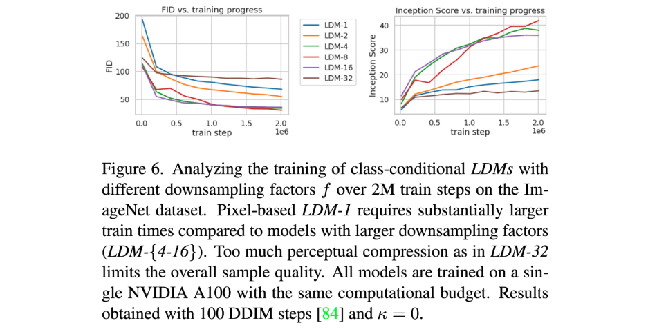
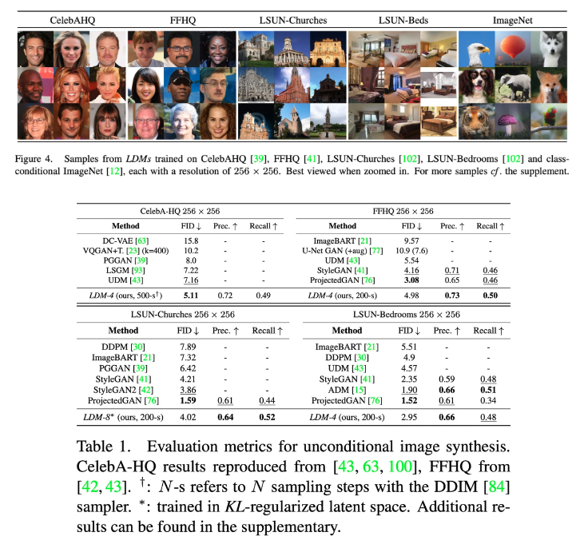
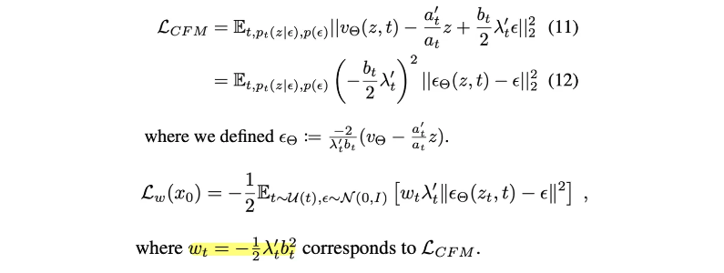
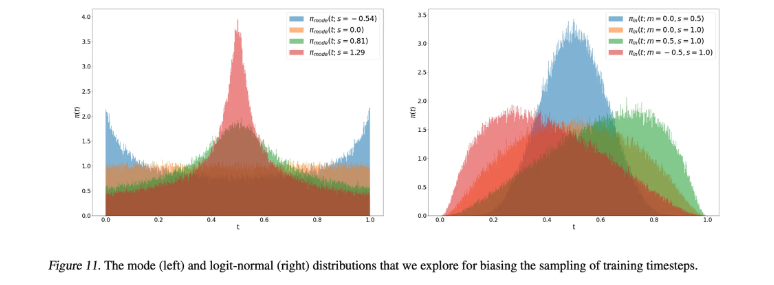
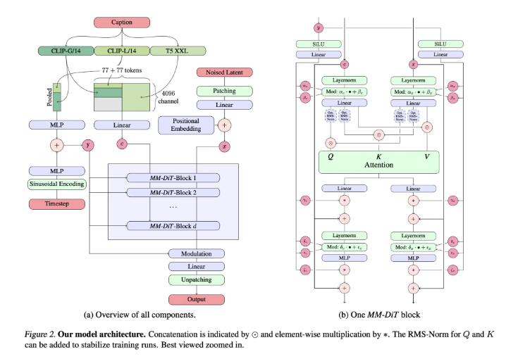
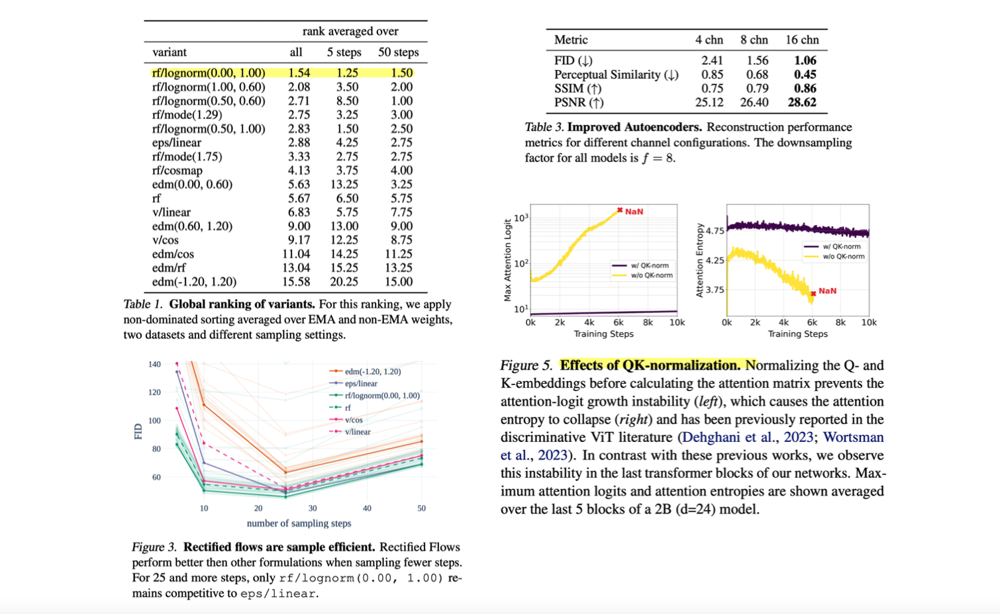
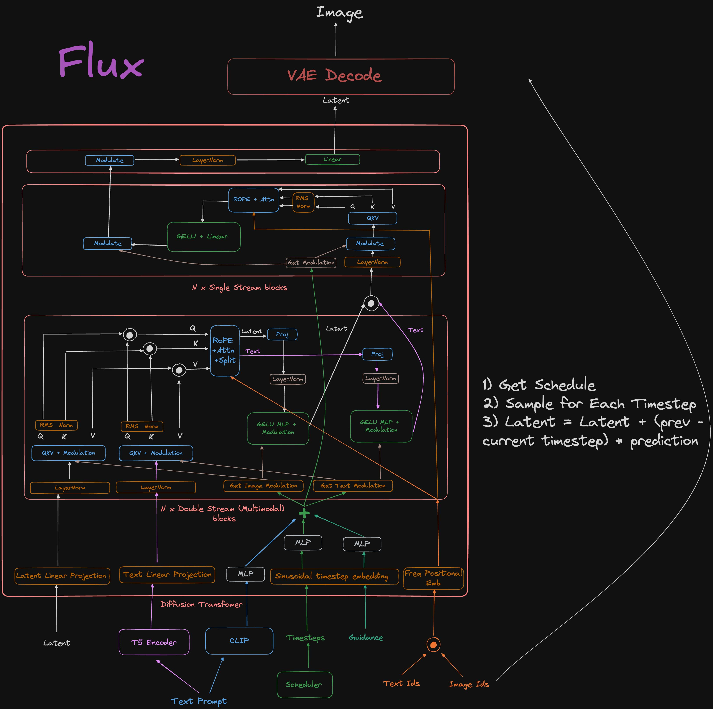

> A quick overview of the evolution of deep generative models over recent years, with reviews of key papers on diffusion and flow matching.

### Introduction

Here are one-line summaries of important papers from recent years:

- 2020.06 / DDPM: Learns the reverse process after a forward process that gradually adds noise to data
- 2019.07 / NCSN → 2020.12 / NCSN++: Restores data by estimating the score function
- 2021.06 / LoRA: Parameter Efficient Fine-Tuning
- 2021.08 / LAION-400M: Large-scale image-text pair dataset
- 2021.12 / Stable Diffusion: Performs diffusion in latent space rather than pixel space
- 2022.03 / LAION-5B: Large-scale image-text pair dataset (14x larger than LAION-400M)
- 2022.08 / DreamBooth: Fine-tuning to match a specific subject or style with just 3-5 images
- 2022.10 / Prompt-to-Prompt: Modifying parts of an image's attributes by editing the text prompt
- 2022.12 / InstructPix2Pix: An interactive model that can modify images based on natural language instructions
- 2022.12 / DiT: A diffusion model based on the Transformer architecture
- 2023.02 / ControlNet: Modifying image structure through control conditions such as poses and sketches
- 2023.07 / SDXL: Generates more realistic and detailed images using a larger model architecture than Stable Diffusion
- 2023.08 / IPAdapter: Generates new images using images as prompts
- 2023.11 / ShareGPT4V: A VLM with powerful image captioner capabilities
- 2022.10 / Flow Matching → 2024.03 / Stable Diffusion 3: Enables stable image generation without stochastic noise injection in the diffusion process through the flow matching technique
- 2024.08 / Flux: A high-performance Text2Img model based on flow matching

While diffusion models dominated after the 2020 DDPM paper, flow matching-based models such as Stable Diffusion 3 and Flux have been most widely used recently. A detailed explanation of DDPM can be found in the [previous post](https://yuhodots.github.io/deeplearning/24-11-09/).

### Stable Diffusion

Diffusion models proposed since DDPM have shown great performance but suffered from very slow training/inference speeds. Since both training and inference occur in pixel space and require multiple denoising steps, they needed many GPUs and long training times, making high-quality image generation difficult.

To achieve high-quality image generation, we first need to understand Perceptual Compression and Semantic Compression.

- Perceptual Compression: Compresses and restores the visual features of an image
- Semantic Compression: Compresses and restores the high-level semantic information of an image

To generate high-quality images, one needs to increase the 'rate' related to Perceptual Compression, which requires 25 to 1000 denoising steps with a diffusion model. Therefore, using diffusion models for perceptual compression is highly inefficient.

The Stable Diffusion authors proposed using VAEs, which are far more efficient than diffusion models, for perceptual compression (i.e., compressing and restoring visual features), and using diffusion models only for semantic compression (i.e., compressing and restoring high-level semantic information).

##### Method

For the perceptual compression model (the VAE), it is important to preserve local realism and avoid blurriness through pixel loss. Prior works (perceptual loss and patch-based adversarial loss) were referenced for this purpose. When the latent vector $z$ has dimensions $h, w, c$, expressing the downsample factor as $f = H/h = W/w$ relative to the original $H, W$, values of $f$ equal to 4 or 8 generally showed good performance. KL regularization and VQ regularization were added to prevent the variance of the latent space from growing too large. (These regularizations are optional, not mandatory.)

For the semantic compression model (the diffusion model in latent space), noise prediction is performed similarly to DDPM. However, prediction is performed on the latent space $z_t$ rather than the pixel space $x_t$. The timestep $t$ is uniformly sampled.

Additionally, a conditional image generation mechanism can be easily incorporated. Simply change $\epsilon_\theta(z_t, t)$ to $\epsilon_\theta(z_t, t, y)$. The authors implemented this by inserting cross-attention layers into the UNet. While the query head receives embeddings from the previous layer, the key and value heads receive the conditioning embedding $y$.

The latent diffusion model is ultimately defined as follows:
$$
L_{L D M}:=\mathbb{E}_{\mathcal{E}(x), y, \epsilon \sim \mathcal{N}(0,1), t}\left[\left\|\epsilon-\epsilon_\theta\left(z_t, t, \tau_\theta(y)\right)\right\|_2^2\right]
$$

##### Experiments

The experiments first analyze perceptual compression tradeoffs, discussing the importance of properly setting the latent space dimension.

1. Too little compression forces the diffusion model to handle too much perceptual compression, making it slow (not the authors' intention)
2. Too much compression causes information loss, making it difficult to achieve high quality

The unconditional image generation results are as follows.

### Stable Diffusion 3

Next, let us discuss the relatively recent Stable Diffusion 3 model. To understand Stable Diffusion 3, one must first understand flow matching. A brief comparison between diffusion models and flow matching is as follows:

- Diffusion model
  - Forward process: Gradually add Gaussian noise to ultimately produce $\mathcal N(0, I)$
  - Backward process: Predict and remove the noise added at step $t$, progressively restoring from $\mathcal N(0, I)$ to the original data
- Flow matching
  - Forward process: Assume a probability path for moving from a data point to $\mathcal N(0, I)$, and learn the vector field for data movement along this path.
  - Backward process: Use the learned vector field to move data sampled from $\mathcal{N}(0, I)$ along the path to restore it.

The key concepts to understand for flow matching are as follows:

- Flow $\psi_t(x_0)$: Takes $x_0$ as input and represents 'where the data that was initially $x_0$ will be located at time $t$'
- Vector Field $u_t(\psi_t(x_0))$: Takes $\psi_t(x_0)$ as input and is the derivative of $\psi_t(x_0)$ with respect to $t$. It represents 'which direction the data at time $t$ will flow.' That is, $\psi^{'}_t(x_0) = u_t$
- Conditional Flow Matching Loss $\mathcal L_{CFM}$

Some natural questions arise here:

- The predicted vector field $v_t$ can be predicted using a model, but
- How do we define the target vector field $u_t$?

To resolve these questions, one must first define the form of the 'target flow,' which should be $x_0$ at $t=0$ and $\mathcal N(0, I)$ at $t=1$. Any form satisfying this condition works.

##### Simulation-Free Training of Flows

Now let us dive into the paper. The paper first explains how to express the flow matching objective $\mathcal L_{CFM}$ in noise-based form similar to diffusion. The data at timestep $0<t<1$ is defined as follows, with $a_0=1, b_0=0, a_1=0, b_1=1$:
$$
z_t=a_t x_0+b_t \epsilon \quad \text { where } \epsilon \sim \mathcal{N}(0, I)
$$
Since $\psi^{-1}_t(z|\epsilon)$ essentially represents $x_0$, we can write:
$$
\begin{aligned}
& \psi_t(\cdot \mid \epsilon): x_0 \mapsto a_t x_0+b_t \epsilon \\
& u_t(z \mid \epsilon):=\psi_t^{\prime}\left(\psi_t^{-1}(z \mid \epsilon) \mid \epsilon\right)
\end{aligned}
$$
Using the fact that $\psi_t^{\prime}\left(x_0 \mid \epsilon\right)=a_t^{\prime} x_0+b_t^{\prime} \epsilon \text { and } \psi_t^{-1}(z \mid \epsilon)=\frac{z-b_t \epsilon}{a_t}$, we can rearrange to get:
$$
z_t^{\prime}=u_t\left(z_t \mid \epsilon\right)=\frac{a_t^{\prime}}{a_t} z_t-\epsilon b_t\left(\frac{a_t^{\prime}}{a_t}-\frac{b_t^{\prime}}{b_t}\right)
$$
Furthermore, by substituting $\lambda_t = \log{\frac{a^2_t}{b^2_t}}$, the expression simplifies to:

##### Flow Trajectories: Rectified Flow

Now that we know how to write the conditional flow matching equation as shown above, the question of how to best define the target flow for model training is addressed below.

We denote the position of data at time $t$ as $z_t$, which should be $x_0$ at $t=0$ and $\mathcal N(0, I)$ at $t=1$. Therefore, there are multiple possible forms for the forward process.

While several forms are introduced (e.g., EDM, Cosine, LDM-Linear), the authors chose rectified flow, which connects the data distribution and standard normal distribution with a straight line:
$$
z_t=(1-t) x_0+t \epsilon
$$
Since intermediate values of $t$ are harder for the model to predict, one approach is to sample more at the midpoint between 0 and 1, but the authors implemented this by modifying $w_t$, which serves as the weight in the loss. Originally, for rectified flow, $w_t$ is defined as $\frac{t}{1-t}$, and $\pi(t)$ is added to this: $w_t^\pi=\frac{t}{1-t} \pi(t)$

Various forms can be used for $\pi(t)$.

##### Text-to-Image Architecture

Following the LDM (Stable Diffusion) setup, a pre-trained autoencoder was used as the base, but the backbone was newly designed based on the DiT backbone rather than UNet. As in the LDM paper, the autoencoder and text encoder are pre-trained frozen networks, while the MM-DiT backbone is trained.

It is called MM-DiT because it is a DiT suitable for multi-modal inputs.

- $y$: A vector that receives coarse-grained information about the timestep and text as input, applying modulation (shifting & biasing) to text and image.
- $c$: A text representation for text conditioning.
- $x$: A noise latent for image generation.

A notable characteristic is that since text and image embeddings are conceptually different, they pass through separate parameters and are only combined during attention.

##### Experiments

The paper provides various experimental results showing that the applied method performs best: rf/lognorm(0.00, 1.00) requires only 10-30 sampling steps, deeper latent channel $d$ produces better image quality, and attention logits became too large in high-resolution training causing divergence, which was addressed by applying normalization to Q and K.

### Flux

Since there is no official paper, the architecture must be understood from the provided code. A Reddit post analyzing the Flux architecture was found, and the link is shared below.

- https://www.reddit.com/r/LocalLLaMA/comments/1ekr7ji/fluxs_architecture_diagram_dont_think_theres_a/?rdt=57296

