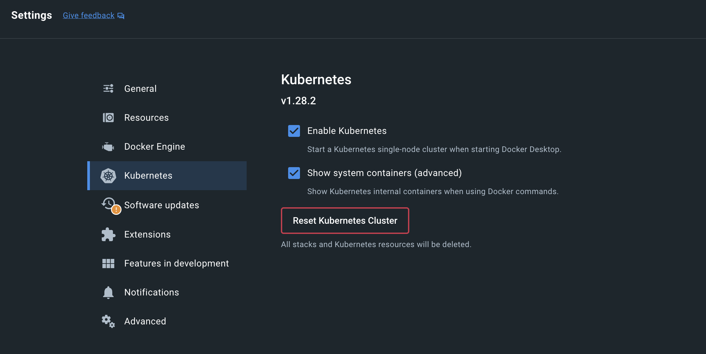

> Kubernetes is a container orchestration platform that provides various automated features for operating, managing, deploying, and scaling multiple containerized applications. This post covers fundamental Kubernetes concepts, kubectl, helm, and more.

### Kubernetes Components

The elements required to have a Kubernetes cluster are as follows.

- **Control Plane Components**
  - **kube-apiserver**: The Kubernetes API server that handles all requests to the cluster, managing authentication, authorization, and API validation/configuration
  - **etcd**: A highly available key-value store that stores all cluster data, maintaining the state of Kubernetes
  - **kube-scheduler**: Performs scheduling tasks to select a suitable node for newly created Pods
  - **kube-controller-manager**: Runs controllers that continuously manage and reconcile the state of nodes, replicas, endpoints, etc.
  - cloud-controller-manager: Manages and coordinates cluster resources

- **Node Components**
  - **kubelet**: Runs on each node, managing and reporting the status of Pods and containers

  - **kube-proxy**: A network proxy that manages networking and handles communication between Kubernetes services

  - **Container Runtime** (Kubernetes CRI - containerd, CRI-O...): Software that runs and manages containers

- Add-ons

  - DNS: Provides name resolution between Kubernetes services to simplify networking

  - Web UI (Dashboard): Provides a user interface for monitoring and managing cluster status

  - Container Resource Monitoring: Tracks and monitors resource usage of each container

  - Cluster-Level Logging: Collects and stores log data within the cluster for troubleshooting and auditing

### Kubernetes Objects

Persistent entities in the Kubernetes system are called kubernetes objects, which the official website describes as 'a record of intent.'

- Describes which applications are running and on which nodes they are located
- Describes the resources available to those applications
- Describes various policy elements such as restart policies and upgrade policies for those applications

##### Object spec

```yaml
apiVersion: apps/v1
kind: Deployment
metadata:
  name: nginx-deployment
spec:
  selector:
    matchLabels:
      app: nginx
  replicas: 2 # tells deployment to run 2 pods matching the template
  template:
    metadata:
      labels:
        app: nginx
    spec:
      containers:
      - name: nginx
        image: nginx:1.14.2
        ports:
        - containerPort: 80
```

- **`apiVersion`**: The Kubernetes API version used to create the object
  - POD: v1
  - Service: v1
  - ReplicaSet: apps/v1
  - Deployment: apps/v1

- **`kind`**: The type of object
- **`metadata`**: Information to distinguish the object within the cluster
  - name: The name of the object
  - labels: Labels that link similar objects together

- **`spec`**: Information about the desired state of the object

##### Resources

- **Workloads**
  - **Pod**: The smallest deployable unit containing one or more containers

  - ReplicationController: Manages maintaining the desired number of Pods (rarely used, replaced by ReplicaSet)

  - **ReplicaSet**: Manages maintaining a specific number of Pods

  - **Deployment**: Provides declarative updates for applications

  - **StatefulSet**: Manages applications that require unique, stable network identifiers and guaranteed storage ordering

  - **DaemonSet**: Ensures that Pods run on all (or some) nodes

  - **Job**: Manages one-time tasks and ensures completion

  - **CronJob**: Performs tasks periodically on a schedule

- **Network**
  - **Service**: Manages network access between Pods

  - **Ingress**: Routes external HTTP and HTTPS traffic to services within the cluster

  - **NetworkPolicy**: Controls network traffic for Pods

  - Others: Endpoint, Network policy, Port forwarding...
- **Config**
  - **ConfigMap**: Stores and manages application configuration data

  - **Secret**: Stores and manages sensitive data (e.g., passwords, tokens, keys)

  - **ResourceQuota**: Limits resource usage within a namespace

  - **LimitRange**: Limits resource usage within a namespace and defines requests and limits
- **Access Control**
  - **ServiceAccount**: User accounts for granting permissions to Pods

  - **Role**: Defines permissions for resources within a namespace

  - **ClusterRole**: Defines permissions for resources across the entire cluster

  - **RoleBinding**: Assigns roles to users/groups within a namespace

  - **ClusterRoleBinding**: Assigns roles to users/groups across the entire cluster

- **Storage**
  - **PersistentVolume (PV)**: Represents a storage resource within the cluster

  - **PersistentVolumeClaim (PVC)**: Used by users and Pods to request storage

  - **StorageClass**: Defines storage configuration for storage providers

  - VolumeAttachment: Connects volumes from external storage systems to cluster nodes

- etc.
  - **Namespace**: Logically groups cluster resources

  - PodSecurityPolicy: Defines Pod security policies to control Pod security settings

  - HorizontalPodAutoscaler: Automatically adjusts the number of Pods based on application load

  - VerticalPodAutoscaler: Automatically adjusts resource requests for Pods

  - PodDisruptionBudget: Defines the minimum number of Pods to ensure service availability during cluster maintenance

  - CustomResourceDefinition (CRD): Defines custom resources to extend the Kubernetes API


### Kubectl

The command-line tool for communicating with the Kubernetes cluster's control plane using the Kubernetes API is called kubectl. More detailed explanations about kubectl *[commands](https://kubernetes.io/ko/docs/reference/kubectl/#명령어), [supported resource types](https://kubernetes.io/ko/docs/reference/kubectl/#리소스-타입), [output options](https://kubernetes.io/ko/docs/reference/kubectl/#출력-옵션)*, etc. are documented on the official website.

```
kubectl [command] [TYPE] [NAME] [flags]
```

- `command`: Specifies the operation to perform
  - **`get`**: List resources
  - **`create`**: Create a new resource
  - **`apply`**: Create or update resources using a YAML file
  - **`delete`**: Delete resources
  - **`describe`**: Display detailed information about a resource
  - `edit`: Edit a resource
  - **`logs`**: View logs for a specific Pod

- `TYPE`: Specifies the resource type. Both singular and plural forms can be used
  - `pod`, `pods`, `deployment`, `deployments`, `service`, `services`, `node`, `nodes`, `configmap`, etc.

- `NAME`: Specifies the type of resource to work with. If the name is omitted, the command applies to all instances of that resource type
  - If all resources are of the same type: `TYPE1 name1 name2 name<#>`: `kubectl get pod example-pod1 example-pod2`
  - To specify multiple resource types individually: `TYPE1/name1 TYPE1/name2 TYPE2/name3 TYPE<#>/name<#>`: `kubectl get pod/example-pod1 replicationcontroller/example-rc1`

  - To specify resources from one or more files: `-f file1 -f file2 -f file<#>`

- `flags`: Optional flags

  - `-s` or `--server`: Specifies the address and port of the Kubernetes API server
  - `-n` or `--namespace`: Specifies the namespace in which to run the command
  - `-o` or `--output`: Specifies the output format (`-o yaml`, `-o json`, `-o wide`)
  - `--kubeconfig`: Specifies a particular kubeconfig file to use
  - `--context`: Specifies the kubeconfig context in which to run the command

### YAML

- Data representation: Data is expressed in key-value format
- Indentation: 2 spaces are generally recommended (Helm only supports 2 spaces), but 4 spaces are also possible
- Boolean: Supports true, false as well as yes, no
- List: Expressed using hyphens ('-')
  - Dicts and lists can also be expressed in abbreviated form
  - e.g., `martin: {name: Martin D'vloper, job: Developer, skill: Elite}`
  - e.g., `fruits: ['Apple', 'Orange', 'Strawberry', 'Mango']`


- Multiline string
  - `|`: Preserves newline characters within the block
  - `>`: Converts newline characters within the block to spaces
  - `|-`: Recognizes all except the last newline
- `---`: Start of document (optional)
- `...`: End of document (optional)

### Core Concepts for CKA

- A simple example of declaring a Pod using YAML in k8s
  - Can be applied using `kubectl apply -f pod.yaml`

```yaml
# pod definition
apiVersion: v1
kind: Pod
metadata:
  name: my-simple-pod
  labels:
    app: my-app
spec:
  containers:
  - name: my-container
    image: nginx:latest
    ports:
    - containerPort: 80
```

- **ReplicaSets**: Ensures that a specific number of identical Pods are always running. However, they are typically managed through Deployments
  - Uses label selectors to identify Pods to manage
  - Requires manual updates and does not support rollback
- **Deployments**: A higher-level concept than ReplicaSet that provides declarative updates for Pods and ReplicaSets. It makes application deployment easy to manage and ensures zero-downtime updates
  - Provides rolling update and rollback capabilities

```yaml
# k8s yaml definition for ReplicaSet
apiVersion: apps/v1
kind: ReplicaSet
metadata:
  name: my-replicaset
spec:
  replicas: 3
  selector:
    matchLabels:
      app: my-app
  template:	# Content mostly taken directly from pod.yaml above
    metadata:
      labels:
        app: my-app
    spec:
      containers:
      - name: my-container
        image: nginx:latest
```

- **Service**: Exposes Pod networks and provides load balancing to enable stable application access from both within and outside the cluster

| Type             | Internal | External | Description                                                  |
| ---------------- | -------- | -------- | ------------------------------------------------------------ |
| **ClusterIP**    | O        | X        | Creates an internal IP accessible only within the cluster    |
| **NodePort**     | O        | O        | Opens a specific port on each node for external access, used for testing or simple external exposure (**uses node IP**) |
| **LoadBalancer** | O        | O        | Automatically creates an external load balancer in 'cloud environments' to provide external access. **Uses the cloud provider's (AWS, GCP, Azure, etc.) network load balancer**, and internally uses NodePort and ClusterIP |
| **ExternalName** | -        | O        | Routes requests to external cluster services **using DNS names**. Allows external databases or API servers to be used within the Kubernetes namespace, enabling integration with external services |
| **Headless**     | O        | X        | For stateful applications or direct Pod access               |

- **Namespace**: A virtual cluster that logically divides a single cluster to independently manage multiple applications, teams, and environments (e.g., development, testing, production)
  - **default**: The default namespace where resources without a specified namespace are created
  - **kube-system**: Namespace containing Kubernetes system components (Pods, Services, etc.)
  - **kube-public**: A public namespace readable by all users
  - **kube-node-lease**: Used to track the status of each node
  - Can be created via yaml apply or `kubectl create namespace my-namespace`

```yaml
# kubectl apply -f namespace.yaml
apiVersion: v1
kind: Namespace
metadata:
  name: my-namespace
```

##### Scheduling

- Manual Scheduling
  - Changing the nodeName of an already created Pod is not possible in k8s
  - Therefore, to assign a node to an already created Pod, create a Binding object and send a request to the binding API
- **Label**: The basic format is `<prefix>/<name>` where the prefix is optional and typically follows a domain name format (e.g., `example.com/mylabel`). Filtering is possible with commands like `kubectl get pods --selector app=App1`
  - `app`: Application name.
  - `env`: Environment information (e.g., `production`, `staging`, `dev`).
  - `tier`: Application tier (e.g., `frontend`, `backend`, `database`).
  - `role`: Role information (e.g., `web-server`, `data-store`).
  - `function`: A label indicating a specific function.

```yaml
apiVeision: v1
kind: Pod
metadata:
	name: simple-webapp
	labels:
		app: App1
		function: Front-End
```

- **Taints**: A mechanism applied to nodes that prevents certain Pods from being scheduled on those nodes. When a Taint is set on a node, only Pods that can "tolerate" that Taint will be placed on it.
  - Key: The name or attribute of the Taint / Value: Optional, provides additional information for the Key / Effect: Defines the effect of the Taint, using one of the following
  - **`NoSchedule`**: Pods that cannot tolerate the Taint will not be placed on this node
  - **`PreferNoSchedule`**: Pods will preferably not be placed on this node, but this is not enforced
  - **`NoExecute`**: Immediately removes Pods from the node, and new Pods will not be scheduled either
  - Interesting fact: Master nodes have NoSchedule taints applied, and no application Pods run on them

```yaml
key=value:effect
```

- **Toleration**: A setting that allows Pods to "tolerate" specific Taints. Pods without Tolerations cannot be scheduled on nodes with Taints.
  - Key: Must match the Taint's Key
  - Operator: `Equal` requires both Key and Value to match for Toleration / `Exists` requires only the Key to match
  - Value: Must match the Taint's Value (used only with Equal)
  - Effect: Must match the Taint's Effect

```yaml
apiVersion: v1
kind: Pod
metadata:
  name: toleration-example
spec:
  tolerations:
  - key: "dedicated"
    operator: "Equal"
    value: "web"
    effect: "NoSchedule"
  containers:
  - name: nginx
    image: nginx
```

- **Node Selector**: The simplest mechanism for scheduling Pods on specific Nodes. Limits Pod scheduling to Nodes with specific labels by defining a `nodeSelector` field in the Pod spec
  - Does not support complex conditions or logical operations (e.g., OR, NOT)

```yaml
apiVersion: v1
kind: Pod
metadata:
  name: my-pod
spec:
  containers:
  - name: my-container
    image: nginx
  nodeSelector:
    disktype: ssd
```

- **Node Affinity**: Complements the limitations of Node Selector, providing more flexible and advanced scheduling options
  - `requiredDuringSchedulingIgnoredDuringExecution`: Required condition; will not be scheduled if not satisfied
  - `preferredDuringSchedulingIgnoredDuringExecution`: Preferred condition; scheduling is preferred but not mandatory
  - Supports multiple conditions (e.g., AND, OR)

```yaml
apiVersion: v1
kind: Pod
metadata:
  name: my-pod
spec:
  affinity:
    nodeAffinity:
      requiredDuringSchedulingIgnoredDuringExecution:
        nodeSelectorTerms:
        - matchExpressions:
          - key: disktype
            operator: In
            values:
            - ssd
      preferredDuringSchedulingIgnoredDuringExecution:
      - weight: 1
        preference:
          matchExpressions:
          - key: region
            operator: In
            values:
            - us-west-1
  containers:
  - name: my-container
    image: nginx
```

- **Requirements & Limits**
  - no request & no limit: A single Pod can consume too much node CPU
  - no request & limit: In this case, k8s automatically sets request = limit
  - request & limit: When a specific Pod needs heavy CPU work, the limit may prevent it from achieving peak efficiency
  - request & no limit: Guarantees basic CPU while allowing efficiency when needed
  - For memory, unlike CPU, when memory is full, the only option is to kill some Pods.
- **DaemonSets**: A resource that ensures a specific Pod runs on all (or selected) nodes in the cluster, one per node
  - Used for monitoring solutions & log viewers
  - kube-proxy and weave-net are also DaemonSets
- **Static Pods**: Pods that are managed directly by the kubelet on a specific node without going through the API server
  - Use cases: Running basic cluster components (e.g., etcd, kube-apiserver, kube-controller-manager), high-availability environments that must operate without the API server, etc.
  - Advantages: Can maintain Pods even if the API server goes down; can run independently outside of Kubernetes.
  - Disadvantages: Cannot be centrally managed and requires manual work; state and changes cannot be easily viewed or modified within the Kubernetes cluster.
- Scheduling Plugins: Custom plugins can be created in addition to the following
  1. Scheduling queue: PrioritySort
  2. Filtering: NodeResourcesFit, NodeName, NodeUnschedulable, ...
  3. Scoring: NodeResourcesFit, ImageLocality, ...
  4. Binding: DefaultBinder

##### Application Lifecycle Management

- **Rolling Update**: Using the `kubectl apply` command to update a deployment automatically triggers a rollout update
  - `kubectl rollout status deployment <deployment-name>`: Check rollout status

  - `kubectl rollout restart deployment <deployment-name>`: Restart Pods in a rollout manner without updating the deployment
- **Rollback**: The operation of restoring a Deployment to a previous state
  - `kubectl rollout undo deployment <deployment-name>`: Restore to the immediately previous state
  - `kubectl rollout history deployment <deployment-name>`: Check revision history (to find revision numbers)
  - `kubectl rollout undo deployment <deployment-name> --to-revision=<revision-number>`: Restore to a specific version
  - Kubernetes records a maximum of 10 Revisions for a Deployment by default. This limit can be configured using the `revisionHistoryLimit` field


- **ConfigMap**: A resource for managing configuration data

```yaml
apiVersion: v1
kind: ConfigMap
metadata:
  name: my-config
data:
  key1: value1
  key2: value2
```

```yaml
apiVersion: v1
kind: Pod
metadata:
  name: pod-using-configmap
spec:
  containers:
  - name: my-container
    image: nginx
    env:
    - name: MY_KEY1
      valueFrom:
        configMapKeyRef:
          name: my-config
          key: key1
```

- **Secret**: A resource for securely storing and managing sensitive data. By default, it is Base64-encoded but not encrypted

```yaml
apiVersion: v1
kind: Secret
metadata:
  name: my-secret
type: Opaque
data:
  username: bXktdXNlcg==   # Base64 value of "my-user"
  password: bXktcGFzcw==   # Base64 value of "my-pass"
```

```yaml
apiVersion: v1
kind: Pod
metadata:
  name: pod-using-secret
spec:
  containers:
  - name: my-container
    image: nginx
    env:
    - name: USERNAME
      valueFrom:
        secretKeyRef:
          name: my-secret
          key: username
```

- Multi-Container Pods: When you want to keep an app and logger together, multi-container Pods can be useful. They can communicate via localhost

  - **Sidecar pattern**: Runs an application container alongside an auxiliary container (e.g., an application container with a Fluentd log collection container)
  - **Ambassador pattern**: Includes a container (acting as a proxy) that handles communication with specific services

  - **initContainer**: A container that runs before application containers start. InitContainers perform initialization tasks and terminate before application containers run (e.g., data preparation, permission setup, network connection testing, dependency downloads before application container execution)

```yaml
apiVersion: v1
kind: Pod
metadata:
  name: init-container-pod
spec:
  initContainers:
  - name: init-container
    image: busybox
    command: ["sh", "-c", "echo 'Initializing...' && sleep 5"]
    volumeMounts:
    - name: shared-data
      mountPath: /app/data
  containers:
  - name: app-container
    image: nginx
    volumeMounts:
    - name: shared-data
      mountPath: /usr/share/nginx/html
  volumes:
  - name: shared-data
    emptyDir: {}
```

##### Cluster Maintenance

- OS Upgrades
  - **Drain**: `kubectl drain <node-name> --ignore-daemonsets --delete-emptydir-data`, moves all Pods running on a node to other nodes

  - **Cordon**: `kubectl cordon <node-name>`, marks the node as unschedulable so that no new Pods are assigned to it

  - **Uncordon**: `kubectl uncordon <node-name>`, removes the cordon status so the node can receive Pods again

- Cluster Upgrades
  - Strategy 1: Update the master node first, then upgrade worker nodes one at a time. The worker node being upgraded is drained to other nodes and then uncordoned

  - Strategy 2: Update the master node first, then upgrade worker nodes one at a time. A new replacement node is added during the upgrade

- Backup & Restore
  - Strategy 1: Resource Configuration Backup: Store all Kubernetes resource YAML or Helm charts in a version control system like GitHub, `kubectl get all --all-namespaces -o yaml > cluster-backup.yaml`
  - Strategy 2: ETCD Cluster Backup, `ketcdctl snapshot save <snapshot.db> ...` followed by `ketcdctl snapshot restore <snapshot.db> --data-dir=<new-data-dir>`

##### Security

- Basics
  - **Authentication**: "Who" can access
  - **Authorization**: "What actions" they can perform
  - TLS (Transport Layer Security): A protocol that encrypts communication between client and server to ensure data confidentiality and integrity
  - Certificate API: Provides a mechanism for managing TLS certificates within the cluster


- KubeConfig: Uses KubeConfig files to configure authentication and connections between clusters and users
  - **clusters**: Contains API server information for the cluster. URL and certificate data are key information
  - **contexts**: Defines connections between clusters and users
  - **users**: Contains information about users accessing the cluster. Authentication tokens, client certificates, and keys are key information
- **API Groups**: A structure that manages API requests by dividing Kubernetes resources (e.g., Pods, Services, Deployments) into groups
  - **Core Group** (Legacy API): In the form `https://<k8s-apiserver>/api/v1`, contains the most basic Kubernetes resources including Pod, Service, Node, Namespace, ConfigMap, Secret, PersistentVolume (PV), PersistentVolumeClaim (PVC), etc.
  - **Named API Groups**: In the form `https://<k8s-apiserver>/apis/<group>/v1`, used to add or extend features beyond the Core Group
  - Named API Groups include **apps** (`/apis/apps/v1`): Deployment, StatefulSet, DaemonSet, ReplicaSet / **batch** (`/apis/batch/v1`): Job, CronJob / **autoscaling** (`/apis/autoscaling/v1`): HorizontalPodAutoscaler (HPA) / **networking.k8s.io** (`/apis/networking.k8s.io/v1`): Ingress, NetworkPolicy / **rbac.authorization.k8s.io** (`/apis/rbac.authorization.k8s.io/v1`): Role, ClusterRole, RoleBinding, ClusterRoleBinding, etc.
- Authorization mode: Node, ABAC, RBAC, Webhook, AlwaysAllow, AlwaysDeny exist
- **RBAC** (Role-Based Access Control)
  - Create a Role first, then connect users to the Role via RoleBinding
  - **Namespaced**: **roles, rolebindings**, pods, replicasets, jobs, deployments, services, secrets, configmaps, PVC
  - **Cluster Scoped**: **clusterroles**, **clusterrolebindings**, nodes, PV, namespaces
- Accounts
  - User account: Accounts used by actual people (admin, developer, ...)
  - **Service account**: Accounts used by machines (prometheus, jenkins, ...)
- **Network Policy**
  - By default, all Pod-to-Pod network traffic is allowed in Kubernetes. Network Policies can define allow/block rules for traffic to specific Pods
  - `podSelector`: Selects the Pods to which the policy applies
  - `policyTypes`: Policy type, can be set to ingress, egress, or both
  - `ingress`: Defines incoming traffic rules
  - `egress`: Defines outgoing traffic rules
  - `rules`: Defines conditions to allow traffic, specifying `from`, `to`, `ports`

```yaml
apiVersion: networking.k8s.io/v1
kind: NetworkPolicy
metadata:
  name: mixed-policy
  namespace: default
spec:
  podSelector:
    matchLabels:
      app: backend
  policyTypes:
    - Ingress
    - Egress
  ingress:
    - from:
        - podSelector:
            matchLabels:
              app: frontend
      ports:
        - protocol: TCP
          port: 8080
  egress:
    - to:
        - ipBlock:
            cidr: 172.16.0.0/12
      ports:
        - protocol: TCP
          port: 3306

```

##### Storage

| Storage Type                | Description                                                  | Use Cases                                |
| --------------------------- | ------------------------------------------------------------ | ---------------------------------------- |
| EmptyDir                    | Persists during the Pod lifecycle. Data is lost when the Pod is deleted or restarted | Cache, temporary file storage            |
| HostPath                    | Uses the node filesystem path. Tightly coupled to the node, limiting Pod mobility | Debugging, log storage                   |
| PersistentVolume (PV)       | Managed by cluster administrators. Abstracts actual storage external to the cluster as a Kubernetes resource | Persistent data storage, storage backend connection |
| PersistentVolumeClaim (PVC) | A resource used when applications request PV. Specifies requested storage size and access mode | Application-storage connection           |
| StorageClass                | Serves as a template for dynamically provisioning PVs. Automatically creates PVs based on administrator settings, with configurable `reclaimPolicy` (delete, retain, etc.) | Various backend storage support          |

- Volume types usable as PV: HostPath, NFS (Network File System), AWS EBS (Elastic Block Store), GCE Persistent Disk (PD), CSI (Container Storage Interface), etc.
- Static Provisioning: A method where the cluster administrator directly creates and configures PersistentVolumes (PVs), which applications then request via PersistentVolumeClaims (PVCs)
- Dynamic Provisioning: A method where Kubernetes automatically provisions a suitable PersistentVolume (PV) when a PVC is created. It operates using **StorageClass**, and users only need to specify the storage type, size, and access mode

```yaml
# PersistentVolume
apiVersion: v1
kind: PersistentVolume
metadata:
  name: pv-example
spec:
  capacity:
    storage: 10Gi
  accessModes:
    - ReadWriteOnce
  persistentVolumeReclaimPolicy: Retain
  nfs:
    path: /nfs/share
    server: 192.168.1.1
```

```yaml
# PersistentVolumeClaim
apiVersion: v1
kind: PersistentVolumeClaim
metadata:
  name: pvc-example
spec:
  accessModes:
    - ReadWriteOnce
  resources:
    requests:
      storage: 5Gi
```

```yaml
# PVC and PV connection:
volumes:
- name: persistent-storage
  persistentVolumeClaim:
    claimName: pvc-example
```

##### Network

- **Ingress**: A Kubernetes resource that routes HTTP and HTTPS traffic from outside the cluster to internal services
  - `ingressClassName`: Specifies an Ingress Controller such as NGINX
  - `tls`: Configures TLS and enables HTTPS support for example.com. `secretName` is the name of the Kubernetes Secret where the TLS certificate is stored
  - `rules`: Defines the host (example.com) and path (/) to route traffic to example-service
  - `nginx.ingress.kubernetes.io/rewrite-target`: Redirects traffic to a specific path
  - `nginx.ingress.kubernetes.io/ssl-redirect`: Force redirects HTTP to HTTPS

```yaml
apiVersion: networking.k8s.io/v1
kind: Ingress
metadata:
  name: example-ingress
  namespace: default
  annotations:
    nginx.ingress.kubernetes.io/rewrite-target: /
    nginx.ingress.kubernetes.io/ssl-redirect: "true" # Redirect HTTP to HTTPS
spec:
  ingressClassName: nginx # Ingress Controller in use
  tls:
  - hosts:
    - example.com
    secretName: example-tls-secret # TLS certificate
  rules:
  - host: example.com
    http:
      paths:
      - path: /
        pathType: Prefix
        backend:
          service:
            name: example-service
            port:
              number: 80
```

##### ETC.

- Probe: Diagnostics periodically performed by the kubelet on containers
  - **Liveness Probe**: Checks whether a container is "running normally." Useful when an application may enter a deadlock state. Can be used when long-running processes need recovery if certain conditions are not met

  - **Readiness Probe**: Checks whether a container is "ready to handle traffic." Useful for configuring traffic to be received only after application initialization (e.g., data loading) is complete. Can be used when you want to block traffic until external services (e.g., DB connections) are ready

  - **Startup Probe**: Checks whether application "initialization is complete." Used only when a container starts for the first time, allowing longer wait times than the Liveness Probe based on initialization time (e.g., Triton Inference Server). Useful for applications with long initialization times (e.g., complex data initialization tasks). Can be used when you want to prevent the existing Liveness Probe from returning failure too early and causing container restarts


### Helm

A Helm chart is a collection of templated YAML files that define a Kubernetes application. A single chart contains all the Kubernetes resources needed to deploy an application. The basic structure is as follows:

- Chart.yaml: A file containing metadata about the chart (name, version, description, etc.)
- values.yaml: A file defining default values used in the chart
- templates/: The directory containing template files that define actual Kubernetes resources

Values define the variable values passed to the chart's 'template files.' Default values are defined in the `values.yaml` file, and custom values can be added during installation using the `--values` or `-f` flag. The values file enables reusing the same chart across different environments (the simplest example being dev/prod separation).

```yaml
# values.yaml
replicaCount: 2
image:
  repository: nginx
  tag: stable
```

Templates are template files used to make Kubernetes resource definitions dynamic and flexible. Defined variables are substituted with values from the values file, enabling dynamic generation of Kubernetes manifests.

```yaml
# templates/deployment.yaml
apiVersion: apps/v1
kind: Deployment
metadata:
  name: {{ .Release.Name }}-deployment
spec:
  replicas: {{ .Values.replicaCount }}
  template:
    spec:
      containers:
        - name: nginx
          image: "{{ .Values.image.repository }}:{{ .Values.image.tag }}"
```

In summary, the overall workflow is as follows:

1. A Helm chart contains all resource definitions needed to deploy a Kubernetes application.
2. Values files are used to set the values for application deployment.
3. Template files dynamically generate Kubernetes resource manifests using values from the values file.
4. Finally, Helm renders the templates to produce complete Kubernetes manifest files and applies them to the cluster. To preview the values that will be applied, you can use the `--dry-run` option (`helm install NAME . --dry-run --values=values.yaml`).

Various Helm commands can be found on the official site's [cheat sheet](https://helm.sh/docs/intro/cheatsheet/) page.

### Local Development



Navigate to the Kubernetes section in Docker Desktop settings and click 'Enable Kubernetes' to set up a k8s cluster in your local environment. A cluster named docker-desktop will automatically be added to the k8s config at `~/.kube/config`. If you click the 'Show system containers' button, you can also see the k8s system containers (kube-apiserver, etcd, kube-scheduler, kube-controller-manager...) added to Docker Desktop's container list.

### References

- https://kubernetes.io/ko/docs/home/
- https://helm.sh/ko/docs/
- https://www.json2yaml.com/
- https://docs.ansible.com/ansible/latest/reference_appendices/YAMLSyntax.html
