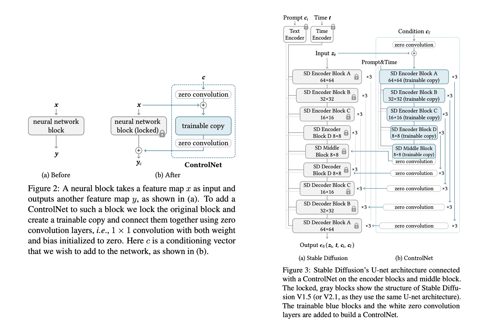
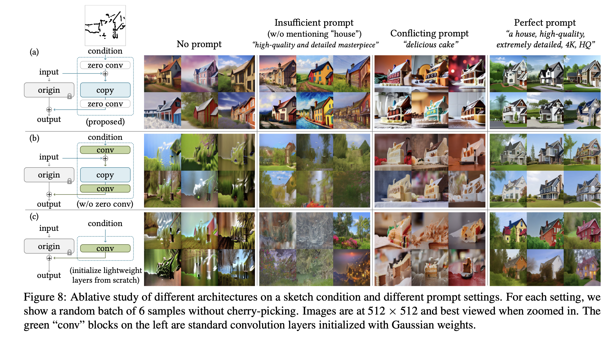
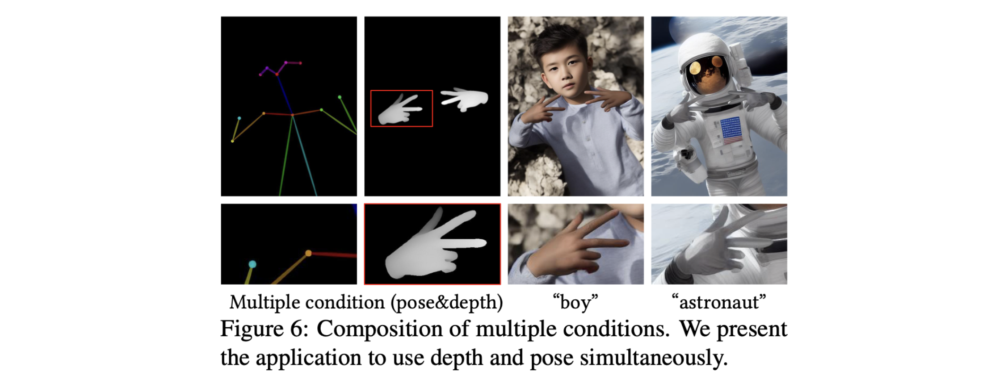
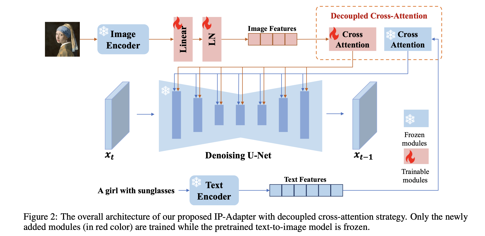
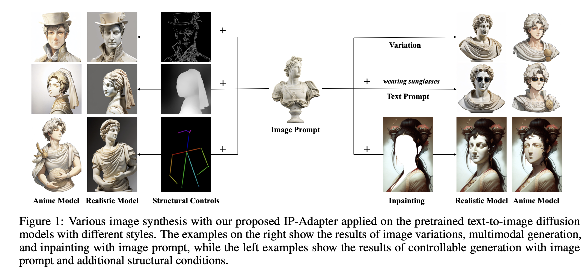
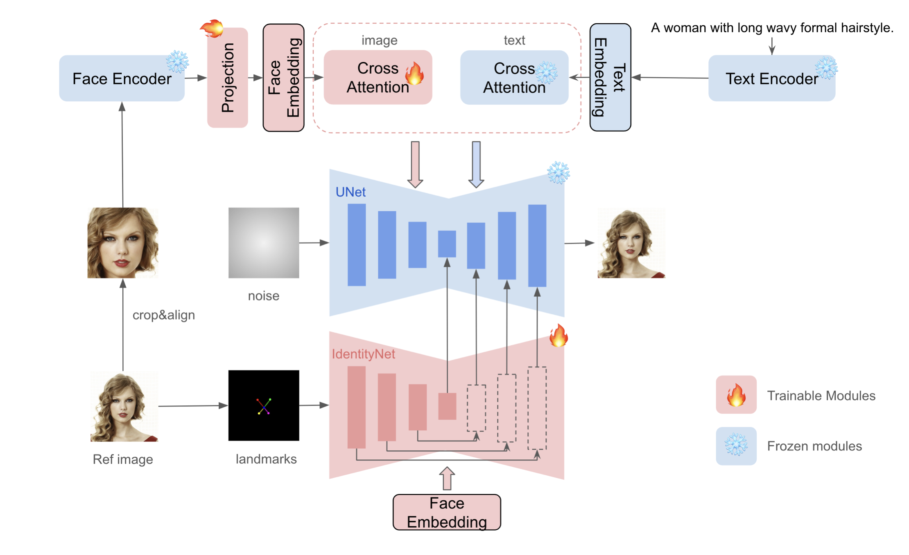
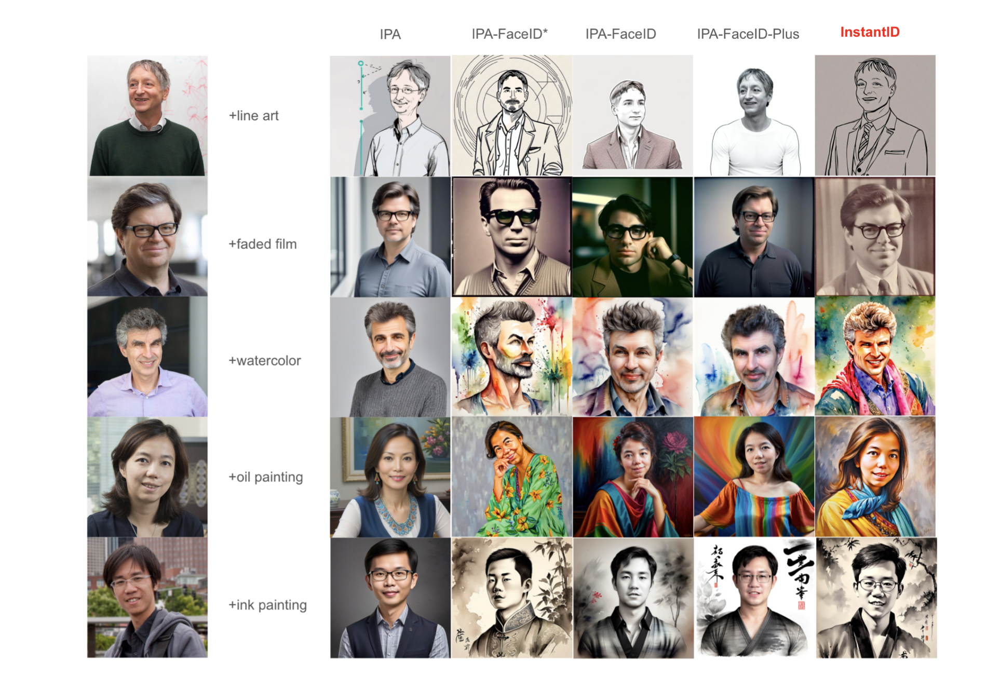
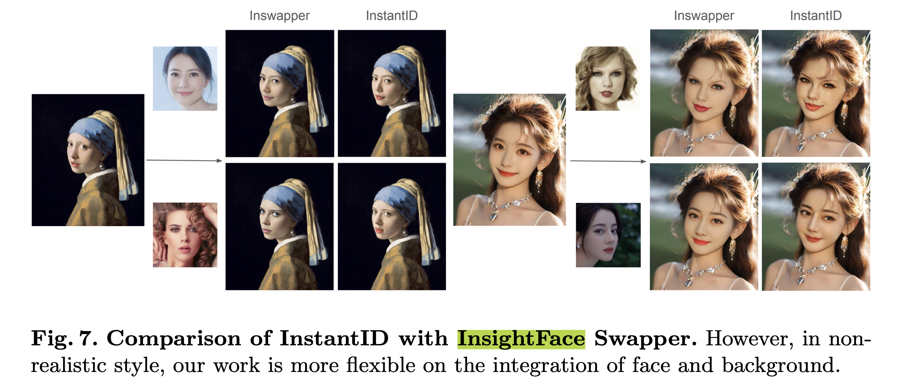

> A summary of various topics and papers related to conditional image generation.

### Preliminary

##### CFG scale

CFG (Classifier-Free Guidance) Scale is **a scaling parameter used to control condition-based sampling** in diffusion models. It controls the output quality by adjusting the weights of unconditional and conditional samples.
$$
\tilde{\boldsymbol{\epsilon}}_\theta\left(\mathbf{z}_\lambda, \mathbf{c}\right)=(1+w) \boldsymbol{\epsilon}_\theta\left(\mathbf{z}_\lambda, \mathbf{c}\right)-w \boldsymbol{\epsilon}_\theta\left(\mathbf{z}_\lambda\right)
$$

- Low values (e.g., 1.0 or below): The model generates more natural, general samples. At -1, the prompt has no influence at all

- High values (e.g., 7.0 or above): The model tends to align more strongly with the condition

- Generally, a CFG scale between 7 and 11 provides optimal results

##### Negative Prompt

Looking at the denoising process with CFG scale above, it follows the form 'conditional sampling - unconditional sampling.'

Negative prompts are implemented by hijacking the unconditional sampling portion. That is, they operate as **'conditional sampling - unconditional sampling with negative prompt.'** Visual explanations can be found [here](https://stable-diffusion-art.com/how-negative-prompt-work/).

##### CLIP Skip

CLIP skip means **skipping some (the last few) CLIP layers during the image generation process**. Not only does it improve speed, but it can also improve image generation quality in some cases.

The deeper layers of CLIP are related to fine-grained text descriptions, but in certain models, such detailed understanding can add unnecessary noise to image generation. Therefore, CLIP skip is useful for reducing excessive noise and efficiently utilizing GPU time.

- Low CLIP skip: Finely reflects text descriptions
- High CLIP skip: Sacrifices some text detail
- Generally, CLIP skip of 1-2 is appropriate.
- However, when using techniques like LoRA or Negative Prompt, careful verification is needed to ensure CLIP does not distort the LoRA modifications

##### BF16 / FP16 / FP32

BF16 (Brain Float 16) consists of **`1-bit sign, 8-bit exponent, 7-bit mantissa`**.

- Has lower precision due to the smaller mantissa, but provides a wide dynamic range by using the same number of exponent bits as FP32
- Offers a dynamic range close to FP32, with fast computation speed and low memory usage
- Frequently used in neural network training and inference, particularly useful when precision is not critically important (e.g., gradient computation)

FP16 consists of **`1-bit sign, 5-bit exponent, 10-bit mantissa`**.

- Like BF16, computation is fast and memory usage is low
- Has a narrow dynamic range, which may result in insufficient precision for very large or very small values (risk of overflow/underflow)

FP32 consists of **`1-bit sign, 8-bit exponent, 23-bit mantissa`**.

- Provides high precision and reduces overflow/underflow issues
- However, memory usage and computational cost are high

##### LoRA Alpha

In LoRA, alpha is **a scaling factor that controls the influence of LoRA**. LoRA weight scale also serves to control LoRA's influence. Typically, LoRA is computed as follows (where dim refers to the LoRA dimension):

```
output = original_weight + (lora_A @ lora_B) * (alpha / dim)
```

The alpha / dim part in the equation above controls LoRA's influence. Therefore, when dim is 64 and alpha is 32, alpha / dim equals 0.5. In other words, with alpha=32 and dim=64, setting the LoRA weight scale to 0.5 during inference **produces the same effect as the alpha-to-dim ratio set during LoRA training**.

### ControlNet

It **directly copies the UNet layers** and places **zero convolution layers** with weights and biases initialized to 0 at the input and output ends. Then the trainable copy and convolution layers are fine-tuned.



Below are results showing that zero-initialized convolution was important.



The training approach is identical to the existing Stable Diffusion loss. However, 50% of the text prompts were randomly replaced with empty strings. The authors also report a 'sudden convergence phenomenon' where results were poor during training until a certain step when they suddenly became good.

During inference, applying multiple conditions is also possible. Simply attach an additional ControlNet.



### IP-Adapter

While various methods exist for incorporating multiple image prompts, they had the following issues:

- Performance is lower than image prompt models that fine-tune the entire model
- Other methods do not properly utilize the diffusion model's cross-attention module. The mechanism for merging image features and text features merely aligns image features to text, causing image-centric features to disappear and only allowing control of rough image elements (e.g., style)

IP-Adapter aimed to address these issues through a decoupled cross-attention mechanism. The overall architecture is as follows:



1. **Extract image features** from the image prompt.
2. **Decoupled cross attention**: Perform cross attention separately with image features and text features, then combine them.
3. The combined features are used in the UNet.

Through the following equation, text prompt and image prompt each undergo cross attention separately before being combined:
$$
\begin{array}{r}
\mathbf{Z}^{\text {new }}=\operatorname{Softmax}\left(\frac{\mathbf{Q} \mathbf{K}^{\top}}{\sqrt{d}}\right) \mathbf{V}+\operatorname{Softmax}\left(\frac{\mathbf{Q}\left(\mathbf{K}^{\prime}\right)^{\top}}{\sqrt{d}}\right) \mathbf{V}^{\prime} \\
\text { where } \mathbf{Q}=\mathbf{Z W}_q, \mathbf{K}=\boldsymbol{c}_t \mathbf{W}_k, \mathbf{V}=\boldsymbol{c}_t \mathbf{W}_v, \mathbf{K}^{\prime}=\boldsymbol{c}_i \mathbf{W}_k^{\prime}, \mathbf{V}^{\prime}=\boldsymbol{c}_i \mathbf{W}_v^{\prime}
\end{array}
$$
At the inference stage, the strength of the image prompt can be adjusted:
$$
\mathbf{Z}^{\text {new }}=\operatorname{Attention}(\mathbf{Q}, \mathbf{K}, \mathbf{V})+\lambda \cdot \operatorname{Attention}\left(\mathbf{Q}, \mathbf{K}^{\prime}, \mathbf{V}^{\prime}\right)
$$
The training logic of IP-Adapter differs slightly from the inference logic. Although during inference a reference image is provided as input, during training no separate reference image is created. Instead, **the existing (text, image) pairs are used directly**, with **the image given as input to IP-Adapter, and the goal is to faithfully reconstruct that same image**.

IP-Adapter is useful for freely defining specific poses while capturing overall color composition and style, whereas ControlNet is better suited for enforcing specific poses. Therefore, using IP-Adapter and ControlNet together, as shown in the example below, enables controlling structural features while preserving fine image details and style (e.g., setting the composition with ControlNet and then finely adjusting the style with IP-Adapter).



A useful tutorial on IP-Adapter is shared below.

- https://www.internetmap.kr/entry/IP-Adapter-too-many

If you want to generate an image that (1) reflects the characteristics of a specific reference image while (2) controlling it in a specific structure/form with a specific style, you can **use IP-Adapter to reflect the reference image's characteristics**, **ControlNet to control the structure**, and **apply a LoRA trained in the desired style**.

However, basic IP-Adapter often fails to sufficiently reflect fine styles or details of the reference image in the result. In such cases, IP-Adapter Plus can be used.

### IP-Adapter Plus

IP-Adapter Plus is an extended version of IP-Adapter that more precisely reflects the fine styles and layout of reference images. This model does not have a separate paper; the same authors updated the original paper and added this new model.

Since it can capture not only simple image concepts but also fine details, if you plan to use IP-Adapter, it is recommended to also test IP-Adapter Plus.

The principle behind IP-Adapter Plus's ability to better reflect details compared to IP-Adapter is as follows:

1. Both global embedding (cls token) and local patch embeddings are extracted. (The original IP-Adapter uses only global embedding)
2. These are passed through IP-Adapter's MLP for processing, and the processed vectors are delivered to cross-attention.

In other words, while IP-Adapter uses only a single summary vector representing the entire image, IP-Adapter Plus uses local vectors for each patch of the image, enabling more detailed and fine-grained image information to be reflected.

### InstantID

It uses an **IP-Adapter structure to capture facial detail** and a **ControlNet structure to identify the structural region of the face in the image**, leveraging both pieces of information to generate new images while preserving identity.



Comparison results with other methods are as follows:



When compared with InsightFace, the most widely used tool for face swapping, both demonstrate natural and high-quality performance.



A useful tutorial is shared below.

- https://www.internetmap.kr/entry/Stable-Diffusion-InstantID

Regarding ID preservation methods, PuLID is a recent paper showing high performance, but it will be covered in a future post.

### Reference

- [Adding Conditional Control to Text-to-Image Diffusion Models (2023.02)](https://openaccess.thecvf.com/content/ICCV2023/papers/Zhang_Adding_Conditional_Control_to_Text-to-Image_Diffusion_Models_ICCV_2023_paper.pdf)
- [IP-Adapter: Text Compatible Image Prompt Adapter for Text-to-Image Diffusion Models (2023.08)](https://arxiv.org/abs/2308.06721)
- [InstantID: Zero-shot Identity-Preserving Generation in Seconds (2024.01)](https://arxiv.org/abs/2401.07519)
