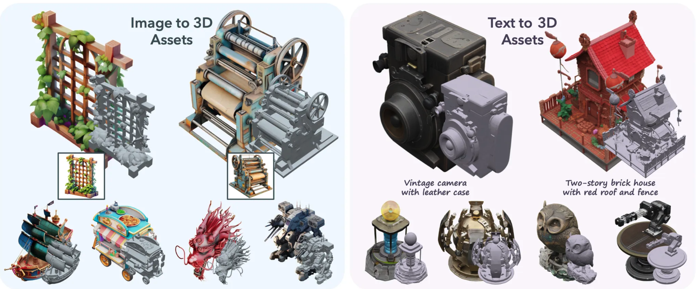
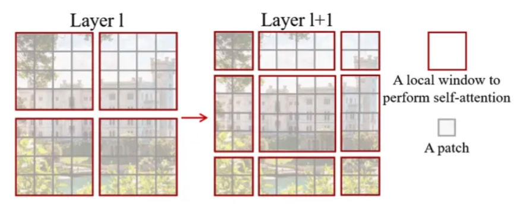
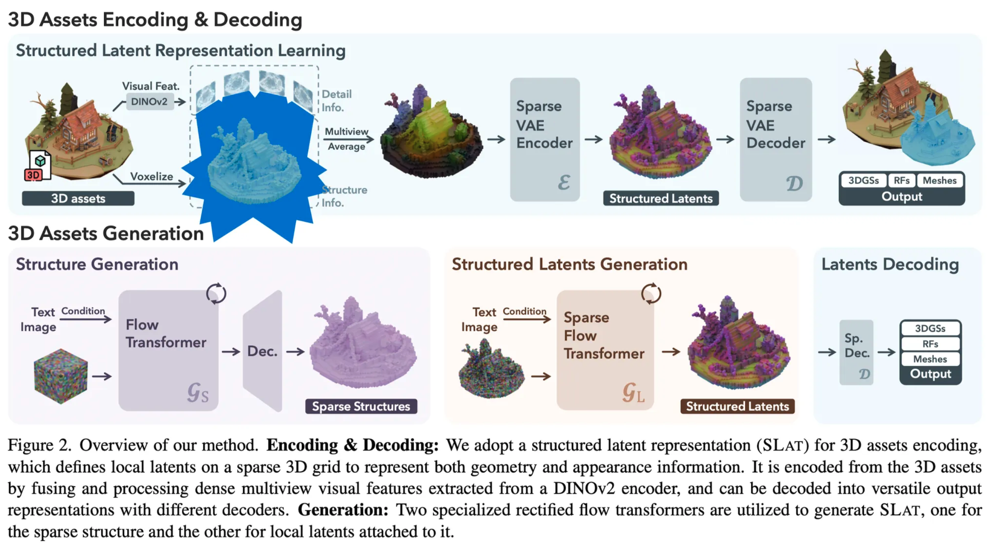
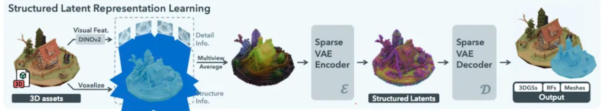
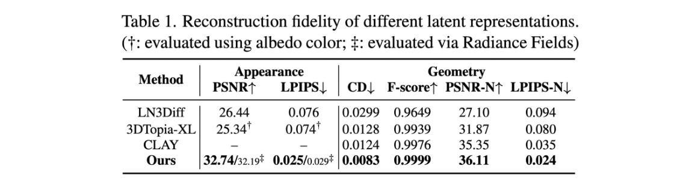
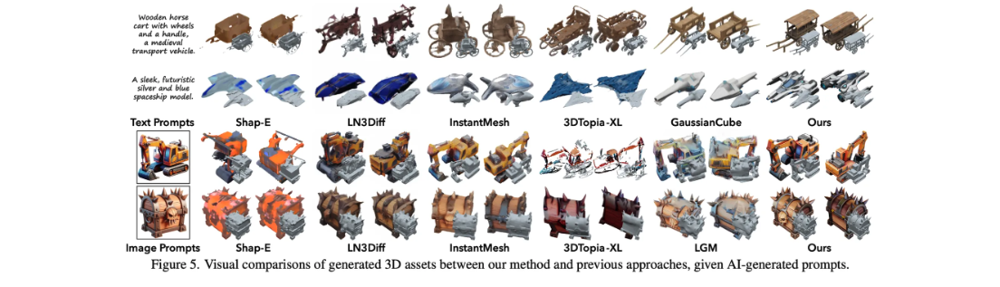
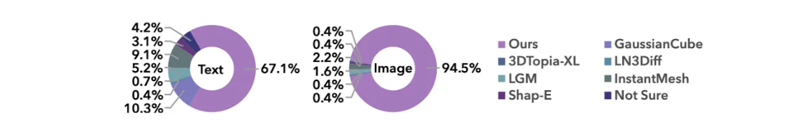

> A review of the "TRELLIS: Structured 3D Latents for Scalable and Versatile 3D Generation" paper.

### Introduction

Research on 3D generation exists across several directions. Mesh-based methods fall short in detailed appearance modeling, while methods that generate 3D Gaussians or Radiance Fields (NeRF) boast high-quality rendering in terms of appearance but have limitations in geometry extraction.

Because each 3D representation -- mesh, 3D Gaussian, Radiance Field -- has fundamentally different characteristics and structures, it is difficult to unify them under a single network architecture. Consequently, unlike 2D generation, integrating them into a single network or latent space has been challenging.

Therefore, the goal of the TRELLIS paper is to 'unify several different 3D representations into one,' a topic the authors claim is challenging since it has not been frequently addressed before. (The term 'representation' used in the paper refers to 3D representation methods such as mesh, 3D Gaussian, and Radiance Field.) TRELLIS supports the following tasks:

1. Image-to-3D: 3D generation based on a reference image
2. Text-to-3D: 3D generation based on text input
3. Flexible editing
   - Detail variation: Changing detail elements while keeping the overall structure intact
   - Local editing: Modifying only specific regions while keeping the rest fixed

### Preliminaries

- **Rectified Flow Transformer**: Depending on how the flow is defined mathematically, various forms of flow matching models exist, and rectified flow is the most commonly used one recently. It defines the flow by connecting 'data points and N(0, 1)' with a straight-line path.
- **Shifted Window Attention**: A concept from the Swin Transformer. To incorporate locality in ViT, attention is applied only within local windows. However, since tokens at the edges of windows are adjacent at layer $l$ but do not attend to each other, the windows are shifted at layer $l+1$ to compute attention.
  - Local Window Self-Attention (W-MSA): Self-attention is performed window-by-window at each layer, enabling information exchange only within each window
  - Shifting Window Self-Attention (SW-MSA): At the next layer, windows are shifted by a certain number of pixels and self-attention is performed again, resulting in indirect information exchange with tokens from other windows that were not directly connected in the previous layer

### Methodology

The overall approach is as follows:

1. Encoder & Decoder training to produce a good SLAT (Structured Latent) vector representation space
   - `Decoder` is trained in three types: Mesh / 3D Gaussian / Radiance Field
2. Transformer training to generate SLAT from noise & text/image
   - A two-stage approach is used for SLAT generation
     1. `Flow Transformer`: Training to generate structure from noise & text/image
     2. `Sparse Flow Transformer`: Training to attach latent values to the structure
3. These three separately trained models are combined into a single 'noise & text/image to 3D model'
   1. `Flow Transformer`: noise & text/image -> structure & text/image
   2. `Sparse Flow Transformer`: Attaching features to the structure (SLAT)
   3. `Decoder`: SLAT -> 3D Gaussian/RF/Mesh

##### Structured Latent Representation (SLAT)

$$
\boldsymbol{z}=\left\{\left(\boldsymbol{z}_i, \boldsymbol{p}_i\right)\right\}_{i=1}^L, \quad \boldsymbol{z}_i \in \mathbb{R}^C, \boldsymbol{p}_i \in\{0,1, \ldots, N-1\}^3
$$

- $N$ is the spatial length of the 3D grid, $L$ is the total number of active voxels
  - By default, $N$ is set to 64, and $L$ averaged around 20K
- Intuitively, active voxels $p_i$ can be viewed as the rough structure of the 3D asset
- The latent $z_i$ captures the fine details of appearance and shape

##### Structured Latents Encoding & Decoding

The voxelized features for active voxels were obtained using DINOv2.

1. Each voxel is projected onto multiview images
   - Multiview images: Camera views are randomly sampled per 3D asset (150 2D images)
2. Features at the corresponding positions are averaged to produce the voxelized feature
   - The dimension of $f$ is also set to $64^3$ like $z$
     - Encoding from $64^3 \to 64^3$, meaning encoding to the same dimension
     - Rather than compressing the representation, the purpose is to transform it into a latent suitable for decoding into multiple representations

While one might question whether this approach works, the authors confirmed experimentally that it is sufficient for reconstructing 3D assets.

A decoder is attached, and the encoder and decoder are trained based on reconstruction loss. Decoding is possible into three formats -- mesh, 3D Gaussian, and NeRF -- using three separate decoders.

- Uses a Transformer architecture
- KL penalty is added to ensure $z_i$ follows a normal distribution
- Input features $f$ are flattened with sinusoidal positional encoding added, creating $L$-length tokens that are fed into the Transformer architecture
- Shifted window attention in 3D space is applied to account for locality characteristics

##### Structured Latent Generation

A two-stage generation pipeline is used to create the structured latent.

1. **Sparse Structure Generation**: The goal of this stage is to create the sparse structure, i.e., active voxels $\{p_i\}^L_{i=1}$
   - The original goal was to generate an $N\times N\times N$ 3D grid, but since this is computationally expensive, a low-resolution feature grid of $D \times D \times D \times C$ is first generated and then decoded to $N\times N\times N$ to produce active voxels $\{p_i\}^L_{i=1}$
   - A flow transformer is used, where each feature grid is combined with positional encoding and fed into the flow transformer
   - Timestep information is utilized through AdaLN and gating mechanisms
   - CLIP model features are used for text conditioning, and DINOv2 features are used for image conditioning, injected via cross-attention layers
2. **Structured Latent Generation**: This stage generates the latent ${z_i}^L_{i=1}$ for the given structure ${p_i}^L_{i=1}$
   - Instead of serializing like the sparse VAE encoder, downsampling followed by upsampling is applied
   - Timestep information is utilized through AdaLN and gating mechanisms
   - $\mathcal G_S$ and $\mathcal G_L$ are each trained independently

##### 3D Editing with Structured Latents

- **Detail variation**: Keep the structure generated in the first stage fixed, and apply different text prompts in the second stage
- **Region-specific editing**: Uses an inpainting method called Repaint. Only voxels within a given bounding box region are modified, while the rest remain unchanged

### Experiments

The experimental setup is as follows:

- 500K 3D assets from four public datasets were used for training
  - Objaverse, ABO, 3D-FUTURE, HSSD
- 150 2D images were used per 3D asset
- GPT-4o was used for captioning
- Three model sizes were trained: Basic (342M), Large (1.1B), X-Large (2B)
  - XL: Trained for 400K steps with batch size 256 on 64 A100 GPUs
- Inference used CFG of 3 with 50 sampling steps
- Evaluation used the Toys4k dataset (not used in training), and visualizations in the paper used text generated by GPT-4 and images generated by DALL-E
- Gaussian decoding was used for appearance evaluation, and mesh decoding for geometry

##### Reconstruction Results

The method achieved the best performance across multiple metrics.

- Appearance fidelity: Measures how similar the appearance is to the actual or reference data
- Geometry quality: Used to evaluate the structural accuracy of 3D objects

##### Generation Results

Regarding text/image to 3D generation, the authors claim that colors and details are vivid, structure and shape are precise, transparent objects like water cups can be handled, and generated objects match well with the text.

68 text-to-3D and 67 image-to-3D assets were created and evaluated by humans, with good results as well.

### Conclusion

The TRELLIS paper created a new high-performance 3D asset generation model. Through the Structured Latent Representation (SLAT), decoding into multiple output formats became possible. A two-stage generation pipeline suitable for SLAT was developed, and its superior performance was demonstrated through various experiments.

### Reference

Xiang, Jianfeng, et al. "Structured 3d latents for scalable and versatile 3d generation." *arXiv preprint arXiv:2412.01506* (2024).
