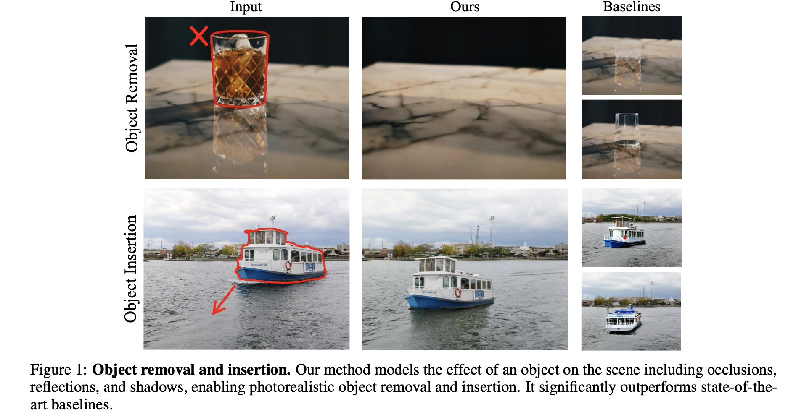
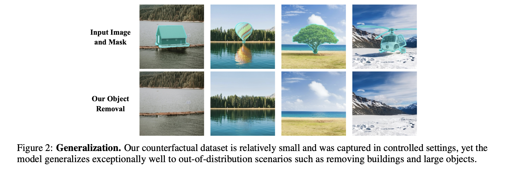
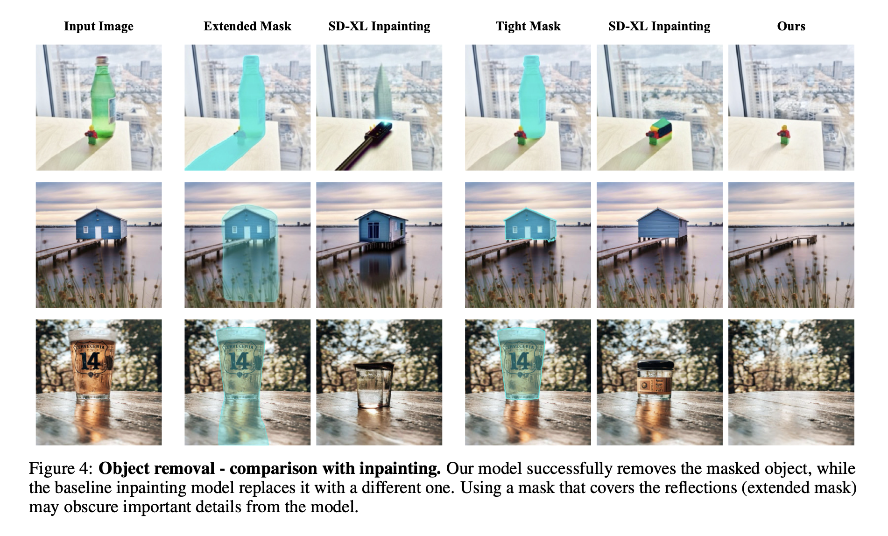
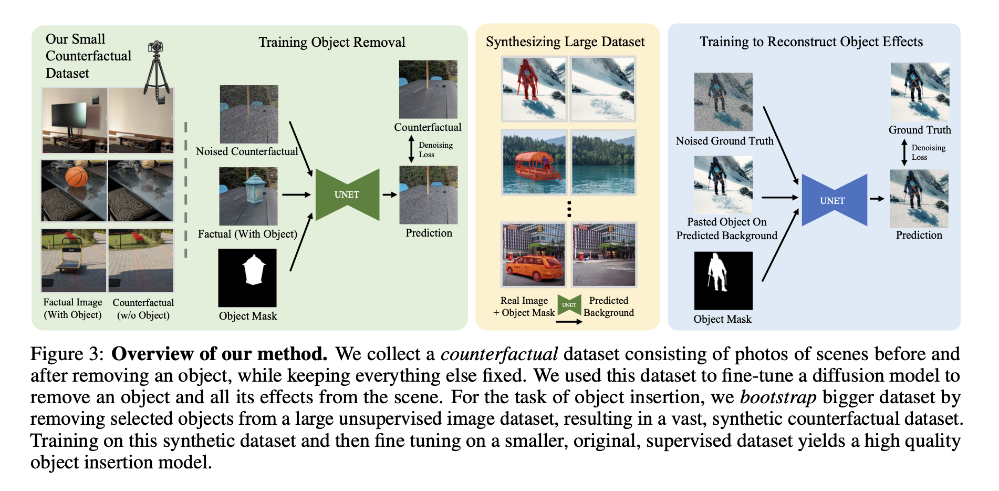
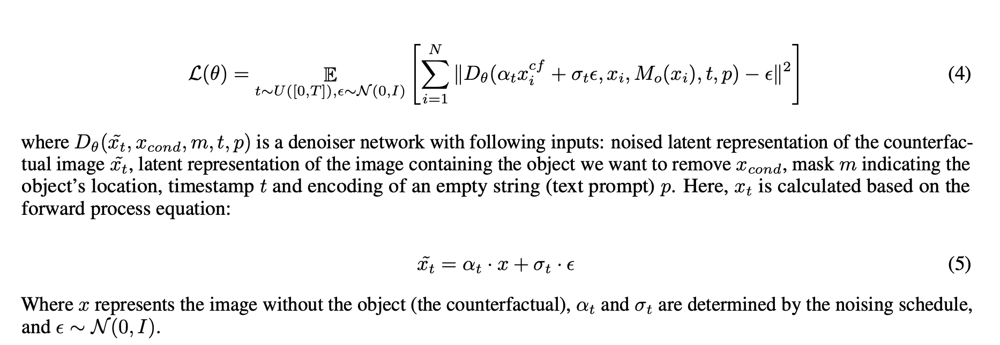
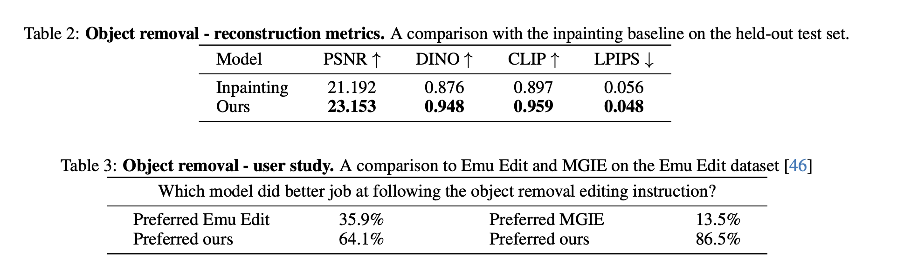
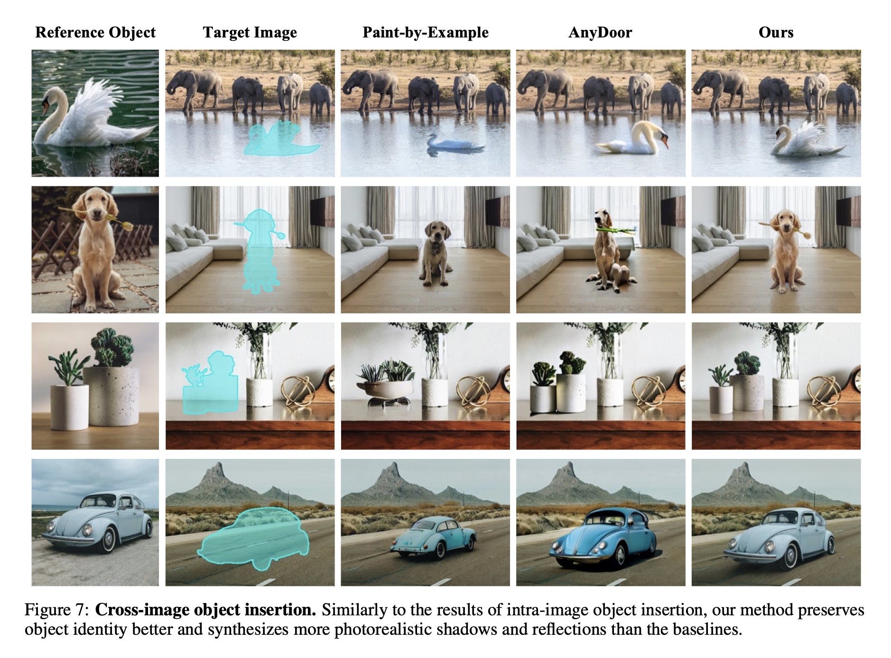
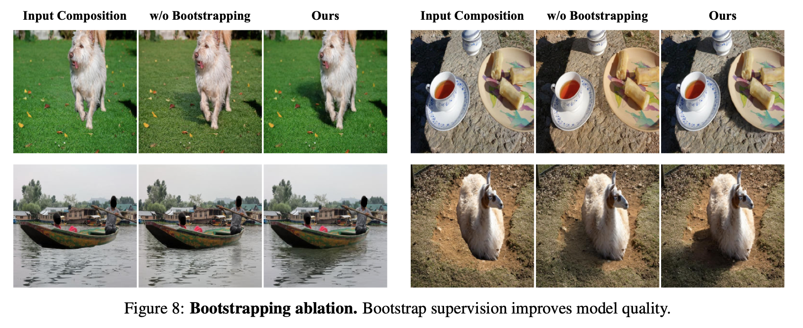

> A review of the ObjectDrop paper presented at ECCV 2024.

### Introduction

Many diffusion-based editing models have recently shown impressive performance, but generating physically realistic images remains challenging. For example, an object removal model must not only replace pixels occluded by the object but also remove associated shadows and reflections.

Diffusion-based inpainting and self-supervised image editing methods like prompt-to-prompt have limitations in this regard. Since they only have access to the image with the object already present, they lack information about the counterfactual image and therefore cannot sufficiently remove these shadow and reflection effects.

This paper proposes an approach of training a diffusion model on a well-curated "counterfactual" dataset. A counterfactual dataset consists of pairs of:

1. A factual image depicting the scene
2. A counterfactual image depicting the scene after an object change (adding/removing it)

This dataset is created by having professional photographers physically modify objects within a scene. The paper demonstrates that this approach works well for object removal across diverse, unseen objects.

However, since object insertion is a more challenging task than object removal and requires a larger volume of data, the authors take a 2-step approach:

1. Train an object removal model on a small counterfactual dataset
2. Use the object removal model to remove objects from a large unlabeled image dataset, creating a synthetic dataset

The resulting large synthetic dataset is used to train the insertion model. The authors refer to this method as bootstrap supervision, and ultimately show that it outperforms recent methods such as EmuEdit, AnyDoor, and Paint-by-Example.

### Related Works

The paper introduces four categories of related work:

- Image inpainting: Struggles with realistic object removal, specifically failing to properly remove shadows and reflections.
- Shadow removal methods: These focus on removing shadows using shadow region masks. This work differs fundamentally in that it requires only the object's region mask to remove all object-related regions (including shadows and reflections), rather than a shadow region mask.
- General image editing models: Refers to text-based image editing models. While multi-modal LLMs are also effective, the paper claims ObjectDrop is superior.
- Object insertion: While AnyDoor is a strong recent method, it sometimes fails to preserve object identity. In contrast, ObjectDrop's approach maintains identity well.

### Self-Supervision is Not Enough

Previous approaches included diffusion-based inpainting and attention-based methods like prompt-to-prompt. These self-supervised methods have the following limitations:

- When the segmentation mask is set too broadly: Pixels from non-object regions are erased, causing the model to regenerate unwanted areas, which introduces errors.
- When the segmentation mask is set too tightly: Shadow, reflection, and other object-related information cannot be removed.

### Object Removal

##### Collecting a counterfactual dataset

To create the dataset, 2,500 counterfactual pairs were collected, with professional photographers using tripod-mounted cameras.

1. Capture $X$ (factual image) containing object $O$.
2. Physically remove object $O$ while restricting camera movement, lighting changes, and movement of other objects.
3. Capture $X_{cf}$ (counterfactual image).
4. Generate a segmentation mask for object $O$ using SAM.
5. The final dataset consists of $X$, mask $M(X)$, and $X_{cf}$.
6. 100 of the 2,500 images are designated as the test dataset.

##### Counterfactual distribution estimation

A large-scale diffusion model is trained on the manually created counterfactual dataset to obtain the object removal model.

- $\tilde x$: latent representation counterfactual image
- $x$: latent representation of the image containing the object we want to remove
- $m$: mask
- $t$: timestemp
- $p$: text prompt encoding

Notably, unlike traditional inpainting methods, the masked pixels were not replaced with gray or black pixels. This approach helps the model fully utilize information within the mask region, enabling better handling of partially transparent objects and cases where the mask is insufficient.

##### Advantages over video supervision

While using supervision obtained from video is also possible, the paper highlights serious limitations of this approach:

1. In the counterfactual dataset, the only thing that changes is the object, whereas in video, many other properties such as camera position can change. This can create spurious correlations between object removal and other properties.
2. The video-based dataset creation approach only works with moving objects. In contrast, the counterfactual approach also generalizes well to objects that are difficult to move (heavy, large, immobile objects), and actually achieves better performance.

### Object Insertion

ObjectDrop can be extended beyond object removal to object insertion as well.

The goal of object insertion is to predict what the target image would look like with the given object placed at the desired position, given an image of the object, a target image, and the desired position.

The authors hypothesized that the relatively small counterfactual dataset (2,500 samples) was sufficient for object removal but insufficient for training object insertion. Therefore, they used a new synthesis approach to increase the data volume.

##### Bootstrapping Counterfactual Dataset

1. Train the object removal model using the dataset described above.

2. Create synthetic datasets from a large external dataset.

   - Use a foreground detector to detect objects.

   - Remove objects and their shadow reflections from the scene using the object removal model.
   - Paste back only the object region onto the image.

3. Fine-tune a diffusion model for object insertion using this dataset.

The paper refers to this approach as bootstrap supervision.

In more detail, (1) a total of 14M images were collected, from which 700K suitable images were selected, and (2) after performing object removal, 350K samples with satisfactory results were chosen. This is 140 times more data than the dataset (2,500 images) used to train the object removal model.

##### Diffusion Model Training

- For object removal, a Latent Diffusion Model was used with a pre-trained inpainting model.
- Internally, an architecture similar to SDXL was adopted.
- For object insertion, a pre-trained inpainting model was not used.
- Since the synthetic data is not sufficiently realistic, it is used only for pre-training in the insertion task.
- In the final stage, the model was fine-tuned on the manually created (photographer-captured) counterfactual dataset.

### Experiments

Quantitative results and user study results for the object removal task:

Quantitative and qualitative results for object insertion:

The effectiveness of bootstrap supervision can be observed in the figure:

