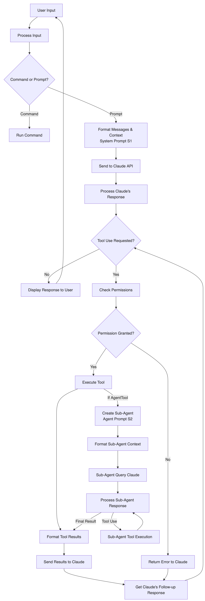
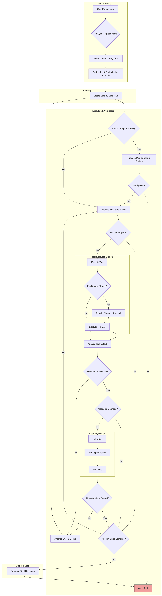

I visualized the high-level operation of Gemini CLI and Claude Code using mermaid diagrams.

### Gemini CLI

I directly prompted Gemini CLI to "visualize the overall flow of gemini cli as a mermaid diagram," and then asked it to "review whether the result matches your (gemini cli's) actual logic."

Please note that hallucinations may exist, so treat this as reference material only.

### Claude Code

The overall flow below was taken from the following link, and this person also prompted Claude Code directly to describe its own flow.

- https://github.com/abhinavsharma/claude-code-description?tab=readme-ov-file

##### Claude Code in Detail

There is also someone who analyzed and visualized the Claude Code source code directly. Please refer to the original link below for detailed diagrams.

- https://gist.github.com/leehanchung/04c0c53fe839e6b1ad7570f026c2f988

### Summary

At a high level, what an agent does can be summarized as follows:

1. **Check if it's a command**: Determine whether it is a directly executable command or whether a tool needs to be invoked after analyzing the prompt

2. **Assess task complexity**: Determine whether the task is complex enough to require the user to review a plan

3. **Planning**: Create a plan (ToDo list) and execute it sequentially
   - **Determine the necessary tool for each step**: Decide whether a tool (or sub-agent) is needed for the current step. If so, determine which tool is appropriate, whether permissions are available, etc.

   - **Evaluate whether the tool usage result was adequate**
   - **Determine whether all steps in the plan are complete**

4. **Compile and return the final response**
