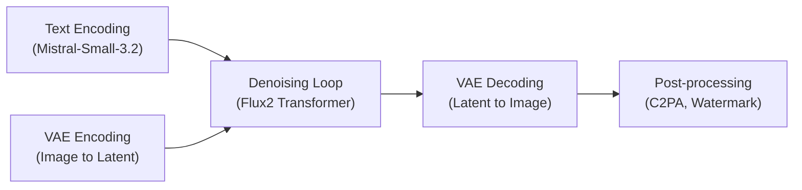
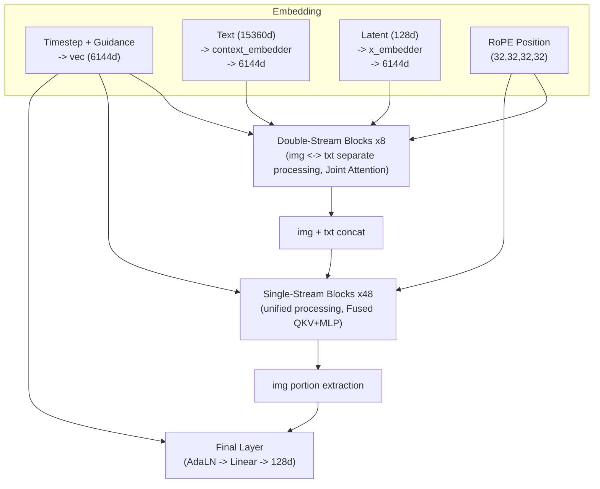
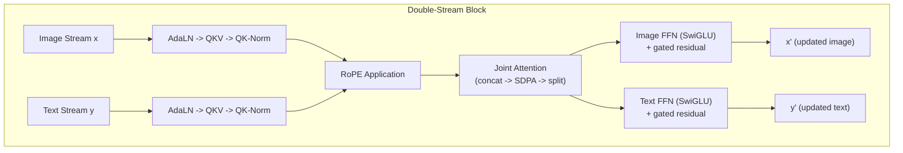
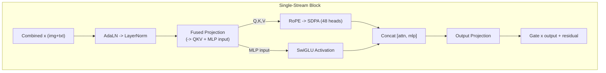
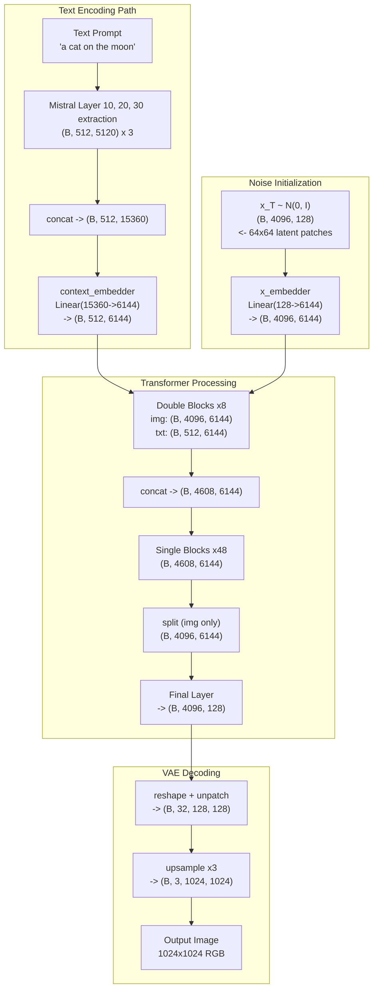
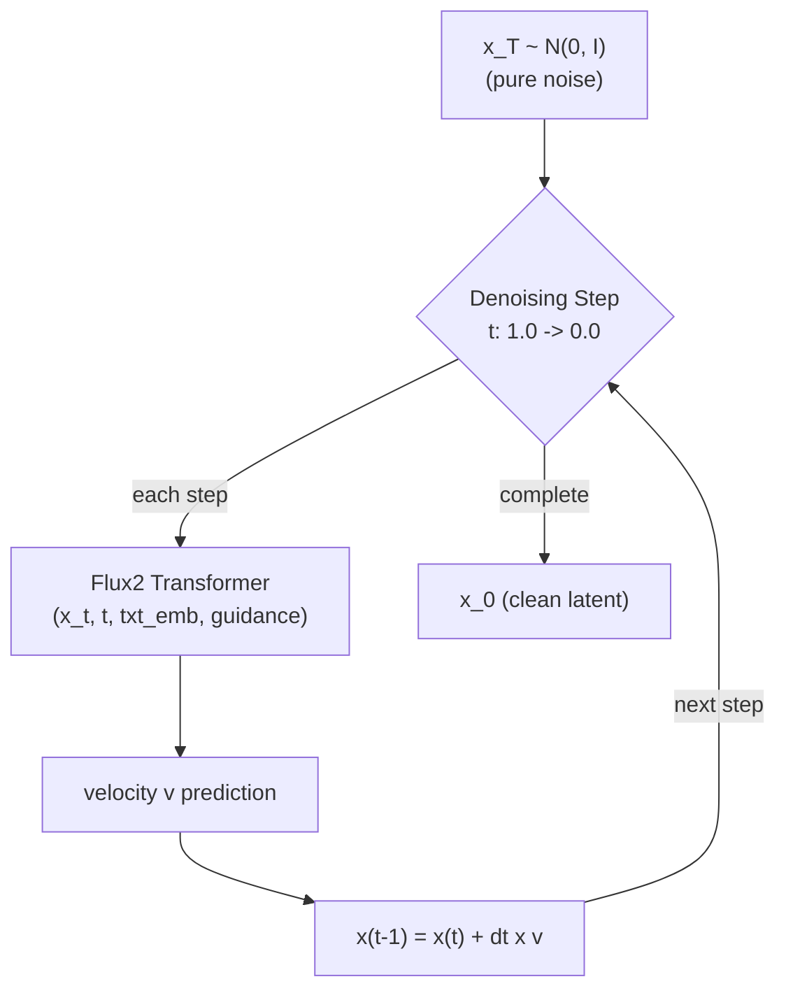

> A step-by-step look at the FLUX.2 [dev] 32B model architecture from Black Forest Labs, comparing it with FLUX.1 across text encoders, Transformer structure, VAE, and sampling process. This post was written based on analysis of the flux.2[dev] architecture performed by Claude Code, and the text was also drafted and organized using Claude Code.

### Introduction

FLUX.1 is a flow matching-based text-to-image model released in 2024 by Black Forest Labs, which spun off from Stability AI.[^1] For background on FLUX.1 and flow matching, please refer to the [previous post](https://yuhodots.github.io/deeplearning/24-12-04/).

FLUX.1 delivered excellent image quality with 12B parameters, but had several limitations:[^1][^2]

- **Text encoder**: Required simultaneously loading two separate models -- CLIP-L and T5-XXL -- causing significant memory overhead[^3]
- **Image editing**: No native editing capabilities, requiring separate models like InstructPix2Pix[^3]
- **Input modality**: Only text input was supported, making multimodal generation with image references impossible[^17][^18]
- **Model variety**: Only a single model size was available, making it difficult to accommodate diverse computing environments[^1]

FLUX.2 [dev] was designed to address these limitations.[^22] It unifies the text encoder into a single multimodal LLM[^4], scales up to 32B parameters while employing more efficient block configurations[^6], supports native image editing and multimodal input[^4], and offers lightweight options through Klein variants (9B, 4B).[^21] In this post, we will examine FLUX.2's architecture step by step, comparing it with FLUX.1.

### Overall Pipeline

The overall inference process of FLUX.2 can be broadly divided into five stages.[^4]

**Text prompts are converted into embeddings through a Mistral-based text encoder**[^4], and **in image editing mode, the input image is encoded into latent space through a VAE**.[^4] These two pieces of information enter the Flux2 Transformer's denoising loop to progressively generate an image from noise, and finally the VAE decoder reconstructs the latent vector back into an image.[^4]

The pipeline differences from FLUX.1 are summarized as follows:[^2][^3][^4][^6]

| Item | FLUX.1 [dev] 12B | FLUX.2 [dev] 32B |
|---|---|---|
| **Text Encoder** | CLIP-L + T5-XXL (2 models) | Mistral-Small-3.2-24B (1 model) |
| **Input Modality** | Text only | Text + Image (multimodal) |
| **Image Editing** | Not supported | Natively supported (single/multi-ref) |
| **VAE Scale Factor** | 8 | 16 |
| **Transformer** | 12B (Double 19 + Single 38) | 32B (Double 8 + Single 48) |

**FLUX.2 also supports an image editing mode**.[^4] By feeding the target image through the VAE encoder to convert it into a latent vector, then inputting it to the Transformer along with a text prompt, it can generate a modified image following the prompt while preserving the original image's structure.[^4] It is also possible to input multiple reference images to guide style or composition during generation.[^4] In this case, reference images are center-cropped to a maximum of 768x768 resolution, then processed through the text encoder (Mistral).[^4]

### Text Encoder

One of the most notable changes from FLUX.1 to FLUX.2 is the **complete replacement of the text encoder from CLIP + T5 to Mistral**.[^3][^4]

##### FLUX.1's Approach: Combining Two Models

**FLUX.1 used two text encoders: CLIP-L (768 dimensions) and T5-XXL (4096 dimensions)**.[^2] CLIP-L provided short embeddings specialized for image-text alignment, while T5-XXL provided rich semantic embeddings for long text.[^17][^18] CLIP-L's output was primarily used as a global conditioning vector, while T5-XXL's output was used as sequence-form text embeddings for cross-attention.[^3]

However, this approach had limitations. Loading two models simultaneously created a significant **memory burden**[^3], and the different output dimensions of each model required **separate projections**.[^2] Furthermore, since both CLIP and T5 could only process text, it was **impossible to use images as reference conditions**.[^17][^18]

##### FLUX.2's Approach: Unification into a Single Multimodal LLM

**FLUX.2 handles text encoding with a single Mistral-Small-3.2-24B**.[^4] Rather than simply using the output of the last layer, **hidden states are extracted from Layers 10, 20, and 30 respectively**.[^4] Since Mistral's hidden size is 5120 dimensions, concatenating the outputs from three layers yields a $5{,}120 \times 3 = 15{,}360$-dimensional text embedding.[^6][^20]

Like taking photos from different heights, the shallow layer (Layer 10) captures surface-level syntactic information, the middle layer (Layer 20) captures semantic information, and the deep layer (Layer 30) captures higher-order reasoning information.[^22] This approach is **similar in concept to Qwen3-VL's DeepStack mechanism**.[^19] In DeepStack, visual features are also extracted not only from the last layer of the ViT but also from intermediate layers and injected into different layers of the LLM, enabling the use of **information ranging from low-level textures to high-level semantics**.[^19]

During input processing, a chat template and system message are applied when passing prompts to Mistral.[^4] It can process up to 512 tokens[^4], and when image input is present, supports up to 768x768 resolution.[^4] Additionally, **NSFW filtering** (threshold 0.85) screens out inappropriate content.[^4]

| Item | FLUX.1 | FLUX.2 |
|---|---|---|
| **Model** | CLIP-L + T5-XXL | Mistral-Small-3.2-24B |
| **Number of Models** | 2 | 1 |
| **Output Dimension** | 768 + 4,096 | 15,360 (5,120 x 3) |
| **Extraction Method** | Last layer | Multi-layer (L10, L20, L30) |
| **Image Input** | Not possible | Possible (768x768) |

So why were these changes made? First, by using a multimodal LLM, both text and image inputs can be processed by the same encoder.[^20] This enables reference image-based generation.[^4] Second, unifying two separate models into one simplifies the pipeline.[^22] Third, the rich 15,360-dimensional embedding space enables more fine-grained text condition control.[^22]

### Transformer

FLUX.2's Transformer uses the same combination of Double-Stream Blocks and Single-Stream Blocks as FLUX.1, but the ratio and scale have changed significantly.[^2][^6]

| Item | FLUX.1 [dev] 12B | FLUX.2 [dev] 32B |
|---|---|---|
| **Hidden Size** | 3,072 (24 heads x 128d) | 6,144 (48 heads x 128d) |
| **Double-Stream Blocks** | 19 | 8 |
| **Single-Stream Blocks** | 38 | 48 |
| **in_channels** | 64 | 128 |
| **FFN Activation** | GELU | SwiGLU |
| **joint_attention_dim** | 4,096 | 15,360 |

FLUX.1 had 19 Double Blocks and 38 Single Blocks, but FLUX.2 drastically reduces Double Blocks to 8 and increases Single Blocks to 48.[^2][^6] So why reduce Double Blocks and increase Single Blocks?

**Double Blocks process image and text as separate streams while exchanging information through joint attention**.[^5] They serve to establish alignment between the two modalities early on.[^22] However, with the hidden size doubled to 6,144, each block's representational capacity has grown significantly, making **8 blocks sufficient for proper alignment**.[^22]

Double Blocks maintain separate QKV and FFN parameters for image and text respectively, making them parameter-inefficient.[^5] Single Blocks, on the other hand, merge image and text into a single sequence and process them with a single parameter set, making them more processing-efficient per parameter.[^5] The strategy was to increase this portion to improve fine-grained generation quality.[^22]

Additionally, FLUX.1 used GELU as the FFN activation, but FLUX.2 switches to SwiGLU.[^5][^6] SwiGLU takes the form $\text{SwiGLU}(x) = \text{SiLU}(xW_1) \otimes (xW_2)$, splitting the input into two branches, applying SiLU (Swish) activation to one and performing element-wise multiplication with the other.[^12] The added gating mechanism enables more precise control over information flow, and has consistently shown better performance than GELU in the LLM domain, becoming the recent standard.[^12]

##### Input Embeddings

Before entering the Transformer, inputs pass through their respective embedding layers.[^6]

- **x_embedder**: Projects image latent vectors (128 dimensions) via `Linear(128 -> 6144)`[^6]
- **context_embedder**: Projects text embeddings (15,360 dimensions) via `Linear(15360 -> 6144)`[^6]
- **timestep_embedding**: Transforms the current timestep $t$ through sinusoidal 256 dimensions -> MLP -> 6,144 dimensions[^6]
- **guidance_embedding**: A **separate MLP layer** that transforms the guidance scale $\gamma$ in the same manner as timestep (sinusoidal 256 dimensions -> MLP -> 6,144 dimensions).[^6] At inference time, when the user specifies a float value like `guidance_scale=3.5`, this scalar value is processed through `x 1000` scaling -> sinusoidal embedding (256d) -> `MLPEmbedder(256 -> 6144)`.[^6] The generated guidance embedding is combined with the timestep embedding via **element-wise addition** to form a single conditioning vector.[^6]
  - In traditional CFG, the model must be run twice per step (conditional + unconditional), then interpolated externally as $v = v_{\text{uncond}} + \gamma(v_{\text{cond}} - v_{\text{uncond}})$.[^15] Guidance embedding injects the $\gamma$ value itself as conditioning inside the model, enabling the model to directly produce guided output in a single forward pass.[^6] This cuts inference cost in half.[^22]
  - Klein models do not have guidance embedding and therefore operate without CFG.[^21]

This conditioning vector is delivered to each block through AdaLN (Adaptive Layer Normalization), adjusting the block's behavior according to the current timestep and guidance strength.[^6]

The overall Transformer flow can be represented as follows:

### Double-Stream Block

The Double-Stream Block processes image and text as independent streams, merging them only at the attention stage to exchange information.[^5] It is similar to two people organizing their own notes separately, while periodically reviewing and discussing each other's notes.[^22]

Each stream (image/text) goes through the following process:

1. **AdaLN-Zero Modulation**: The conditioning vector $\text{vec}$ is passed through `Linear(6144 -> 6144x6)` to generate 6 values: shift, scale, and gate.[^5][^6] Of these, 3 (shift, scale, gate) are for attention and the other 3 are for FFN.[^5] These values modulate the output of Layer Normalization to adapt the block's behavior to the current timestep and guidance.[^5]
2. **QKV Projection**: Generates Query, Key, and Value. Q, K, V are generated at once via `Linear(6144 -> 6144x3)`, then split into 48 heads (128 dimensions per head).[^6]
3. **QK-Norm**: Q and K are normalized with RMSNorm(128).[^5][^6] This prevents attention logits from growing too large during high-resolution image generation, which could cause training divergence.[^9] The Stable Diffusion 3 paper also emphasized the importance of this technique.[^9]
4. **RoPE Application**: Positional encoding is applied to Q and K.[^5][^6]
5. **Joint Attention**: Image and text QKV are concatenated to perform a single SDPA (Scaled Dot-Product Attention), then separated again.[^5]
6. **FFN (SwiGLU)**: Each stream is processed through `Linear(6144 -> 36864) -> SwiGLU -> Linear(18432 -> 6144)`.[^6] With an mlp_ratio of 3.0, the intermediate dimension becomes $6144 \times 3 = 18432$.[^6]
7. **Gated Residual**: The gate-weighted output is added to the original input. Separate gates are applied to the attention output and FFN output respectively.[^5]

Joint Attention is the key component. The image's Q, K, V and text's Q, K, V are concatenated along the sequence dimension and a single attention is performed.[^5] This allows image tokens to attend to text tokens and text tokens to attend to image tokens.[^5] After attention, the results are separated back into image and text portions and returned to their respective streams.[^5]

The advantage of this structure is that the two modalities can reference each other's information while independently maintaining their own representation spaces.[^22] In standard cross-attention, only one side (usually image) references the other (text), but in joint attention, information flows bidirectionally.[^9] This design was inspired by the MM-DiT architecture from Stable Diffusion 3 that FLUX.1 was based on, and FLUX.2 maintains the same principle.[^9][^5][^6]

### Single-Stream Block

After passing through the Double-Stream Blocks, **image and text are concatenated along the sequence dimension to form a single unified sequence**.[^6] For example, when generating a 1024x1024 image, 4,096 image tokens and 512 text tokens are combined into a 4,608-token sequence.[^22] The 48 Single-Stream Blocks then process this unified sequence.[^6]

##### Fused QKV + MLP

The most distinctive feature of Single-Stream Blocks is the fusion of QKV projection and MLP input projection into a single linear layer.[^5]

$$\text{linear1}: \text{Linear}(6144 \rightarrow 3 \times 6144 + 2 \times 18432 = 55296)$$

A single projection simultaneously generates Q, K, V (each 6,144 dimensions) and MLP inputs (two branches for SwiGLU, each 18,432 dimensions).[^5] This allows processing with one large matrix multiplication instead of two separate forward passes, improving GPU utilization efficiency.[^23] GPUs are more efficient at performing one large matrix multiplication than multiple small ones.[^23]

The generated Q and K have RMSNorm (QK-Norm) and RoPE applied, then are split into 48 heads for SDPA.[^5][^6] The MLP input passes through SwiGLU activation.[^6] The attention output (6,144 dimensions) and MLP output (18,432 dimensions) are then concatenated again and pass through a single output projection.[^5]

$$\text{linear2}: \text{Linear}(6144 + 18432 = 24576 \rightarrow 6144)$$

##### Gated Residual

The final output is multiplied by the gate value generated from AdaLN, then added to the input via residual connection.[^5] While the Double Block had separate gates for attention and FFN, the Single Block uses a single gate to control the entire merged output.[^5] The gate value determines through learning how strongly each block transforms its input.[^10] Early in training, gate values are close to 0 so residual connections dominate, and as training progresses, block transformations gradually increase.[^10][^22]

After passing through all 48 Single-Stream Blocks, **only the image portion is extracted (text portion removed)** and passed through the Final Layer (AdaLN modulation -> Linear(6144 -> 128)) to output the denoised latent.[^6]

### Positional Encoding

Both FLUX.1 and FLUX.2 use Rotary Position Embedding (RoPE), but the configurations differ significantly.[^5][^6]

| Item | FLUX.1 | FLUX.2 |
|---|---|---|
| **axes_dims** | (16, 56, 56) | (32, 32, 32, 32) |
| **theta** | 10,000 | 2,000 |
| **Total Dimension** | 128 (16+56+56) | 128 (32+32+32+32) |

FLUX.1 encoded position along 3 axes (time 16 + height 56 + width 56).[^5] Most dimensions were allocated to height and width, with fewer dimensions for the time axis.[^5] In this configuration, height and width information is rich, but the time axis's representational capacity is relatively weak.[^22]

FLUX.2 changed to 4 axes (32 + 32 + 32 + 32).[^6] All axes receive an equal allocation of dimensions.[^6] This change appears to address the **frequency imbalance problem, as also identified in Qwen3-VL's Interleaved MRoPE**, where frequencies are **biased toward specific axes**.[^22] In Qwen3-VL, time (t), height (h), and width (w) components were interleaved across embedding dimensions to ensure each dimension is uniformly distributed across both low and high frequency bands.[^19]

The 4th axis was added because **additional positional information is needed to distinguish between reference images and generated images in image editing mode**.[^22] Even in generation-only mode, this 4th axis can be used to encode additional structural information within the sequence.[^22]

Additionally, the theta value decreased from 10,000 to 2,000.[^5][^6] In RoPE, theta determines the base of the rotation frequency.[^11] Lower theta means shorter rotation periods with respect to position, enabling more sensitive capture of differences between nearby positions.[^11] Conversely, higher theta can encode distant positional relationships but reduces discrimination between nearby positions.[^11] The reduction of theta in FLUX.2 is interpreted as a choice to capture fine-grained spatial relationships in a more compressed latent space due to scale factor 16.[^22]

### VAE

The VAE (Variational Autoencoder) is responsible for compressing images into latent space and reconstructing them.[^23] The biggest change in FLUX.2's VAE is the **increase of the scale factor from 8 to 16**.[^8][^7]

##### Scale Factor 8 vs 16

The scale factor represents the spatial resolution ratio of the latent vector input to the Transformer relative to the input image.[^23]

| Item | FLUX.1 | FLUX.2 |
|---|---|---|
| **VAE downsample** | 3 times (8x) | 3 times (8x) |
| **Patchification** | Performed in pipeline | Integrated within VAE |
| **Effective Scale Factor** | 8 (VAE) + 2 (patch) = 16 | 16 (VAE built-in) |
| **latent_channels** | 16 | 32 |
| **Transformer in_channels** | 64 (16x4) | 128 (32x4) |

Both models actually use the same `block_out_channels=[128, 256, 512, 512]` with 3 downsamples.[^7][^8] The key difference is that FLUX.2 integrates 2x2 patchification within the VAE (`patch_size=(2,2)`) and that `latent_channels` doubled from 16 to 32.[^7] More channels preserve information even in a more compressed space.[^22] Think of it as using a chest of drawers instead of a wide desk -- reducing surface area while storing information in depth (channels).[^22]

As a result, the sequence length the Transformer must process remains the same (4,096 tokens for 1024x1024), but the information each token carries doubles from 64 to 128 dimensions.[^22]

##### Encoder Structure

The Encoder reduces spatial resolution to $1/8$ through 3 downsamples, then additionally achieves a final scale factor of $1/16$ through patch rearrangement (folding 2x2 patches into channels).[^7] The output has 64 channels (mean + logvar), from which only the mean is taken to produce a 32-channel latent vector.[^7]

```mermaid
flowchart TB
    subgraph Encoder["VAE Encoder"]
        E_IN["Input Image<br>(3ch, 1024x1024)"]
        E_CONV["Conv2d(3->128)"]
        E_D1["ResBlock x2 -> Downsample<br>(128ch, 512x512)"]
        E_D2["ResBlock x2 -> Downsample<br>(256ch, 256x256)"]
        E_D3["ResBlock x2 -> Downsample<br>(512ch, 128x128)"]
        E_D4["ResBlock x2<br>(512ch, 128x128, no downsample)"]
        E_MID["Mid Block<br>(ResBlock -> AttnBlock -> ResBlock)"]
        E_OUT["GroupNorm -> Swish<br>-> Conv2d(512->64ch)"]
        E_MEAN["mean extraction -> 32ch"]
        E_PATCH["Patch Rearrange (2x2)<br>(32ch, 128x128) -> (128ch, 64x64)"]
        E_NORM["BatchNorm Normalize"]

        E_IN --> E_CONV --> E_D1 --> E_D2 --> E_D3 --> E_D4 --> E_MID --> E_OUT --> E_MEAN --> E_PATCH --> E_NORM
    end
```

Note that the VAEs of FLUX.1 and FLUX.2 share the same `block_out_channels=[128, 256, 512, 512]` and 3-downsample structure.[^7][^8] The key difference is that `latent_channels` doubled from 16 to 32.[^7][^8] In FLUX.1, patchification was performed at the pipeline level, but in FLUX.2, it is integrated within the VAE with `patch_size=(2,2)`, making the VAE's effective scale factor 16.[^3][^7]

##### Decoder Structure

The Decoder is the reverse process of the Encoder.[^23] It receives a 32-channel latent vector and reconstructs an image at the original resolution.[^7] A notable point is that the Decoder uses 3 ResBlocks per level (compared to 2 in the Encoder).[^7] This is because the reconstruction process is more difficult than compression, so more parameters are allocated to improve detail restoration quality.[^22]

```mermaid
flowchart TB
    subgraph Decoder["VAE Decoder"]
        D_DENORM["Denormalize (BatchNorm inverse)"]
        D_UNPATCH["Unpatch (2x2)<br>(128ch, 64x64) -> (32ch, 128x128)"]
        D_CONV["Conv2d(32->512)"]
        D_MID["Mid Block<br>(ResBlock -> AttnBlock -> ResBlock)"]
        D_U4["ResBlock x3<br>(512ch, 128x128)"]
        D_U3["ResBlock x3 -> Upsample<br>(512ch, 256x256)"]
        D_U2["ResBlock x3 -> Upsample<br>(256ch, 512x512)"]
        D_U1["ResBlock x3 -> Upsample<br>(128ch, 1024x1024)"]
        D_OUT["GroupNorm -> Swish<br>-> Conv2d(128->3ch RGB)"]
        D_IMG["Output Image<br>(3ch, 1024x1024)"]

        D_DENORM --> D_UNPATCH --> D_CONV --> D_MID --> D_U4 --> D_U3 --> D_U2 --> D_U1 --> D_OUT --> D_IMG
    end
```

##### Dimension Tracking (1024x1024 Image Generation Example)

Tracking how tensor dimensions change throughout the entire inference process:[^22]

### Sampling

FLUX.2's sampling process uses Rectified Flow-based velocity prediction, just like FLUX.1.[^4][^13]

##### Rectified Flow Velocity Prediction

In conventional diffusion models like DDPM, the approach was to predict the noise $\epsilon$ added at each timestep.[^16] In contrast, rectified flow **connects the data distribution and noise distribution with a straight line** and predicts the velocity along this line.[^13][^14] Data at time $t$ is defined as:

$$z_t = (1-t)x_0 + t\epsilon$$

When $t=0$ it is the original data $x_0$, and when $t=1$ it is pure noise $\epsilon$.[^13] The model predicts velocity $v$ at this $z_t$, and a single denoising step is performed as:

$$x_{t-1} = x_t + (t_{\text{prev}} - t_{\text{curr}}) \times v$$

Since $t$ decreases from 1 (pure noise) to 0 (clean image), $t_{\text{prev}} - t_{\text{curr}}$ is negative, moving in the opposite direction of the velocity -- toward the clean image.[^22] Because it follows a straight-line path, it can generate high-quality images with fewer steps compared to diffusion models that follow curved paths.[^14]

##### Schedule Generation

The timestep schedule uniformly divides $[1.0, ..., 0.0]$ into N steps, with SNR (Signal-to-Noise Ratio) shift applied.[^4] The shift degree is determined by $\mu = a \times \text{seq\_len} + b$ based on the image sequence length.[^4] This appropriately adjusts the schedule for higher-resolution images (longer sequences).[^22]

##### Guidance

In traditional CFG, the model is run twice per denoising step (conditional + unconditional), then interpolated externally:[^15]

$$v = v_{\text{uncond}} + \gamma \times (v_{\text{cond}} - v_{\text{uncond}})$$

Instead, FLUX.2 [dev] injects the guidance scale $\gamma$ as an embedding inside the model.[^6] With the model aware of the $\gamma$ value, it directly produces guided output in a single forward pass, cutting inference cost in half compared to traditional two-pass CFG.[^6][^22] This is achieved through distillation during training, where the model learns to directly output results with CFG applied for various $\gamma$ values.[^22]

### FLUX.2 Model Family

Beyond the 32B model, FLUX.2 also provides lightweight Klein variants.[^21] By reducing the hidden size and block count, they can be used in diverse computing environments.[^21]

| Item | FLUX.2 [dev] 32B | Klein 9B | Klein 4B |
|---|---|---|---|
| **Hidden Size** | 6,144 (48 heads x 128d) | 4,096 (32 heads x 128d) | 3,072 (24 heads x 128d) |
| **Double Blocks** | 8 | 8 | 5 |
| **Single Blocks** | 48 | 24 | 20 |
| **Guidance Embedding** | Yes | No | No |

Klein models operate without CFG since they lack guidance embedding, and enable faster inference with fewer Single Blocks.[^21] An interesting point is that Klein 4B's hidden size of 3,072 is identical to FLUX.1 [dev] 12B.[^2][^21] However, with only Double 5 + Single 20 blocks compared to FLUX.1's Double 19 + Single 38, the parameter count is just 4B.[^2][^21] In other words, it is a lightweight form that maintains similar block width to FLUX.1 while reducing depth.[^22]

All Klein variants share the same VAE (scale factor 16, 128 in_channels) as the 32B model, so the latent space representational capacity is identical.[^22] Differences only arise in the processing capacity within the Transformer.[^22]

### Conclusion

Finally, here is a summary table of the key differences between FLUX.1 and FLUX.2:[^2][^5][^6][^7][^8]

| Item | FLUX.1 [dev] 12B | FLUX.2 [dev] 32B |
|---|---|---|
| **Text Encoder** | CLIP-L + T5-XXL (2 separate models) | Mistral-Small-3.2-24B (1 model) |
| **Text Embed Dim** | 4,096 (T5) + 768 (CLIP) | 15,360 (5,120 x 3 layers) |
| **in_channels** | 64 | 128 |
| **Hidden Size** | 3,072 (24 heads x 128d) | 6,144 (48 heads x 128d) |
| **Double Blocks** | 19 | 8 |
| **Single Blocks** | 38 | 48 |
| **RoPE axes** | (16, 56, 56) | (32, 32, 32, 32) |
| **RoPE theta** | 10,000 | 2,000 |
| **FFN Activation** | GELU | SwiGLU |
| **VAE latent_channels** | 16 | 32 |
| **VAE Scale Factor** | 8 (+ pipeline patchify) | 16 (VAE built-in patchify) |
| **Image Editing** | Not supported | Natively supported |
| **Multimodal Input** | Text only | Vision-Language |
| **Model Family** | Single model | dev 32B + Klein 9B/4B |

Key changes summarized:

- **Text encoder unification**: Transitioned from two separate models (CLIP-L + T5-XXL) to a single multimodal LLM (Mistral-Small-3.2-24B). Multi-layer extraction (Layers 10, 20, 30) generates richer 15,360-dimensional embeddings[^4][^6]
- **Transformer architecture redesign**: Hidden size doubled from 3,072 to 6,144, Double Blocks reduced from 19 to 8 while Single Blocks increased from 38 to 48 for improved balance between efficiency and quality. FFN switched from GELU to SwiGLU[^2][^6]
- **VAE deeper compression**: latent_channels increased from 16 to 32, in_channels from 64 to 128 for richer latent representation. Patchification integrated within the VAE[^7][^8]
- **RoPE equal distribution**: Transitioned from 3-axis unequal allocation (16,56,56) to 4-axis equal allocation (32,32,32,32). theta lowered from 10,000 to 2,000 for enhanced fine-grained position awareness[^5][^6][^22]
- **Native multimodal**: Image editing and reference image-based generation supported natively without separate models[^4]
- **Model family**: Klein 9B and Klein 4B lightweight variants accommodate diverse computing environments[^21]

FLUX.2 is not simply a scaled-up model but a case where each component was fundamentally redesigned to create a more unified and efficient architecture.[^22] Adopting a multimodal LLM as the text encoder represents a meaningful departure in the image generation model space, where the CLIP/T5 combination had been the standard.[^22] It is likely that other image generation models will evolve in a similar direction going forward.[^22]

### Reference

[^1]: BFL official announcement -- Black Forest Labs FLUX.1/FLUX.2 release
[^2]: FLUX.1-dev HuggingFace [`config.json`](https://huggingface.co/black-forest-labs/FLUX.1-dev) -- `{attention_head_dim:128, guidance_embeds:true, in_channels:64, joint_attention_dim:4096, num_attention_heads:24, num_layers:19, num_single_layers:38, pooled_projection_dim:768}`
[^3]: diffusers [`pipeline_flux.py`](https://github.com/huggingface/diffusers/blob/main/src/diffusers/pipelines/flux/pipeline_flux.py) -- FLUX.1 pipeline implementation
[^4]: diffusers [`pipeline_flux2.py`](https://github.com/huggingface/diffusers/blob/main/src/diffusers/pipelines/flux2/pipeline_flux2.py) -- FLUX.2 pipeline implementation (Mistral3ForConditionalGeneration, editing mode, NSFW filtering, denoising loop, schedule generation, etc.)
[^5]: diffusers [`transformer_flux.py`](https://github.com/huggingface/diffusers/blob/main/src/diffusers/models/transformers/transformer_flux.py) -- FLUX.1 Transformer implementation. FluxTransformerBlock, FluxSingleTransformerBlock, Modulation classes. defaults: `axes_dims_rope=(16,56,56)`, `theta=10000`, GELU activation
[^6]: diffusers [`transformer_flux2.py`](https://github.com/huggingface/diffusers/blob/main/src/diffusers/models/transformers/transformer_flux2.py) -- FLUX.2 Transformer implementation. defaults: `num_attention_heads=48, attention_head_dim=128, num_layers=8, num_single_layers=48, in_channels=128, joint_attention_dim=15360, mlp_ratio=3.0, axes_dims_rope=(32,32,32,32), rope_theta=2000, timestep_guidance_channels=256, guidance_embeds=True`. MLPEmbedder(256->6144), SwiGLU activation
[^7]: diffusers [`autoencoder_kl_flux2.py`](https://github.com/huggingface/diffusers/blob/main/src/diffusers/models/autoencoders/autoencoder_kl_flux2.py) -- FLUX.2 VAE implementation. `latent_channels=32, patch_size=(2,2), block_out_channels=(128,256,512,512)`
[^8]: FLUX.1 VAE config -- `latent_channels:16, scaling_factor:0.3611, block_out_channels:[128,256,512,512]`
[^9]: [Stable Diffusion 3 (Esser et al., 2024)](https://arxiv.org/abs/2403.03206) -- MM-DiT, Joint Attention, QK-Norm
[^10]: [DiT (Peebles & Xie, 2023)](https://arxiv.org/abs/2212.09748) -- AdaLN-Zero: zero initialization of gates so each block starts as an identity function. Note: actual zero init application in FLUX.2 was not directly confirmed in the code
[^11]: [RoPE (Su et al., 2021)](https://arxiv.org/abs/2104.09864) -- Rotary Position Embedding. In $\theta_i = \text{base}^{-2i/d}$, the base (theta) determines frequency characteristics
[^12]: [SwiGLU (Shazeer, 2020)](https://arxiv.org/abs/2002.05202) -- GLU Variants Improve Transformer
[^13]: [Flow Matching (Lipman et al., 2022)](https://arxiv.org/abs/2210.02747) -- linear interpolation path, velocity prediction
[^14]: [Rectified Flow (Liu et al., 2022)](https://arxiv.org/abs/2209.03003) -- Advantages of straight-line paths
[^15]: [CFG (Ho & Salimans, 2022)](https://arxiv.org/abs/2207.12598) -- Classifier-Free Diffusion Guidance
[^16]: [DDPM (Ho et al., 2020)](https://arxiv.org/abs/2006.11239) -- noise prediction approach
[^17]: [CLIP (Radford et al., 2021)](https://arxiv.org/abs/2103.00020) -- text-only encoder
[^18]: [T5 (Raffel et al., 2020)](https://arxiv.org/abs/1910.10683) -- text-only encoder
[^19]: [Qwen3-VL Technical Report](https://arxiv.org/abs/2502.13923) -- DeepStack, Interleaved MRoPE
[^20]: [Mistral AI official](https://mistral.ai/) -- Mistral-Small-3.2-24B (vision-language model, hidden_size=5120)
[^21]: HuggingFace FLUX.2-dev-Klein repo config -- Klein 9B/4B model specs
[^22]: Claude's commentary: Interpretations, analogies, calculations, and projections written directly by Claude based on code analysis (includes reasoning without official evidence since BFL's official paper has not been released)
[^22]: General knowledge: Common ML knowledge without specific sources
- [Diffusion Models and Flow Matching (previous post)](https://yuhodots.github.io/deeplearning/24-12-04/)
