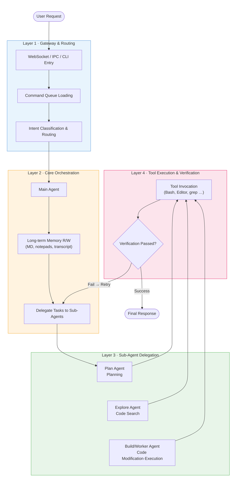
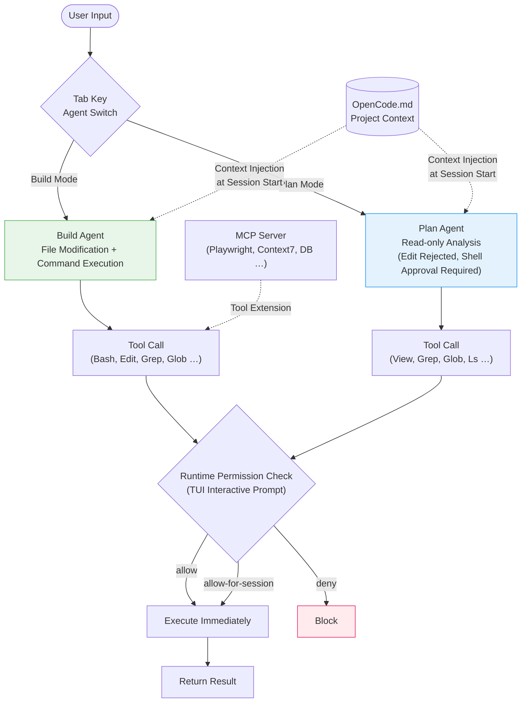
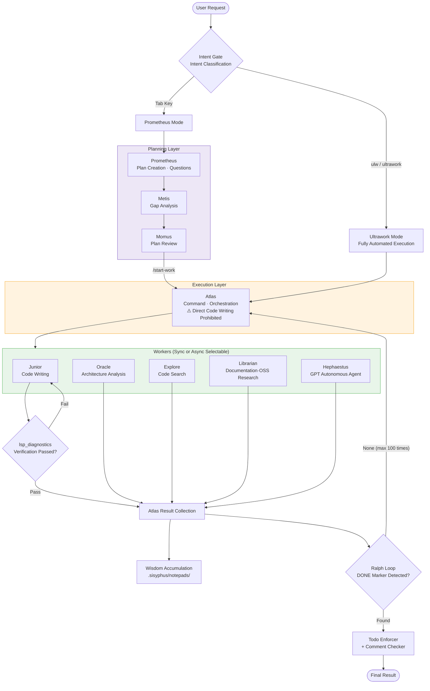
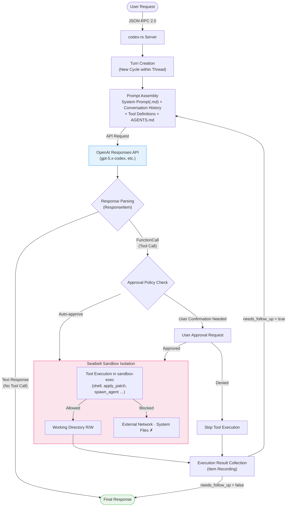
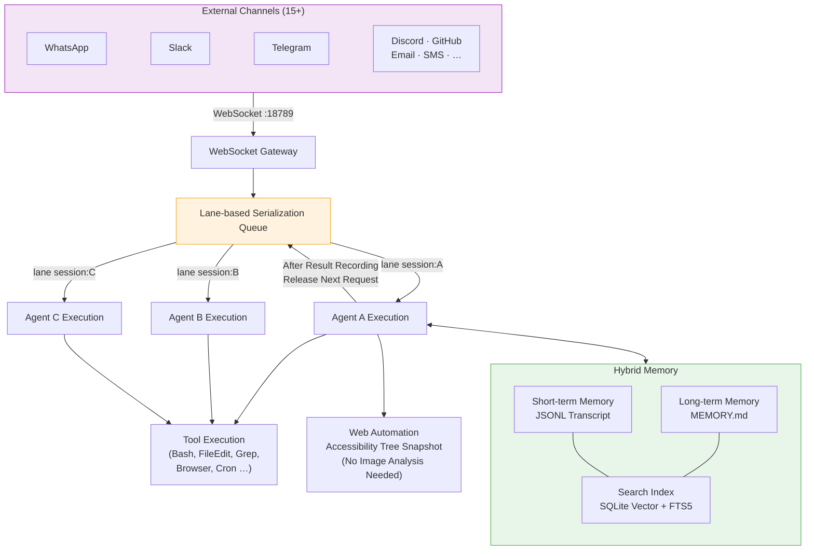

> This post analyzes how coding agents work internally. We compare the orchestration pipelines, memory structures, sandboxing, and permission control mechanisms of major coding agents including Claude Code, OpenCode, oh-my-opencode (Sisyphus), Codex, and OpenClaw. In [previous post 1](https://yuhodots.github.io/deeplearning/25-07-28/) and [previous post 2](https://yuhodots.github.io/deeplearning/25-09-06/), I covered the general flow of coding agents and Anthropic's agent design know-how. In this post, we take a deeper look at the internal workings of each agent.

> This post was written based on analysis of several open-source coding agents by Claude Code, and the text was also entirely written by Claude Code. It seems like having Claude Code write it produces higher quality content than writing it myself 😅

### LLM Applications

The architecture of LLM-based applications has evolved through roughly three stages.

1. **Stateless chatbots**: Simply inputting a prompt and receiving a response
2. **Workflow-based systems**: DAG (Directed Acyclic Graph) forms where code like n8n or LangChain defines the execution flow and calls LLMs within that flow
3. **Autonomous agents**: Forms where the LLM itself proactively controls the execution loop and decides on its own which tools to use and when

Coding agents belong to the third stage. What distinguishes them from conventional IDE plugins or code autocomplete tools is that coding agents **directly combine OS-level tools like Bash, file systems, and grep to perform tasks**. Instead of being dependent on specific software APIs, they read, modify, build, and test code in the same way a human engineer would at the terminal.

As summarized in previous posts, the basic operation of these agents can be outlined as follows:

1. **Command check**: Determine whether it's a directly executable command or whether tools need to be called after analyzing the prompt
2. **Task complexity assessment**: Determine whether the task is complex enough to require plan review by the user
3. **Planning**: Create a plan (ToDo List) and execute sequentially
   - Determine the necessary tools for each step (which tool is appropriate, whether permissions exist, etc.)
   - Determine whether the tool usage results were appropriate
   - Determine whether all steps in the plan are complete
4. **Organize and return the final response**

While this process may seem simple, it actually involves several technical challenges. These include **context overload** where the context window overflows while exploring a large codebase, **cognitive drift** where the agent loses its goal and goes in the wrong direction, **infinite loops** where hallucinations cause the same commands to repeat, and **permission issues** where dangerous commands like `rm -rf /` could be executed. Modern coding agents manage these problems through controlled structures called **orchestration mechanisms**.

### AI Coding Agents

Analyzing major coding agents in the current developer ecosystem, they can be divided into closed and open types based on **whether the orchestration pipeline is publicly available**.

| Agent | License | Core Environment | Key Orchestration Features |
| --- | --- | --- | --- |
| **Claude Code** | Proprietary (closed) | TypeScript binary, cloud/local hybrid | Ephemeral agent teams, hardcoded system prompts, CLAUDE.md-based static memory injection |
| **OpenCode** | Open Source | Go, TUI-based | Build/Plan multi-agent switching, runtime interactive permission control, MCP extensions |
| **oh-my-opencode** | Open Source | TypeScript (OpenCode plugin) | Planning/Execution/Workers 3-layer delegation, knowledge accumulation system, Ralph Loop + LSP validation |
| **Codex** | Open Source | Rust (codex-rs) | Thread→Turn→Item state machine, JSON-RPC-based communication, Seatbelt sandboxing |
| **OpenClaw** | Open Source | TypeScript, Gateway Server | Lane-based serialization queue, WebSocket control, SQLite + FTS5 hybrid memory |

Claude Code, being closed-source, has a well-polished user experience but its internal structure cannot be modified. Open-source agents differ in that developers can freely swap various model providers and directly modify all layers of the orchestration pipeline.

### Common Pipeline

While open-source agents have different implementations, they share a common pipeline structure of four layers as follows.

##### Layer 1: Gateway & Routing

The layer where user requests enter the system through WebSocket, IPC, CLI, etc. Here, requests are loaded into a command queue to prevent async request collisions, and the intent of requests is classified to route them to the appropriate agent.

##### Layer 2: Core Orchestration (Main Agent)

The layer where the main agent understands the overall context of the task and coordinates work by reading and writing to long-term memory systems (markdown config files, notepads, transcripts, etc.). The main agent typically doesn't write code directly but delegates tasks to sub-agents.

##### Layer 3: Sub-Agent Delegation

The layer where specialized sub-agents perform actual work. They are generally separated into the following roles:

- **Plan agent**: Establishes and refines work plans
- **Explore agent**: Explores the codebase and analyzes architecture
- **Build/Worker agent**: Actually modifies and executes code

##### Layer 4: Tool Execution & Verification

The layer where sub-agents call local tools (Bash, file editors, grep, etc.) and verify the results. If verification fails, it returns to the previous step for retry, and final results are only returned to the main agent after all verifications pass.

The diagram below visualizes the flow of these four layers.



The core of this structure is **distributing cognitive load**. Instead of solving everything with a single prompt, each layer focuses on its own role, and the verification loop naturally corrects hallucinations or mistakes.

### Claude Code

Claude Code is a proprietary tool tightly coupled with Anthropic's ecosystem. Let's examine the key features of its internal orchestration.

##### System Prompt & Context

According to analysis of Claude Code's source code, it internally has a core system prompt of approximately 2,896 tokens hardcoded into the binary. Additionally, detailed prompts for sub-agents such as the Explore sub-agent (516 tokens), Plan agent (633 tokens), and Task agent (294 tokens) are also built in.

The part where users can directly intervene is partial instruction injection through the **CLAUDE.md** file at the project root. Coding standards, build commands, project conventions, etc. can be written here and the agent will reference them when performing tasks. However, modifying the core runtime's decision-making logic itself is not possible.

##### Agent Team (Ephemeral)

Unlike frameworks like LangGraph or AutoGen that define agents with persistent memory across sessions in code, Claude Code's agent teams **operate as one-time instances**. When a user instructs team composition through prompts, multiple agents are created and run in parallel for the task. A lead agent coordinates the work, assigns subtasks, and merges results. When the session ends, the team dissolves without resume capability, making it optimized for quickly and cheaply creating experimental workflows.

##### Programmatic Tool Call

When the model determines that tool usage (code editor, shell, etc.) is necessary, it internally generates code to call the tool in function form. At this point, API execution is paused and a `tool_use` block is returned. Intermediate results or raw data generated during tool execution are not loaded into the model's main context window; only the final result is delivered to the model after the tool call completes.

Each tool is strictly defined through a JSON schema. It must have a unique `name` within 64 characters, a `description` explaining the tool's purpose, and an `input_schema` defining parameter types and structure. These structural constraints prevent incorrect tool calls due to hallucinations and improve context window efficiency by ensuring intermediate data processing doesn't consume the model's tokens.

##### Internal Tools & Agent

The core tools publicly provided by Claude Code are as follows:

| Tool | Description |
| --- | --- |
| **Read** | File reading (supports text, images, PDF, Jupyter notebooks) |
| **Write** | New file creation or full overwrite |
| **Edit** | Exact string replacement in existing files (old_string → new_string) |
| **Bash** | Shell command execution (max 10-minute timeout, background execution support) |
| **Glob** | Glob pattern-based file search (`**/*.ts`, etc.) |
| **Grep** | ripgrep-based regex content search |
| **WebFetch** | Fetch content from URL and convert to markdown |
| **WebSearch** | Web search |
| **Agent** | Lightweight sub-agent creation (for parallel research, uses smaller models) |
| **ToolSearch** | Search and activate lazy-loaded tools by keyword |

On the agent side, there is no separate named agent system; the main model directly performs the agent role. **Agent** tool creates sub-agents as needed, and these sub-agents can only use read-only tools. External tools like Sentry, Slack, and databases can be additionally connected through MCP servers.

### OpenCode

OpenCode is among the most precise in permission control among open-source coding agents. The overall orchestration flow is as follows:



##### Internal Tools

OpenCode defines the following 12 built-in tools in its source code (`internal/llm/tools/`):

| Tool | Description |
| --- | --- |
| **bash** | Shell command execution (configurable timeout) |
| **edit** | File editing (old_string/new_string replacement, creation, deletion) |
| **write** | File creation or overwrite |
| **view** | File content reading (line numbers, offset/limit support) |
| **glob** | Glob pattern-based file search |
| **grep** | Regex-based content search |
| **ls** | Directory tree structure output |
| **patch** | Apply changes across multiple files at once |
| **fetch** | Fetch content from URL and convert to markdown |
| **sourcegraph** | Public repository code search via Sourcegraph GraphQL API |
| **diagnostics** | LSP diagnostic results (errors/warnings, activated when LSP client is configured) |
| **agent** | Read-only sub-agent creation (can only use glob, grep, ls, sourcegraph, view) |

##### Agents

There are 4 built-in agents, with the core being **coder** and **task**. They can be switched instantly with the Tab key.

| Agent | Role | Available Tools |
| --- | --- | --- |
| **coder** (= Build) | Full-access coding agent | All 12 |
| **task** (= Plan sub-agent) | Read-only exploration/analysis | glob, grep, ls, sourcegraph, view |
| **summarizer** | Conversation history context compression | - |
| **title** | Auto-generate session title (max 80 tokens) | - |

To add custom commands, create a markdown file in the `.opencode/commands/` directory. The filename becomes the slash command name, and the entire file content is used as a prompt template. `$NAME` format argument placeholders are also supported.

##### Runtime Permission Control

OpenCode's permission control is not configured through files in advance, but through **runtime TUI interactive prompts**. When the agent calls potentially dangerous tools like shell commands or file modifications, the action details are displayed on the TUI screen and the user is asked for approval.

Users choose one of three options:

- **allow**: Allow only this one time
- **allow-for-session**: Automatically allow the same type of action for the current session
- **deny**: Block

The advantage of this approach is that users can make context-appropriate decisions while observing the agent's actual behavior. Users can make real-time situation-specific judgments that are difficult to predict with static configuration files, effectively blocking dangerous command execution (e.g., `rm -rf`) caused by agent hallucinations.

##### Context Initialization & MCP

OpenCode uses the `/init` command to automatically analyze the project structure and generate an `OpenCode.md` file. This file records build/lint/test commands and code style guidelines to help the agent quickly understand the project context.

Additionally, functionality can be extended through **MCP (Model Context Protocol)** servers. Connecting MCP servers like Playwright (browser automation), Context7 (library documentation lookup), and Database (DB schema lookup) enables the agent to use those tools. oh-my-opencode takes this a step further with an **embedded MCP** approach where each skill brings its own MCP server, activating tools only when needed and preventing the context window from becoming unnecessarily bloated.

### oh-my-opencode (Sisyphus)

oh-my-opencode, an extension plugin built on OpenCode, introduces an orchestration system called **Sisyphus**. Below is the complete orchestration pipeline of Sisyphus.



It deploys various models to the right places without being locked into a single vendor—Claude for orchestration, GPT for logical reasoning, Gemini for frontend work, deployed in parallel. The project README compares this to "If OpenCode is Debian, oh-my-opencode is Ubuntu."

##### Internal Tools & Agents

oh-my-opencode inherits OpenCode's tools while adding a multi-agent system and dedicated tools.

| Agent | Default Model | Role | Write Permission |
| --- | --- | --- | :---: |
| **OmO (Sisyphus)** | claude-opus | Main orchestrator. Understands requirements, evaluates codebase, delegates to sub-agents | O |
| **Oracle** | gpt-5.4 | Architecture consulting, code review, debugging. Pure reasoning only (no tools), 32k token thinking budget | X |
| **Librarian** | gemini-flash | External documentation lookup, multi-repo analysis, OSS research | X |
| **Explore** | grok-code-fast | Fast codebase search. Specializes in "Where is X?" questions | X |
| **Hephaestus** | gpt-5 family | GPT-native autonomous agent. Performs tasks with independent judgment | O |
| **Multimodal Looker** | gpt-5.4 | PDF, image, diagram, and other media file analysis | X |
| **Metis** | (higher model) | Assists Prometheus with gap analysis. 32k token thinking budget | X |
| **Momus** | (higher model) | Plan review and validation. 32k token thinking budget | X |

The following dedicated tools are used for inter-agent communication:

| Tool | Used By | Description |
| --- | --- | --- |
| `call_omo_agent` | OmO | Sub-agent invocation |
| `background_task` | OmO | Run async agent in background |
| `background_output` / `background_cancel` | OmO | Collect or cancel background task results |
| `context7` | Librarian | Real-time library documentation lookup |
| `websearch_exa` | Librarian | Web search |
| `grep_app` | Librarian, Explore | GitHub code search |
| `lsp_goto_definition` / `lsp_find_references` / `lsp_symbols` | Explore | LSP-based code navigation |
| `ast_grep_search` | Explore | AST pattern matching-based code search |
| `look_at` | All agents | Trigger Multimodal Looker for media file analysis |

##### Intent Gate & Execution Mode

When Sisyphus receives a user request, instead of executing immediately, it first classifies the true intent of the request through the **Intent Gate**. It determines whether it's research, implementation, investigation, or bug fixing, then routes to the appropriate agent and workflow.

There are two main execution modes:

- **Ultrawork mode**: Entering `ultrawork` or `ulw` triggers fully automated operation. The agent independently judges and proceeds through codebase exploration, pattern analysis, implementation, and diagnostic verification until completion
- **Prometheus mode**: Entered via Tab key. Prometheus asks clear questions like a real engineer to precisely understand requirements before creating a plan. Then executing `/start-work` activates Atlas to distribute work according to the plan

##### 3-Layered Delegation Model

The core architecture of Sisyphus is a 3-layer delegation structure of Planning / Execution / Workers.

1. **Planning Layer** - Prometheus (plan creation) + Metis (gap analysis) + Momus (review): Analyzes user requirements and generates work plans in `.sisyphus/plans/*.md` format. Metis catches what Prometheus missed, and Momus reviews the plan's clarity and verifiability
2. **Execution Layer** - Atlas (command/orchestration): Has authority to read plans, explore files, and verify results through command execution, but **is prohibited from directly writing or modifying code**. Actual code work must always be delegated to Workers
3. **Worker Layer** - Sisyphus-Junior (code writing), Oracle (architecture analysis), Explore (codebase search), Librarian (documentation/OSS research), Hephaestus (GPT-native autonomous agent), etc.: Each performs actual work in their specialized area

A noteworthy aspect of the Worker layer is **Sync/Async execution selection**. All agents can choose synchronous (wait for response) or asynchronous (background parallel) execution through the `run_in_background` parameter of the `call_omo_agent` tool. Atlas runs cases like Junior or Oracle synchronously when results need immediate verification, and runs independent research tasks like Librarian or Explore asynchronously in parallel. With 5 or more agents working simultaneously, one agent writes code while another investigates patterns and yet another checks documentation—operating like an actual development team.

##### Category-based Model Routing

The key mechanism in oh-my-opencode's multi-model support is the **Category system**. When an agent delegates work to a sub-agent, instead of specifying a particular model name, it specifies a category matching the nature of the work. Categories are automatically mapped to optimal models.

```jsonc
// oh-my-opencode.json configuration example
{
  "agents": {
    "sisyphus": { "model": "anthropic/claude-opus-4-6" },
    "oracle": { "model": "openai/gpt-5.4" },
    "librarian": { "model": "google/gemini-3-flash" },
    "explore": { "model": "github-copilot/grok-code-fast-1" }
  },
  "categories": {
    "visual-engineering": { "model": "google/gemini-3.1-pro" },
    "ultrabrain": { "model": "openai/gpt-5.3-codex" },
    "quick": { "model": "anthropic/claude-haiku-4-5" },
    "deep": { "model": "openai/gpt-5.3-codex" }
  }
}
```

This configuration can be placed both globally (`~/.config/opencode/oh-my-opencode.json`) and project-locally (`.opencode/oh-my-opencode.json`), and even if a model provider goes down at runtime, it automatically switches to another provider through a fallback chain.

##### Hash-anchored Edits (LINE#ID)

One chronic problem with coding agents is **edit failures when the model cannot accurately reproduce existing code** during file editing. oh-my-opencode solves this with the **LINE#ID content hashing** approach. It identifies edit target lines by hash values rather than text matching, validating all edits before application. Thanks to this approach, **the Grok Code Fast 1 model's edit success rate dramatically improved from 6.7% to 68.3%**.

##### Wisdom Accumulation Mechanism

This is Atlas agent's most distinctive feature. Each time a sub-agent completes work, Atlas **extracts successful patterns, architectural conventions, failure causes, etc. from the response and physically records them as markdown within the project**.

```
.sisyphus/notepads/{plan-name}/
├── learnings.md       # Code conventions, patterns, successful approaches
├── decisions.md       # Architectural choices and rationale
├── issues.md          # Problems encountered, blockers
└── problems.md        # Unresolved issues, technical debt
```

This physical accumulation of knowledge **prevents agents from repeating the same mistakes** and helps subsequent agents maintain consistent code patterns.

##### Persistence Loop & LSP Validation

A key differentiator of oh-my-opencode, two complementary mechanisms enforce task completeness.

The first is the **Ralph Loop** (`/ralph-loop` or `/ulw-loop`). This self-referential execution loop repeats up to 100 times until a `<promise>DONE</promise>` marker indicating complete task completion is detected, **preventing agents from abandoning work midway**.

The second is **lsp_diagnostics validation**. Before reporting task completion, Sisyphus-Junior must run the LSP (Language Server Protocol) diagnostic tool `lsp_diagnostics` to **verify the absence of syntax errors or lint errors**. Work is not recognized as complete unless it passes this validation.

Additional auxiliary mechanisms include the **Todo Continuation Enforcer** (returns idle agents to work) and **Comment Checker** (automatically removes unnecessary comments left by AI). Through the combination of these discipline mechanisms, the 'Lazy Agent' phenomenon—where coding agents only complete 80% of complex work and leave the rest to humans—is structurally prevented.

### OpenAI Codex

OpenAI's Codex (codex-rs) built its core runtime in **Rust**, ensuring high file system IO performance and memory safety. The overall architecture represented as a diagram is as follows:



##### Internal Tools

Codex has a particularly diverse range of tools compared to other coding agents. The main tools defined in `codex-rs/core/src/tools/` organized by category are:

| Category | Tool | Description |
| --- | --- | --- |
| **File System** | `read_file`, `list_dir`, `grep_files`, `apply_patch`, `view_image` | File reading, directory browsing, regex search, patch application, image analysis |
| **Execution** | `shell`, `container.exec`, `write_stdin` | Shell command execution (within Seatbelt sandbox), container execution, stdin input to processes |
| **Planning** | `update_plan` | Structured work plan creation and updates |
| **Multi-agent** | `spawn_agent`, `send_input`, `resume_agent`, `wait`, `close_agent` | Sub-agent creation, input sending, resuming, waiting, termination |
| **MCP** | `list_mcp_resources`, `read_mcp_resource` | MCP resource list query and reading |
| **Interactive** | `js_repl`, `request_user_input`, `web_search`, `image_generation` | JavaScript REPL, user input request, web search, image generation |

Notably, **programmatic multi-agent management** is possible through the `spawn_agent` → `send_input` → `wait` → `close_agent` pattern, and `spawn_agents_on_csv` also supports batch agent creation based on CSV data.

##### Thread → Turn → Item State Machine

All interactions with the agent are managed through a 3-level explicit state machine.

- **Thread**: The entire long-term conversation context between user and agent
- **Turn**: A user's single request and the agent's entire subsequent work
- **Item**: The minimum unit of I/O including user messages, tool calls, command execution results, file changes, etc.

This hierarchical state management ensures session integrity even during complex asynchronous operations.

##### JSON-RPC-based Communication

Codex uses the **JSON-RPC 2.0** protocol for client-server communication. The default transport method is newline-delimited JSON through standard I/O (stdin/stdout), with experimental WebSocket support. Messages follow naming conventions of `*Params` (requests), `*Response` (responses), and `*Notification` (notifications). `codex-rs/app-server-protocol/src/protocol/v2.rs` defines structs like `Thread` and `Turn` along with notification types like `TurnStartedNotification`, `TurnCompletedNotification`, `ItemStartedNotification`, and `ItemCompletedNotification`, allowing clients to track agent execution status in real-time.

##### Seatbelt Sandboxing

On macOS, Codex uses Apple's built-in sandbox utility **Seatbelt** (`/usr/bin/sandbox-exec`) to run child processes. Each time a shell tool is called, `CODEX_SANDBOX_NETWORK_DISABLED=1` or `CODEX_SANDBOX=seatbelt` environment variables are set. In this isolated environment, the following are fundamentally blocked:

- Agents sending arbitrary network requests externally through the shell to exfiltrate data
- Accessing sensitive system files beyond the working directory

Security isolation is so central to the design philosophy that the developer contribution guidelines explicitly state not to add code that bypasses or modifies sandbox-related environment variables.

### OpenClaw

OpenClaw goes beyond a simple coding agent to become a locally-hosted autonomous agent runtime that integrates with 15+ external channels including WhatsApp, Slack, and Telegram. It orchestrates concurrent requests through a local WebSocket gateway on port 18789. Below is the overall flow of OpenClaw.



##### Internal Tool Groups

OpenClaw manages tools in **group** units for concise permission policy configuration. Major tool groups and representative tools are:

| Group | Representative Tools | Description |
| --- | --- | --- |
| **group:runtime** | `exec`, `process` | Shell command execution (foreground/background/PTY), process management (list/logs/kill) |
| **group:fs** | `read`, `write`, `edit`, `apply_patch` | File system read/write/edit/patch |
| **group:web** | `web_search`, `web_fetch` | Web search (Perplexity/Brave/Gemini, etc.), URL content extraction |
| **group:ui** | `browser`, `canvas` | Browser automation (tab/screenshot/click/input), canvas rendering |
| **group:sessions** | `sessions_spawn`, `sessions_send`, `sessions_history` | Sub-agent session creation, message sending, history query |
| **group:memory** | `memory_search`, `memory_get` | Long-term memory search and retrieval |
| **group:messaging** | `message` | Message send/receive/search/edit/delete to 15+ external channels |
| **group:automation** | `cron`, `gateway` | Cron job management, gateway configuration/restart |
| **Special tools** | `image`, `pdf`, `nodes` | Image/PDF analysis, paired device (Android/iOS/macOS) control |

Tool profiles of `minimal` (session_status only), `coding` (fs+runtime+sessions+memory), `messaging` (messaging+sessions), and `full` (everything) can be selected to restrict tool access scope according to the agent's purpose.

##### Lane-based Serialization Queue

One of the trickiest problems in agent systems flooded with numerous async requests is **Race Conditions**. If multiple async functions simultaneously try to modify the same file system or memory state, context corruption or file damage can occur.

OpenClaw solves this with a **lane-based serialization command queue**. **All messages or cron jobs entering the system are assigned to each session's unique lane (`lane session:<key>`) and loaded into the queue**.

```typescript
// Queue by session key to guarantee only one execution per session
runEmbeddedPiAgent enqueues by session key (lane session:<key>)
```

**Within a specific session, execution of the next request is held until the previous agent execution is fully completed and results are recorded to files and reflected in memory**. Limiting concurrency this way is not a performance limitation but an intentional design to maintain session history integrity.

##### Hybrid Memory Architecture

To overcome context window constraints, OpenClaw has a multi-layered memory structure.

- **Short-term memory**: Records conversations and tool call history from sessions as JSONL transcript files on disk
- **Long-term memory**: Stores important architectural information and user preferences in **MEMORY.md markdown files**
- **Search index**: Uses **built-in SQLite** for simultaneous **embedding-based vector search** (semantic matching) and **FTS5 keyword search** (exact phrase matching)

When the agent needs to access past information, this hybrid search quickly extracts only the necessary context from vast logs and dynamically injects it into prompts.

##### Web Automation with Semantic Snapshot

When controlling a local browser, instead of relying on screen captures or pixel coordinates, semantic snapshots are extracted based on the browser's **Accessibility Tree**. By extracting reference IDs of text boxes and buttons and providing them to the model, stable web automation is possible at low cost without an image analysis process.

### AST-based Code Search

While past development assistance tools searched code using text-based regular expressions, recent open-source coding agents utilize **AST (Abstract Syntax Tree)**-based parsing tool ast-grep as a core exploration tool in the orchestration loop.

For example, when trying to find "a function that returns a hardcoded secret key" in a codebase, **text search suffers from reduced accuracy due to line breaks, spacing, and variable name differences**. AST-based search understands the logical structure of code and is therefore unaffected by such superficial differences.

The process by which an agent creates and validates ast-grep rules is as follows:

1. **Example generation**: The model writes hypothetical target example code matching the search intent
2. **Rule draft**: Writes a YAML rule draft to accurately catch the example code

```yaml
# Example ast-grep rule generated by agent
id: async-with-await
language: javascript
rule:
  kind: function_declaration
  has:
    pattern: await $EXPR
  stopBy: end
```

3. **CST dump and debugging**: Dumps the **CST (Concrete Syntax Tree)** with the `--debug-query=cst` flag to verify which tree nodes the pattern matches and make corrections
4. **Full scan application**: Scans the entire actual project with the verified rule from the sandbox (`ast-grep scan --rule ...`)

Through this multi-stage validation loop, coding agents can precisely find blocks with logically identical structures regardless of the code's superficial text form. This not only improves search accuracy but also prevents wasting context space by reading unnecessary files.

### Summary

The core design principles of the coding agents analyzed in this post can be summarized as follows:

- **Distributing cognitive load**: Instead of a single agent handling everything, planning/exploration/execution/verification roles are delegated to separate agents so each can focus on their specialized area. Operating agents in parallel through `run_in_background` parameters, as in oh-my-opencode, is an extension of this principle.
- **Intent classification then routing**: User requests are not executed immediately but are classified through an Intent Gate and routed to appropriate agents and models. Auto-mapping based on task nature rather than model names through the Category system is the core of multi-model orchestration.
- **Context economics**: Treating the context window as a scarce resource, efficiency is maximized by not loading intermediate results into the main context but offloading to tool execution, or having sub-agents compress only the essentials before passing them upstream. Selectively activating only needed tools through Embedded MCP follows the same principle.
- **Structural safeguards**: Risks from hallucinations or async collisions are blocked at the architecture level through runtime interactive permission control (OpenCode), OS-level sandboxing (Codex's Seatbelt), lane-based serialization queues (OpenClaw), and hash-based edit verification (oh-my-opencode's LINE#ID).
- **Persistent quality verification**: Code completeness is mechanically enforced by combining self-referential execution loops (Ralph Loop) and LSP diagnostic verification. Auxiliary mechanisms like Todo Enforcer and Comment Checker also contribute to maintaining agent discipline.
- **Long-term memory and knowledge accumulation**: Patterns and failure causes discovered during work are physically recorded (oh-my-opencode's notepads, OpenClaw's MEMORY.md) to prevent repetition of the same mistakes and maintain consistent code quality.

Ultimately, the core of coding agents lies not in "how smart a model you use" but in "**how to transform non-deterministic model outputs into reliable results within a controlled structure**." This suggests that acknowledging the limitations of a single model and recognizing that different models have different temperaments (Claude's deep thinking, GPT's architectural reasoning, Gemini's visual understanding, Haiku's fast processing), multi-model orchestration that places each model in the right place is the natural direction. These precise orchestration pipelines are the core technology that elevates coding agents from mere LLM API wrappers to practical software engineering tools.

### References

- [Claude Code Architecture (Reverse Engineered) - Vikash Rungta](https://vrungta.substack.com/p/claude-code-architecture-reverse)
- [oh-my-opencode Orchestration Guide - GitHub](https://github.com/code-yeongyu/oh-my-opencode/blob/dev/docs/guide/orchestration.md)
- [How Claude Code works - Claude Code Docs](https://code.claude.com/docs/en/how-claude-code-works)
- [Claude Code Agent Teams](https://cobusgreyling.medium.com/claude-code-agent-teams-ca3ec5f2d26a)
- [OpenCode vs Claude Code - Morph](https://www.morphllm.com/comparisons/opencode-vs-claude-code)
- [Programmatic tool calling - Claude API Docs](https://platform.claude.com/docs/en/agents-and-tools/tool-use/programmatic-tool-calling)
- [The Complete Guide to AI Agent Memory Files](https://medium.com/data-science-collective/the-complete-guide-to-ai-agent-memory-files-claude-md-agents-md-and-beyond-49ea0df5c5a9)
- [anomalyco/opencode - GitHub](https://github.com/anomalyco/opencode)
- [Permissions | OpenCode](https://opencode.ai/docs/permissions/)
- [oh-my-opencode AGENTS.md - GitHub](https://github.com/code-yeongyu/oh-my-opencode/blob/dev/AGENTS.md)
- [Codex CLI - OpenAI for developers](https://developers.openai.com/codex/cli/)
- [Codex App Server - OpenAI](https://developers.openai.com/codex/app-server/)
- [codex/AGENTS.md - GitHub](https://github.com/openai/codex/blob/-/AGENTS.md)
- [Technical Deep Dive into OpenClaw's Architecture](https://towardsaws.com/unlocking-the-lobster-way-a-technical-deep-dive-into-openclaws-architecture-061f342e2f50)
- [Sisyphus loop for 100% task completion - Reddit](https://www.reddit.com/r/ClaudeAI/comments/1qi39gt/i_found_a_way_to_force_100_task_completion_using/)
