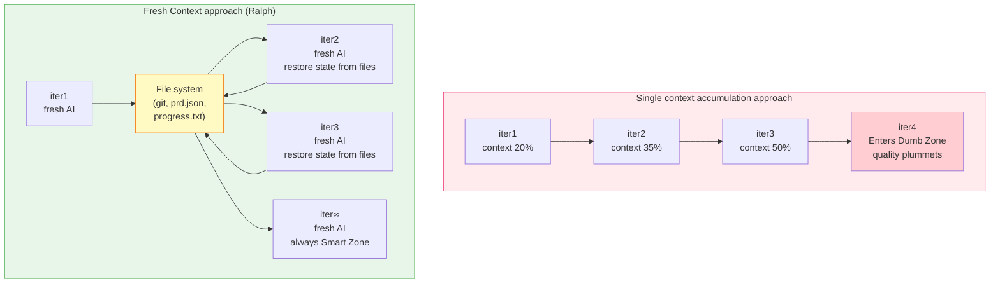
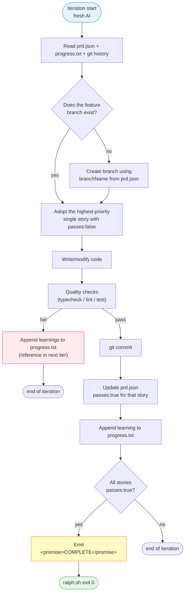
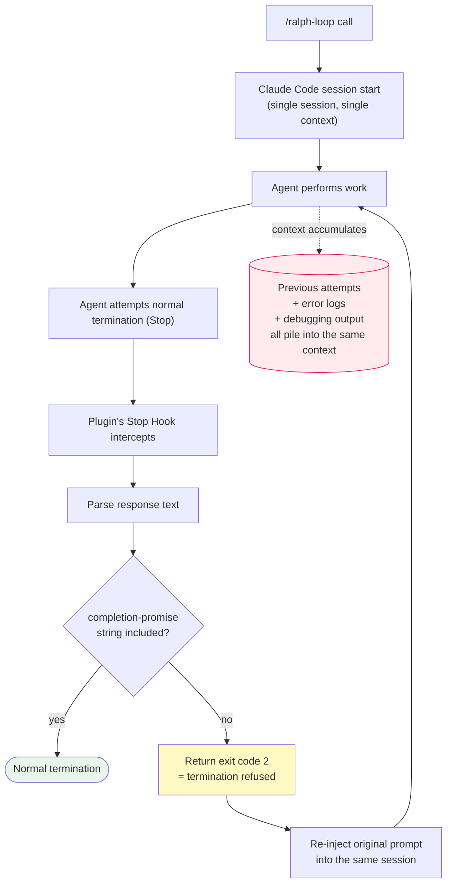

> From Geoffrey Huntley's original Ralph pattern to snarktank/ralph, the Claude Code Ralph Loop plugin, and OpenAI Codex `/goal` — this post examines how long-running coding agents bypass context rot and define termination. This post is the result of merging drafts written by different agents using the ralph loop method.

### What is Ralph?

In the second half of 2025, Australian developer [Geoffrey Huntley](https://ghuntley.com/ralph/) proposed a one-line bash script.

```bash
while :; do cat PROMPT.md | claude-code ; done
```

That is all. Even when the AI agent says "implementation done," it is ignored, and the same prompt is fed back in indefinitely — a simple infinite loop. Huntley named this pattern after a Simpsons character — **Ralph Wiggum**, a character who is not particularly smart but persistently refuses to give up.

Don't dismiss this as too simple. At a YC hackathon, one team put this script on a GCP instance and went to sleep, only to wake up to 1,100 commits across 6 repositories the next morning. They had nearly finished porting Browser Use from Python to TypeScript, with costs at $800 — the equivalent of hiring a developer at $10.50 USD/hour. Huntley himself used the same pattern to deliver a $50k contract deliverable (MVP + tests + review included) for $297 USD, demonstrating a 168x cost reduction.

The core point Huntley emphasizes is summarized in this single line.

> "Ralph is a technique. In its purest form, Ralph is a Bash loop."

Instead of a microservice architecture in which multiple agents communicate with each other, this is a monolithic approach in which a single OS process scales vertically. It was a philosophical shift away from the uncontrollable chaos created by multiple non-deterministic LLMs interacting, towards letting a single agent continuously sculpt and refine the software.

##### The Meaning of the Ralph Wiggum Analogy

The name's origin is the Simpsons character Ralph Wiggum. Ralph is not clever. He jumps off the same slide in the same way and repeats the same mistakes. But if you put up enough signs in the playground saying "get off the slide, don't jump, look around," Ralph eventually exits the playground safely.

A single LLM call is non-deterministic. It produces different answers to the same prompt every time and often hallucinates. But the loop itself is deterministic, and because each iteration starts with a clean context, given good enough signs (prompts, specs, tests), the output gradually converges on the correct answer. The somewhat counterintuitive claim at the heart of the analogy is that the foundation of operation is not one smart call but a hundred dumb calls.

### Why Does It Work?: Context Rot

To understand why the Ralph Loop works, you first have to look at the **Context Rot** phenomenon, an essential limitation of LLMs. A language model's context window is divided into two zones.

- **Smart Zone (front ~40%)**: A zone where the model is sharp, perfectly understands the system prompt and requirements, and makes architecturally sound decisions
- **Dumb Zone (the remaining ~60%)**: A zone where debugging logs, compilation errors, and traces of failures from previous turns accumulate, dispersing attention from the core objective. The model gets stuck in a deadlock — repeating the same mistakes, hallucinating more, and outputting meaningless code

The single line Huntley emphasizes most strongly is:

> "The more you use the context window, the worse the outcomes you'll get."

There are two reasons.

1. The context window itself is a finite resource. Within a single context window, the spec, tools, intermediate results, and traces of failure all compete with each other.
2. The longer a session continues, the more the model carries forward its own earlier lies and incorrect assumptions accumulated along the way.

When these two combine, you get a phenomenon where **the latter half of a session's output is consistently worse than the first half**.

The essence of a good autonomous loop system is not how clever the code the model writes is, but how to **forcibly keep the model in the Smart Zone** throughout the work. And the simplest, most effective answer is — **kill the process and start a new one every iteration**.



If you store progress **in files and git** rather than in the LLM context, the context will never fill up. When it does, just spawn a new agent. A fresh agent reads the file system state and continues the work. **You have offloaded memory responsibility from expensive tokens to free disk**.

##### One Item Per Loop

In the same vein, another rule Huntley nails down is **"One item per loop."**

> "One item per loop. I need to repeat myself here—one item per loop. You may relax this restriction as the project progresses, but if it starts going off the rails, then you need to narrow it down to just one item."

The smaller you slice the work, the more likely it is to finish within a single context window, and once it finishes, the next loop starts again with a clean state. This is the practical advantage that the fresh-context pattern has over the cumulative-session model.

### Spec Beats Execution

The Ralph cycle is not "writing code" but **two phases of Generation and Backpressure**. In the generation phase, the LLM produces code; in the backpressure phase, specs, tests, and the priority queue filter that code.

> "Generating code is now cheap, and the code that Ralph generates is within your complete control through your technical standard library and your specifications."

> "As code generation is easy now, what is hard is ensuring that Ralph has generated the right thing."

Writing code is no longer the bottleneck. The real work is **clearly writing down what to build** — that is, writing the spec. To say that the spec beats execution in this pattern means: "The loop should be as simple as possible, and all intelligence should be embedded in the external state (specs, priority, progress logs) that the simple loop reads in every time."

Huntley writes the truth in three kinds of files instead of LLM memory.

- **specs/** — agreed-upon specs. *"Specs are formed through a conversation with the agent at the beginning phase of a project."*
- **fix_plan.md** — priority queue. *"The TODO list is what I'm watching like a hawk. And I throw it out often."*
- **AGENT.md** — runtime learnings. *"When you learn something new ... make sure you update @AGENT.md using a subagent but keep it brief."*

[snarktank/ralph](https://github.com/snarktank/ralph), which we'll see in the next section, absorbs these three directly into its own format.

| ghuntley essay | snarktank/ralph implementation |
| --- | --- |
| `specs/*` spec directory | `prd.json.userStories[].acceptanceCriteria` |
| `fix_plan.md` priority queue | `prd.json.userStories[].priority` + `passes` |
| `AGENT.md` runtime learnings | `progress.txt` (append-only) |
| `while :; do cat PROMPT.md \| claude-code ; done` | `for i in $(seq 1 $MAX_ITERATIONS)` loop in `scripts/ralph/ralph.sh` |
| "until specs.md is satisfied" termination | termination via `<promise>COMPLETE</promise>` token grep |

The last row of the table is the small difference that separates the two tools. ghuntley's one-line loop runs **until a human stops it with Ctrl+C**, whereas snarktank/ralph **emits the agreed-upon token `<promise>COMPLETE</promise>` to stdout** when the model judges that all acceptance criteria have passed, and `ralph.sh` catches this string with `grep` and terminates normally. This single line transforms a "tool that humans terminate manually" into a "tool that terminates itself."

### snarktank/ralph

The open source project that translates the philosophy of the Ralph pattern most faithfully into practical code is [snarktank/ralph](https://github.com/snarktank/ralph).

It extends the simple one-line bash into a PRD-based autonomous development pipeline, and what the user actually writes by hand is essentially **just the single `prd.json` file** — the rest, the loop script and prompt templates, are copied verbatim from the repository.

##### Prerequisites

- Claude Code (`npm install -g @anthropic-ai/claude-code`) or [Amp](https://ampcode.com/)
- `jq` — used by `ralph.sh` to read `branchName` from the PRD JSON (`brew install jq`)
- A git repository — since each iteration leaves a commit, it's safer to start with a clean working tree

##### Installation

The simplest option is to clone the repository, then copy `ralph.sh` and the prompt template into the project you are working on.

```bash
# 1) Clone the Ralph repository
git clone https://github.com/snarktank/ralph.git /tmp/ralph

# 2) Move to the root of your working project
cd /path/to/your-project
mkdir -p scripts/ralph

# 3) Copy the loop script + prompt template
cp /tmp/ralph/ralph.sh scripts/ralph/
cp /tmp/ralph/CLAUDE.md scripts/ralph/    # for Claude Code
# or
cp /tmp/ralph/prompt.md scripts/ralph/    # for Amp

# 4) Grant execute permission
chmod +x scripts/ralph/ralph.sh
```

Execution is as follows.

```bash
# Amp (default)
./scripts/ralph/ralph.sh [max_iterations]

# Claude Code
./scripts/ralph/ralph.sh --tool claude [max_iterations]
```

The default iteration count is 10, overridable by a single argument. On every iteration, the `=== Ralph Iteration N of M ===` header is printed to stderr, and when the model judges that it has satisfied all acceptanceCriteria, it streams the `<promise>COMPLETE</promise>` token to stdout to agree on termination. For the first run, it is safer to verify operation with a single-digit iteration count.

##### Core Logic

The body of `scripts/ralph/ralph.sh:84-108` ([6c53cb0](https://github.com/snarktank/ralph/blob/6c53cb0b831ebe8739c6a003e22af14902d8b0b5/ralph.sh#L84-L108)) is very simple. It looks long, but excluding argument parsing and archive handling, it's effectively a single chunk of for-loop.

```bash
for i in $(seq 1 $MAX_ITERATIONS); do
  echo ""
  echo "==============================================================="
  echo "  Ralph Iteration $i of $MAX_ITERATIONS ($TOOL)"
  echo "==============================================================="

  # Run the selected tool with the ralph prompt
  if [[ "$TOOL" == "amp" ]]; then
    OUTPUT=$(cat "$SCRIPT_DIR/prompt.md" | amp --dangerously-allow-all 2>&1 | tee /dev/stderr) || true
  else
    # Claude Code: use --dangerously-skip-permissions for autonomous operation, --print for output
    OUTPUT=$(claude --dangerously-skip-permissions --print < "$SCRIPT_DIR/CLAUDE.md" 2>&1 | tee /dev/stderr) || true
  fi

  # Check for completion signal
  if echo "$OUTPUT" | grep -q "<promise>COMPLETE</promise>"; then
    echo ""
    echo "Ralph completed all tasks!"
    echo "Completed at iteration $i of $MAX_ITERATIONS"
    exit 0
  fi

  echo "Iteration $i complete. Continuing..."
  sleep 2
done
```

The core consists of three lines. Two dispatch lines spawn the `amp` or `claude` CLI as a **new process** every iteration — therefore the context is automatically reset cleanly — and pipe `prompt.md` or `CLAUDE.md` to stdin; `grep -q "<promise>COMPLETE</promise>"` is the single interface where the LLM and the shell agree "we're done" via one line of stdout, and if it is not caught, after a `sleep 2` the `for` loop automatically advances to the next iteration. Within 25 lines, dispatch, capture, termination judgment, and pacing are all closed.

##### prd.json

What "I have to do this iteration" is all contained in a single `prd.json` file each iteration. The minimal form of one user story is as follows.

```json
{
  "project": "MyApp",
  "branchName": "ralph/task-priority",
  "description": "Task Priority System - Add priority levels to tasks",
  "userStories": [
    {
      "id": "US-001",
      "title": "Add priority field to database",
      "description": "As a developer, I need to store task priority so it persists across sessions.",
      "acceptanceCriteria": [
        "Add priority column to tasks table: 'high' | 'medium' | 'low' (default 'medium')",
        "Generate and run migration successfully",
        "Typecheck passes"
      ],
      "priority": 1,
      "passes": false,
      "notes": ""
    }
  ]
}
```

Only stories with `passes: false` remain in the queue, and once they all become `true`, `<promise>COMPLETE</promise>` is emitted.

A single story has only seven fields — `id`, `title`, `description`, `acceptanceCriteria[]`, `priority` (smaller value takes precedence), `passes`, and `notes` — and the agent **picks only one item, the highest-priority one whose `passes: false` is set**, in each iteration. From the AI's perspective, prd.json plays the role of a **TODO list and answer key at the same time**. The key point is that "the acceptanceCriteria are the spec that flows into the LLM."

> "Each PRD item should be small enough to complete in one context window. If a task is too big, the LLM runs out of context before finishing and produces poor code."

A single item should be small enough to finish within one context window, and the recommended pattern is to write **automatically verifiable items** (e.g., "typecheck passes," "tests pass") instead of vague expressions.

##### progress.txt

`progress.txt` is even simpler. It is an **append-only text file**. The fresh AI of each iteration records one or two lines of codebase information learned that day in this file, and the fresh AI of the next iteration reads it at startup so as not to step on the same landmines again.

```text
# Ralph Progress Log
Started: Tue May 6 23:18:00 KST 2026
---
[iter 3] Routing is consolidated in app/router.go; all handlers must register via RegisterRoutes
[iter 4] An FTS index already exists in the search_index table — do not create a new one
[iter 6] make test panics if TEST_DATABASE_URL env var is missing. See .env.test
[iter 7] PRD explicitly says not to touch the legacy/ directory
```

This is the **external brain** of the Ralph pattern. If the LLM context window is expensive volatile memory, progress.txt is free permanent storage.

##### CLAUDE.md / prompt.md

The prompt file that `ralph.sh` pipes into the child process every time is `CLAUDE.md` (or Amp's `prompt.md`). This file plays the role of Ralph's "agent constitution." The verbatim text from snarktank/ralph's `CLAUDE.md:7-16` ([6c53cb0](https://github.com/snarktank/ralph/blob/6c53cb0b831ebe8739c6a003e22af14902d8b0b5/CLAUDE.md#L7-L16)).

```markdown
1. Read the PRD at `prd.json` (in the same directory as this file)
2. Read the progress log at `progress.txt` (check Codebase Patterns section first)
3. Check you're on the correct branch from PRD `branchName`. If not, check it out or create from main.
4. Pick the **highest priority** user story where `passes: false`
5. Implement that single user story
6. Run quality checks (e.g., typecheck, lint, test - use whatever your project requires)
7. Update CLAUDE.md files if you discover reusable patterns (see below)
8. If checks pass, commit ALL changes with message: `feat: [Story ID] - [Story Title]`
9. Update the PRD to set `passes: true` for the completed story
10. Append your progress to `progress.txt`
```

This short markdown file is the source of all the magic. It nails down the **order** (read state → pick → implement → verify → commit → log), enforces the **duty to update the external brain** (append to progress.txt), and teaches what is valuable as *"learning for future iterations."*

Step 4 ("pick the highest-priority `passes:false`") and step 9 ("once done, update to `passes:true`") reference exactly the same keys as the PRD JSON above. The intelligence is embedded in this markdown and JSON; `ralph.sh` is just a deterministic shell loop that flows the two into a non-deterministic LLM fresh every time.

By injecting this into a blank-slate AI every iteration, you get Ralph: "dumb but consistently good at doing the same thing." OpenClaw's "soul document" concept is a more elaborate version of the same — a way to bind the agent's personality, action principles, and prohibitions in a single markdown and inject it into every session.

##### Flowchart of One Iteration

The script itself is this simple, but what actually happens within one iteration almost exactly mimics the workflow of a human developer.



The real value of this diagram lies in **where the state is**. The AI dies and is reborn each time, but the `passes` flags in `prd.json`, the git commit history, the append-only `progress.txt`, and the `CLAUDE.md` injected anew every time — these four preserve the cumulative progress and rules of behavior. The blank-slate AI of the next iteration reads these and reverse-engineers "where I left off, what I figured out, and how I should behave," then continues the work seamlessly. This is what it means for memory to live on disk rather than in the LLM.

##### Notes

Before running the above flow on a real project, the following four points need to be addressed.

- **Permission-bypass flags are turned on.** `ralph.sh` invokes Amp with `--dangerously-allow-all` and Claude with `--dangerously-skip-permissions`. That is, even if the LLM throws a command like `rm -rf`, the user is not asked. It is safer to run it inside an isolated environment such as a container, VM, or Devcontainer.
- **It is useless without a CI/feedback loop.** Because Ralph enters every iteration with a new context, code that the previous iteration wrote incorrectly will accumulate into the next iteration as-is unless typecheck and tests catch it. The README explicitly states *"Ralph only works if there are feedback loops."*
- **One story per cycle.** The reason the PRD must be sliced finely is not readability, but the finite context window. If a single story does not finish within one iteration, the next iteration starts in an incomplete state and is more likely to break further.
- **Billing and token consumption.** Each run invokes the LLM CLI in dozens of new processes, so API usage piles up fast. It's good to set `MAX_ITERATIONS` small and validate starting from the first story in `prd.json`.

### Claude Code Ralph Loop Plugin

Riding on the popularity of the Ralph pattern, Anthropic officially released the [Ralph Loop](https://claude.com/plugins/ralph-loop) plugin as an official plugin. It is the result of bringing the same idea **inside the Claude Code session** and packaging it so that a self-referential loop runs within the same chat window without the user having to write a shell loop. Instead of an external shell loop, Claude Code's **Stop Hook** intercepts termination and feeds the same prompt back into the next iteration.

##### Installation

Claude Code's plugin system is a two-step flow: register a marketplace, then install plugins from it. On first use, run the following two lines in order.

```text
/plugin marketplace add claude-plugins-official
/plugin install ralph-loop@claude-plugins-official
```

Once installation finishes, three slash commands (`/ralph-loop`, `/cancel-ralph`, `/help`) and a Stop Hook (`hooks/hooks.json` → `hooks/stop-hook.sh`) are registered automatically. Plugin files are cached at `~/.claude/plugins/cache/claude-plugins-official/ralph-loop/1.0.0/`.

The loop is started with a single slash-command line.

```text
/ralph-loop "Build a todo API" --completion-promise "DONE" --max-iterations 20
```

There are only two flags.

- `--max-iterations`: a safety upper bound
- `--completion-promise`: when this string appears in the agent's response, the loop terminates. This is the same pattern as snarktank/ralph using `<promise>COMPLETE</promise>` as the agreed token, but it can be freely specified per call — the Stop Hook only ends the loop when the `<promise>X</promise>` form appears exactly

If you omit `--max-iterations`, **the default is unlimited**, so it is safer to specify both options at the start. To stop a loop in progress, use `/cancel-ralph` in the same session — internally it merely deletes the `.claude/ralph-loop.local.md` state file, and when the next Stop event occurs, the hook judges "no active loop" and allows normal termination.

##### How Does It Work?

Unlike the original Ralph, which uses an external bash script to spawn a new child process every time, the official plugin uses Claude Code's internal **Stop Hook** mechanism to mimic a loop within the same session.



The README nails it in one sentence — *"The loop happens **inside your current session** - you don't need external bash loops. The Stop hook in `hooks/stop-hook.sh` creates the self-referential feedback loop by blocking normal session exit."*

In terms of safeguards, even when multiple Claude Code sessions are running simultaneously, a `session_id` comparison guard is in place so that another session's Stop Hook does not touch the wrong state file, providing multi-session isolation by default — something raw Ralph does not have.

##### Single Context

The problem is that all work logs of every iteration accumulate indefinitely **in the same context window**. This is the exact opposite of the snarktank/ralph philosophy, which secured a fresh context each time by killing and respawning the process cleanly. According to aihero.dev's measurements:

- iter1: ~20% context used
- iter2: ~35%
- iter3: ~50% — already half of it is past failure logs and cruft
- After iter4: the model rapidly enters the Dumb Zone, with hallucinations and repeated mistakes spiking

The longer the loop runs, the more the token cost grows linearly while output quality drops in the opposite direction. On top of that, there are reports of cases where Claude Code's internal automatic context compaction collides with the Stop Hook, frequently requiring the user to intervene mid-loop and compact manually.

For this reason, critical reviews like aihero.dev recommend "use the original bash pattern instead of the official plugin." Installation is convenient with one line, but that convenience can directly translate to architectural limitations. That said, for tasks like writing a single article that finish in 5–10 iterations, you can wrap things up before reaching the Dumb Zone, so practically speaking it is sufficient — for a multi-day code migration, an external shell-loop implementation would be more predictable.

### OpenAI Codex Goal Command

What appeared on a different vector from local/container-based Ralph-family tools is the OpenAI Codex CLI's [`/goal` command](https://github.com/openai/codex). It was added to v0.128.0 in April 2026, and at the time of writing, the `goals` feature flag is exposed as `under development`. Since official documentation is still catching up, here we treat it as a **lifecycle feature for tracking long-term goals inside a Codex session** that goes beyond a simple autonomous loop.

If snarktank/ralph spawns a new LLM process each time via an external bash loop and Claude `ralph-loop` creates a self-referential loop within the same session via Stop Hook, `/goal` is a form where, **inside a single Codex thread**, the system automatically injects an audit prompt right after each turn ends, prompting the model itself to judge "am I really done?"

##### Activation

`/goal` is a feature added to Codex CLI after 0.128.0, but it is not active by default and is gated by the `Feature::Goals` flag. There are two ways the user can toggle it directly.

```toml
# ~/.codex/config.toml
[features]
goals = true
```

```bash
# Apply the same result with a single command line
codex features enable goals
```

##### How to Use

The invocation syntax after activation is a single slash-command line. The usage as defined directly in the source is:

```text
Usage: /goal <objective>
Example: /goal improve benchmark coverage
```

After the loop has started, state is manipulated with the same slash-command family.

```text
/goal pause
/goal resume
/goal clear
```

The internal `ThreadGoalStatus` enum has exactly four states (`Active` / `Paused` / `BudgetLimited` / `Complete`), and the slash commands above plus automatic transitions update this enum.

##### System Prompt Injection

The core of `/goal` is the two system prompt templates that the backend automatically injects at the end of each turn.

| Template | Role |
|---|---|
| `goals/continuation.md` | Analyze previous action results + directory state → self-evaluate goal achievement → plan next steps |
| `goals/budget_limit.md` | Triggered upon reaching a user-predefined token budget threshold → blocks all subsequent loops immediately even if the goal is incomplete, freezing into `BudgetLimited` state |

The single line that `continuation.md` nails down at its core is:

> "Treat uncertainty as not achieved; do more verification or continue the work."

Another line that the same template emphasizes next is the fact that the right to call the `update_goal` tool depends solely on passing the audit.

> "Do not call update_goal unless the goal is complete. Do not mark a goal complete merely because the budget is nearly exhausted or because you are stopping work."

Termination only occurs when the model calls the `update_goal(status="complete")` tool, and the head comment of that tool nails the intent: *"create_goal starts an active objective, while update_goal can only mark the existing goal complete"* — **the authority to end the loop itself is intentionally separated**.

Another termination path is the **token budget**. If the user passes a `token_budget` argument together with `create_goal`, when tokens are exhausted there is a forced transition to `BudgetLimited` state, and the `goals/budget_limit.md` template is injected once, instructing the model to wrap up: *"do not start new substantive work for this goal. Wrap up this turn soon."* The biggest fear of long-running autonomous agents is the scenario of "getting stuck and producing an astronomical token bill," and this template serves as a forced safeguard.

##### Meta Prompting

The key technique to actually run `/goal` well is **Meta Prompting**. Aditya Bawankule's guide points out that short goals are deliberately prone to failure.

> "the agent fills in the blanks itself, and the blanks compound" — *"We're talking hours of continuous work."*

Instead of writing the mission directive yourself, you delegate to another powerful reasoning model like Claude or ChatGPT: "Write a perfect mission directive that a long-running agent can understand." The five things a good `/goal` prompt should have are:

1. **Scope** — area of impact, which files/modules
2. **Constraints** — parts that must not be touched, technical/style limits
3. **Files in play** — explicit specific file paths
4. **Definition of Done** — uncontroversial completion criteria
5. **Validation** — automated checklists, tests, lint, human review

If you launch `/goal` with a one-line vague instruction ("do some refactoring"), it will burn days of compute and produce a wrong PR. Conversely, if a meta prompt with the five elements above tightly defined goes in, it can finish a migration overnight without human supervision and submit a PR in the morning.

An actual meta prompt looks roughly like this.

```text
/goal

## Scope
- Migrate all Express routes under packages/api/src/handlers to a Hono router
- Do not change external contract (URL, request/response shape)

## Constraints
- Absolutely do not modify packages/web, packages/shared
- No new dependency additions (hono@4.x is already in package.json)
- Do not invent new middleware; only use existing packages/api/middleware/*

## Files in play
- packages/api/src/handlers/**/*.ts
- packages/api/src/server.ts (router mount point)
- packages/api/test/**/*.spec.ts (all existing tests must continue to pass)

## Definition of Done
- pnpm --filter api test passes (without exception)
- pnpm --filter api typecheck has 0 errors
- pnpm --filter api lint has 0 warnings
- 0 occurrences of `import { Router } from 'express'` in modified files

## Validation
1. All four commands above exit with 0
2. Confirm git diff only touches packages/api/
3. All cases in the integration test (test/integration/api.spec.ts) pass
```

When such a prompt goes in, Codex self-verifies via `continuation.md` every turn and decides on its own things like "3 of 5 validations are still not done — keep going." And once the token budget is exhausted, `budget_limit.md` forces termination, so cost is also controlled.

##### Goal vs. Ralph

A one-line comparison of termination strategies. snarktank/ralph spawns a new Claude process every iteration (i.e., context always starts clean) and grep-checks the output for the agreed token `<promise>COMPLETE</promise>` — **the authority for termination judgment lies in the external shell script**.

Codex `/goal`, conversely, accumulates context within a single thread but, at the end of each turn, the system injects an audit prompt and lets the model itself decide "am I done?" — **the termination judgment lies in the model's tool call** (`update_goal(status="complete")`), and that tool is protected by a natural-language contract saying it should only be called when the audit passes.

### Comparison

When you put the tools we've seen so far into a single table, the differences become clear. Where the authority for termination judgment lies is the biggest dividing line.

| Comparison axis | ghuntley original Ralph | snarktank/ralph | Claude Plugin Ralph Loop | Codex `/goal` |
| --- | --- | --- | --- | --- |
| **Lineage** | one-line bash pattern | PRD-based external bash loop | Anthropic official Claude Code plugin | OpenAI Codex goal lifecycle |
| **Runtime environment** | local terminal + bash | local Git repo + bash | inside a single Claude Code session | Codex CLI session / execution environment |
| **Trigger** | `./loop.sh` (manual run) | `./scripts/ralph/ralph.sh --tool claude N` | slash `/ralph-loop "<prompt>"` | slash `/goal <objective>` |
| **Loop control** | external `while` loop | external `for` loop, child process forced reset | Stop Hook + exit code 2 (session interception) | per-turn auto injection of `continuation.md` / `budget_limit.md` |
| **Context model** | **Fresh Context** (blank slate per iter) | **Fresh Context** (blank slate per iter) | **Single Context accumulation** (Dumb Zone risk) | **Persistent Goal** (long window + self-audit) |
| **State persistence** | git + single PROMPT.md | git + `prd.json` + `progress.txt` | in-session context + state file | thread goal state + token/time accounting |
| **Termination condition** | human Ctrl+C / spec satisfaction judgment | `<promise>COMPLETE</promise>` grep | `--completion-promise` match or max-iterations | `update_goal(status="complete")` call or token budget limit |
| **Termination authority** | human | external shell | in-session Stop Hook | model's own tool call |
| **Safeguards** | human supervision | max iterations, CI scripts | max-iterations | **forced token-budget abort**, execution environment isolation |
| **Best-fit work** | learning/demonstrating the Ralph pattern | multi-stage structured projects sliced via PRD | small repeated edits, clear success strings | multi-day async migrations, infra transitions |
| **Weakness** | no UI, depends on human termination | lacks monitoring UI, only text visibility | **early entry to Dumb Zone** — context accumulation | requires meta-prompting writing skills, lacking official docs |

### Conclusion

The most important thing when actually running a Ralph-class loop is not "iteration" but "termination." Anyone can make an infinite loop. The hard part is defining the evidence of being done. Good termination conditions look like this.

- `pnpm test` passes
- `pnpm typecheck` passes
- A specific API response matches the fixture
- Playwright passes the main UI flow
- All stories in `prd.json` are `passes=true`
- The final document exists at the specified file path

Bad termination conditions look like this.

- "until it's okay"
- "as good as possible"
- "complete it however"
- "refactor the entire thing"

Agent loops burn cost and time when goals are vague. Conversely, **when the goal is small and verification is fast, even an extremely dumb iteration can become quite powerful automation**.

Things that are good to take care of additionally during operation.

- **Tests must run fast.** Since Ralph absorbs failures via repetition, the entire system slows down if the verification loop is slow. For projects with heavy compilation like Rust, slice unit-test scope finely; for frontend, separate typecheck and core browser verification.
- **`progress.txt` and `AGENTS.md` matter.** If every iteration is a fresh context, the run instructions, prohibitions, and project conventions that the next agent must know should be written in files.
- **Run in an isolated environment.** Since `--dangerously-*` flags are on, it is safer to operate inside a container, VM, Devcontainer, or Docker Sandbox.

Tool selection by situation goes roughly like this.

- If you want to finish a **multi-stage structured project** that's been pre-decomposed, with each stage in a fresh context, in turn → **snarktank/ralph**
- If you want to **experience the Ralph pattern in its simplest form** with just a one-line PROMPT.md → **ghuntley original Ralph Loop** (educational/demo use)
- If you're already working in the Claude Code chat window and want to **run an automatic loop in the current session** without an external terminal → **Claude `ralph-loop` plugin**
- If you're a Codex CLI user and want to **pursue a single goal to the end with hours of accumulated context** while letting the model judge termination on its own → **Codex `/goal`**

Not a way to make LLMs smarter, but a way that — having accepted the LLM's tendencies to forget, hallucinate, and finish lazily mid-way — wraps them on the outside with old-fashioned engineering devices. What things named Ralph have in common is here. The file system is memory, Git is the timeline, tests are counter-pressure, and the PRD/task list is the state machine. **Don't trust the agent's words; trust state and verification. And keep the loop running until evidence of being done emerges.** Even if the draft is not completed in one shot, the next iteration reads the state left in the files and pushes forward again. Until evidence of being done emerges.

### References

- [Geoffrey Huntley — Ralph](https://ghuntley.com/ralph/) — original Ralph essay
- [Geoffrey Huntley — Everything is a Ralph Loop](https://ghuntley.com/loop/)
- [ghuntley/how-to-ralph-wiggum](https://github.com/ghuntley/how-to-ralph-wiggum) — Clayton Farr's Ralph Playbook
- [snarktank/ralph (GitHub)](https://github.com/snarktank/ralph) — PRD JSON-based operational tool repository
- [Anthropic claude-plugins-public — `ralph-loop`](https://github.com/anthropics/claude-plugins-public/tree/main/plugins/ralph-loop)
- [Ralph Loop – Claude Plugin (Anthropic)](https://claude.com/plugins/ralph-loop)
- [PageAI ralph-loop](https://github.com/PageAI-Pro/ralph-loop) / [project site](https://ralphloop.sh/)
- [openai/codex — `goals.rs` source](https://github.com/openai/codex/blob/main/codex-rs/core/src/goals.rs) / [`continuation.md` template](https://github.com/openai/codex/blob/main/codex-rs/core/templates/goals/continuation.md)
- [GitHub Issue #20536](https://github.com/openai/codex/issues/20536) — Codex `/goal` lifecycle spec
- [OpenAI Developers — Codex CLI](https://developers.openai.com/codex/cli)
- [aihero.dev — Why the Anthropic Ralph plugin sucks (use a bash loop instead)](https://www.aihero.dev/why-the-anthropic-ralph-plugin-sucks)
- [paddo.dev — Ralph Wiggum: Autonomous Loops for Claude Code](https://paddo.dev/blog/ralph-wiggum-autonomous-loops/)
- [sidbharath.com — The Dumbest Smart Way to Run Coding Agents](https://sidbharath.com/blog/ralph-wiggum-claude-code/)
- [HumanLayer — A Brief History of Ralph](https://www.humanlayer.dev/blog/brief-history-of-ralph)
- [Aditya Bawankule — *Codex /goal: How to Meta Prompt It For Days of Autonomous Work*](https://www.adityabawankule.io/blog/codex-goal-meta-prompting)
- [Ralph Wiggum development method (daleseo)](https://daleseo.com/ralph-wiggum/)
- [GeekNews — Ralph Loop](https://news.hada.io/topic?id=27426) / [snarktank/ralph](https://news.hada.io/topic?id=26146) / [Adding /goal feature to Codex CLI](https://news.hada.io/topic?id=29158)
- [Internal Architecture of Coding Agents (previous post)](https://yuhodots.github.io/deeplearning/26-03-09/)
