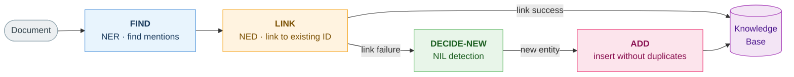
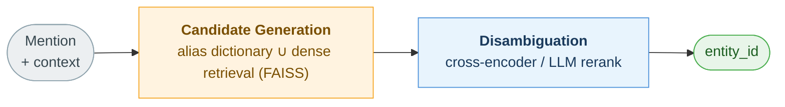
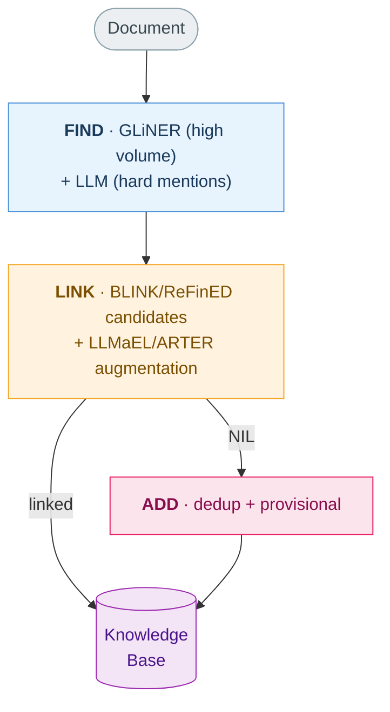

> Finding entities in a document (NER), linking them to a specific ID in a knowledge base (NED), and adding a new entity when linking fails — this post organizes that three-stage pipeline around modern LLM-based methods. We look at which techniques emerged and why, and what gets combined in practice, from a beginner's perspective. This post was written with the help of AI (LLMs) to research and draft the material, which I then reviewed and edited myself.

### What are NER and NED?

Extracting knowledge from unstructured text usually splits into two stages.

**NER (Named Entity Recognition)** finds the **span (boundary) and type** of meaningful units (people, organizations, places, dates, etc.) in text. For example, in the sentence `"Apple released Vision Pro in Cupertino"`, identifying `Apple` as `ORG`, `Vision Pro` as `PRODUCT`, and `Cupertino` as `LOCATION` is NER.

**NED (Named Entity Disambiguation)** — also called Entity Linking (EL) — **binds the mention found by NER to a specific entity ID** in a knowledge base (KB). For instance, the mention `"Columbus"` is classified as `LOC` in the NER stage, and in the NED stage we use context to decide whether it is Wikidata's `Q16567` (the city of Columbus, Ohio) or `Q7195` (the explorer Christopher Columbus).

This pipeline is the common foundation for (a) building a **Knowledge Graph**, (b) grounding in **RAG** that binds answers to entity-level evidence to reduce hallucination, and (c) entity-based search and recommendation. The quality of each step in the chain "text → entity → ID → graph triple" directly determines the quality of the downstream system.

### Find → Link → Add Pipeline

In practice, the whole flow of populating a knowledge base from text (KB population) decomposes into three operations.



The most important insight here is that **"adding a new entity without duplicates" is not a separate module bolted onto NED — it is the entity resolution applied to mentions that failed to link.** That is why the real-world pipeline is more accurately viewed not as three stages but four: **FIND → LINK → DECIDE-NEW → ADD**.

The rest of this post follows these four stages in order.

### Before LLMs

The standard pre-LLM pipeline was a **chain of staged supervised components**. On the NER side it was a history of gradually removing hand-crafted features (part-of-speech, capitalization, dictionaries, etc.) — POS → CRF → BiLSTM-CRF → BERT token-classification. On the EL side it was a two-step process: "pull candidates from a mention dictionary → collective disambiguation via context/link graph" (TagMe, AIDA, etc.).

The shared limitations of this lineage are clear.

- **The label set is fixed at training time** — adding a new type requires retraining.
- **Dependence on large labeled corpora** — every domain incurs expensive annotation work.
- **Weak transfer to new domains and entities** — fragile out-of-domain (OOD).
- **Multi-stage pipelines propagate errors** — an omission early on is amplified downstream.

LLM-based methods target exactly these four. The interface itself changes.

| Aspect | Classic / encoder-based | LLM-based approach |
|---|---|---|
| Input | token sequence | document + instruction + label definitions + examples |
| Output | BIO tags, span list | JSON / inline marker / generated text |
| Type extension | requires retraining | zero/few-shot via natural-language definitions |
| Domain adaptation | labeled data | prompting, retrieval, distillation, LoRA |
| Weakness | OOD-fragile, fixed label set | hallucination, offset errors, cost/latency |

That said, **LLMs have not completely replaced the older methods.** On in-domain news benchmarks, specialized small models still hold the ceiling, while LLMs shine when there are no labels, in the long tail, or out of domain. That is why the dominant pattern in practice is **hybrid**.

### Find: LLM-based NER

Doing NER with an LLM essentially means **"turning a sequence-labeling problem into a text-generation problem,"** and fighting the failure modes that conversion introduces (hallucination, span errors). First, let me nail down the single most important engineering rule.

##### Golden rule: don't ask the LLM for character offsets

If you make the LLM directly output character-level offsets like `{"text": "Apple", "start": 0, "end": 5}`, **performance collapses**. In a comparison from one study (*Assessment of Generative NER*, 2026), offset-based JSON output dropped to about **29 F1**, while the inline approach — marking entities right inside the sentence — scored about **90 F1**. Precise character-position arithmetic simply does not fit the text-generating nature of an LLM.

> The prescription is simple. **Receive entities as surface strings or inline markers, and recover offsets in post-processing with a deterministic string search.** (Cases where the same string appears multiple times must be handled explicitly.)

##### Method 1. Prompted Structured Extraction

The most direct approach is to give the document and a schema and have the model generate an array of entities. The key here is to forbid free-form answers and use **structured output / constrained decoding**. Tools such as OpenAI's `response_format`, Gemini's `response_schema`, or Outlines and Instructor (Pydantic) for open models force the output to stay within the JSON schema at every decoding step.

```json
{ "entities": [
    { "mention_text": "Apple", "entity_type": "organization", "confidence": 0.87 }
] }
```

A caveat: guaranteeing structure does **not** guarantee correctness of the content. Hallucinated or wrongly-typed entities can still pass while remaining schema-valid, so you need a verification layer downstream. Also restrict types with an enum so the model cannot invent types that don't exist in the DB.

##### Method 2. Generative NER (inline marker)

**GPT-NER** is a representative case that recasts sequence labeling as generation. It rewrites the sentence while wrapping entities in special markers.

```
input  : Columbus is a city
output : @@Columbus## is a city      # @@ ## wrap the target-type entity
```

Afterward you parse the markers and recover offsets with a string search. The downside is that a separate call is needed per type, which is expensive, and a self-verification step to filter hallucinations adds further cost.

##### Method 3. Compact Open-type Model (GLiNER)

Let me clear up a common confusion here. **The GLiNER family is not a generative decoder LLM but an encoder-only span-matching model.** It embeds text and labels into the same space with a bidirectional transformer and scores span embeddings against label embeddings **in parallel** (no autoregressive decoding). This is exactly why it is fundamentally faster than LLM prompting.

```python
from gliner import GLiNER
model = GLiNER.from_pretrained("urchade/gliner_medium-v2.1")
ents = model.predict_entities(text, labels=["Person", "Award", "Date"], threshold=0.5)
# [{'text': ..., 'label': ..., 'start': ..., 'end': ...}, ...]  ← returns real offsets
```

Because you hand it natural-language labels at inference time, zero-shot without a fixed label set is possible, and it **returns real character offsets**, sidestepping the offset problem mentioned earlier. With under 500M parameters it runs even on CPU, so it is widely used as the default for high-volume, low-latency, on-premise settings (Apache-2.0).

##### Method 4. Distillation (UniversalNER)

If API costs are a burden or you need local inference, there is the path of **distilling a large LLM as a teacher into a small model**. UniversalNER trained 7B/13B models on data labeled by ChatGPT and reports outperforming its teacher, ChatGPT, on the zero-shot average across 43 datasets. It is useful when you want both "LLM-level label flexibility" and "small-model cost."

In short, for NER you pick based on the situation: **① a compact encoder like GLiNER for high volume, ② LLM prompting (inline marker) when there are no labels and the task is tricky, ③ distillation when you need both.**

### Link: LLM-based NED

Once NER has found a mention, it is time to link it to a KB ID. Modern EL is dominated by the two-stage **retrieve-then-rerank** pattern.

##### Why not put the whole DB into the prompt

You cannot fit millions of KB entities into a prompt. So you narrow the candidates first.



In stage 1, **candidate generation**, **recall** matters more than precision, because the answer must be inside the candidate set for stage 2 to pick it. Typically you take the **union** of alias/anchor dictionary matching and dense bi-encoder retrieval (**BLINK**-style: embed entity descriptions and retrieve top-k with FAISS). In stage 2, **disambiguation**, a cross-encoder or LLM compares the context with candidate profiles and picks the final one.

##### Golden rule: don't ask the LLM for a bare KB id

This is the NED counterpart to the NER offset rule. If you let the LLM generate canonical IDs without constraints, you get the **hallucination of inventing plausible names that don't even exist in the DB**. You must constrain the output space. There are two canonical approaches.

- **Generative + constrained decoding (GENRE):** Redefine EL as "generating the entity name one token at a time," but constrain decoding with a **prefix trie** built from all valid names in the KB so only existing entities can be generated. There's no need to store an entity vector index, so memory is small, and adding a new entity just means adding its name to the trie. (Note: GENRE is CC-BY-NC licensed, which limits commercial use.)
- **Retrieve-then-rerank (BLINK):** As in the diagram above, retrieve candidates and then rerank with a cross-encoder. There are also fast variants like ReFinED that fuse detection, typing, and linking into a single forward pass.

##### Use the LLM as a helper, not the linker

The central trend of 2024–2025 is to not use the LLM as the linker itself, but for **handling hard cases** or **context augmentation**.

- **LLMaEL** — Have the LLM generate a mention-centered description, append it to the original context, and feed that augmented input straight into an existing EL model (BLINK/GENRE/ReFinED). The LLM only supplies world knowledge about long-tail entities; it is not the linker itself.
- **ARTER** — A router branches easy mentions from hard ones. Easy ones are handled instantly by a cheap model, and only the hard minority go to the LLM, which picks from the candidate list as multiple-choice (a selection, not free generation). It reports accuracy comparable to a system that uses the LLM on every mention, at roughly half the tokens.

One key rule: since the LLM can only choose when **the answer is included among the candidates**, you must measure the candidate stage's recall@k **separately** from final accuracy.

### Add: When the Entity is New

Off-the-shelf linkers (BLINK, GENRE, ReFinED) only do FIND and LINK. **None of them can create a new entity on their own.** Because the world's information doesn't stand still (neologisms, new drugs, newly founded companies), a link failure must be treated not as a plain error but as a "new entity candidate." This stage splits in two.

##### DECIDE-NEW: is it really new?

A mention that failed to link is judged **NIL** (no correspondent in the KB). But dumping everything below a threshold into NIL is dangerous. One study (*Learn to Not Link*) showed that NIL is not monolithic.

- **Missing Entity** — a real entity absent from the KB → triggers ADD
- **Non-Entity Phrase** — a string that was never an entity to begin with → must not be ADDed

**Only the former should be sent to the next stage**, so that the KB is not polluted with non-entities. Also, "retrieval failed to find a candidate" and "genuinely absent from the DB" are different things. Before rushing to create, reduce retrieval misses with alias expansion and re-retrieval.

##### ADD = Entity Resolution

Adding a new entity is precisely **entity resolution: canonicalize and insert without duplicates**. If `"Joe's Building Company"`, `"Joe's Bldg Inc."`, and `"Joe's LLC"` all go in separately, the knowledge graph fragments in no time. In practice you observe the following.

- **Dedup first:** Before creating, search existing entities by canonical name, alias, and embedding similarity. Pair cheap embedding search (recall) with expensive LLM verification (precision) to prevent over-merging (approaches like EDC, LLM-CER).
- **Start in a provisional state:** Put an auto-created entity in `provisional` rather than `active` immediately, and restrict its use on critical paths until a human reviews it.
- **Provenance and merge log:** Attach evidence (which document/span) to every output, and if it later proves to be a duplicate, keep history so you can roll back via **merge** rather than deletion.

The core is a **data model that stores mention / entity / link decision / provenance / merge event separately**. The LLM greatly improves ambiguous natural-language judgments, but the responsibility for stably managing IDs still lies with the system design.

### Practical Recipe

The dominant real-world answer is not "one LLM for everything" but a **layered combination**.

| Stage | Recommended tools | Notes |
|---|---|---|
| FIND (NER) | high-volume, low-latency → **GLiNER / NuNER Zero** | returns real offsets, runs on CPU |
| | no labels, long-tail → **frontier LLM prompting** | inline marker, no offsets |
| LINK (NED) | candidate gen → **alias dictionary ∪ BLINK (dense)** | recall first |
| | disambiguation → **ReFinED / GENRE** | output space must be constrained |
| | long-tail, hard cases → **LLMaEL / ARTER** | LLM as helper |
| DECIDE-NEW | **NIL classification** (Missing vs Non-Entity) | a learned outcome > a hand-tuned threshold |
| ADD | **canonicalize-or-create + dedup** | provisional + merge log |

A sense of cost matters too. Public numbers from an adjacent classification task show LLM prompting costing about **25–381× more in inference and 3–10× more in latency** than a fine-tuned encoder (with negligible accuracy difference). So the principle reduces to one line — **let cheap models handle the common cases, and reserve the LLM for the hard tail.**



### Summary

- **View the pipeline as four stages:** FIND (NER) → LINK (NED) → DECIDE-NEW (NIL detection) → ADD (canonicalize and dedup). Off-the-shelf linkers only do the first two, so you must bolt on the last two yourself.
- **NER golden rule:** Don't ask the LLM for character offsets (90→29 F1 collapse). Receive inline markers/strings and recover offsets by search. Distinguish encoder-span (GLiNER) ≠ generative LLM.
- **NED golden rule:** Don't ask for a bare KB id. Constrain the output space (GENRE trie) or restrict it to candidates (BLINK retrieve-rerank) to structurally eliminate hallucination. Use the LLM for routing and context augmentation.
- **ADD = entity resolution:** Split NIL into Missing-Entity and Non-Entity, and protect KB integrity with dedup, provisional status, and a merge log.
- **The production default is hybrid:** small models for high volume, the LLM only for the hard tail. Manage accuracy, cost, and latency stage by stage.

### References

- [GPT-NER (2023)](https://arxiv.org/abs/2304.10428) · [GLiNER (NAACL 2024)](https://arxiv.org/abs/2311.08526) ([GitHub](https://github.com/urchade/GLiNER)) · [UniversalNER (ICLR 2024)](https://arxiv.org/abs/2308.03279)
- [Assessment of Generative NER (2026)](https://arxiv.org/abs/2601.17898) · [NuNER Zero](https://huggingface.co/numind/NuNER_Zero)

- [BLINK (EMNLP 2020)](https://aclanthology.org/2020.emnlp-main.519/) · [GENRE (ICLR 2021)](https://arxiv.org/abs/2010.00904) · [ReFinED (NAACL 2022)](https://arxiv.org/abs/2207.04108)
- [EntGPT (2024)](https://arxiv.org/abs/2402.06738) · [LLMaEL (CIKM 2025)](https://arxiv.org/abs/2407.04020) · [ARTER (EMNLP 2025)](https://arxiv.org/abs/2510.20098)

- [Learn to Not Link (Findings of ACL 2023)](https://aclanthology.org/2023.findings-acl.690/) · [BLINKout (CIKM 2023)](https://arxiv.org/abs/2302.07189) · [EDC (EMNLP 2024)](https://arxiv.org/abs/2404.03868)

- [OpenAI Structured Outputs](https://platform.openai.com/docs/guides/structured-outputs) · [Outlines](https://github.com/dottxt-ai/outlines) · [Instructor](https://python.useinstructor.com/) · [spaCy-llm](https://spacy.io/usage/large-language-models)
