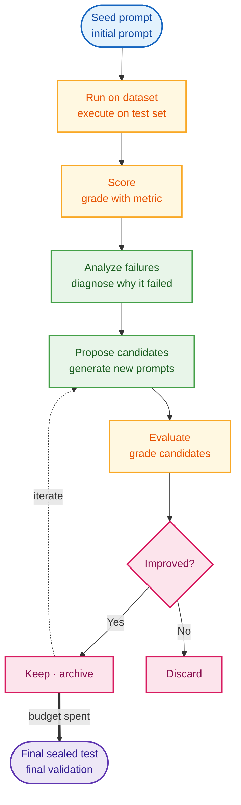
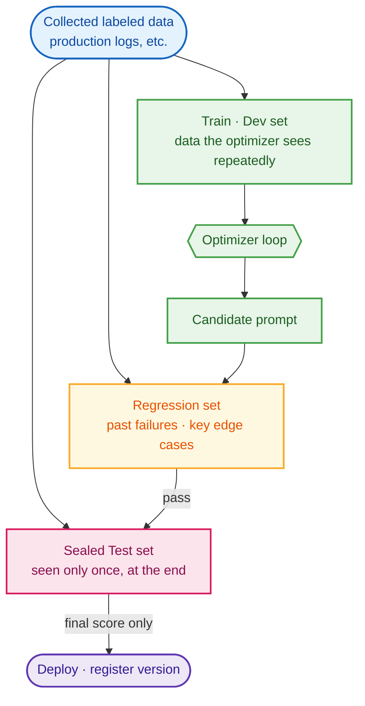
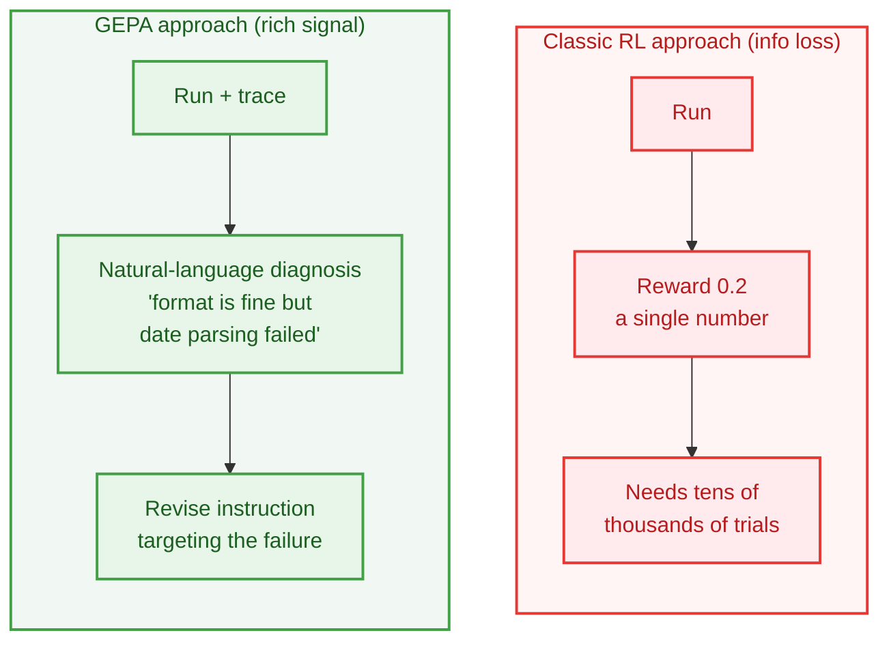

> Instead of tweaking prompts by gut feeling, this post covers practical methods for automatically improving LLM prompts by fixing a test set and a metric and pushing the score up. It walks through the common optimization loop, the major algorithms (GEPA, OPRO, MIPROv2, etc.) and tools (DSPy, Braintrust, etc.), and an operational protocol for avoiding overfitting — all at a beginner's level. This post was researched and written with the help of AI.

### From Vibes to Evals

Anyone who has written prompts has had this experience. You add a line like "Answer only in English," and some cases get better while others break. So you fix it again, and yet another spot breaks. This kind of **prompt engineering that relies on intuition and trial-and-error** works when you only have a handful of cases, but it quickly hits a wall once the inputs grow diverse and the system involves multiple intertwined stages.

The starting point for a solution is a shift in perspective. Instead of treating a prompt as "good writing if you write it well," treat it as a **parameter you can measure and improve by score** — just like a model's weights or hyperparameters. To do that, you first have to define "good" as a number. That is, you fix a **test set (a collection of inputs and expected outputs)** and an **evaluation metric**, then score multiple candidate prompts against the same standard and find the one with the higher score.

Every method covered in this post is ultimately a variation on a single idea: **"If you have data and a scoring function, you can turn prompt improvement into a repeatable optimization problem."**

### The Core Loop

Whatever the method, test-set-based optimization converges on nearly the same closed loop. It's intuitive when drawn out.

Breaking down each step:

1. Start with a **seed prompt**. Whatever you're using now is fine.
2. **Run** it on the test set and **score** it with your chosen metric.
3. Gather the failed cases and analyze **why they failed**.
4. Based on that analysis, generate **new candidate prompts**.
5. Score the candidates again and **keep only the better ones**.
6. Once the budget (number of trials, cost) is spent, do a **final validation on a separate test set** that the optimizer never saw.

The differences between methods ultimately come down to step 4 (how candidates are generated) and step 3 (how richly failure information is used). If a human fixes prompts directly, it's a manual loop; if an LLM fixes them automatically, it's automatic optimization.

### Build Your Eval First

Before picking an optimization algorithm, it's far more important to **set up your evaluation (eval) first**. Without a good dataset and a trustworthy metric, even the smartest optimizer will warp the prompt in the wrong direction.

##### Choose a metric that fits the task.

Whenever possible, an objective metric that can be compared mechanically against the ground truth is best.

| Task | Good metric examples |
|---|---|
| Classification | exact match, F1, confusion matrix |
| Extraction | field-level F1, JSON schema validity |
| RAG QA | answer correctness, faithfulness, retrieval recall |
| Agent / tool use | final success, tool-call validity, cost/latency |
| Summarization / generation | human-label-based judge, hallucination penalty, length |

For cases where it's hard to assign a number (friendliness, tone, etc.), you use an **LLM-as-judge** (the LLM does the grading), but that judge must be **calibrated against human-assigned scores**. An unvalidated judge contaminates the optimization with biases like "preferring verbose answers."

##### Always split your data.

If you keep looking at the same data while fixing the prompt, that dataset effectively becomes a training set. So at minimum, split it like this.

Just doing this split properly already filters out a lot of "prompts that score high on the leaderboard but are mediocre in real use."

### Manual Hill Climbing

The most basic and, surprisingly, powerful method is the **loop a human runs directly**. Setting up this loop before adopting any automatic algorithm is the standard practice.

1. Fix a baseline prompt.
2. Build a dataset and a scorer.
3. Run it, gather **failure cases**, and find patterns.
4. Fix instructions, examples, and output format per pattern.
5. Re-score on the same dataset and compare improvements/regressions.

Even without an automatic optimizer, just having this loop makes things far more reproducible than "fixing by gut feeling." And the collection of failure cases and the scorer you accumulate here become the direct input to automatic optimization.

### Letting the LLM Optimize

Once the manual loop becomes familiar, you can **automate candidate generation by handing it to an LLM**. The representative methods fall into two broad families.

##### Evolutionary / search family

Treats the prompt as a string; the LLM generates multiple candidates and selects/iterates by score.
- **APE**: Has the LLM inversely induce candidate instructions from input/output examples, then scores them. Good when you have little to no initial prompt.
- **OPRO**: Show the LLM the history of (prompt, score) it has tried so far, and it proposes new candidates that should score higher. Famous for discovering the "Take a deep breath..." instruction.
- **PromptBreeder / EvoPrompt**: Like a genetic algorithm, the LLM performs mutation/crossover to evolve prompts generation by generation.

##### Gradient-like family

Treats the prompt as if it were a differentiable parameter, flowing natural-language "feedback" backward like backpropagation.

- **ProTeGi / TextGrad**: Treats the LLM's critique of failures as a "textual gradient" and modifies the prompt in the opposite direction.

The names vary, but if you remember that they're all just different ways of generating candidates within the same common loop (Core Loop) seen earlier, it won't get confusing.

### GEPA: Reflective Evolution

The most talked-about method recently is **GEPA (Genetic-Pareto)**, released in 2025 and accepted as an ICLR 2026 Oral. A good comparison for beginners is the contrast with reinforcement learning (RL).

RL compresses the result into **a single number** like `0.2`, so it loses "why it was wrong," which is why it needs an enormous number of trials. GEPA, on the other hand, exploits the fact that most of an LLM system's execution leaves behind **natural-language records (traces)**. There are three core ideas.

- **Reflection (reflective mutation)**: A strong LLM reads the failed execution trace, diagnoses "what failed and why" in natural language, and proposes a new instruction reflecting that diagnosis. This is a far richer learning signal than a number.
- **Pareto frontier (maintaining diversity)**: Growing only the single highest-average-scoring candidate easily gets stuck in a local optimum. So GEPA preserves candidates that are "the best in at least some cases" together, maintaining diversity.
- **Merge (system-aware crossover)**: Combines the strengths of two candidates that are strong on different cases into a new candidate.

The performance is impressive too. Per the paper, it achieved roughly +6% on average (up to +20%) over RL (GRPO) while using **up to 35× fewer rollouts**, and it also beat the previous strongest optimizer, MIPROv2, by more than 10 percentage points. It's especially attractive in practical settings where data is scarce and API call costs are a concern.

There's an **interesting paradox** here. We usually assume more data is better, but in GEPA's experiments, using more than 500 examples actually hurt performance and only made the prompt verbose. **20–100** representative examples worked best. That's because prompt optimization isn't about statistically memorizing data — it's a process of **extracting universal rules from many cases and compressing them into something short**.

### DSPy and Beyond

Now let's look at what to actually use in practice. The tools fall into two broad categories.

**Those that directly run an automatic optimization algorithm for you:**

- **DSPy**: The de facto standard framework that declares an LLM pipeline with a signature like `question -> answer` and treats the prompt as a learnable parameter. You can pick optimizers like `dspy.GEPA` or `MIPROv2`.
- **gepa library / MLflow / DeepEval / Opik**: They adopt GEPA as a core or offer multiple optimizers. Choose based on the stack you already use (MLflow registry, Python test code, etc.).

**Those that provide an eval/regression-test loop (a human runs the loop):**

- **Braintrust / LangSmith / Promptfoo / Parea**: They bundle datasets, scorers, experiment comparison, version control, and CI quality gates. Good when an operational eval and deployment safety nets matter more than automatic rewriting.

| Situation | Consider first |
|---|---|
| Want to build an eval loop quickly | Promptfoo, Braintrust, LangSmith |
| Want to run an automatic optimizer in Python code | DSPy (GEPA/MIPROv2), gepa, DeepEval |
| Rich natural-language feedback and traces | GEPA |
| Have ground-truth labels but weak feedback | MIPROv2, PromptWizard |
| Want regression tests in CLI/CI | Promptfoo |

> If you're torn between GEPA and MIPROv2, there's a simple rule of thumb. **If natural-language feedback/traces are rich and data is scarce, GEPA**; **if you want to tune few-shot examples together and have ample data/compute, MIPROv2.**

### Avoiding Overfitting

Fitting your score to a test set always casts a shadow of **overfitting and judge hacking**. Finally, here are the safeguards you must keep in practice.

- **Split the data.** Optimize only on train/dev; report finally on a sealed test never seen before. (Most important)
- **Align the judge with humans.** When delegating subjective metrics to an LLM judge, first verify that the judge agrees with human scores.
- **Cap the length.** Without a limit, the prompt keeps appending exception clauses for every edge case and balloons to 5,000 characters, spiking cost and latency. A length limit acts as a kind of regularization.
- **Allocate compute asymmetrically.** Use a cheap small model for scoring (called often), and an expensive, smart frontier model for reflection/proposal (called occasionally). This is how GEPA dramatically cut cost versus RL.
- **Register it as a regression test.** Put the optimized prompt into CI so that any model swap or edit automatically detects a score drop.

Summarized as a checklist:

- Eval score ↑ but real-use quality ↓ → suspect overfitting / test-set leakage
- Metric checks only format, not meaning → reinforce the judge rubric
- Candidates get overly verbose → consider length caps, instruction-style (GEPA)
- Weak optimizer/reflection model → use a strong model for the reflection step

### Wrapping Up

The essence of test-set-based prompt optimization isn't a fancy algorithm but **"an operational system that tests prompts like code, validates them like models, and gates them like products."** The reason methods like GEPA are powerful isn't that they generate many candidates — it's that they turn failures into natural-language learning signals and maintain diversity.

So the usual order of adoption in practice is as follows.

1. First build a **data-driven eval loop** with Promptfoo/Braintrust/LangSmith, etc.
2. Secure a baseline prompt and a **failure taxonomy**.
3. Attach an automatic optimizer that fits your current stack (DSPy GEPA, MLflow, etc.).
4. Compare alternatives like MIPROv2/OPRO on the **same data split**.
5. Confirm generalization with a sealed test and a canary rollout, then promote the prompt.

In the end, the core competency of an AI engineer will shift from "the ability to write prompts eloquently" toward **the ability to design robust evaluation metrics that measure the system's true goal and good test sets**.

### References

- GEPA: [Reflective Prompt Evolution Can Outperform Reinforcement Learning (arXiv:2507.19457)](https://arxiv.org/abs/2507.19457), [gepa-ai/gepa](https://github.com/gepa-ai/gepa)
- DSPy: [Prompt Optimizing with GEPA](https://dspy.ai/getting-started/gepa-optimization/), [Choosing an Optimizer](https://dspy.ai/diving-deeper/choosing-an-optimizer/)
- OPRO: [Large Language Models as Optimizers (arXiv:2309.03409)](https://arxiv.org/abs/2309.03409)
- APE: [LLMs Are Human-Level Prompt Engineers (arXiv:2211.01910)](https://arxiv.org/abs/2211.01910)
- TextGrad: [Automatic "Differentiation" via Text (arXiv:2406.07496)](https://arxiv.org/abs/2406.07496)
- MIPROv2: [Optimizing Instructions and Demonstrations (arXiv:2406.11695)](https://arxiv.org/abs/2406.11695)
- Braintrust: [The prompt optimization loop](https://www.braintrust.dev/articles/prompt-optimization-loop)
- Promptfoo: [Getting started](https://www.promptfoo.dev/docs/getting-started/)
