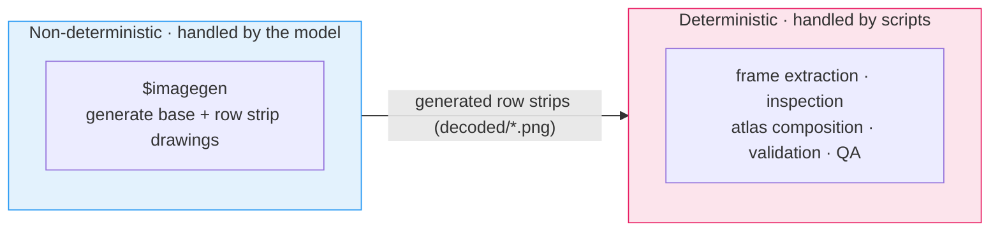
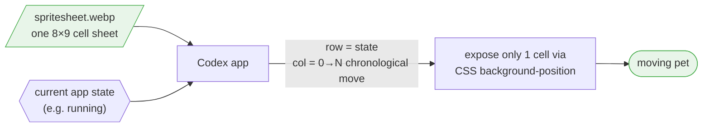
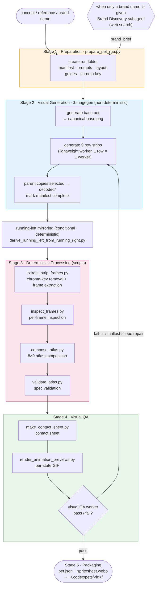
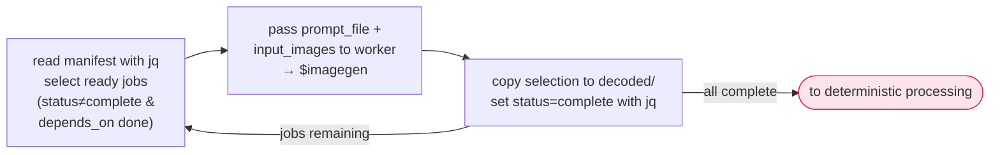
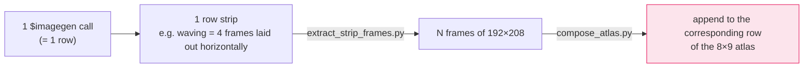
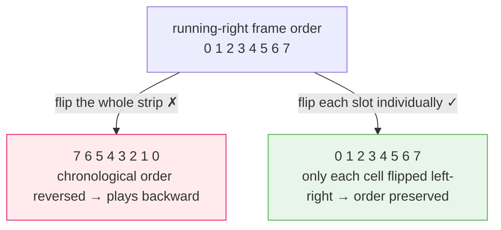
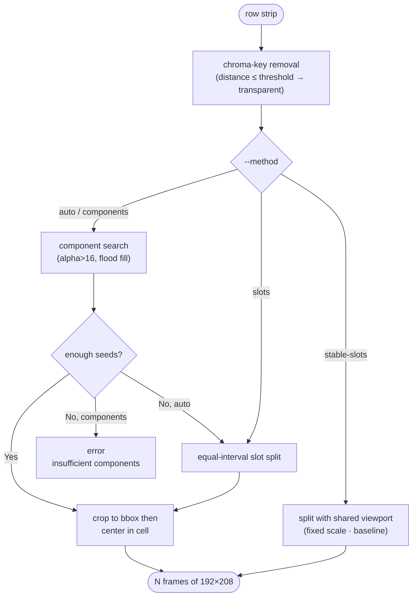

> This post analyzes the internal workings of OpenAI Codex's `hatch-pet` skill — how it turns a one-line concept or a single reference image into a "moving pet." We look at the bundled-script level: the split between non-deterministic image generation (`$imagegen`) and a deterministic raster pipeline, automatic per-pet chroma-key selection, connected-component-based frame extraction, atlas validation, and GIF preview generation.

> This post is based on a direct analysis of the publicly available `hatch-pet` skill (`SKILL.md`), its bundled Python scripts, and its reference documents. The internal logic discussed here therefore goes only as far as what the skill publicly exposes. The overall draft was written with Claude Code, and I then read through it myself and fixed the awkward parts.

### Terminology

- **Sprite atlas (spritesheet)** — an image that packs many frame drawings into a single grid. The app just computes "which cell" to crop and display.
- **Frame / row / strip** — a frame is one animation cut, a row is the horizontal line holding the frames of one state, and a row strip is the generated output where that single line is drawn out horizontally.
- **Alpha / transparency** — a value indicating how opaque a pixel is (0 means fully transparent). It is the final `A` in RGBA.
- **Raster** — an image made of a pixel grid (PNG / WebP). The opposite of vector (SVG), which is coordinate- and formula-based.
- **Connected component** — a single blob of pixels that touch and connect to one another.
- **bbox (bounding box)** — the smallest rectangle that tightly encloses a sprite. It is the reference for cropping and alignment.
- **Deterministic / non-deterministic** — deterministic means the same input always yields the same output; non-deterministic means it varies each time, like a model.
- **size popping / baseline jump** — the phenomenon where the size or baseline jitters frame to frame, making the character appear to jump during playback.
- **`$imagegen`** — an image-generation skill installed in Codex. Every drawing in hatch-pet is generated only through this path.
- **canonical base / identity lock** — the base image that serves as the identity reference, and the rule that binds every row to preserve that face, palette, and silhouette.
- **WebP (lossless)** — an image format that supports transparency while allowing lossless compression. It is the final distribution file format for the pet.

### Codex Pets

**Codex Pets** are animated desktop companions added to the OpenAI Codex app. They live in a corner of the app and react to the state of your coding work. They show a focused look when a task is being processed, a blank standing look when waiting for input, and a dejected look when a task fails.

The first thing to clarify here is one point. **The pet that moves on screen is not the GIF file we usually imagine.** What gets installed into the app is a single **sprite atlas (spritesheet)**, and the Codex app cuts this single image cell by cell with CSS `background-position` to play it. The GIF shows up later, separately, used only as a QA artifact for a human to verify the motion.

A custom pet is laid out as a small package under the local Codex home.

```text
${CODEX_HOME:-$HOME/.codex}/pets/<pet-id>/
├── pet.json
└── spritesheet.webp
```

`pet.json` holds only minimal metadata.

```json
{
  "id": "pet-name",
  "displayName": "Pet Name",
  "description": "One short sentence.",
  "spritesheetPath": "spritesheet.webp"
}
```

### The hatch-pet Skill

`hatch-pet` is a skill that takes a concept, brand cue, company/product name, reference image, or a combination of these and **generates, edits, validates, visual-QAs, and packages a Codex-compatible pet**. Opening its directory makes the skill's identity clear.

```text
~/.codex/skills/hatch-pet/
├── SKILL.md          # Orchestration policy (policies, prompts, rules)
├── scripts/          # Deterministic Python pipeline (8 scripts)
├── references/       # Contract documents (atlas/row/QA specs)
└── agents/           # Subagent definitions
```

The core design intent is revealed in this structure. `SKILL.md` is not code but a **policy document**. It holds only the rules, prompts, constraints, and workflow the model is to read and follow; all the arithmetic that actually touches pixels is delegated to the bundled scripts.

##### Generation vs. Deterministic Split

The single principle that runs through `hatch-pet` is a **thorough separation of the non-deterministic part from the deterministic part**.

- **Non-deterministic (image generation):** All visual generation happens only through the installed `$imagegen` skill. `hatch-pet` does not call the Image API or an image CLI directly, and it is forbidden from drawing, tiling, or compositing sprites locally.
- **Deterministic (raster processing):** **Geometric tasks with a fixed correct answer** — frame extraction, inspection, atlas composition, validation, QA media generation — are all handled by Python scripts.



This separation matters because the atlas spec (`1536x1872`, cells of `192x208`) tolerates not even a single pixel of error. Instead of asking a non-deterministic model to "draw exactly 8 cells at precisely 192-pixel intervals," the model is handed only the **drawing (row strip)**, and fitting it to the grid is the responsibility of deterministic code.

##### Atlas, Not a GIF

The pet's final rendering contract (`references/codex-pet-contract.md`) is as follows.

| Item       | Value                                                    |
| ---------- | -------------------------------------------------------- |
| Format     | PNG or WebP (default distribution is `spritesheet.webp`) |
| Total size | `1536 x 1872` px                                         |
| Grid       | 8 columns × 9 rows                                       |
| Cell size  | `192 x 208` px                                           |
| Background | Transparent (unused cells are fully transparent)         |

The size `1536 x 1872` comes from `8 × 192` horizontally and `9 × 208` vertically. Each of the 9 rows corresponds to one state of the Codex app, and each row actually uses a different number of frames. For rows that do not use all 8 cells, the remaining cells must be fully transparent.

| Row | State           | Frames | Meaning                                  | Preview duration (ms)        |
| --: | --------------- | -----: | ---------------------------------------- | ---------------------------- |
|   0 | `idle`          |      6 | Calm micro-changes (breathing, blinking) | 280, 110, 110, 140, 140, 320 |
|   1 | `running-right` |      8 | Movement to the right                    | 120 ×7, 220                  |
|   2 | `running-left`  |      8 | Movement to the left                     | 120 ×7, 220                  |
|   3 | `waving`        |      4 | Waving hand/arm                          | 140, 140, 140, 280           |
|   4 | `jumping`       |      5 | Vertical jump                            | 140 ×4, 280                  |
|   5 | `failed`        |      8 | Error/disappointment reaction            | 140 ×7, 240                  |
|   6 | `waiting`       |      6 | Waiting for user input                   | 150 ×5, 260                  |
|   7 | `running`       |      6 | **Processing a task** (non-directional)  | 120 ×5, 220                  |
|   8 | `review`        |      6 | Focused review                           | 150 ×5, 280                  |

`running` is an especially easy state to confuse here. `running-right`/`running-left` are literally **walking movement** left or right, but `running` is the state in which Codex is **processing a task**. So it must not depict feet running or speed lines; it should be expressed as a non-directional, focused motion such as thinking, scanning, or typing. This subtle distinction in meaning is enforced not by the scripts but by the prompts and QA rules.

So how does a single static sheet become a moving pet? The app picks the row corresponding to the current state, then within it moves through the columns (frames) one cell at a time in chronological order, exposing only one cell via CSS `background-position`. Rather than decoding a GIF, it **moves a viewing window over a single sheet**.



### Pipeline Overview

The full pipeline flows through 5 stages: preparation → generation → deterministic processing → visual QA → packaging. In the diagram below, the blue-toned items are non-deterministic (model) work, and the pink-toned items are deterministic (script) work.



The scripts and reference documents responsible for each stage are as follows.

| File                                        | Role                                                                        |
| ------------------------------------------- | --------------------------------------------------------------------------- |
| `prepare_pet_run.py`                        | Create run folder, job manifest, prompts, layout guides, chroma key         |
| `derive_running_left_from_running_right.py` | Mirror the approved `running-right` frame by frame to derive `running-left` |
| `extract_strip_frames.py`                   | row strip → `192x208` frame extraction (including chroma-key removal)       |
| `inspect_frames.py`                         | Inspect frame quality before atlas composition                              |
| `compose_atlas.py`                          | Compose frames into an 8×9 atlas, save as lossless WebP                     |
| `validate_atlas.py`                         | Validate that the final atlas satisfies the Codex pet contract              |
| `make_contact_sheet.py`                     | Generate a labeled contact sheet for checking all rows                      |
| `render_animation_previews.py`              | Generate per-state GIF previews (QA only)                                   |
| `references/animation-rows.md`              | The state / frame-count / duration contract for the 9 rows                  |
| `references/codex-pet-contract.md`          | Atlas spec, custom pet package structure                                    |
| `references/qa-rubric.md`                   | The visual QA checklist that must pass before acceptance                    |

### Preparation

The entry point of the pipeline is `prepare_pet_run.py`. This script creates, in one shot, the working folder, the `imagegen-jobs.json` manifest, the per-state prompts, and the layout guides. If the user omits the name/description/style, it infers them from the concept or reference filenames, and if even that fails, it uses the default name `Sprout`.

##### Chroma Key Selection

The most interesting detail is that **the chroma key is not fixed to green**. People often think "chroma key = green," but `hatch-pet` picks a different key color for each pet.

```python
CHROMA_KEY_CANDIDATES = [
    ("magenta", "#FF00FF"), ("cyan", "#00FFFF"), ("yellow", "#FFFF00"),
    ("blue", "#0000FF"), ("orange", "#FF7F00"), ("green", "#00FF00"),
]
```

If a reference image exists, it samples its pixels (excluding the white background), then scores **how far each of the 6 candidate colors is from the pet's colors**. It picks the key that is sufficiently far even from the pet's closest color — that is, the key with the least risk of erasing part of the character along with the background during extraction. When there is no reference at all, the default is **magenta (`#FF00FF`), not green**.

The chosen key is recorded in `pet_request.json`, and every subsequent script reads this value. It is a structural device to avoid mistakes like aiming a green chroma key at a green pet.

##### Layout Guides

For each of the 9 states, `prepare_pet_run.py` draws an **invisible construction-guide** image and saves it under `references/layout-guides/`. The guide is a drawing on a gray canvas of width `frames × 192`, with a black-bordered rectangle per cell + a blue safe-area rectangle (margins 18×16) + a gray dotted center-line cross.

When generating a row strip, attaching this guide as a **layout-only input** lets the model draw following the exact frame count / spacing / center alignment / safe margins. However, these guide lines must not appear in the generated output. They serve purely as a ruler saying "draw inside this cell, with about this much margin."

##### Job Manifest

`imagegen-jobs.json` is the dependency graph of the visual jobs. Looking at the lookup query that `SKILL.md` suggests, you can see what fields each job has.

```bash
jq '.jobs[] | {id, kind, status, depends_on, prompt_file,
   retry_prompt_file, input_images, output_path, derivation_policy}' \
   imagegen-jobs.json
```

A typical single run has up to **10 generation jobs** (1 base + 9 row strips). A job is considered "ready" when its `status` is not `complete` and all ids in its `depends_on` are already complete. Every row job carries a `retry_prompt_file` alongside its `prompt_file` in advance, so that if `$imagegen` returns a transport-level `Bad Request`, the same row can be retried once more with the retry prompt.

##### Pet-Safe Styles

The style is also decided during the prepare stage. The default is `auto`, which infers the style from the user prompt and reference, then keeps it identical across all rows. If the user specifies one, it follows a preset such as **`pixel`, `plush`, `clay`, `sticker`, `flat-vector`, `3d-toy`, `painterly`, `brand-inspired`**. Beyond pixel art, non-pixel styles like plush toy, clay, sticker, and vector are treated as first-class citizens.

That said, any style must satisfy the **pet-safe** conditions.

- A compact full-body silhouette that fits inside a `192x208` cell
- Consistent face/proportions/material/palette/props across all rows
- A cleanly removable chroma background
- Detail that reads even at pet size
- No text/labels/UI/logos (unless from an approved reference)

### Visual Generation

This is the stage where the drawings are actually made. There are two key points here.

First, the parent agent does not make the drawings itself; it hands the visual jobs to **lightweight workers (lightweight subagents)**. Second, rather than having the model draw the entire final atlas, it only generates **per-state row strips**. The subsequent frame extraction and atlas composition are handled by deterministic scripts.

##### Parent Agent Loop

`imagegen-jobs.json` is not an automatic scheduler but a dependency manifest. The parent agent reads it directly with `jq`, picks a **ready job**, hands it to a worker, receives the result, then updates the state again. Here, a ready job is one whose `status` is not `complete` and all of whose `depends_on` jobs are already complete.



At first, only the base job — whose `depends_on` is empty — is ready. Only once the base is complete do the row jobs that use that image as grounding become ready. If the order gets out of sync, the deterministic scripts that follow block it as a guard. For example, the `running-left` mirror derivation is rejected if `running-right` is not complete.

There is intent behind the order this loop produces.

1. **Generate the base pet.** Create one full-body pet on a flat chroma background. The selected output is copied to `decoded/base.png` and `references/canonical-base.png`, becoming the **identity source of truth for every subsequent row**.
2. **`idle` and `running-right` first.** This is the first checkpoint for confirming that the character identity and the sense of gait are preserved.
3. **Generate the remaining rows.** Each row job is generated separately, attaching the canonical base and the corresponding layout guide as inputs.

Each worker **returns exactly two lines** so as not to pollute the parent's context. `selected_source=<path>` and `qa_note=<one sentence>` are all there is. **Putting a Markdown image preview or base64 into the response is forbidden.**

Copying the result image into `decoded/` and updating the manifest to `complete` is the parent's job, but the parent does not open each image itself every time. This is a deliberate design for **context economics**.

##### Generation Granularity

The easiest point to get confused is the unit of generation. The model neither draws the entire atlas at once nor draws each cell (frame) separately. The unit of generation is **one row (state)**.

A single `$imagegen` call produces **one strip with all the frames of one state drawn out horizontally**. For example, the `waving` (4-frame) job generates a single image with 4 poses laid out left → right. So a typical run finishes with **1 base + 9 row strips = up to 10 generation calls**.



- Why not draw the entire atlas at once: because you cannot ask the model to fill 8×9 cells on a `1536×1872` canvas with pixel-level precision (the non-deterministic ↔ deterministic split mentioned earlier).
- Why not draw cell by cell: the frames of one row must have animation continuity, with the motion connecting naturally on the same scale and baseline. Drawing them together on one sheet preserves that continuity, whereas generating cells separately easily breaks frame-to-frame consistency.

In other words, the model draws only up to a **single-row animation sheet**, and **cutting that strip into `192×208` frames and placing them in the `8×9` atlas is the code's job**.

##### Prompt Contract

The prompts are created by `prepare_pet_run.py` and saved under `prompts/`. A prompt is not a simple drawing description but is closer to a **contract** that constrains the model output so the extraction scripts that follow succeed. The quotations below generalize dynamic values from the actual script's f-strings, such as turning `args.pet_id` and `args.display_name` into `{pet_id}`.

The base prompt creates the one identity-reference image.

```text
Create one clean full-body reference sprite for Codex pet {display_name}.

Pet identity: {pet_notes}.
Style: {style_contract}
{brand_block}
Place a single centered pose on a perfectly flat pure {chroma_name} {chroma_key} chroma-key background. Keep the full pet visible, compact, readable at 192x208, and easy to animate. Preserve approved reference identity cues. No scenery, text, borders, checkerboard transparency, shadows, glows, detached effects, or extra props. Keep {chroma_key} and close colors out of the pet, props, highlights, and effects.
```

The row strip prompt is the template that creates the per-state strip. Here, `{state_prompt}`, `{state_requirements}`, and `{style_contract}` are the key variables.

```text
Create one horizontal animation strip for Codex pet `{pet_id}`, state `{state}`.

Use the attached canonical base for identity. Use the attached layout guide only for slot count, spacing, centering, and padding; do not draw the guide.

Output exactly {frames} full-body frames in one left-to-right row on flat pure {chroma_name} {chroma_key}. Treat the row as {frames} invisible equal-width slots: one centered complete pose per slot, evenly spaced, with no overlap, clipping, empty slots, labels, or borders.

Identity: same pet in every frame: {pet_notes}. Preserve silhouette, face, proportions, markings, palette, material, style, and props.
Style: {style_contract}
Animation continuity: keep apparent pet scale and baseline stable within the row unless the state itself intentionally changes vertical position, such as `jumping`. Move the pose within the slot instead of redrawing the pet larger or smaller frame to frame.

State action: {state_prompt}

State requirements:
{state_requirements}

Clean extraction: crisp opaque edges, safe padding, no scenery, text, guide marks, checkerboard, shadows, glows, motion blur, speed lines, dust, detached effects, stray pixels, or chroma-key colors inside the pet.
```

`{style_contract}` is a string combining `PET_SAFE_STYLE` and `STYLE_PRESETS[style_preset]`. Only when the user adds a style note does `User style notes: ...` get appended at the end.

```text
Pet-safe sprite: compact full-body mascot, readable in a 192x208 cell, clear silhouette, simple face, stable palette/materials, and crisp edges for chroma-key extraction. Style `{style_preset}`: {preset_contract}
```

The per-preset `{preset_contract}` is one of the following values.

- `auto`: Infer the most appropriate pet-safe style from the user request and reference images, then keep that exact style consistent across every row.
- `pixel`: Pixel-art-adjacent digital mascot with a chunky silhouette, simple dark outline, limited palette, flat cel shading, and visible stepped edges.
- `plush`: Soft plush toy mascot with rounded stitched forms, fuzzy fabric feel, simple sewn details, and readable toy-like proportions.
- `clay`: Handmade clay or polymer-clay mascot with rounded sculpted forms, soft material texture, simple features, and clean readable edges.
- `sticker`: Polished sticker mascot with bold clean shapes, crisp outline, flat colors, and minimal highlight detail.
- `flat-vector`: Flat vector-style mascot with simple geometric forms, crisp color areas, clean outline, and minimal shading.
- `3d-toy`: Stylized 3D toy mascot with smooth rounded forms, simple materials, clear silhouette, and no photoreal complexity.
- `painterly`: Painterly mascot with simplified brush texture, readable forms, stable palette, and enough edge clarity for clean extraction.
- `brand-inspired`: Brand-inspired mascot using approved public or user-provided brand cues such as colors, mascot themes, and vibe while avoiding readable text or logo copying unless explicitly approved.

`{state_prompt}` is the per-state one-line action coming from `STATE_PROMPTS[state]`. The actual values are as follows.

| State           | `state_prompt`                                                                                                                                                                                                                       |
| --------------- | ------------------------------------------------------------------------------------------------------------------------------------------------------------------------------------------------------------------------------------ |
| `idle`          | Calm low-distraction resting loop: subtle breathing, tiny blink, slight head/body bob, and only quiet persona-preserving motion.                                                                                                     |
| `running-right` | Dragging-right loop: show directional movement to the right through body and limb poses only.                                                                                                                                        |
| `running-left`  | Dragging-left loop: show directional movement to the left through body and limb poses only.                                                                                                                                          |
| `waving`        | Greeting loop: paw or limb down, raised, tilted, and returning in a friendly attention gesture.                                                                                                                                      |
| `jumping`       | Hover jump loop: anticipation, lift, airborne peak, descent, and settle through body height.                                                                                                                                         |
| `failed`        | Blocked/failed loop: slumped or deflated reaction with sad or closed eyes.                                                                                                                                                           |
| `waiting`       | Needs-input loop: expectant asking pose for approval, help, or user input.                                                                                                                                                           |
| `running`       | Working loop: focused active-task processing, thinking, typing, scanning, or effortful concentration; not literal foot-running, jogging, sprinting, treadmill motion, raised knees, long steps, pumping arms, or directional travel. |
| `review`        | Ready-review loop: focused inspection of completed output with lean, blink, narrowed eyes, head tilt, or paw pose.                                                                                                                   |

`{state_requirements}` is a block that appends each sentence of `STATE_REQUIREMENTS[state]` as a `- ...` bullet. For example, the `running` row gets its action and requirements like this.

```text
State action: Working loop: focused active-task processing, thinking, typing,
scanning, or effortful concentration; not literal foot-running, jogging,
sprinting, treadmill motion, raised knees, long steps, pumping arms, or
directional travel.

State requirements:
- Show the pet actively working or processing, as if running a task: focused
  posture, busy hands or paws, purposeful bobbing, thinking motion, tool or prop
  motion only if already part of the pet identity, or other non-locomotion
  activity.
- Do not show literal foot-running, jogging, sprinting, treadmill motion, raised
  knees, long steps, pumping arms, directional travel, speed lines, dust clouds,
  floor shadows, motion trails, or detached motion effects.
```

So, to avoid producing a foot-running image just because the state is named `running`, the action and requirements double-block it inside the prompt. Conversely, `running-right`/`running-left` require clearly showing left/right movement, and `jumping` requires expressing the jump through the body's vertical position alone, without shadows or dust. These per-state requirements protect the downstream chroma-key removal and component extraction.

Finally, if `$imagegen` returns a transport-level `Bad Request`, the same row is retried once more with a more tightly compressed **retry prompt** (`retry_prompt_file`). The retry template drops the style description and preserves only the frame count, chroma key, identity, and state action.

```text
Create Codex pet row `{state}` for `{pet_id}`: exactly {frames} full-body frames in one horizontal strip on flat pure {chroma_name} {chroma_key}.

Use the attached canonical base for identity and the layout guide only for spacing. Same pet in every frame: {pet_notes}. Preserve silhouette, face, palette, material, proportions, markings, and props.

Keep apparent pet scale and baseline stable within the row unless the state itself intentionally changes vertical position, such as `jumping`.

Action: {state_prompt}

State requirements:
{state_requirements}

One centered complete pose per invisible slot. No text, boxes, guide marks, scenery, shadows, glows, motion blur, speed lines, dust, detached effects, stray pixels, or {chroma_key} colors in the pet.
```

##### Identity Lock

Every row job other than the base **must attach a grounding image**. Only the base is allowed prompt-only generation, and a row generated without a grounding image is invalid. Across all 9 rows, the face, proportions, palette, material, style, prop design, and silhouette must be kept identical. This is called **identity lock**, and even if there is not a single error in `qa/review.json` and `validation.json`, a wavering identity is in itself grounds for rejecting acceptance.

##### Transparency & Effects

Every pixel of a row must be one of two things: **part of the pet sprite, or a cleanly removable chroma background**. So `hatch-pet` prefers changes in pose, expression, and silhouette over decorative effects.

Even if an effect is included, it is allowed only if it satisfies **all** of the following conditions.

- It is related to the state
- It is physically attached to the pet silhouette (it must not float)
- It is within the same frame slot so it does not create a separate component
- It is opaque with crisp edges
- It is small enough to read at pet size

Conversely, speed lines, motion arcs, afterimages, detached stars/sparkles/dust, shadows, glows, halos, text, speech bubbles, UI, and colors close to the chroma key are forbidden by default. This forbidden list is not an aesthetic preference but a **rule to protect chroma-key removal and component extraction**. Floating effects or shadows can be caught as separate components or break the background removal.

The per-state guidance is in the same vein. `jumping` expresses the jump through body position alone, without shadows or dust; `waving` through the waving pose alone (no motion arc); and `idle` must not have its 6 frames be effectively the same drawing — it must carry subtle changes.

##### running-left Mirroring

Among the 9 rows, **the only row that can be deterministically derived is `running-left`**. Only when a human has judged and approved that `running-right` is left-right symmetric so flipping it does not break the meaning can it be mirrored with `derive_running_left_from_running_right.py`.

There is a subtle trap here. Flipping the entire strip left-right at once **also reverses the chronological order of the frames**, so the animation plays backward. That is why this script **mirrors each frame slot individually, in place**.



```python
def mirror_strip_preserving_frame_order(source, frame_count=8):
    mirrored = Image.new("RGBA", source.size, (0, 0, 0, 0))
    slot_width = source.width / frame_count
    for index in range(frame_count):
        left = round(index * slot_width)
        right = round((index + 1) * slot_width)
        mirrored.alpha_composite(
            ImageOps.mirror(source.crop((left, 0, right, source.height))),
            (left, 0),  # paste back at the same column position → preserves order
        )
    return mirrored
```

In addition, this derivation enforces a `--confirm-appropriate-mirror` flag and a `--decision-note`. To prevent mirroring without any justification, it requires explicit human approval and a reason at the code level. The remaining states such as `waiting`, `running`, `failed`, and `review` carry different app meanings, so they can never be derived/reused and must each be generated independently.

### Deterministic Processing

Once all 9 row strips gather in `decoded/`, the model's role is over. From here on, it is the stage of fitting pixels to a fixed spec. The flow is simple: **remove the background → cut the frames → inspect the frames → merge into an atlas → validate the final contract**.

##### Frame Extraction

`extract_strip_frames.py` takes a horizontally long row strip and turns it into N frames of `192x208`. The very first thing it does is **chroma-key removal**. It reads the key color recorded in `pet_request.json` and makes every pixel whose Euclidean distance from that color is at or below a threshold (default 96) transparent (`0,0,0,0`).

Next it finds the frames. The default `auto` does not blindly split the strip into N equal parts. It first finds the actual sprite blobs via **connected-component** analysis, and falls back to equal-interval slot splitting only when that fails.



The component method groups pixels with alpha above 16 via 4-directional flood fill. It computes each blob's area, bbox, and center x-coordinate, then picks the N largest-area blobs as **seeds** and maps them to frames in left → right order. Small pieces that are not seeds (eyes, a held prop, etc.) are merged into the seed whose center x-coordinate is closest, provided they are judged not to be noise.

The meaning of each mode can be seen as follows.

| Method         | Meaning                                                                                    |
| -------------- | ------------------------------------------------------------------------------------------ |
| `auto`         | Tries component extraction first, and falls back to `slots` if there are not enough seeds. |
| `components`   | Allows only component extraction. If it cannot find enough frames, it errors.              |
| `slots`        | Cuts the strip into equal intervals matching the frame count.                              |
| `stable-slots` | Applies the same viewport across the whole row to fix scale and baseline.                  |

The reason `stable-slots` exists separately is size popping. Ordinary component extraction grabs the bbox independently for each frame and centers it with `fit_to_cell`. So only frames with wide poses may be shrunk more, or the baseline may waver. `stable-slots` reduces this problem by applying the same top/bottom bounds and the same scale across the whole row. However, it does not go so far as to fix cases where the original strip itself is clipped or the poses are bad.

##### Frame Inspection

`inspect_frames.py` inspects the extracted frames **before** building the atlas. The problems it catches here are the "looks plausible as an image but breaks when put into the atlas" kind.

- Whether the frame count matches the per-state expected value, and whether each frame is exactly `192x208`
- Whether a frame is empty with too few non-transparent pixels (`min_used_pixels`)
- Whether there is a risk of clipping with pixels touching the cell edge (edge warning)
- Whether there are **residual pixels close to the chroma key** (a sign of background-extraction failure → error)
- Whether there are outliers among frames that are excessively small or large relative to the row median

In particular, using the `--require-components` option **escalates to an error** any row made by slot fallback rather than component extraction. `stable-slots` passes only as a warning when `--allow-stable-slots` is explicitly given. It is, in effect, a gate that forces "fallback not to be silently buried."

##### Atlas Composition & Validation

`compose_atlas.py` creates an empty `1536x1872` RGBA canvas and, in the order defined by `ROW_SPECS`, composites each state's frames into the center of the cells of its designated row.

After composition, `clear_transparent_rgb` normalizes the RGB values of fully transparent pixels (alpha=0) all to `0,0,0`. This is because if color residue remains in transparent pixels, some renderers may show a halo at the edges. Saving is done as PNG and **lossless WebP** (`method=6`, `exact=True`), and the final package includes `spritesheet.webp`.

`validate_atlas.py` mechanically checks whether the completed atlas keeps the contract and leaves behind `final/validation.json`.

- Whether the size is exactly `1536x1872`, the format is PNG/WebP, and there is an alpha channel
- Whether the **used cells** (col < frame_count) are not empty
- Whether the **unused cells** are fully transparent (an error if there is even one non-transparent pixel)
- Whether a used cell is not packed almost fully opaque (which would be a sign the background was not removed)
- Whether RGB residue does not remain in fully transparent pixels

This validation is a **necessary, not a sufficient, condition.** Even if the spec passes, it cannot catch problems where the pet's identity wavers or the motion is awkward. That is why visual QA follows.

### Visual QA

##### Contact Sheet & Preview GIFs

`make_contact_sheet.py` shrinks the atlas to 0.5× and lays out the 9 rows with labels on a single sheet, the contact sheet. Used cells are marked with a green border and unused cells with a red border, so you can check each row's frame usage at a glance.

And then, at last, **the only place where the GIF appears**, `render_animation_previews.py`. There is one easy-to-misunderstand point in how this script works.

```python
frames[0].save(
    output,
    save_all=True,
    append_images=frames[1:],
    duration=durations,   # ROW_DURATIONS[state], per-frame ms
    loop=0,               # infinite loop
    disposal=2,           # restore to background before next frame (prevents afterimages)
    optimize=False,       # prioritize predictable output over optimization
)
```

The key point is that this script **does not re-cut the atlas**. Instead, it reads the **individual frame files** that `extract_strip_frames.py` already made, such as `frames/<state>/00.png`, and bundles them with PIL. The timing is specified not by FPS but by a **list of per-frame millisecond durations** (`ROW_DURATIONS`).

The implication of this fact is clear. Most of the problems you see in a GIF preview are **not** the GIF encoder's problem; they come from the stages before it (row generation, chroma-key removal, component extraction, centering, frame count). And, to stress it again, this GIF is **for inspection**. What goes into the Codex app is not a GIF but `spritesheet.webp`.

##### Repair Workflow

The visual QA worker looks at the contact sheet and the preview GIFs and judges whether the 9 rows preserve the same identity / style / palette / silhouette, and whether there are problems such as size popping, directional errors, or a frozen idle loop. If there is a problem, it follows the **smallest-scope-first** principle from `qa-rubric.md`.

1. A single bad frame
2. One row
3. A full regeneration only when the identity/layout is broken broadly

That is, rather than remaking the whole thing, it regenerates only the failed row, overwrites it at the same `decoded/` path, then re-runs from frame extraction. However, if the popping was caused by extraction, it tries re-extracting with `stable-slots` before remaking the image.

### Packaging

Once QA passes, only the final files are copied to the Codex pet folder.

```bash
PET_DIR="${CODEX_HOME:-$HOME/.codex}/pets/$PET_ID"
mkdir -p "$PET_DIR"
cp "$RUN_DIR/final/spritesheet.webp" "$PET_DIR/spritesheet.webp"
jq -n --arg id "$PET_ID" ... > "$PET_DIR/pet.json"
```

It then records `qa/run-summary.json` and tidies up the intermediate artifacts (prompts, layout guides, decoded rows, extracted frames, `spritesheet.png`, job manifest). What it keeps is about `pet_request.json`, `final/spritesheet.webp`, `final/validation.json`, and the `qa/` artifacts.

### What the Source Reveals

Finally, it is worth distinguishing what this analysis can and cannot tell us.

**What is publicly verifiable:** the atlas geometry, chroma-key selection, frame-extraction algorithm, transparency handling, validation rules, GIF preview generation, and packaging — all are revealed at the level of the `hatch-pet` skill and its bundled scripts. In other words, "**how the drawings are fit to the grid and validated**" is fully deterministic and transparent.

**What cannot be determined:** which image model and path `$imagegen` chooses internally, and exactly which components the Codex app renderer uses to compute CSS `background-position`, cannot be known from this public source alone. Still, since `codex-pet-contract.md` explicitly states that the webview animation uses CSS background positions over a fixed number of rows/columns, it is clear that app playback is **sprite-cell animation**, not GIF decoding.

### Summary

The principles that run through the internal design of `hatch-pet` can be summarized as follows.

- **Separation of non-deterministic and deterministic:** image generation is left to `$imagegen`, and pixel-level geometry to deterministic scripts. The key to stability is not asking the model for precise grid arithmetic.
- **Single source of truth (identity lock):** the base image becomes the canonical reference, and all 9 rows preserve the same identity. Even if the spec passes, a wavering identity is rejected.
- **The GIF is not the artifact but an inspection tool:** the app body is a single `spritesheet.webp`, and the GIF is merely a QA preview for a human to verify the motion.
- **Defensive defaults:** automatic per-pet chroma-key selection (default magenta), per-frame mirroring, gates that escalate fallback extraction to errors, normalizing transparent RGB residue, and so on — all structurally block common failures.
- **Context economics:** lightweight workers process one job at a time and return just two lines, so image payloads do not pile up in the parent agent's context.
- **Smallest-scope repair:** when a problem arises, it fixes from the smallest failing unit (frame → row → whole) rather than the entire thing.

If you want to build a similar generator yourself, there are three key points. (1) Make the source of truth a `1536x1872` transparent atlas rather than a final single GIF; (2) leave AI image generation responsible only up to the row strip, and handle extraction, inspection, composition, and preview with deterministic code; (3) use the preview GIF only as an inspection aid, and package `pet.json` and `spritesheet.webp` into the app. In the end, what `hatch-pet` shows is one answer to the same question as coding-agent design: **how do you push a non-deterministic model's output into a deterministic contract to turn it into a reliable artifact?**

### References

- [openai/skills — hatch-pet/SKILL.md](https://github.com/openai/skills/blob/main/skills/.curated/hatch-pet/SKILL.md)
- [openai/skills — hatch-pet/scripts](https://github.com/openai/skills/tree/main/skills/.curated/hatch-pet/scripts) (`extract_strip_frames.py`, `compose_atlas.py`, `validate_atlas.py`, `render_animation_previews.py`, etc.)
- [openai/skills — codex-pet-contract.md / animation-rows.md / qa-rubric.md](https://github.com/openai/skills/tree/main/skills/.curated/hatch-pet/references)
- [OpenAI Codex manual — Codex Pets](https://developers.openai.com/codex/codex-manual.md)
- [Hongkiat — Codex Pets: What They Are and How to Hatch Your Own](https://www.hongkiat.com/blog/codex-pets-custom-hatch-guide/)
- [crafter-station/petdex — public gallery of animated pets](https://github.com/crafter-station/petdex)
  </content>
  </invoke>
