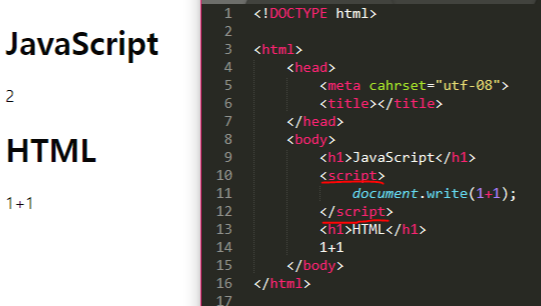
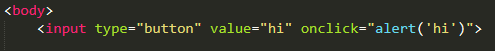
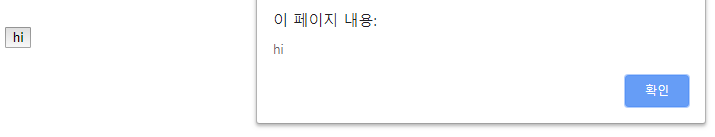

> This post is a summary of Egoing's [lecture](https://opentutorials.org/course/3083) from 'OpenTutorials - Life Coding'.

An important aspect of JavaScript in web programming is that it enables interaction with the user. A web browser has no ability to change itself once it renders on screen. However, using JavaScript can compensate for this limitation to a considerable extent. JavaScript controls HTML code and makes it possible to design web pages in a much more dynamic way.

Today, before diving into learning JavaScript in earnest, let's look at three essential topics you need to know.

### The Script Tag

Fundamentally, JavaScript is a language that runs on top of HTML. However, these two are written in completely different syntax. So how can we appropriately combine these two things that look very different from each other? The answer is to use the `Script` tag.

To do this, you need to tell the HTML code that JavaScript is starting. The computer recognizes the code written from the point where the `<script>` tag is used until the tag closes as JavaScript.

In the example above, the `document.write(1+1)` part is recognized as JavaScript code.

### Events

Another core concept that allows JavaScript to interact with users is the 'event'. For example, let's create a button labeled "hi." Then let's make an alert pop up when the button is clicked.

Looking at the code, there is an attribute called `onclick`. The `onclick` attribute must contain JavaScript. The web browser remembers the value of this attribute and executes the JavaScript code according to that value when the user triggers a click event.

Events like these — things that happen in the web browser — are called events. As shown in the example above, `onclick` is one such event. If we consider all possible events, there would be infinitely many, but programmers have organized a set of commonly used, noteworthy events. There are roughly 10 to 20 events, and if we use them well, we can create web pages that interact with users. When you want to find out what events are available, I recommend searching on Google.

### Console

So far, we have been creating files to run JavaScript. However, when you want to quickly test something simple, you can easily run code using the console. In Chrome, you can open the console by right-clicking on an empty space of a web page and selecting 'Inspect', or by using the shortcut 'Ctrl + Shift + J'.

The JavaScript code you run in the console operates on the currently open web page, which makes it surprisingly useful in many situations. For example, go to any Facebook post and open 'Chrome Developer Tools - Elements'. Then, if you enter code in the console that randomly extracts a few data entries from the numerous comments, you can easily pick random winners from thousands of comments.
