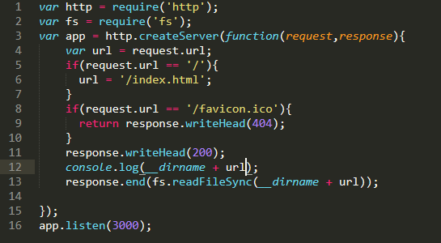
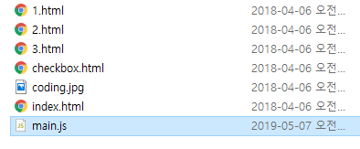
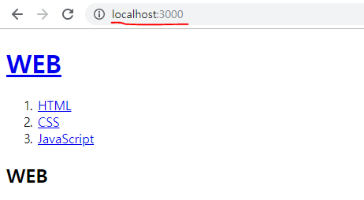

> This post is a summary of Egoing's [lecture](https://opentutorials.org/course/3332/21032) from 'OpenTutorials - Life Coding'.

The web can broadly be divided into web browsers and web servers. When you enter an address in a web browser to make a request to a server, the web server finds and responds with the appropriate content. While you could run a web server through Apache, Node.js has a built-in web server, so it can also serve as a web server.

### Node.js as a Web Server

Let's create a file that can start a server. For now, you don't need to understand the code content.

On Windows, open cmd; on Mac, open the terminal. Navigate to the folder containing main.js, then run it with the `node main.js` command. This will start the server. After completing all these steps, type `localhost:3000` in the Chrome address bar to check if the server is running properly.

This confirms that Node.js can function as a web server.

### Template Literals

When representing strings in programming, we typically use single quotes (' ') and double quotes (" "). Because of this, in most programming languages, inserting variable values within strings requires breaking the string using plus or minus operators, or commas.

However, JavaScript has a convenient feature called 'template literals' that allows you to insert variable values within strings without breaking them. This feature even lets you create line breaks simply by pressing Enter instead of using '\n'.

To use this feature, you need to type the **grave accent (`)**, which shares a key with the tilde (~) on your keyboard. Simply use the grave accent instead of the single or double quotes you would normally use. Personally, I found it amazing that you can just press Enter instead of using '\n'. I encourage everyone to take advantage of template literals for more convenient coding.
