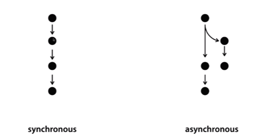

> This post is a summary of Egoing's [lecture](https://opentutorials.org/course/3332/21032) from 'OpenTutorials - Life Coding'.

### Synchronous and Asynchronous

To better understand Node.js, you need to understand the concepts of 'synchronous and asynchronous.' Synchronous means operations happen in sequence, while asynchronous means they don't. Their dictionary definitions are as follows:

- **Synchronous**: A method of transmitting and receiving data by synchronizing to a constant clock pulse for serial transmission in data communication.
- **Asynchronous**: The counterpart to synchronous communication, where two communicating devices do not maintain a constant speed but instead communicate through pre-agreed signals.

When there are multiple tasks, completing one before starting the next, and then completing that one before starting the following one, is called 'synchronous.' In contrast, when there are multiple tasks and you delegate a time-consuming one to someone else, have them notify you when it's done, and immediately start the next task yourself, that is called 'asynchronous.'

What differences do synchronous and asynchronous have at the code level? Let's take a look at File System (fs), a module for handling files in Node.js. If you visit the link https://nodejs.org/dist/latest-v10.x/docs/api/fs.html, you'll find many contents related to the File System. If you look closely, you'll notice pairs with identical names that differ only by the presence or absence of Sync — like `fs.readFile` and `fs.readFileSync`.

Looking more closely, path and options are identical, but readFile has an additional thing called callback. To briefly explain, a **callback** is a **function that is called by an event**. It can also refer to a function being used as an argument to another function. We'll have a chance to explore this later, so let's skip it for now and look at examples of how code executes differently depending on whether it's synchronous or asynchronous. Let's assume we created a file called 'FILE1' containing the letter 'A'. And let's say we run the code below. (I'm not sure if the code is perfectly written, but it's just enough to help with understanding.)

- `var result= fs.readFileSync(file path); console.log(result); console.log('B');` : Outputs A -> B in order

- `fs.readFile(file path,function(err,result){ console.log(result); }); console.log('B');` : Outputs B -> A in order

The first line executes synchronously, so the results are output in order. However, the second line executes asynchronously, so while fs.readFile is processing, the next `console.log('B')` also runs, which means B — which finishes processing first — is output before A. Since Node.js fundamentally favors asynchronous operations, if you want to execute code synchronously, you need to find the appropriate method and append something like Sync as shown in the example above.

### Package Manager and PM2

Node.js has a package manager called **NPM**. Let's use NPM to install a useful program called **PM2** for running servers. If you visit http://pm2.keymetrics.io/, you'll see the text `npm install pm2 -g`, which means to install PM2 using NPM. On Linux or Mac, use the terminal; on Windows, use the command prompt and enter `npm install pm2 -g` to install it. If you encounter a permission-related error, you can prepend sudo to the command to install with administrator privileges.

So what are the benefits of installing PM2? PM2 monitors your application. If your file shuts down due to some issue during execution, PM2 immediately restarts it. Also, when you modify code in your file, PM2 immediately restarts it so the changes are applied to the web page right away. Without PM2, you would have to manually restart the application for code changes to take effect.

If there are errors in the modified code, you can check them using the `pm2 log` command. In this way, PM2 is a program that helps your application survive more robustly.
