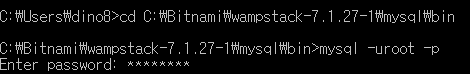
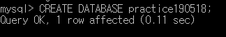
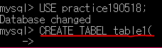
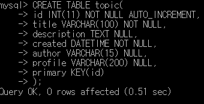

> This post is a summary of Egoing's [lecture](https://www.opentutorials.org/course/3162) from 'OpenTutorials - Life Coding'.

### The Purpose of Databases

Let's compare databases and spreadsheets. Both spreadsheets and databases can display information in tabular form. They also offer convenient features like sorting by ID value in descending order or sorting by date. However, while spreadsheets allow users to control data by clicking buttons, databases control data using a computer language called SQL. In other words, you can manage data through code.

### Installing MySQL

I'm using the Windows operating system, so I'll install MySQL through Bitnami WAMP.

Go to this [link](https://bitnami.com/stack/wamp) and install Bitnami WAMP, then make sure to note which directory it was saved in. In my case, a directory called wampstack-7.1.27-1 was created inside the bitnami directory on my C drive.

Now go into the wampstack-7.1.27-1 folder, then the mysql folder, then the bin folder, and you need to run the mysql.exe file inside. However, instead of simply double-clicking to run this file, you should run it through Windows cmd to control it via code. As shown in the screenshot below, first navigate to the appropriate directory using cd, then run mysql and enter the password you set when installing WAMP. Below are the commands I entered in cmd.

### MySQL Structure

Information is stored in the form of tables, simply put. However, as information accumulates and the number of tables grows significantly, it becomes difficult to find the information we want. To solve this, we need a process of grouping related tables together. The folder-like container that holds these grouped tables is called a database.

What we're currently learning about overall is called a database, and the grouping of tables is also called a database, which can be a bit confusing. That's why in MySQL, grouping related tables together is also called a **schema**. Finally, the space where this data is stored is called a **database server**.

<b>Database > Schema > Data</b> is how you can think of it!

### Connecting to a MySQL Server

Among the advantages of databases are **security and access control features**. To use these features, you first need to connect to the database server, and you can connect as various users. The username commonly used to mean administrator is root, and the administrator has access to all features. However, since having access to all features also means higher risk, it's safer to create new users for regular management rather than using the administrator account except for important tasks.

### Using Schemas

Let's use a search engine like Google and [search](https://dev.mysql.com/doc/refman/8.0/en/creating-database.html) for 'MySQL create database'. You'll find that you can create a database using the command `CREATE DATABASE database_name;`. Don't forget to add a semicolon (;) at the end of the command.

So how can we verify that the database was created successfully? Let's find out through a search engine as well. While it's important to already know commands, what's even more important is the ability to find and use the commands you need through search engines. I used the `SHOW DATABASES;` command.

And finally, you need to tell MySQL that you want to use the database you created. For this, use the `USE database_name;` command. MySQL will then execute commands targeting the tables in this schema. (As mentioned in the previous post, the terms database and schema can be considered the same in MySQL.)

### What is SQL?

Let's find out what SQL means. SQL stands for **Structured Query Language**. Relational databases fundamentally organize information in tabular form, and this tabular organization is described as being '**Structured**.' Also, when we request or ask something of a database, that is called a **Query**, and it is transmitted in a **Language** that both the database and the programmer can understand — that is the overall meaning.

### Creating a Table

Let's create a table with rows and columns using SQL. You need to enter the command in the format `CREATE TABLE table_name( contents )`. First, type only `CREATE TABLE table_name(` and press Enter. This allows you to enter code with readable line breaks as shown below.

So what content should go inside the parentheses? Inside the parentheses, you need to specify the **column name, data type, display length**, and other details. You can also add commands like NOT NULL (to reject empty values) and `AUTO_INCREMENT` (to automatically increment by 1). Let's look at an example.

Because the values in the id column must be unique, I entered the **PRIMARY KEY(id)** command. Additionally, as shown in the example above, data types like `DATETIME` also exist, which can represent dates and times. I've attached a well-explained [link](http://www.incodom.kr/DB_-_%EB%8D%B0%EC%9D%B4%ED%84%B0_%ED%83%80%EC%9E%85/MYSQL) related to data types.
