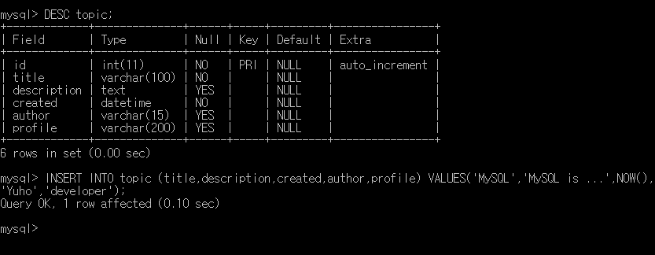
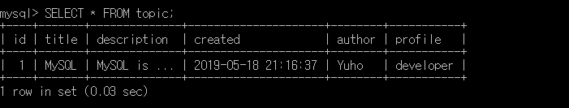
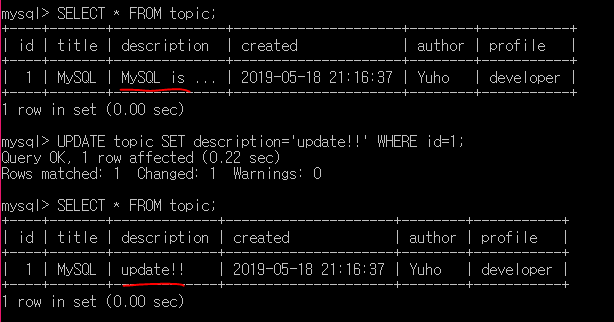
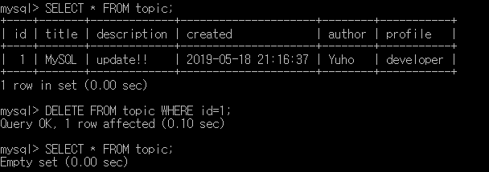
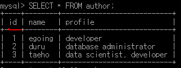
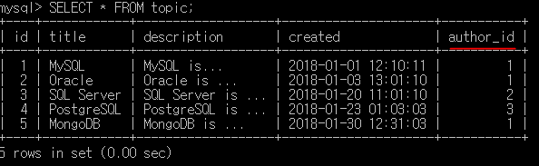
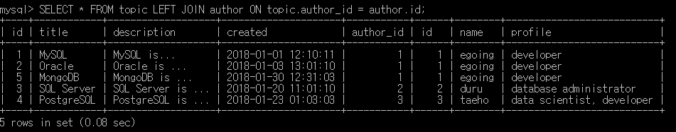
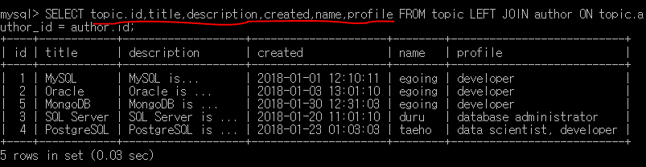

> This post is a summary of Egoing's [lecture](https://www.opentutorials.org/course/3162) from 'OpenTutorials - Life Coding'.

### INSERT Statement

Let's start by listing the basic commands.

- `SHOW DATABASES`: Shows the currently existing databases
- `USE database_name`: Selects the database to use
- `SHOW TABLES`: Shows the tables within the database
- `DESC table_name`: Shows information about the table
- `INSERT INTO table_name ( columns ) VALUES( values )`: Creates table data with the specified VALUES

### SELECT Statement

> MySQL official manual: https://dev.mysql.com/doc/refman/8.0/en/select.html

The SELECT statement is used when reading data.

- `SELECT desired_columns FROM table_name`: Outputs desired data from the table
- `SELECT * FROM table_name`: Outputs all data from the table

From here on, I'll omit `SELECT desired_columns FROM table_name`.

- `~ WHERE column_name='desired_data'`: Outputs data containing 'desired_data'
- `~ ORDER BY column_name DESC`: Outputs data in descending order by 'column_name'
- `~ ORDER BY column_name DESC LIMIT number`: Outputs data in descending order by 'column_name', up to 'number' entries.

### UPDATE Statement

> MySQL official manual: https://dev.mysql.com/doc/refman/8.0/en/update.html

Let's learn about the UPDATE statement for modifying data.

- `UPDATE table_name SET column_name='new_content' WHERE id=number;`

This command modifies the content of a selected column within a table, but only for the data with the id value you specify. Be careful — if you don't include 'WHERE id=number', all data will be modified, which could be a catastrophe!

### DELETE Statement

> MySQL official manual: https://dev.mysql.com/doc/refman/8.0/en/delete.html

Let's learn about the DELETE statement for removing data.

- `DELETE FROM table_name WHERE id=number;`

This command deletes the data with the specified id value from the table. Again, be careful — if you don't include 'WHERE id=number', all data will be deleted, which could also be a catastrophe.

### Splitting Tables

Let's learn how to split tables to manage duplicate parts more efficiently. For example, if you want to split the table based on the author column, first create a separate table for authors.

Then create the main table, and replace the author column with an author_id column.

### Joining Tables (JOIN)

Let's learn how to combine the two tables we split above so we can view them together. Here we need to use the JOIN command, which is considered the core of relational databases.

Using the command `SELECT * FROM 'table1' LEFT JOIN 'table2' ON 'criterion1' = 'criterion2';`, you can merge 'table1' and 'table2' by matching entries where 'criterion1' equals 'criterion2'.

Also, if you specify only the columns you want after SELECT instead of '*', you can output a cleaner merged table.
