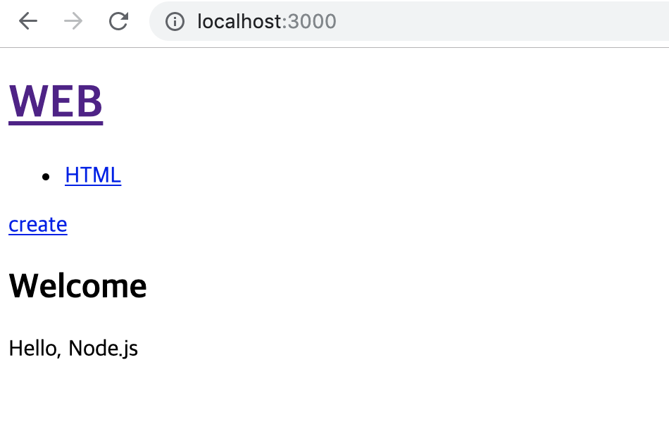
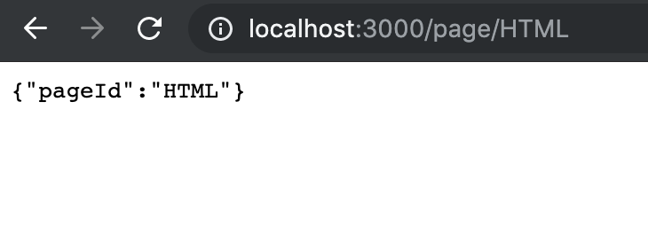

> This post is a summary of Egoing's [lecture](https://opentutorials.org/course/3370/21378) from 'OpenTutorials - Life Coding'.

There are various frameworks based on Node.js, but Express is the most commonly used one among them. Let's build a web page using Express. To do this, you'll need to have basic programs like npm, Node.js, and PM2 installed first.

Here is the [link](https://github.com/web-n/Nodejs) to Egoing's lecture materials. Download the materials from this link and run them in the terminal with `pm2 start main.js --watch`. Also, run `npm install` to install the modules used in the source code. Since the source code specifies port 3000, you can verify the web page loads correctly by entering localhost:3000 in the address bar.



Let's modify the web page to use Express. To do this, we need to edit the main.js file. Following the Express manual, I wrote the following code:

```javascript
var express = require('express')
var app = express()

//route, routing
//app.get('/', (req, res) => res.send('Hello World!'))

app.get('/', function(req, res) {
  return res.send('/');
});

app.get('/page', function(req, res) {
  return res.send('/page');
});

app.listen(3000, function() {
  console.log('Example app listening on port 3000!')
});
```

In the code above, `app.get` serves as routing. Routing can be thought of as calling the appropriate information based on the client's pathname. Try entering localhost:3000/ or localhost:3000/page in the address bar to verify it works. Through `app.listen`, when this function executes, the web server starts and connects to port 3000. These two elements are the most fundamental building blocks for creating a web page, so make sure to remember them.

Now let's handle basic request and response information through Express.

```javascript
app.get('/', function(request, response) {
  fs.readdir('./data', function(error, filelist){
    var title = 'Welcome';
    var description = 'Hello, Node.js';
    var list = template.list(filelist);
    var html = template.HTML(title, list,
      `<h2>${title}</h2>${description}`,
      `<a href="/create">create</a>`
    );
    response.send(html);
  });
});
```

For example, in the code above, when the path is '/', the callback function receives request and response as arguments and executes the `response.send` function, which outputs an html file, at the end.

### Implementing the Detail Page

The current trend in web development for writing URLs is somewhat different from passing information through query strings. This is for making URLs more elegant and for various reasons such as search engine optimization. The trend has shifted from the query string format like `/?id=HTML` to a format like `/page/HTML`, so let's learn how to implement this.

```javascript
app.get('/page/:pageId', function(request, response) {
  response.send(request.params);
});
```

The part we should focus on here is '/page/:pageId'. When you write code this way, the pageId value is transmitted to the request argument in a page parameter format. Since verbal explanation might not be very clear, let's run the code directly. By the way, information about this can be found in the [guide](https://expressjs.com/ko/) on the Express website.



When I entered ~~/page/HTML in the address bar, I confirmed that the value HTML was transmitted as pageId in the `request.params` object. Even with other addresses like /page/example or /page/wooooww, you can see that whatever you type gets transmitted to pageId. You can refer to Egoing's source code [here](https://opentutorials.org/course/3370/21389).
