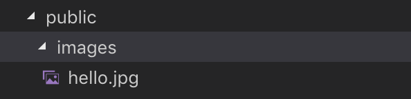

> This post is a summary of Egoing's [lecture](https://opentutorials.org/course/3370/21378) from 'OpenTutorials - Life Coding'.

If you were to pick two important features of Express, one would be routing and the other would be middleware. Middleware is one way to use components made by others for implementing your web page. You can find various middleware on the [Express website](https://expressjs.com/ko/resources/middleware.html). The definition of middleware from [Wikipedia](https://ko.wikipedia.org/wiki/미들웨어) is as follows:

> Middleware is software that acts as an intermediary to connect both sides and enable data exchange. It refers to software that connects many processes across multiple computers linked through a network, allowing them to use certain services. Middleware exists in a 3-tier client/server architecture. Middleware exists between the web browser and the database, enabling data to be stored in or retrieved from the database.

### The Shape of Middleware

Let's visit the Express website and look at the basic forms of middleware. Examining the 'application-level middleware' that we'll frequently use, it looks like the following:

```javascript
var app = express();

app.use(function (req, res, next) {
  console.log('Time:', Date.now());
  next();
});
```

The callback function takes request as its first argument, response as its second, and next — which determines whether to execute the next middleware — as its third argument. In this case, since no specific path is mentioned, it runs for every request.

```javascript
app.use('/user/:id', function (req, res, next) {
  console.log('Request Type:', req.method);
  next();
});
```

If you want to execute only for requests to a specific path, write the path before the callback function. In the code above, only requests to the /user/:id path will execute the function.

```javascript
app.get('/user/:id', function (req, res, next) {
  res.send('USER');
});
```

The code above executes GET requests for the /user/:id path. If you want to execute for all paths rather than a specific one, enter '*****' as the path! For more detailed explanations, you can find them in Korean on the [official Express website](https://expressjs.com/ko/guide/using-middleware.html#middleware.application).

### Using Middleware 1

Let's modify the 'post (file) creation' code using the **body-parser** middleware in Express.

First, you need to install the body-parser middleware using npm. Run `npm install body-parser --save` in the terminal. Then declare `var bodyParser = require('body-parser');` at an appropriate place in your code to load the module. Also, declare `app.use(bodyParser.urlencoded({ extended: false }));` at an appropriate place in your code — this is used when a user makes a request with form-type data. See the example below for reference.

```javascript
var express = require('express')
var app = express()
var fs = require('fs');
var path = require('path');
var qs = require('querystring');
var bodyParser = require('body-parser');
var sanitizeHtml = require('sanitize-html');
var template = require('./lib/template.js');

app.use(bodyParser.urlencoded({ extended: false }));
```

In the code above, you should pay close attention to `app.use(bodyParser.urlencoded({ extended: false }))`. Every time main.js is executed — that is, every time a user makes a request — the middleware is executed by the body-parser module. This internally parses the post data sent by the user, creates a body property on the request, and adds the information there. (If the request is named request, you can access it via 'request.body'.)

Ultimately, for the post data used in the /create\_process and /update\_process sections of our main.js source code, using middleware allows us to write the body-related code more concisely.

### Using Middleware 2

This time, let's build our sense of middleware by using the **compression** middleware. This is middleware that helps the web server compress data when responding to the web browser. When excessively large data keeps going back and forth within a website, it costs more money and takes more time — compression helps solve this problem.

First, you need to install the compression middleware using npm. Run `npm install compression --save` in the terminal. Then declare `var compression = require('compression');` at an appropriate place in your code to load the module. Finally, declare `app.use(compression());` at an appropriate place in your code. See the example below for reference.

```javascript
var express = require('express')
var app = express()
var fs = require('fs');
var path = require('path');
var qs = require('querystring');
var bodyParser = require('body-parser');
var sanitizeHtml = require('sanitize-html');
var compression = require('compression')
var template = require('./lib/template.js');

app.use(bodyParser.urlencoded({ extended: false }));
app.use(compression());
```

When you call the `compression()` function through `app.use()`, the middleware is executed. When you mount middleware like compression or body-parser in `app.use()`, these middleware functions run every time a user sends a request, executing according to the code you've applied.

### Serving Static Files

Let's learn about more middleware.

Files like images, JavaScript, and CSS that are downloaded to the web browser are called static files. Let's find out how to use these static files in the Express version for our website.

To do this, we need to allow and configure the serving of static files, which is also well explained on the Express website. You can use the static middleware that comes built into Express. Let's write the following code:

```javascript
app.use(express.static('public'));
```

Then, as shown below, create a public folder in the same directory as main.js, an images folder inside the public folder, and place an image file inside. I placed an image file called hello.jpg.



The code `app.use(express.static('public'));` means that static files in the public folder will be served, so you can freely use the static files in the public folder within the main.js source code. Here is a simple example:

```javascript
app.get('/', function(request, response) {
  var title = 'Welcome';
  var description = 'Hello, Node.js';
  var list = template.list(request.list);
  var html = template.HTML(title, list,
    `
    <h2>${title}</h2>${description}
    
    `,
    `<a href="/create">create</a>`
  );
  response.send(html);
});
```

The code above uploads the hello.jpg file to our web page.

### Error Handling

Looking at the Express website, there's a good explanation about Not Found: 404, which is what we display when we can't find information for a request. Let me write the code below.

```javascript
app.use(function(req, res, next) {
  res.status(404).send('Sorry cant find that!');
});
```

This is also middleware, but unlike other middleware, it must be declared **at the end of the source code**. Since middleware is executed sequentially, all preceding middleware should be checked first, and only when no appropriate middleware has been executed should the 404 middleware run.

Then what about handling error information that occurs in the middle of the code, rather than failing to find appropriate middleware for a request?

```javascript
app.get('/page/:pageId', function(request, response, next) {
  var filteredId = path.parse(request.params.pageId).base;
  fs.readFile(`data/${filteredId}`, 'utf8', function(err, description){
    if(err){
      next(err);
    } else {
      var title = request.params.pageId;
      var sanitizedTitle = sanitizeHtml(title);
      var sanitizedDescription = sanitizeHtml(description, {
        allowedTags:['h1']
      });
      var list = template.list(request.list);
      var html = template.HTML(sanitizedTitle, list,
        `<h2>${sanitizedTitle}</h2>${sanitizedDescription}`,
        ` <a href="/create">create</a>
          <a href="/update/${sanitizedTitle}">update</a>
          <form action="/delete_process" method="post">
            <input type="hidden" name="id" value="${sanitizedTitle}">
            <input type="submit" value="delete">
          </form>`
      );
      response.send(html);
    }
  });
});
app.use(function (err, req, res, next) {
  console.error(err.stack)
  res.status(500).send('Something broke!')
});
```

Notice how the first block of code is split into if and else statements. The if block is the code that runs when an error occurs, and the else block runs when there is no error. In the if block where an error occurred, err is passed to the next function. In Express, it is conventionally agreed that `next()` is used when there is no error while moving to the next middleware, and `next(err)` is used when there is an error.

When `next(err)` is executed, the second block of code runs to handle the error. An important point to note is that the second block of code must be declared **after the 404 error handling middleware code**.
