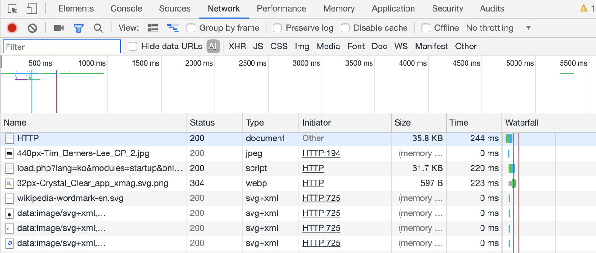
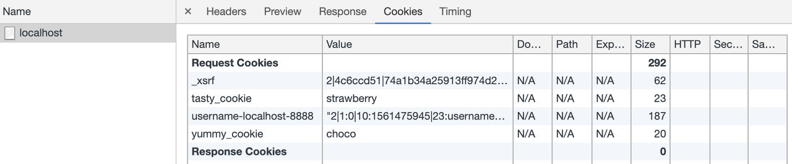

> This post is a summary of [lectures](https://opentutorials.org/course/3385) by Egoing from 'OpenTutorials - Life Coding'.

To properly understand cookies, you first need to know about HTTP. HTTP stands for Hyper Text Transfer Protocol, a communication protocol governing the request/response relationship between servers and clients. HTTP is broadly divided into request and response messages. Since HTTP is an abstract concept that isn't easily visible, let's use Chrome Developer Tools to make it easier to understand.

Let's open Chrome Developer Tools and navigate to the Networks tab. When you click the refresh button, you'll see a screen like the one below. (It varies depending on the web page.) The information displayed here represents the data being exchanged between the client and server. Being able to examine this exchanged information is an extremely important technique for any web-related work.



If you click on one of these entries and go to the header tab, you can also see the detailed information about that particular item.

### Creating Cookies

Cookies are a technology that belongs to the HTTP protocol. According to the cookie documentation from the Mozilla Foundation, cookies serve three purposes: **session management** (authentication), **personalization**, and **tracking**. So how do we create cookies? Let's take a look with an [example](https://developer.mozilla.org/ko/docs/Web/HTTP/Cookies).

```
HTTP/1.0 200 OK
Content-type: text/html
Set-Cookie: yummy_cookie=choco
Set-Cookie: tasty_cookie=strawberry

[page content]
```

The basic format is `Set-Cookie: <cookie-name>=<cookie-value>`. In the example above, the third line means the cookie named 'yummy_cookie' has a value of 'choco', the fourth line means the cookie named 'tasty_cookie' has a value of 'strawberry', and the code above is a response message that creates these two cookies.

Next, let's create cookies using Node.js.

```javascript
var http = require('http');
http.createServer(function(request, response){
     response.writeHead(200, {
         'Set-Cookie':['yummy_cookie=choco', 'tasty_cookie=strawberry']
     });
    response.end('Cookie!!');
}).listen(3000);
```

Using the `response.writeHead` code allows us to **manipulate the response message**. If we can manipulate the response message, we can add a Set-Cookie: header to it, which ultimately lets us create a response message that generates cookies.

The first argument of `response.writeHead` is the status code, and the second argument is an object as per convention. When you need to send multiple cookies, they should be passed as an array. Now, after running the code above, let's modify it as follows:

```javascript
var http = require('http');
http.createServer(function(request, response){
    // response.writeHead(200, {
    //     'Set-Cookie':['yummy_cookie=choco', 'tasty_cookie=strawberry']
    // });
    response.end('Cookie!!');
}).listen(3000);
```

This time, we didn't manipulate the response message and didn't pass any cookie values. However, if you open Chrome Developer Tools and check the file's header information, you'll see that cookie values are already embedded in the request header! You can also confirm that the response header no longer sends any cookies.



### Reading Cookies

Let's find out how we can read cookies within a web application when the web browser sends a request back to the web server. I'll explain through example code.

```javascript
var http = require('http');
var cookie = require('cookie');
http.createServer(function(request, response){
    var cookies = {};
    if(request.headers.cookie !== undefined){
        cookies = cookie.parse(request.headers.cookie);
    }
    response.writeHead(200, {
        'Set-Cookie':['yummy_cookie=choco', 'tasty_cookie=strawberry']
    });
    response.end('Cookie!!');
}).listen(3000);
```

The important part here is the if statement. `request.headers.cookie` contains the cookie information from the request header. If there is any information present, the statement `cookies = cookie.parse(request.headers.cookie)` executes, where `cookie.parse` converts `request.headers.cookie` into an object and stores it in the cookies variable.

Once the cookie information is stored in an object, you can use the object's keys to access cookie values within your web application. For example, typing `cookies.yummy_cookie` in your source code means you want to use the value 'choco'.

### HTTP Request Message

When a web browser connects to a web server, let's look up "http request header format" on Google to understand what the information in the Request Header (found in the Chrome Developer Tools Network tab) means.

- https://images.app.goo.gl/WsxVYpjhtQK1xqxK6

I found an image on Google that clearly explains the HTTP request message. First, the request line is at the very top. Below that is the request header, and together they form the request message header. Below a blank line is the request message body.

The GET in the request line is the method indicating how the web browser and web server communicate. The next part, /doc/test.html, represents the information we're requesting from the web server. Finally, HTTP/1.1 indicates that the current HTTP version being used is 1.1.

Below is an explanation of the request header fields:

- **Host** indicates the address of the web server we're making a request to.
- **User-Agent** is another term for the web browser. It provides information about which web browser is sending the request to the server. **Accept-Encoding** indicates which compression encoding methods can be handled when transferring compressed information.
- **If-Modified-Since** indicates when the file I received was last downloaded. The web server can check this information and skip sending data if no update is needed, which can be used to improve performance.

### HTTP Response Message

Now let's find out what the information in the Response Header means.

- https://images.app.goo.gl/uxDNwxkCYP2Rr2J67

The very first line displays status information, representing the version, status code, and phrase in order. For example, it looks like 'HTTP/1.1 200 OK'.

Below is an explanation of the response header fields:

- **Content-Type** determines what format the web browser should use to interpret the file received from the server.
- **Content-Length** indicates how many bytes the received information contains.
- **Content-Encoding** determines which method to use to decompress and read the information.
- **Last-Modified** indicates when the information was last modified.
