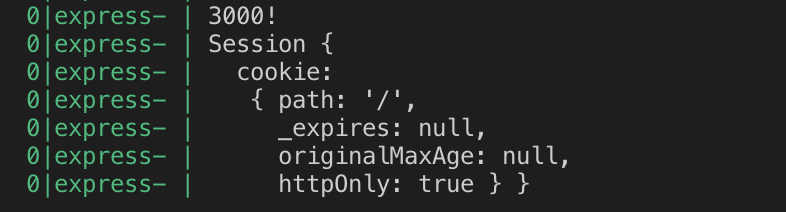
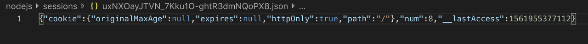

> This post is a summary of [lectures](https://opentutorials.org/course/3400/21836) by Egoing from 'OpenTutorials - Life Coding'.

With the advent of cookies, the web -- which previously could only handle requests and responses -- gained the ability to remember previous communications. This laid the groundwork for personalization and authentication. However, using cookies for authentication is extremely dangerous. The moment authentication information is stored in cookies, anonymous attackers or even the developers running the web service can easily access users' authentication data. This created the need for a different approach when implementing authentication, and that's how sessions came to be.

```javascript
var express = require('express')
var session = require('express-session')

var app = express()

app.use(session({
  secret: 'asadlfkj!@#!@#dfgasdg',
  resave: false,
  saveUninitialized: true
}))

app.get('/', function (req, res, next) {
  res.send('Hello session');
})

app.listen(3000, function(){
    console.log('3000!');
});
```

After installing all necessary modules with `npm install express` and `npm install -s express-session`, let's run the code above using pm2 or nodemon.

Looking at the code, the `app.use(session( ... ))` on line 4 ensures that every time our web application runs, the `session()` function inside `app.use()` is executed. You can see that an object is passed as the argument to this `session()` function. Let's take a look at the options for this session function.

- **secret:** A required option that must not be exposed to others. When managing source code through version control systems like Git, you should not upload this value directly -- instead, use a variable or extract it into a separate file that others cannot see.
- **resave:** (false): Session data is not saved to the session store until the data changes.
- **resave:** (true): Session data is continuously saved to the session store regardless of whether the data changes.
- **saveUninitialized:** (true): The session is not started until it is needed.

It's generally best to set resave to false and saveUninitialized to true.

### Session Object

Next, let's install the session middleware in the source code and write `console.log(req.session)`.

```javascript
var express = require('express')
var session = require('express-session')
var app = express()

app.use(session({
    secret: 'asadlfkj!@#!@#dfgasdg',
    resave: false,
    saveUninitialized: true
}))

app.get('/', function (req, res, next) {
    console.log(req.session);
    if(req.session.num === undefined){
        req.session.num = 1;
    } else {
        req.session.num =  req.session.num + 1;
    }
    res.send(`Views : ${req.session.num}`);
})

app.listen(3000, function () {
    console.log('3000!');
});
```



If you don't use the session middleware in your code, printing `req.session` will output undefined. This means that when we use the session middleware, a **session object is silently added** to the request's properties.

By default, session information entered this way is stored in memory. However, since memory is volatile, all stored information is lost when the web server reboots, potentially causing all users to be logged out. The solution to this problem is the **session store**.

### Session Store

Previously, the session store used volatile memory, but let's change the session store so that session data persists even when the web server reboots. Among the various compatible session store modules, I implemented a file-based session store.

```javascript
var express = require('express')
var session = require('express-session')
var FileStore = require('session-file-store')(session)
var app = express()

app.use(session({
    secret: 'asadlfkj!@#!@#dfgasdg',
    resave: false,
    saveUninitialized: true,
    store:new FileStore()
}))

app.get('/', function (req, res, next) {
    console.log(req.session);
    if(req.session.num === undefined){
        req.session.num = 1;
    } else {
        req.session.num =  req.session.num + 1;
    }
    res.send(`Views : ${req.session.num}`);
})

app.listen(3000, function () {
    console.log('3000!');
});
```

1. First, when a user who already has a session ID connects to the server, the express-session middleware sends the session ID as a cookie value in the `request header`.
2. The express-session middleware also uses the ID to read the corresponding file from the 'session store' and adds a session object to the request properties based on that file's data.
3. So when we modify a value like `req.session.num`, the data is saved to the 'session store'.
4. As a result, even if the web server reboots, the session information remains in the 'session store' and is not deleted.

- If you change the session store from FileStore to MySQL as shown above, you can use MySQL as your session store.



Data is stored in the session store as files, as shown above.
