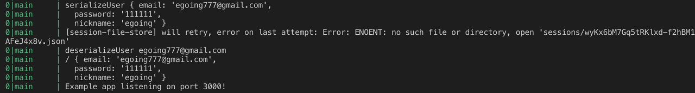

> This post is a summary of [lectures](https://opentutorials.org/course/3402/21869) by Egoing from 'OpenTutorials - Life Coding'.

Instead of implementing authentication features like login from scratch, we can borrow authentication methods built by other development companies. This is where passport.js comes in. While there are many other middleware options available, passport.js is the most widely used, so let's study it in detail.

### Installing passport.js

passport.js categorizes the ways we can extend our login methods using the term "strategies." There are around 300 different strategies available, but for now, we'll focus on implementing the traditional method of authentication -- logging in and registering using a username and password -- through passport.

- Installing passport: Enter `npm install passport` in the terminal
- Implementing traditional login: Enter `npm install passport-local` in the terminal
- Basic format: http://www.passportjs.org/packages/passport-local/


Once you've completed all three steps above, the basic installation for using passport is done. Note that the passport middleware uses sessions internally, so it must be placed **below the code that activates express-session**.

### Implementing Authentication with passport.js

Let's assume that when you fill in the login UI and press the submit button, the login information is sent to a path called /login_process. Then we need to modify the code that handles the information received via the POST method for this path to the passport.js version.

```javascript
var passport = require('passport'),
  LocalStrategy = require('passport-local').Strategy;

app.post('/auth/login_process',
  passport.authenticate('local', {
    successRedirect: '/',
    failureRedirect: '/auth/login'
  }));
```

I've extracted only the passport.js-related parts of the code. First, I loaded the passport module in the appropriate code format following the passport website, and below that is the code that sends login information via the POST method. The information is sent via POST to the /auth/login_process path. If login succeeds, it redirects to the home page at /, and if login fails, it redirects to /auth/login.

### Passport.js Credential Verification

I've extracted only the important parts of the code. Rather than trying to understand everything perfectly, I'll explain just enough to get the general idea.

```javascript
router.get('/login', function (request, response) {
  var title = 'WEB - login';
  var list = template.list(request.list);
  var html = template.HTML(title, list, `
    <form action="/auth/login_process" method="post">
      <p><input type="text" name="email" placeholder="email"></p>
      <p><input type="password" name="pwd" placeholder="password"></p>
      <p>
        <input type="submit" value="login">
      </p>
    </form>
  `, '');
  response.send(html);
});
```

In the code above, I'm sending the HTML form with the ID field named 'email' and the password field named 'pwd'. The credential verification code for login, written with reference to [this page](http://www.passportjs.org/packages/passport-local/), is as follows:

```javascript
var passport = require('passport'),
  LocalStrategy = require('passport-local').Strategy;

passport.use(new LocalStrategy(
  {
    usernameField: 'email',
    passwordField: 'pwd'
  },
  function (username, password, done) {
    console.log('LocalStrategy', username, password);
  }
));
```

The first argument of the `passport.use(new LocalStrategy(...))` function receives the ID and password field names as an **object**, and the subsequent arguments are callback functions. Since I submitted the form with field names 'email' and 'pwd', I declared the object accordingly. Now let's add some more code.

```javascript
passport.use(new LocalStrategy(
  {
    usernameField: 'email',
    passwordField: 'pwd'
  },
  function (username, password, done) {
    console.log('LocalStrategy', username, password);
    if(username === authData.email){
      console.log(1);
      if(password === authData.password){
        console.log(2);
        return done(null, authData);
      } else {
        console.log(3);
        return done(null, false, {
          message: 'Incorrect password.'
        });
      }
    } else {
      console.log(4);
      return done(null, false, {
        message: 'Incorrect username.'
      });
    }
  }
));
```

This code also references the local strategy documentation on the passport.js website. (I followed Egoing's code.) Essentially, you only need to remember two things:

1. When login credentials match: return **done(null, userInfo)**
2. When login credentials don't match: return **done(null, false, error message)**

Based on this, the code above can be interpreted as follows:

- console.log(1): The user's ID matches
- console.log(2): Both the user's ID and password match
- console.log(3): The user's ID matches, but the password doesn't
- console.log(4): The user's ID doesn't match

### Using Sessions with Passport.js

When using auto-restart tools like pm2 or nodemon, you may experience issues where session information isn't saved. This is because Node restarts when files are added to the session directory. To fix this, you need to prevent restarts for the sessions directory.

To resolve this issue, run the main.js file with the command: `pm2 start main.js --watch --ignore-watch="data/* sessions/*" --no-daemon`. This tells pm2 to ignore watching the data and sessions directories.

passport.js internally uses express-session. To connect these two middleware components, you need to include the following code:

```javascript
app.use(passport.initialize());
app.use(passport.session());
```

If you only add the code above, you'll get an error message roughly saying: 'You need to save user information to a session, but the session settings are not configured. Serialize.' To fix this, add the following code as well:

```javascript
passport.serializeUser(function (user, done) {
  console.log('serializeUser', user);
  done(null, user.email);
});

passport.deserializeUser(function (id, done) {
  console.log('deserializeUser', id);
  done(null, authData);
});
```

1. In passport.js, the authData value from `done(null, authData)` that we return upon successful login is passed as the first argument (user) to the callback function of `passport.serializeUser`, as per convention.
2. The `done(null, user.email)` in the `passport.serializeUser` callback sends the user.email information to the passport data within the session. In other words, serializeUser's function is to save the login success information to the session store when login succeeds. That's why it's called only once upon successful login.
3. The `passport.deserializeUser` function executes its callback every time a page is visited. In other words, deserializeUser's function is to check whether the person is a valid user on every page visit. That's why this function is called multiple times while using the web application.




### Summary

Since this is very long and complex, let me summarize everything in order once more.

1. Install the passport module, install passport in Express, and declare that express-session will be used internally by passport.
2. Use the passport.authenticate function to declare that passport should receive user input using the local strategy.
3. Install LocalStrategy in the passport.use function, and use the passport.use callback to verify whether the user's ID and password are correct, which results in the done function being returned.
4. The done function triggers the serializeUser callback.
5. The serializeUser callback saves the user's identifier to the passport data in the session store.
6. Every time you navigate between web pages, deserializeUser is called to verify whether the user is authenticated.
