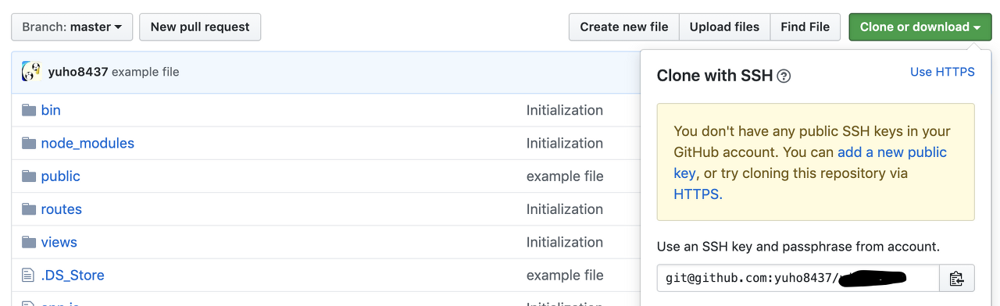

If you want to manage your web application with a version control system, you can use the `git clone` command in your desired directory to connect with GitHub. But what if the computer isn't your local machine but a server like an AWS EC2 instance, and your repository is private and not visible to others?

Since I'm currently using an AWS EC2 Ubuntu instance as my server, I'll walk you through the process based on that environment. Even if your setup is different, the steps should be quite similar, so feel free to use this as a reference.

1. **Generate an SSH key pair** on your instance.

   You can generate a key pair by following this [link](http:// https//docs.gitlab.com/ee/ssh/#generating-a-new-ssh-key-pair). I used the command `ssh-keygen -o -t rsa -b 4096 -C "email@example.com"` to generate mine. For the email, enter whichever email you'd like to use to identify yourself during collaboration.

2. **Check that the /.ssh/id_rsa.pub file has been created** in your home directory.

    You can also verify this by running `cd /home/<your-user-name>/.ssh` followed by `ls -a` to check whether id_rsa.pub exists.

3. Use the `cat id_rsa.pub` command to display your public key, then copy it with ctrl+c.

4. Go to your GitHub repository, then navigate to Settings - Deploy Keys and **register your copied SSH public key**.

5. On your instance, run the `git clone 'link from the bottom-right section shown in the image below'` command.

After completing all the steps above in order, the connection between your instance and the private repository will be established.
