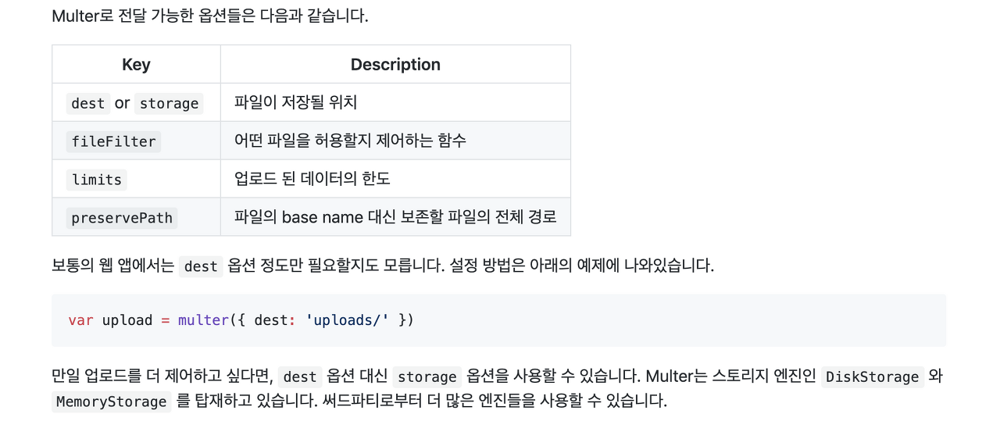

> This post is a summary of Egoing's [lecture](https://opentutorials.org/course/2136/11959) from 'OpenTutorials - Life Coding'.

Since Express does not natively provide the ability to save user-uploaded files to a desired directory on the server, we need to install a module called **multer** to handle this. Let's install the multer module in our project using the command `npm install --save multer`. Then, add the following code to your Node file to configure it so that files uploaded by users are saved in a directory called uploads.

```javascript
var multer = require('multer')
var upload = multer({dest: 'uploads/'})
```

### Upload Form

Let's create an upload form in pug file format. (I named mine upload.pug.) Write the code as shown below. The method must be set to **post**, and you must include `enctype='multipart/form-data'`. This is necessary for the file data submitted by the user to be transmitted to the server.

```html
doctype html
html
    head
        meta(charset='utf-8')
    body
        form(action='upload' method='post' enctype='multipart/form-data')
            input(type='file' name='userfile')
            input(type='submit')
```

### Multer

- Usage is described in detail on the [multer GitHub page](https://github.com/expressjs/multer/blob/master/doc/README-ko.md), so please refer to it.

Since we sent a file via post to the upload path in our upload form above, we need to receive this information using a router on the upload path via post, and then use the multer module to send it to the uploads directory. To do this, write the following code in your Node file.

```javascript
app.get('/upload', function(){
	res.render('upload')
});

app.post('/upload', upload.single('userfile')), function(){
	res.send('Uploaded')
});
```

Let's go through the execution order of the app.post function.

1. First, the router receives the **post data sent to /upload**.
2. Second, the **multer middleware sends the file received under the name userfile to the upload directory**.
3. Third, the **callback function** `function(){res.send('Uploaded')}` **is executed**.

Additionally, when using the multer middleware, information about the file the user sent to us is stored in the request object as **req.file**. Since the req.file object contains information such as **fieldname, originalname, filename, path, size**, and more, it can be utilized in various ways.

### Utilizing Multer



This is the description from the multer module's GitHub page. I'll try using the storage option instead of dest. To do so, the module needs to be loaded as follows. `destination` indicates which directory to save the user's uploaded file in, and `filename` indicates what name to give the saved file. So after loading the module as shown below and using the upload variable, the file will be **saved with the filename specified to the destination** pointed to by the storage variable.

```javascript
var storage = multer.diskStorage({
  destination: function (req, file, cb) {
    cb(null, 'uploads/')
  },
  filename: function (req, file, cb) {
    cb(null, file.originalname)
  }
})

var upload = multer({storage: _storage})
```

Beyond this, by using code with conditional statements, you can save images and text files to different directories, and you can also handle cases where a file with the same name already exists differently. It would also be a good idea to study how to serve 'static files' alongside this topic.

### Multiple File Uploads

If you want to upload multiple files at once, just remember these two things:

1. Use **upload.array** instead of upload.single!
2. Add the **multiple/ attribute** to the file upload input in your HTML form!

```html
form(action="/create" method="post" enctype='multipart/form-data')
    input(type='file' name='userfile' multiple/)
    input(type="submit")
```
