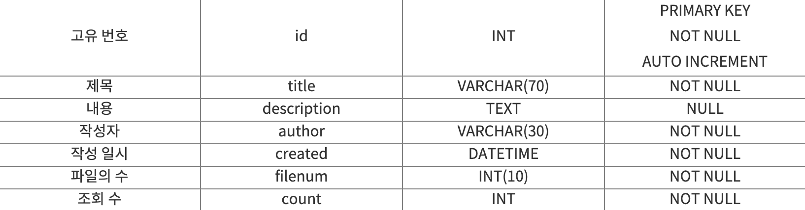
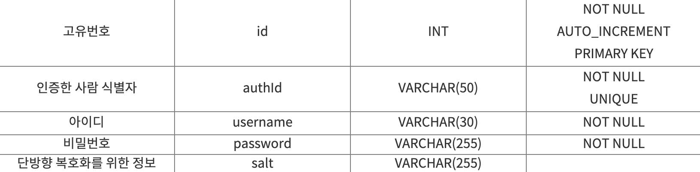
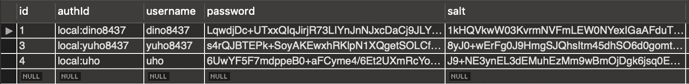

To build a bulletin board that supports reading, creating, editing, and deleting posts using a MySQL database, user-submitted text information must be delivered to the database server, and this requires pre-modeling how the tables should be structured. While researching this topic, I decided to write up what I learned in this post.

### Bulletin Board DB Modeling

There are many different types of bulletin boards. For this post, I'll assume we're building one where users can write posts and upload files. I'll keep the table design minimal, including only the most essential information. To achieve this, we need to create two tables: one **for posts** and one **for files**. Since there can be **multiple attachments**, the file table needs to be separate.

Before creating the database, I first created a user within MySQL who would have access to the database, as shown below. To connect to MySQL using this user, enter `./mysql -udev -p`. (This is because the username is dev.)

```sql
CREATE USER dev@127.0.0.1 IDENTIFIED BY '1234';
GRANT DELETE,INSERT,SELECT,UPDATE ON example.* TO dev@127.0.0.1;
```

#### Post Table (tbl_board)



#### File Table (tbl_files)


File names can cause errors if duplicated, so you should ensure that file names are unique when saving.

The two tables above can be implemented with the following code. I've added extra columns for price, state, class, and location, so if you don't need them, feel free to remove those parts.

```sql
CREATE TABLE tbl_board(
id INT AUTO_INCREMENT NOT NULL,
title VARCHAR(70) NOT NULL,
description TEXT NULL,
author VARCHAR(30) NOT NULL,
created DATETIME NOT NULL,
filenum INT(10) NOT NULL,
count INT NOT NULL,
class VARCHAR(30),
price INT, // networking에선 삭제
state TINYINT(2), // networking에선 TINYINT(1)
PRIMARY KEY(id)
);

CREATE TABLE tbl_files(
board_id INT NOT NULL,
file_id INT(10) NOT NULL,
filename VARCHAR(70)NOT NULL,
location TEXT
);
```

When creating a user within a database, you should not assume that localhost and 127.0.0.1 are the same connection. Depending on which host you choose, the password may differ, so keep this in mind when setting up your database server!

- https://jybaek.tistory.com/418
- https://dlong.tistory.com/m/133

### User Information DB Modeling

We need to create the following table. (I referenced Egoing's [material](https://opentutorials.org/course/2136/12257) from Life Coding.)



The SQL code for this table is as follows.

```sql
CREATE TABLE users (
    id INT NOT NULL AUTO_INCREMENT ,
    authId VARCHAR(50) NOT NULL ,
    username VARCHAR(30) NOT NULL,
    password VARCHAR(255) NOT NULL,
    salt VARCHAR(255),
    PRIMARY KEY (id),
    UNIQUE (authId)
) ENGINE = InnoDB;
```

When a user signs up, their information is stored in the database as shown below.


