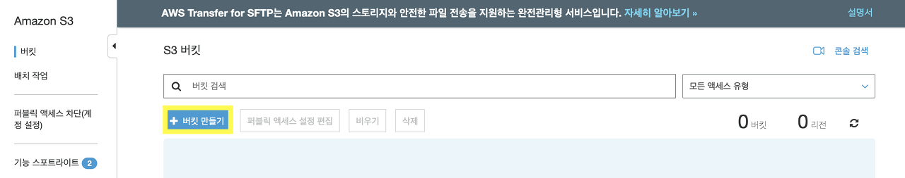
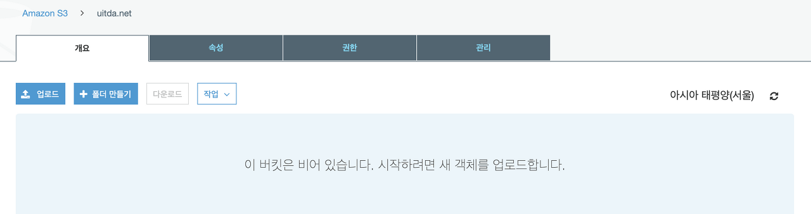
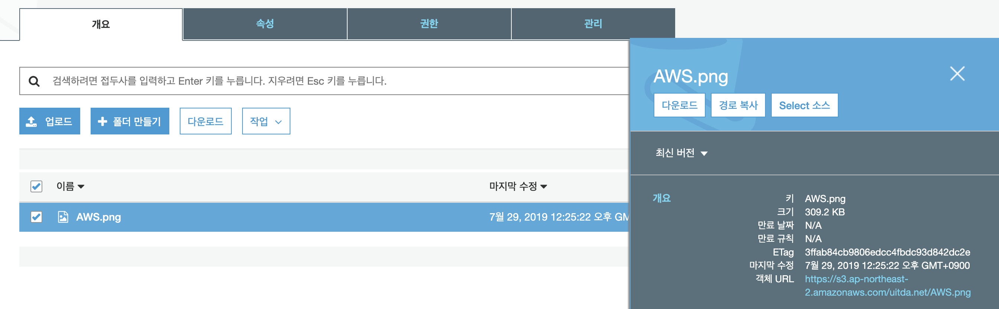
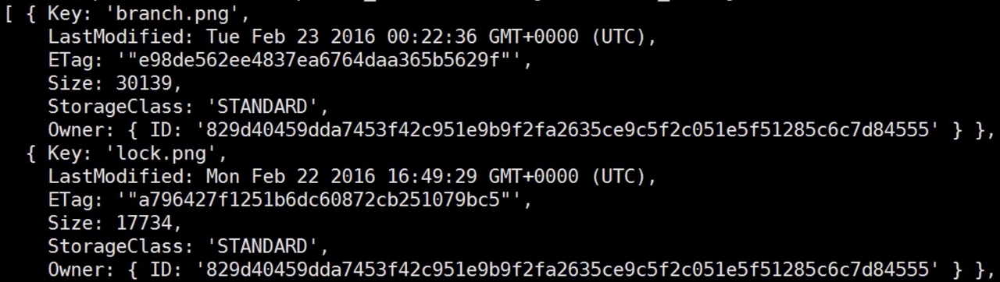

> This post is a summary of egoing's [lecture](https://www.opentutorials.org/course/2717/11344) from 'OpenTutorials - Life Coding'.

S3 is one of the services provided by Amazon Web Services. It stands for Simple Storage Service. In other words, it's a service for storing information — or more simply put, a file storage service. Of course, you could store files directly on your server, but S3 offers the advantage of being able to safely store large amounts of files without worrying about many things.

### Why Use S3

- **Durability**: S3 can store critical data and guarantees 99.999999999% object durability. Data is redundantly stored across multiple facilities and devices within each facility.
- **Low Cost**: S3 allows you to store large amounts of data at very low cost. Since you only pay for what you use, the cost barrier to entry is low. It also reduces costs by storing data differently based on access frequency.
- **Security**: It supports data transfer via SSL and automatic encryption after data upload.
- **Scalability**: You don't need to worry about S3 servers going down or crashing.
- **Event Notifications**: It can also be used as a trigger for other services.

Because of these advantages, S3 is widely used. Additional benefits of using S3 include content storage and distribution, big data analytics, and disaster recovery.

### Basic Operations

Let's explore S3 operations in the Amazon Web Services console.



Click "Create bucket" in the S3 console to create a bucket. Think of a 'bucket' as a space or storage device where files can be stored. An important note here is that you must set a unique DNS-compatible name that doesn't conflict with any other bucket across all of AWS. Once done, a bucket is created as shown below, and you can upload files to it.





You can upload files by clicking the upload button as shown above, but you can also have a middleware on your server receive user requests and instruct S3 to store the files. The file information can also be accessed via a URL link within S3.

### Upload

First, let's import the AWS SDK as a module and set the region to Seoul (ap-northeast-2). We also need to load the File System (fs) module built into Express.

```javascript
var AWS = require('aws-sdk');
var fs = require('fs');
AWS.config.region = 'ap-northeast-2';
```

Then write the following code.

```javascript
var s3 = new AWS.S3();
var param = {
    'Bucket':'example.net',
    'Key':'exp.png',
    'ACL':'public-read',
    'Body':fs.createReadStream('bigfile.png'),
    'ContentType':'image/png'
}
s3.upload(param, function(err, data){
    console.log(err);
    console.log(data);
})
```

- **Bucket**: Specify the name of the S3 bucket to use.
- **Key**: Specify the name under which the file will be stored in S3.
- **ACL**: Set to public-read so that only the owner can write, but everyone can read.
- **Body**: This is the part that defines how the file is transmitted.
- **ContentType**: Define the type of the uploaded file.

For the Body, you can choose from three methods: Buffer, String_value, or streamObject, and streamObject is the recommended approach. That's why we call `createReadStream` from the fs module as shown above — it breaks the file (bigfile) into small pieces, then transmits them to S3 without any issues.

In addition to `upload`, there is also a method called `putObject` for file uploads. However, `putObject` does not include the uploaded file's URL in the data, so when you need that URL, use the `upload` method as shown above.

### Listing

```javascript
s3.listObjects({Bucket: 'example.net'}).on('success', function handlePage(response) {
    for(var name in response.data.Contents){
        console.log(response.data.Contents[name].Key);
    }
    if (response.hasNextPage()) {
        response.nextPage().on('success', handlePage).send();
    }
}).send();
```

The code above displays the names of files in S3 to the console. Let's examine it step by step.

First, we use the `listObjects` method and pass the bucket we want to use as an object argument. (I'm assuming a bucket named example.net.) Then we write event-driven code in the form `.on('success', function ...)`. This means that if the `listObjects` method successfully retrieves information, it **executes the callback function after success**.

Since fetching all the information at once could result in too much data flooding in, paging is used to retrieve information sequentially. First, `response.hasNextPage()` checks whether there is more information on the next page, and if so, `response.nextPage().on('success', handlePage).send()` fetches the next page's information. Notice that `handlePage` itself is passed as the argument, making this a **recursive function**.

Lastly, `response.data.Contents` is where the information about files uploaded to S3 is stored.



Since `response.data.Contents` contains information about files we've uploaded to S3 in object form, it can be usefully applied to web applications later.

### Download

```javascript
var file = require('fs').createWriteStream('logo.png');
var params = {Bucket:'example.net', Key:'logo.png'};
s3.getObject(params).createReadStream().pipe(file);
```

A basic download method is streaming requests. As mentioned earlier, if the data we're using has a very large file size, it could potentially crash our computer. Therefore, rather than using the entire file at once, it's more stable and efficient to use it in parts — this is where streaming comes in.

We're currently reading information from S3 and downloading (or writing) that information to our computer. So we put the name of the file we want to download as the input to `createWriteStream` and store it in a variable called file. Then we specify the information to read from S3 in params, read it with `s3.getObject(params).createReadStream()`, and connect it with `pipe(file)`.

### Practical Usage

To utilize S3 in Node.js, let's first load the necessary modules as shown below. Since Express doesn't have built-in file upload functionality, we load a module called **formidable** to implement this.

```javascript
var express = require('express');
var formidable = require('formidable');
var AWS = require('aws-sdk');
AWS.config.region = 'ap-northeast-2';
var app = express();
```

Then create a form for file uploads.

```javascript
app.get('/form', function(req, res){
    var output = `
<html>
<body>
    <form enctype="multipart/form-data" method="post" action="upload_receiver">
        <input type="file" name="userfile">
        <input type="submit">
    </form>
</body>
</html>
    `;
    res.send(output);
});
```

Since we sent the file via post to the upload_receiver path, let's now write the receiving end's code below.

```javascript
app.post('/upload_receiver', function(req, res){
   var form = new formidable.IncomingForm();
   form.parse(req, function(err, fields, files){
       var s3 = new AWS.S3();
       var params = {
            Bucket:'example.net',
            Key:files.userfile.name,
            ACL:'public-read',
            Body: require('fs').createReadStream(files.userfile.path)
       }
       s3.upload(params, function(err, data){
            var result='';
            if(err)
                result = 'Fail';
            else
                result = ``;
            res.send(`<html><body>${result}</body></html>`);
       });
   });
});
```

The full code is available [here](https://www.opentutorials.org/course/2717/11797). If the file uploads successfully to the S3 server when you run the code, you're all set!
