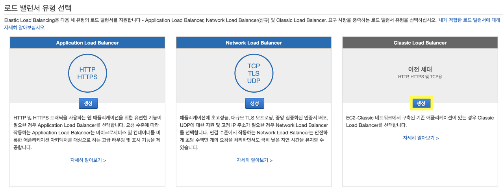
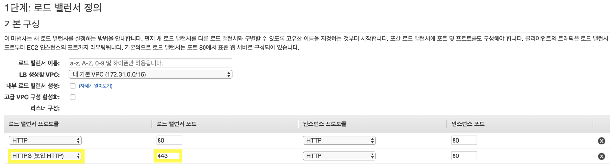
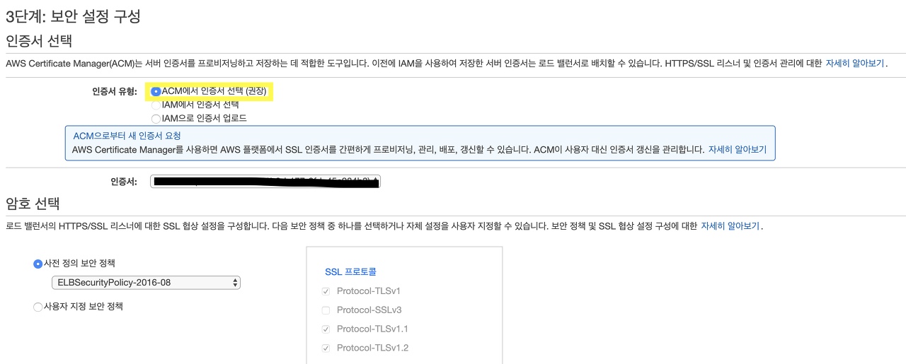
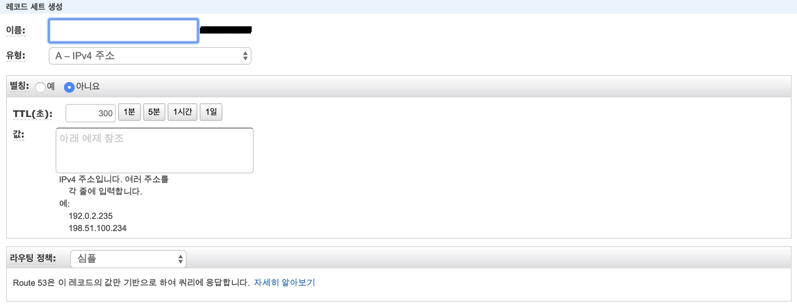
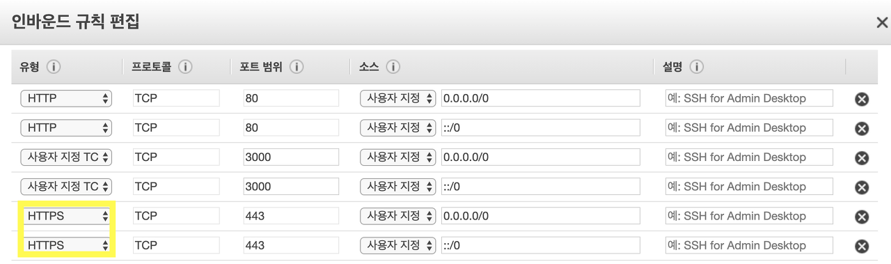

In the previous AWS ACM post, we learned how to obtain an SSL certificate through ACM for a server using Route 53 and AWS EC2. In this post, we will explore how to apply the issued SSL certificate to our server relatively easily using ELB.

### What is ELB?

ELB stands for **Elastic Load Balancing**. Load balancing refers to distributing work across two or more servers. This offers the advantage of optimizing availability and response times. It also allows you to add and remove computing resources from the load balancer as needed without disrupting the overall flow of requests to the application. Among the server scaling methods below, **scale-out** requires load balancing to evenly distribute the load across each server.

- Scale-out: Expanding the system by increasing the number of server machines
- Scale-up: Upgrading a server machine's CPU, RAM, etc. to higher-performance components

AWS supports three types of load balancers: Application Load Balancer, Network Load Balancer, and Classic Load Balancer. A comparison of these three products can be found at [this link](https://aws.amazon.com/ko/elasticloadbalancing/features/#compare).

### Creating an ELB

I will proceed with the explanation assuming you have already created an ACM certificate following the method from the previous post. First, access the EC2 console and click **"Load Balancers - Create Load Balancer"** from the left menu to see the following screen.



Here, click the **Create Classic Load Balancer** button.



In step 1, add the HTTPS load balancer protocol and set your desired load balancer name. Moving to step 2, you need to assign a security group -- assign the same security group that you use for your server instance.



Step 3 is for selecting the certificate to use. Since we created our certificate with ACM, check **Choose a certificate from ACM** and proceed to the next step.

In step 4, configure your desired health check settings freely, and in step 5, select the instances to use. After adding tags and reviewing, the Classic Load Balancer will be successfully created. If the load balancer's status shows "In service" as shown below, it is operating normally.

### Connecting ELB to Your Domain

Once you have created the ELB, you need to connect it to your website's domain. Go to the Hosted Zones section in Route 53 and click the domain you are using. Then click the **Create Record Set** button to see the following screen.



Here, **set Alias to "Yes"** and you will be able to select the ELB we created. Select our ELB and click the Create button. After about 5 minutes, access your domain and verify that HTTPS is working properly -- that's it!

If the connection is not working properly, check the **EC2 Security Group** applied to your server instance. HTTPS access must be allowed as shown below for HTTPS connections to work.



### Redirecting HTTP to HTTPS

To write code that redirects HTTP connections to HTTPS, you first need to identify which protocol was used for the connection. According to the AWS [ELB User Guide](https://docs.aws.amazon.com/ko_kr/elasticloadbalancing/latest/classic/x-forwarded-headers.html), the Classic Load Balancer supports the following X-Forwarded headers. I will use the X-Forwarded-Proto header among these.

- X-Forwarded-For: Helps identify the client's IP when using an HTTP or HTTPS load balancer
- X-Forwarded-Proto: Helps identify the protocol (HTTP or HTTPS) that the client used to connect to the load balancer
- X-Forwarded-Port: Helps identify the destination port that the client used to connect to the load balancer

To use the X-Forwarded header, I will leverage the `get()` method built into Express's request object. Referring to the [Express documentation](https://expressjs.com/ko/api.html#req.get) for the request object, I wrote the following code.

```javascript
var app = express()

app.use(function(req, res, next) {
	var xForwarded = req.get('X-Forwarded-Proto');
	if(xForwarded !== 'https') {
    	res.redirect('https://' + req.get('Host') + req.url);
	}
});
```

If we access `http://example.com/home`, xForwarded will contain "http", so the if statement will execute and redirect to `https://example.com/home`.
