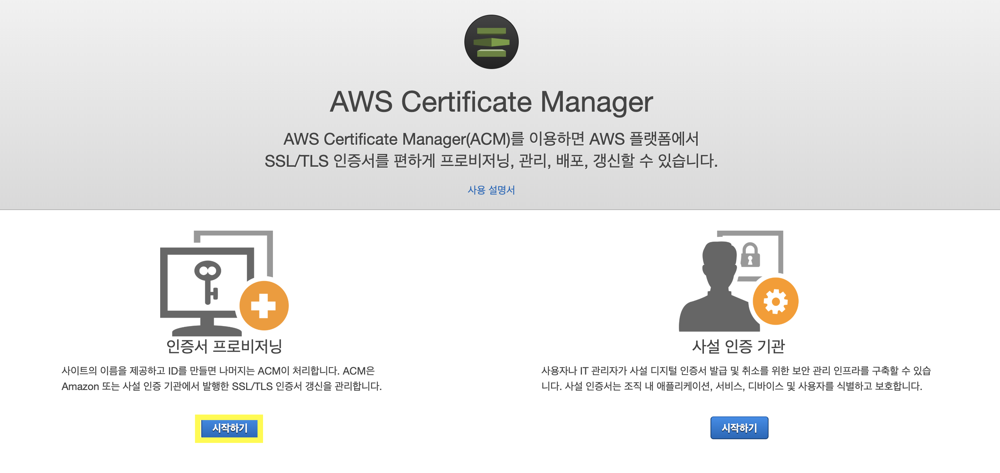
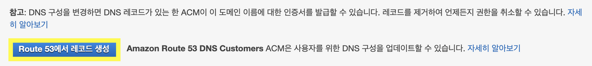

While browsing various websites, you may notice that some URLs begin with http while others begin with https. This difference comes down to data integrity between the user and the server, and it is this difference that guarantees https is a much more secure connection than http.

The 's' in https stands for Secure Socket Layer, commonly abbreviated as **SSL** or **TLS** (Transport Layer Security). You need SSL/TLS certification to make your website more secure against attackers. AWS ACM handles the complex process of creating and managing public SSL/TLS certificates for AWS-based websites and applications. Before diving into ACM in this post, let's first look at the definition of SSL/TLS.

### TLS (Transport Layer Security)

> The following is an explanation from [Wikipedia](https://ko.wikipedia.org/wiki/전송_계층_보안).

Transport Layer Security (TLS) is a cryptographic protocol designed to provide communication security. This protocol is applied to communications using TCP/IP networks such as the Internet, and it ensures end-to-end security and data integrity at the transport layer. The protocol is used in applications such as web browsing, email, and instant messaging. It has been deprecated by the Internet Engineering Task Force (IETF). The final update is RFC 5246, and the latest version was based on the SSL standard created by Netscape.

In the first step, the server and client exchange cipher suites. During this phase, the encryption methods, key exchange, authentication, and Message Authentication Codes (MAC) are determined. Key exchange and authentication algorithms can use public key methods or pre-shared keys (TLS-PSK). Message authentication codes are created using HMAC hash functions. SSL uses a non-standard random function.

The SSL protocol was originally created by Netscape. Version 1.0 was never publicly released, and version 2.0 was not released until February 1995. However, this version was quickly followed by version 3.0 due to numerous security flaws. Version 3.0 was released in 1996. Ultimately, version 3.0 became the foundation for TLS version 1.0, which was defined by the IETF as the RFC 2246 standard in January 1999.

### ACM (AWS Certificate Manager)

HTTPS certification works by having a Certificate Authority (CA) verify the site and issue a certificate. Some organizations issue certificates for personal websites free of charge for several months, and paid certificate options are also available. If you are using AWS, you can obtain a certificate for free through ACM.

Amazon states that it provides the following services. I intend to use ACM certificates among these.

> You can use public certificates provided by ACM (ACM certificates) or certificates imported into ACM. ACM certificates can protect domain names and multiple names within a domain. You can also use ACM to create wildcard SSL certificates that can protect as many subdomains as you need.

ACM generates X.509 version 3 certificates. Each certificate is valid for 13 months and includes the following extensions:

- **Basic Constraints** - Specifies whether the subject of the certificate is a Certificate Authority (CA).
- **Authority Key Identifier** - Allows identification of the public key corresponding to the private key used to sign the certificate.
- **Subject Key Identifier** - Allows identification of the certificate containing a specific public key.
- **Key Usage** - Defines the purpose of the public key contained in the certificate.
- **Extended Key Usage** - Specifies one or more additional purposes for which the public key can be used, beyond those specified in the **Key Usage** extension.
- **CRL Distribution Points** - Specifies where CRL information can be obtained.

### Requesting a Public Certificate via the Console

1. Log in to the ACM console and click the "Get Started" button for certificate provisioning. Then click "Request a public certificate."

2. Enter your website's domain name.

    You can use a Fully Qualified Domain Name (FQDN) like www.example.com or a bare/apex domain name like example.com. You can also use an asterisk (*) on the far left as a wildcard to protect multiple site names within the same domain.

3. If you have or can obtain permission to modify the domain's DNS configuration, select "DNS validation"; otherwise, select "Email validation." (I selected DNS validation.)

Let me explain the **DNS validation method**. ACM uses CNAME (Canonical Name) records to verify your ownership or control of the domain. ACM provides CNAME records for you to insert into your DNS database, and each generated record contains a name and a value. The value is an alias that points to a domain owned by ACM and used by ACM to automatically renew the certificate. You only need to add the CNAME record to your DNS database once to complete the validation.

If your DNS provider is Amazon Route 53, you can easily create the record using the button below.

After updating your DNS configuration, select "Continue" and ACM will display a table view containing all certificates. The requested certificate and its status will be shown. It may take up to several hours after the DNS provider propagates the record update for ACM to validate the domain name and issue the certificate. During this time, ACM displays the validation status as "Pending validation." After the domain name is validated, ACM changes the validation status to "Success." Once AWS issues the certificate, ACM changes the certificate status to "Issued."
