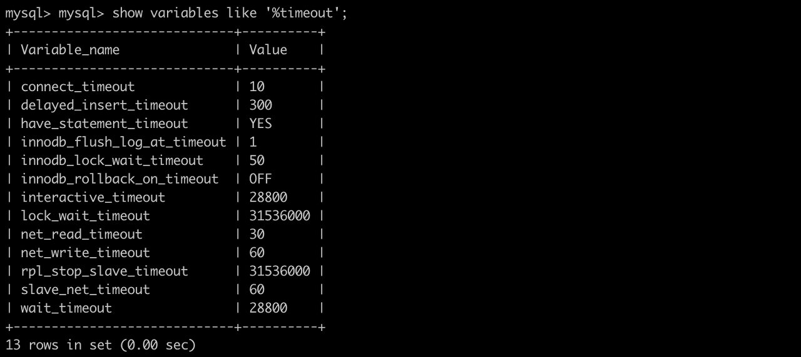

While working on the backend with Node.js, MySQL, AWS EC2, S3, Nginx, and other tools, I occasionally encounter the error log 'Error: Connection lost: The server closed the connection.' which causes the website to become inaccessible. I am documenting what I learned through research about why this error occurs and how to resolve it.

### Cause of the Error



Through [a post by enchoyi](https://enchoyism.github.io/2018/02/02/nodejs-mysql-connection-lost/) that I found while researching, I learned that the time specified in interactive_timeout and wait_timeout represents "the time the server waits before disconnecting an inactive connection."

In my MySQL configuration, this was set to 28800 seconds, meaning that if there is no activity for 8 hours, the server disconnects the connection. Since I am currently the only person accessing the website I am working on, this means the server's connection gets dropped after just one day, which was the cause of the error.

So how can we automatically detect a disconnected DB server connection and reconnect?

### Error Resolution Code

```javascript
var mysql = require('mysql');
var db = mysql.createConnection({
  host:'---',
  user:'---',
  password:'---',
  database:'---'
});

function handleDisconnect() {
  db.connect(function(err) {
    if(err) {
      console.log('error when connecting to db:', err);
      setTimeout(handleDisconnect, 2000);
    }
  });

  db.on('error', function(err) {
    console.log('db error', err);
    if(err.code === 'PROTOCOL_CONNECTION_LOST') {
      return handleDisconnect();
    } else {
      throw err;
    }
  });
}

handleDisconnect();
```

I wrote the above source code based on a [solution found on Stack Overflow](https://stackoverflow.com/questions/20210522/nodejs-mysql-error-connection-lost-the-server-closed-the-connection). Loading the mysql module and entering the DB server information using the `createConnection` method is the same as before. The key part to focus on is the `handleDisconnect` function below.

First, it attempts to connect to the DB server via `db.connect`. Then, using `db.on`, it checks whether the connection to the DB server has been lost. If the connection is lost, it calls `handleDisconnect` again via `return handleDisconnect()` to attempt a reconnection.
