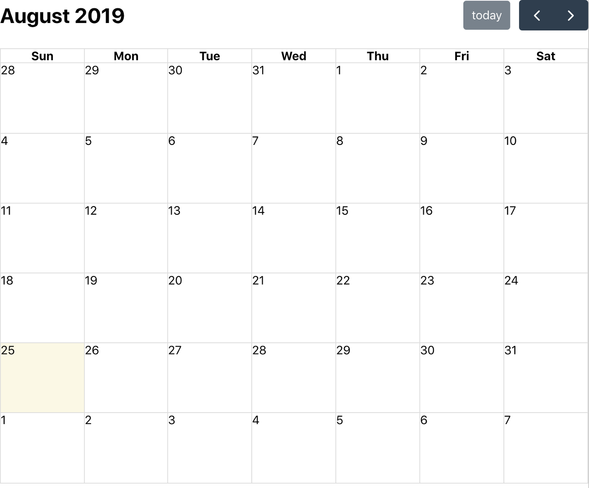
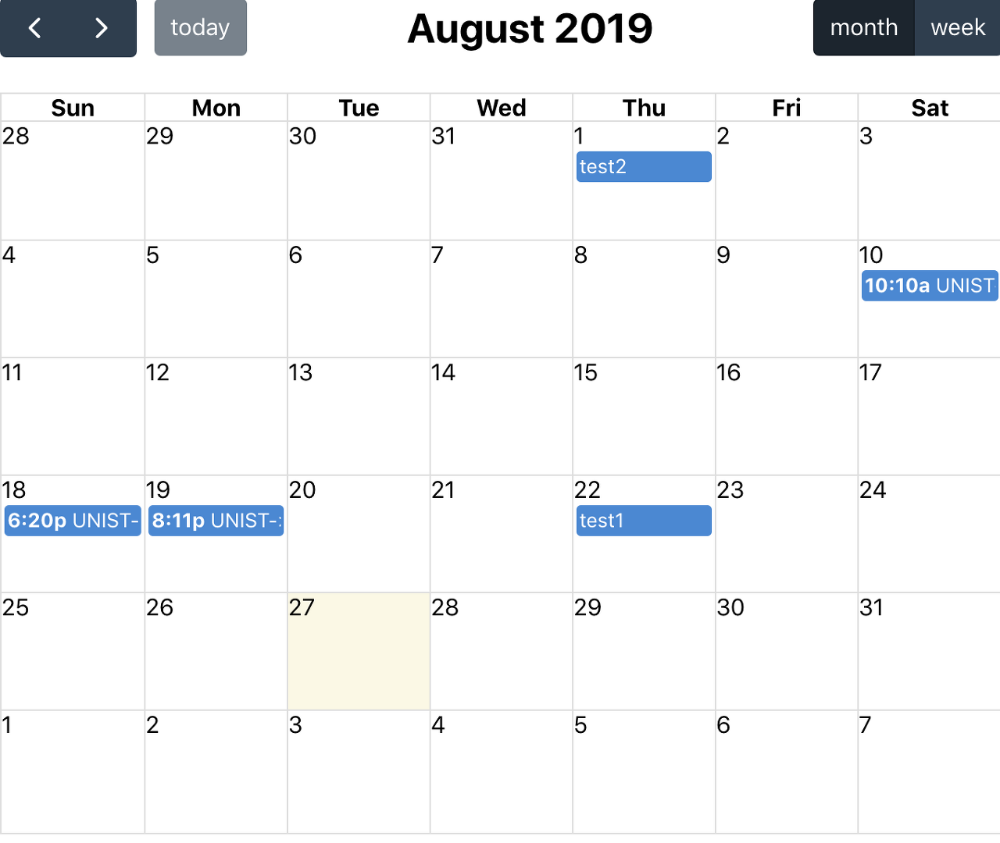

### Installing React and Creating a React Project

Since we need to use React, let's install it and create a React project in the desired directory.

```sh
npm install -g create-react-app
create-react-app 'desired-directory'
```

To verify the project works correctly, run npm start in the terminal from the directory where App.js is located. If you see the React logo spinning when you enter localhost:3000 in your web browser's address bar, you're all set.

```sh
cd 'project-directory'
npm start
```

### Installing FullCalendar Module in a React Project

To display FullCalendar through React, install the modules using the commands below. If the @fullcalendar directory and its files are installed inside the project's node_modules directory, you're good to go.

```sh
npm install --save @fullcalendar/react @fullcalendar/core @fullcalendar/daygrid
```

### Loading FullCalendar in App.js

```javascript
import React, {Component} from 'react'
import FullCalendar from '@fullcalendar/react'
import dayGridPlugin from '@fullcalendar/daygrid'

import 'path-to-main.css'

class App extends Component {

  render() {
    return (
      <div className="App">
        <FullCalendar
          defaultView="dayGridMonth"
          plugins={[ dayGridPlugin ]}
        />
      </div>
    );
  }

}

export default App;
```

Without touching any other files in the project, let's modify only the App.js file as shown above. You should then see FullCalendar displayed correctly.



I haven't studied React extensively, so I can't explain every detail of how it works, but I'll share what I understand. Below is an explanation of the FullCalendar setup.

1. We use import to bring in the previously installed FullCalendar and dayGridPlugin.
2. We place the FullCalendar component inside the App component.

Here's an explanation of the App component that contains FullCalendar.

1. By default, when you create a React project, index.js renders the App component from the App.js file in the src directory.
2. The rendered content is passed to the div with an id of root in the index.html file inside the public directory.
3. As a result, the FullCalendar component contained in the App component is displayed at localhost:3000.

### Displaying Events with React

You can think of it as nearly identical to displaying events with a Script tag. Simply pass the events value as props to the FullCalendar component, and you'll see the events rendered on the calendar according to the data you provided. Here's an example of the component code:

```javascript
<FullCalendar
  defaultView="dayGridMonth"
  plugins={calendarPlugins}
  weekends={false}
  events={[
    { title: 'event 1', date: '2019-04-01' },
    { title: 'event 2', date: '2019-04-02' }
  ]}
/>
```

### Sending JSON Data from the Back-End

I used the Node-Express framework to send JSON data. Below is the index.js router code from the Express project. I created a table called cal_events in the DB server and configured it to fetch data from that table. (I won't go into the details of requiring the db module, as it would make this post too long.)

```javascript
var express = require('express');
var router = express.Router();

var db = require('../config/db');

router.get('/test', function(req,res){
  db.query(
    `SELECT * FROM cal_events`,
    function (error, events) {
      if (error) throw error;
      res.json(events);
    }
  );
});

module.exports = router;
```

When a GET request is made to the /test URL, the information from the cal_events table in the DB is returned as a response via res.json.

### Receiving JSON Data in React

To receive data sent from the Back-End, you first need to set up React as a proxy server for the Back-End server. Add the following line to the package.json file in your React project. (Please modify the port number to match your own Back-End server. I used port 3003.)

```
"proxy":"http://localhost:3003/"
```

Since the code is fairly lengthy, I'll explain it in parts.

```javascript
import React, {Component} from 'react';
import FullCalendar from '@fullcalendar/react'
import dayGridPlugin from '@fullcalendar/daygrid'
import axios from 'axios';

import 'path-to-main.css'
```

This is the beginning of App.js where modules are imported. The change from the previous post is `import axios from 'axios'`. It is used so that React can receive data sent from the Back-End.

```javascript
class App extends Component {

  state = {}

  componentDidMount() {
    this._getEvents();
  }

  _getEvents = async () => {
    const events = await this._axiosEvents();
    this.setState({
      events
    })
  }

  _axiosEvents = () => {
    return axios.get('/test')
      .then(res => res.data)
  }


  render(){

    let {events} = this.state;

    return (
      <div className="App">
        {events ?
        <FullCalendar
          defaultView="dayGridMonth"
          plugins={[ dayGridPlugin ]}
          events={this.state.events}
        /> :
        'loading'
      }
      </div>
    );
  }
}


export default App;
```

I'll explain in the order of `render()`, `_axiosEvents`, `_getEvents`, and `componentDidMount` -- that is, in *reverse* order of the code. (*The source code was written by a friend who is studying alongside me.*)

1. `render()`: Checks whether the component's state contains event data. If it does, it renders the FullCalendar component; otherwise, it displays "loading".
2. `_axiosEvents`: Uses axios's get method to request data from the Back-End's /test URL and returns the res.data response.
3. `_getEvents`: Waits until _axiosEvents receives a response, then calls setState to store the events data in the state.
4. `componentDidMount`: All of the above processes are executed by componentDidMount after the component has been created and the initial rendering is complete.
5. As a result, the state contains the JSON data sent from the Back-End, stored under the name events.

Below is a screenshot showing the events successfully displayed on FullCalendar.



Even while writing these explanations, I find it quite challenging!
