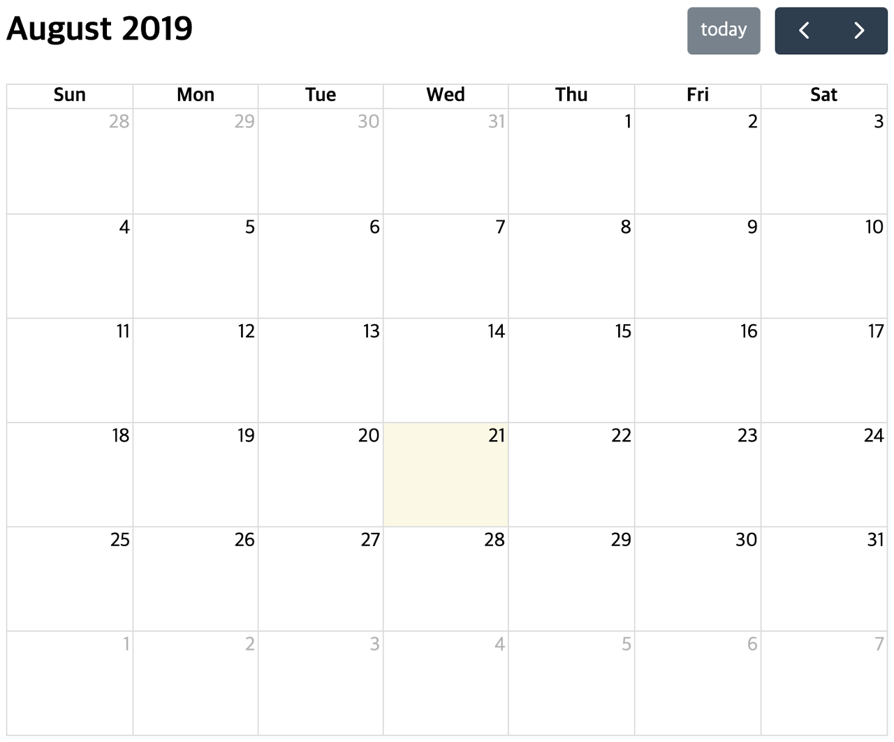
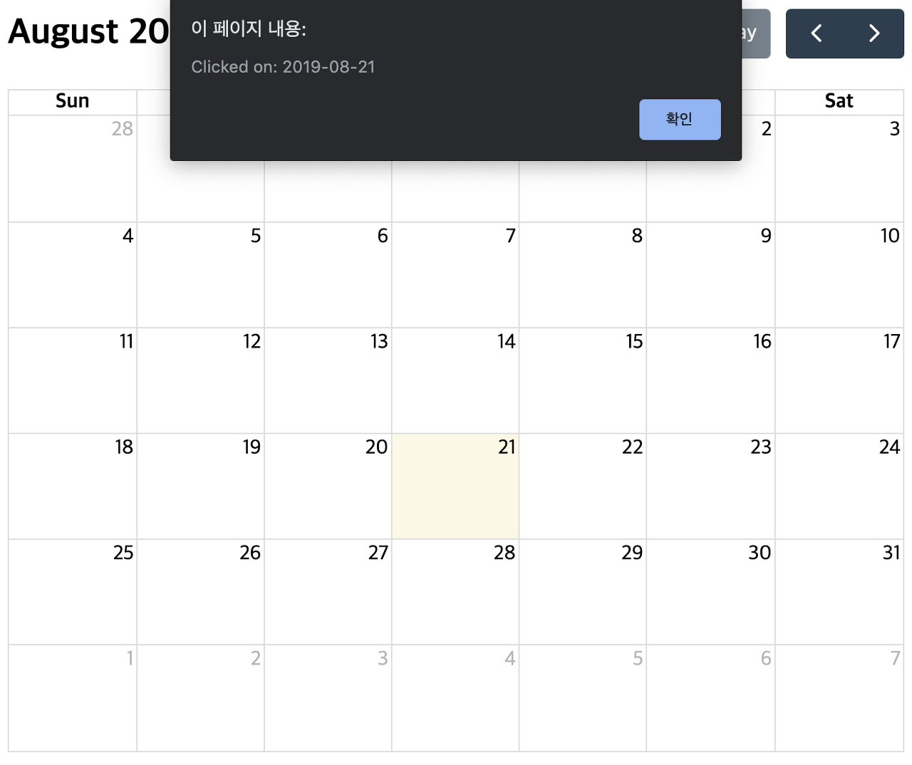
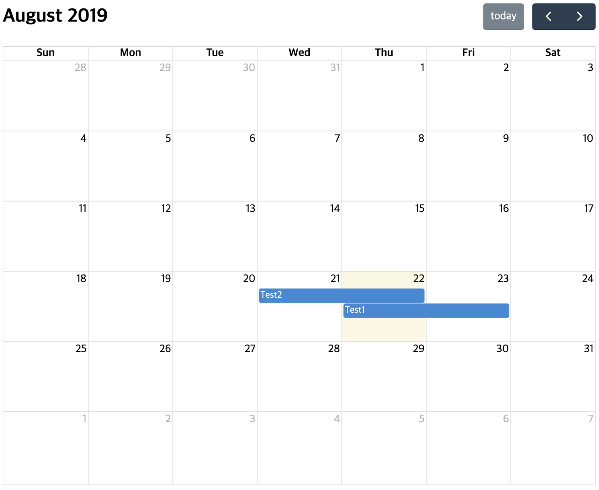
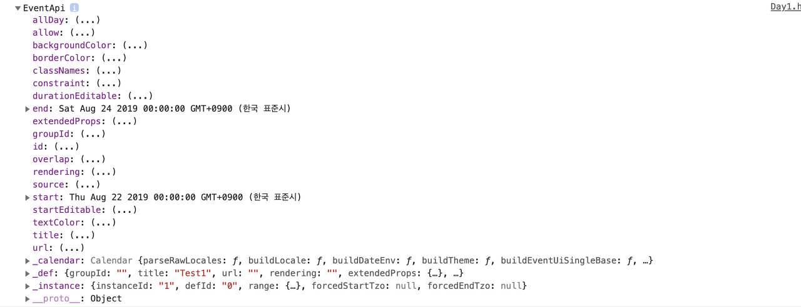

### Displaying FullCalendar

Before diving into detailed usage, let's start by displaying FullCalendar on the screen. This post explains **how to display FullCalendar using script tags**. If you want to use an ES6 build system instead, please refer to [this guide](https://fullcalendar.io/docs/initialize-es6).

1. Download FullCalendar using `npm install --save @fullcalendar/core @fullcalendar/daygrid`.

2. Create an HTML file and paste in the [test code](https://fullcalendar.io/docs/initialize-globals). Make sure to set the href paths correctly.

   In my case, since I created the HTML file outside the node_modules folder, I modified the paths like this: href='./node_modules/@fullcalendar/core/main.css'.

3. Open the HTML file in a browser, and the calendar will be displayed as follows:




### Plugins

If you want more features beyond the basic setup, install plugins and add the desired ones to the *'plugins'* array. You can check the list of plugins provided by FullCalendar [here](https://fullcalendar.io/docs/plugin-index).

Install a plugin using `npm install --save @fullcalendar/'plugin-name'`, then add the following code to your HTML file. (For now, I added the interaction and dayGrid plugins to enable the dateClick feature.)

```javascript
<script src='./node_modules/@fullcalendar/core/main.js'></script>
<script src='./node_modules/@fullcalendar/daygrid/main.js'></script>
<script src='./node_modules/@fullcalendar/interaction/main.js'></script>

<script>
...
var calendar = new FullCalendar.Calendar(calendarEl, {
  plugins: [ 'dayGrid','interaction' ],
  dateClick: function (info) {
          alert('Clicked on: ' + info.dateStr);
  }
  ...
});
...
</script>
```

As a result, clicking on a date cell will display an alert dialog.



### Handler

To understand why the alert dialog appeared, you need to know about Handlers.

```javascript
var calendar = new FullCalendar.Calendar(calendarEl, {
        plugins: ['dayGrid', 'interaction'],
      dateClick: function (info) {
            alert('Clicked on: ' + info.dateStr);
    }
});
```

A handler is a type of option, but specifically one that defines a function called whenever a particular event occurs. In the code above, the `dateClick: function(info){...}` part is the handler, so the corresponding function was executed when a dateClick event occurred.

```javascript
calendar.on('dateClick', function (info) {
        alert('clicked on ' + info.dateStr);
});
```

You can also dynamically add handlers using the on and off methods, as shown above. Besides handlers, you can also control the calendar using FullCalendar's built-in methods -- see the [reference](https://fullcalendar.io/docs/Calendar-prev) for details.

### Event Options

```javascript
var calendar = new FullCalendar.Calendar(calendarEl, {
plugins: ['dayGrid', 'interaction'],
events: [
	{
		id: 1,
		title: 'Test1',
		start: '2019-08-22',
		end: '2019-08-24'
	},
	{
		id: 2,
		title: 'Test2',
		start: '2019-08-21',
		end: '2019-08-23'
	}
]});
```

I added an events option and entered the events in an array of objects. Let's check the calendar.



You can see that the events are displayed correctly on the calendar. For details on which keys and values to use in the events object, refer to this [link](https://fullcalendar.io/docs/event-object).

### getEventById Method

You can retrieve event information using the getEventById method. Simply pass the desired ID as an argument. Let's try running `console.log( calendar.getEventById(1))` with the code above.



You can see that the information for the event with 'id: 1' has been printed.

### References

- [FullCalendar Official Website](https://fullcalendar.io/)[Demo](https://fullcalendar.io/#demos)

[
](https://fullcalendar.io/#demos)
