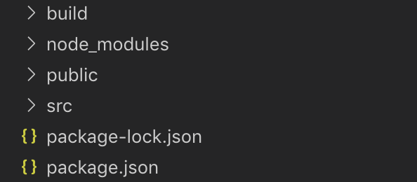
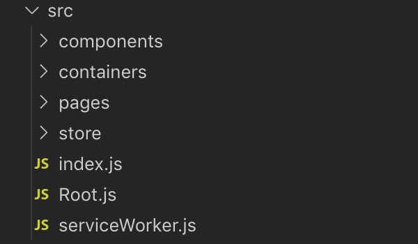

Before building a project yourself, let's examine someone else's project directory structure to get a sense of how to organize directories. In my case, I referenced the directory structure of a friend who had studied React before me. Since directory structures vary from person to person, please use this only as a reference.

### React Project

- **build**: The React deployment folder generated by the `npm run build` command
- **node_modules**: The folder where modules installed via `npm install` are located
- **public**: The folder where static assets are located
- **src**: The folder containing components / containers / pages / store, etc.
- **package**: A file containing information such as version, dependencies, proxy, etc.

Among these, the src folder, where most of the frontend work takes place, is examined in more detail below.

### src Folder

- **components**: The folder where component files are located
- **containers**: The folder where container files are located, mainly containing code that maps state to props
- **pages**: The folder where page files for routing are located
- **store**: The folder for Redux operations, containing **actions** and **reducers** sub-folders
