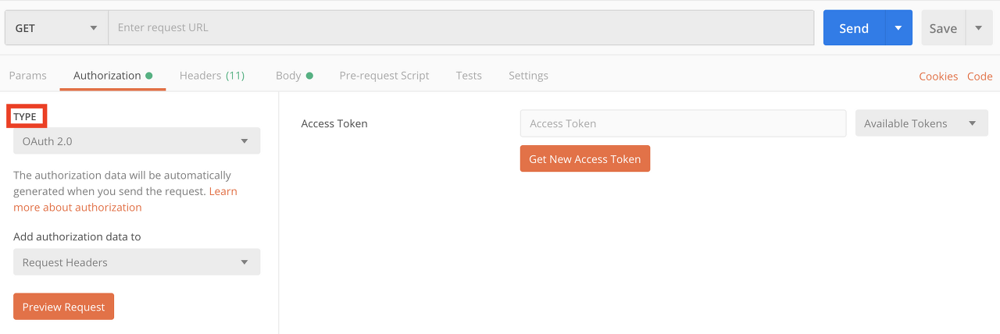
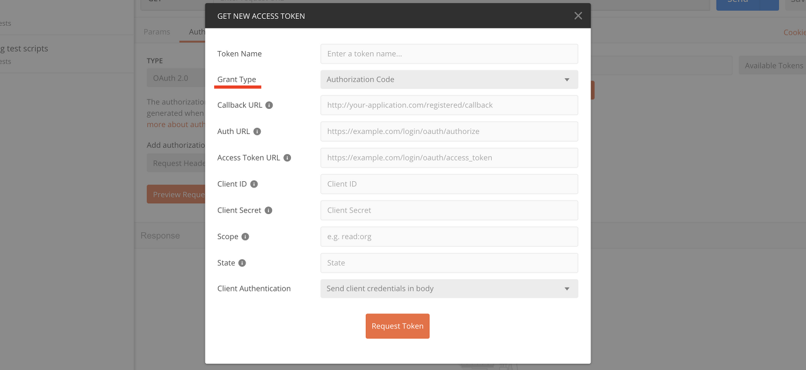
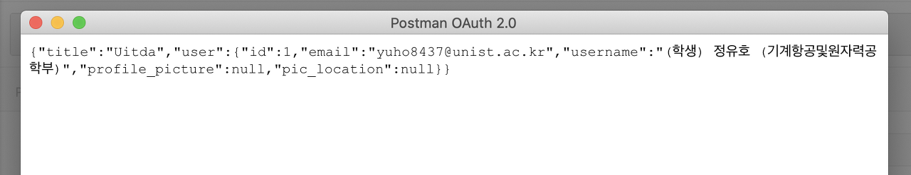

The backend part of web development is responsible for fetching data from the database and receiving/sending data to the frontend. The most basic way to perform these tasks is through HTTP GET and POST methods, and there is a program called Postman that dramatically improves workflow efficiency for these operations.

When I first started learning backend development, I used to verify my code through template engine view files like Pug, but once I started using Postman, that became unnecessary. While I only use GET and POST requests, since those are simple features, I'll skip the explanation for those and instead focus on how to obtain an access token and log in using Postman.

- [https://www.getpostman.com](https://www.getpostman.com/)

### Authorization type

First, you need to identify which **'login strategy'** you are using. For example, I implemented login using the Passport.js library's Outlook strategy. When a user clicks the login button on my website, they are redirected to the Outlook login page, and once they log in through Outlook, they are also logged into my website.

Second, you need to know what **'Authorization type'** your login strategy uses. This information should be available on the homepage of the login strategy you are using. In my case, Passport.js-outlook uses the OAuth 2.0 API. Once you have identified the authorization type, click the Authorization button in Postman and select the appropriate type from the TYPE dropdown.

### Access token

Once you have selected the authorization type, the method for sending an authorization request varies depending on the type. For detailed information, refer to the [official Postman website](https://learning.getpostman.com/docs/postman/sending-api-requests/authorization/), but here we will look at how to obtain an OAuth 2.0 Access token. First, click the orange "Get New Access Token" button to see the following dialog.

The first thing we need to do here is select the **'Grant type'**, which refers to the OAuth 2.0 authorization grant method. To do this, you need to understand which grant method your login strategy uses to issue access tokens. There are four grant types: 'Authorization code, Implicit, Password credentials, Client credentials'. Select the grant type that matches your login strategy and fill in the corresponding information.

If you are unsure about the grant type of your login strategy, there is a way to deduce it. Check what information you obtained to implement the login feature. In my case, I obtained 'ClientID' and 'ClientSecret' through Outlook and configured 'Callback URL' and 'Auth URL' myself. (Auth URL refers to the URL of the login part of your website.) Since the only grant type that can perform login with just this information is Implicit, I was able to deduce that the grant type was Implicit.

After successfully logging in, the following result was displayed. Note that this screen was rendered at the URL I had configured for **redirect**, so it may look different for each person.

If you would like to learn more about grant types, here is a blog post that explains them well:

- https://cheese10yun.github.io/oauth2/
