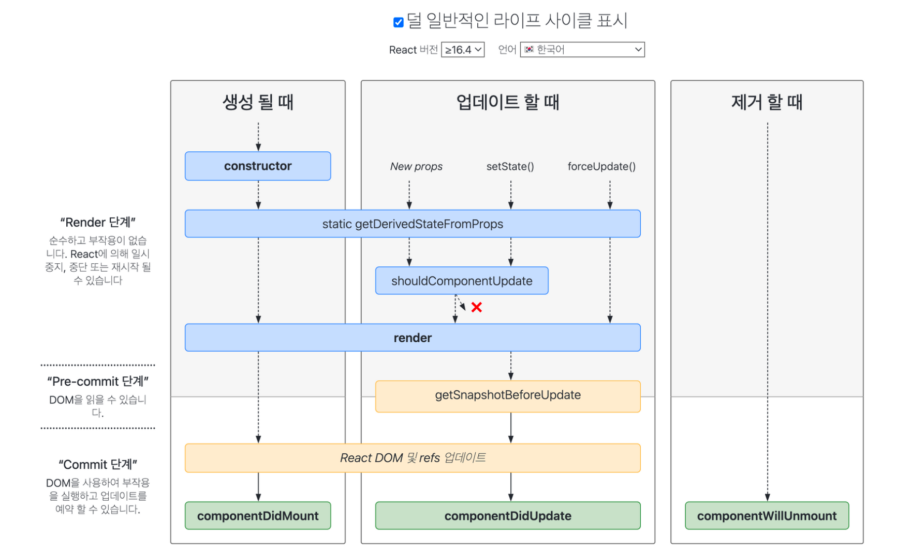

> A comprehensive summary of fundamental React concepts, from basic elements to Redux and Hooks.

### Basics

- JavaScript uses an imperative approach, while React uses a declarative approach. Define the desired state and React handles the appropriate updates.
- JSX (Javascript Syntax eXtension): A syntax extension of JavaScript used for UI representation in React.
- **Component**: The most independent modular unit in React. There are function components and class components.

```typescript
// function component (JavaScript)
function Welcome(props) {
  return <h1>Hello, {props.name}</h1>;
}

// class component (ES6 & JSX)
class Welcome extends React.Component {
  render() {
    return <h1>Hello, {this.props.name}</h1>;
  }
}
```

- **Props**: Data passed from a parent component to a child component (Read-Only, meaning child components can only read the values, not modify them).
- **State**: An independent state that a component holds. State can only be held by class components and must be changed using the React Component method `setState()`. When state is changed using `setState()`, the component re-renders (`render()`).
- **[Lifting state up](https://ko.legacy.reactjs.org/docs/lifting-state-up.html)**: React has a unidirectional data flow, so children cannot pass data to their parents. However, when a child needs to change the parent's state, 'Lifting state up' is used.
  1. Create a function in the parent component that changes the state (e.g., `handleChange = () => {this.setState(...)}`)
  2. Pass that function as a prop to the child. When the child receives and calls that function, the parent's state changes. Since the state changes, the component re-renders.
  3. You need to bind `this` in the parent component when passing the function, but if you use an arrow function, it doesn't create its own execution context, so binding is not needed.
- **Container**: A type of component. There is no official distinction between containers and components. However, a component that controls the app's state is generally called a container, and in the Redux pattern, it is good practice to separate components and containers.
- **Redux pattern**: View $\to$ Action $\to$ Dispatcher $\to$ Store(Middleware $\to$ Reducer) $\to$ View
  - Each component's event is sent to the page root (container), and the page processes the event and modifies the state. Then the page reads the changed state and modifies the values appropriately before passing them down to the component to render the view.
  - **Async operations** are also handled through Redux state for data and task progress. Actions are dispatched at each stage of the async function to update the state along the way. A typical example is a UI where a loading screen appears when a button is clicked, and then displays the completion status when the request finishes.


##### TypeScript

- A superset of JavaScript that includes all JavaScript features.
- Uses the TypeScript compiler to convert ts (TypeScript) files into js (JavaScript) files for easy integration.
- Key characteristics: Provides static type checking, allows creation of class-based objects, and as a class-based language supports inheritance, encapsulation, and constructors.
- JavaScript vs. TypeScript: JavaScript is flexible and allows rapid code writing, making it suitable for small projects. However, when a project grows and code stability and maintainability become important, TypeScript is the better choice.
- **Type Alias**: A type variable that can reference a specific type or interface. A type alias does not create a new type value; it simply assigns a name to a defined type so that it can be referenced later.
- **Interface**: The difference between type aliases and interfaces is whether the type can be extended or not. Interfaces are extendable while type aliases are not, so it is generally recommended to use interfaces.
- **extends** (ES6): Allows inheriting parent properties directly through extends. However, parent values are only initialized after using `super()`.
- **implements** (TypeScript): Used to check whether a class satisfies an interface.

### Life Cycle

- [ZeroCho](https://www.zerocho.com/category/React/post/579b5ec26958781500ed9955)'s blog has well-organized code for examining the life cycle, which is a good reference.
- https://projects.wojtekmaj.pl/react-lifecycle-methods-diagram/



### Redux

A JavaScript state management library used for managing the state of a website or application. It is a data store that affects all components, not just a specific component's data store.

- You can check the overall flow through this [link](https://redux.js.org/assets/images/ReduxDataFlowDiagram-49fa8c3968371d9ef6f2a1486bd40a26.gif).
- Store: A central store that holds the entire state of the app. There is a single store for the entire application.

```typescript
import { createStore } from 'redux';
import rootReducer from './reducers';
const store = createStore(rootReducer);
console.log(store.getState());
```

- Action: A signal to trigger a state change. It has a required property called `type` and can optionally include additional data (payload) describing the state change.
  - Action creators: Functions that create Action objects. They encapsulate the logic for creating specific actions, making Action object creation more concise and consistent.

```typescript
const incrementAction = {
  type: 'INCREMENT',
  payload: 1,
};
```

```typescript
function increment(value) {
  return {
    type: 'INCREMENT',
    payload: value,
  };
}
```

- Reducer: A function that receives the current state and an Action and returns a new state. It contains the state change logic and must be a pure function. That is, it must always return the same output for the same input and must not mutate the input.

```typescript
function counterReducer(state = 0, action) {
  switch (action.type) {
    case 'INCREMENT':
      return state + action.payload;
    case 'DECREMENT':
      return state - action.payload;
    default:
      return state;
  }
}
```

- Dispatch: A method of the Store that passes an Action to the Reducer to change the state.

```typescrip
store.dispatch(increment(1));
```

##### Advanced Topics

- Provider: A component that allows child components to access the Redux store.
- Connect: A function that connects components to the store so they can use the state stored in the store, after they have been granted access.
- mapStateToProps: Retrieves state from the store and passes it as props to the component.
- mapDispatchToProps: Passes dispatch as props to the component.

```typescript
connect(mapStateToProps, mapDispatchToProps)(component);
```

### Hooks

You can find descriptions of various React Hooks [here](https://ko.react.dev/reference/react/hooks).

- useState, `const [state, setState] = useState(initialState)`: Adds a state variable to a component.
- useCallback, `const cachedFn = useCallback(fn, dependencies)`: Reuses a specific function instead of creating it anew.
- useRef, `const ref = useRef(initialValue)`: References a value that is not needed for rendering.
- useEffect, `useEffect(setup, dependencies?)`: Executes a specific task every time the component renders.

### Development

1. Create a React app with a TypeScript template.

```shell
yarn create react-app my-app --template typescript
# or npx create-react-app my-app --template typescript
```

2. Install required libraries.
   - `yarn add <package-name>`: Add a new package
   - `yarn remove <package-name>`: Remove a package
   - `yarn upgrade`: Upgrade all project dependencies to the latest version
   - `yarn install`: Install all dependencies defined in `package.json`
   - `yarn eject`: Extract the project's configuration files

```shell
yarn add react react-dom typescript
yarn add @types/react @types/react-dom @types/node @types/jest
```

3. (Optional) Configure necessary VSCode settings: ESLint (`eslintrc.json`), ESLint config airbnb (`eslint-config-airbnb`), Prettier (`.prettierrc`), `tsconfig.json`, `settings.json`, etc.

```
# Basic architecture of React with typescript template

my-app
├── node_modules
├── public
│   ├── ...
├── src
│   ├── App.css
│   ├── App.test.tsx
│   ├── App.tsx
│   ├── index.css
│   ├── index.tsx
│   ├── react-app-env.d.ts
│   ├── reportWebVitals.ts
│   ├── setupTests.ts
│   ├── ...
├── .gitignore
├── package.json
├── README.md
├── tsconfig.json
├── yarn.lock
```

- `yarn start`: Run the app in development mode.
- `yarn test`: Run the test suite. Uses the Jest test runner to execute tests.
  - Jest: A testing framework for JavaScript applications.
- `yarn build`: Build the application into a deployable state. Generates optimized static files that can be deployed to a production environment.
