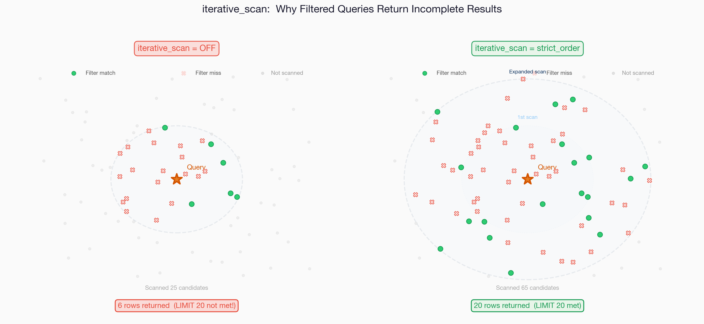
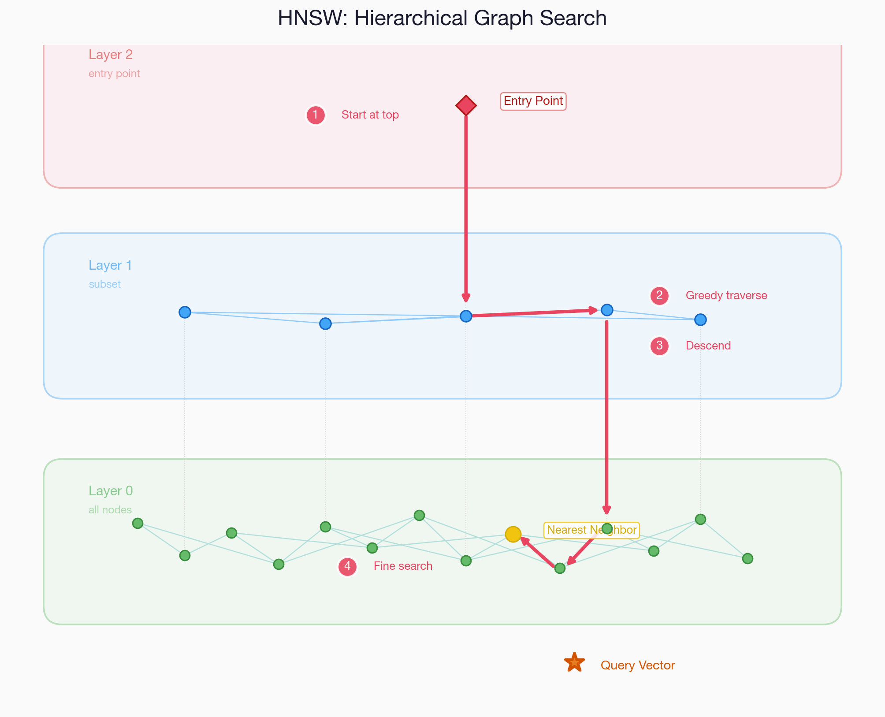
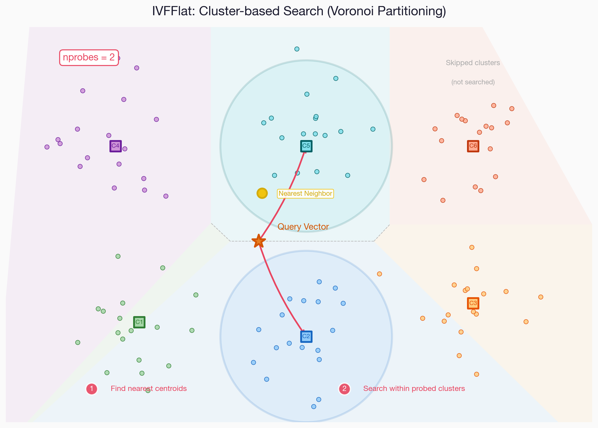

> This post documents the essential things you need to know when implementing vector search with pgvector's HNSW index. It covers the mechanics of iterative_scan, filtering strategies, and performance optimization. All text and images were created with Claude Code.

### Introduction

- pgvector is an extension[^1] that enables vector search in PostgreSQL
- It allows ANN (Approximate Nearest Neighbor) search within existing PostgreSQL infrastructure without introducing a separate vector database
- pgvector provides two types of ANN indexes: **HNSW and IVFFlat**. This post primarily covers the **HNSW** index

HNSW (Hierarchical Navigable Small World) is a graph-based ANN algorithm that provides both fast search speed and high recall[^2]. However, there are unexpected pitfalls when using it with WHERE filters, and failing to understand them can cause serious result omissions.

This post covers the following:

- The **missing results problem** when using **HNSW + WHERE filters** and how to solve it
- **Prefilter vs Postfilter** strategy comparison
- **HNSW parameter tuning guide**
- Index size management and **halfvec** optimization

### iterative_scan Problem

##### Incomplete Results Problem

When using the pgvector HNSW index, **if the WHERE filter is not included in the HNSW partial index condition**, **far fewer results than the requested LIMIT** may be returned.

```sql
-- HNSW partial index: WHERE embedding_type = 'image' (3 million rows)
-- Query adds model_id filter (condition not in the index!)

SELECT id, embedding <=> :query AS distance
FROM embeddings
WHERE embedding_type = 'image'          -- HNSW partial index condition
  AND model_id = :target_model          -- Filter not in the index!
ORDER BY embedding <=> :query
LIMIT 1000;
```

If this query requests LIMIT 1000 but returns **far fewer results**, it is because `hnsw.iterative_scan` is turned off.

##### Why This Happens

The HNSW index performs graph-based traversal. When `iterative_scan = off` (default), it works as follows:

1. Finds the `ef_search` (default 40) nearest candidates in the HNSW graph
2. Returns the found candidates to PostgreSQL
3. PostgreSQL applies the WHERE condition (`model_id = ?`) to filter them
4. Only results passing the filter remain -- if 50% belong to a different model, only ~20 remain
5. **LIMIT is 1000 but it ends with 20.** HNSW has already finished its traversal

The key point is that HNSW decides "I found 40, I'm done," and even though PostgreSQL says "I haven't filled 1000 yet," **it does not search further**.

<center></center>

The figure above illustrates this problem in a simplified form (based on LIMIT 20). On the left (OFF), HNSW scans only a small number of candidates and then terminates, leaving the results that pass the filter (green dots) far short of the LIMIT. On the right (strict_order), it repeatedly expands the scan range until the LIMIT is filled, securing sufficient results. The same principle applies even with large values like LIMIT 1000.

##### iterative_scan Modes

`hnsw.iterative_scan` is a session-level parameter introduced in pgvector 0.8.0[^3]. It is a feature that **repeats the HNSW traversal** until enough results satisfying the WHERE filter condition are collected to meet the LIMIT.

| Mode | Behavior | Distance Order Guaranteed | Use Case |
|------|------|:---:|------|
| `off` (default) | Terminates after single traversal | O | Simple search without filters |
| `strict_order` | Repeats until LIMIT is filled | O | **Must use when filters are present** |
| `relaxed_order` | Repeated traversal, approximate order | X (approximate) | Speed priority |

Traversal continues until LIMIT is reached or `max_scan_tuples` is reached.

##### Usage

```sql
-- Valid only within a transaction (does not affect other sessions)
SET LOCAL hnsw.iterative_scan = strict_order;
SET LOCAL hnsw.ef_search = 100;

-- Then execute the vector search query
SELECT id, embedding <=> :query AS distance
FROM embeddings
WHERE embedding_type = 'image' AND model_id = :target_model
ORDER BY embedding <=> :query
LIMIT 1000;
```

In SQLAlchemy:

```python
await db.execute(text("SET LOCAL hnsw.iterative_scan = strict_order"))
await db.execute(text("SET LOCAL hnsw.ef_search = 100"))
# Then execute ORM query
```

### Prefilter vs Postfilter

Two strategies for applying structured filters (categories, tenant IDs, date ranges, etc.) in vector search.

##### Postfilter Problem

- If a specific category represents 10% of the total, only ~100 results remain out of the top 1,000
- Increasing LIMIT to 50,000 does not fundamentally solve the problem (mass fetching from HNSW is very slow)

##### Prefilter 1: JOIN + ORDER BY

```sql
SELECT e.id, e.embedding <=> :query AS distance
FROM embeddings e
JOIN items i ON e.item_id = i.id
WHERE e.embedding_type = 'image'
  AND i.category = 'character'
  AND i.tenant_id = 'tenant_a'
ORDER BY e.embedding <=> :query
LIMIT 1000;
```

- When `iterative_scan` is enabled, it continues scanning until LIMIT rows satisfying the JOIN + WHERE conditions are found
- **Pros**: Simple implementation, no additional indexes needed
- **Cons**: The PostgreSQL planner may skip the HNSW index (when JOIN is complex or filter selectivity is low)

##### Prefilter 2: Denormalization + Partial Index

```sql
-- Copy frequently used filter columns to the embedding table
ALTER TABLE embeddings ADD COLUMN tenant_id VARCHAR(50);

-- Per-tenant HNSW partial index
CREATE INDEX idx_hnsw_tenant_a ON embeddings
  USING hnsw (embedding vector_cosine_ops)
  WHERE embedding_type = 'image' AND tenant_id = 'tenant_a';
```

- **Pros**: HNSW index is guaranteed to be used. Index size is also reduced, improving performance
- **Cons**: Data synchronization overhead. If there are many tenants, there will be many indexes

##### Prefilter 3: Table Partitioning

```sql
CREATE TABLE embeddings (...) PARTITION BY LIST (tenant_id);

CREATE TABLE embeddings_tenant_a PARTITION OF embeddings
  FOR VALUES IN ('tenant_a');
-- HNSW indexes are automatically created for each partition
```

- **Pros**: PostgreSQL automatically optimizes with partition pruning. Index management is systematic
- **Cons**: Large schema changes required. Partition key selection is critical

##### Prefilter Planner Behavior

An important caveat is that the PostgreSQL planner may not use the HNSW index depending on filter selectivity.

- When filter selectivity is high (many rows match the condition), the planner uses the HNSW index normally
- When filter selectivity is low (very few rows match the condition), the planner may **completely abandon HNSW** and switch to Bitmap Heap Scan or full scan + sort
- Results are accurate but very slow
- In such cases, method 2 (denormalization) or method 3 (partitioning) is needed

### HNSW Parameters

##### Index Build Parameters

Set during CREATE INDEX; rebuilding is required to change them.

| Parameter | Default | Description | Impact |
|---------|:---:|------|------|
| `m` | 16 | Maximum number of connections (edges) per node | Higher = recall up, **index size up**, slower build |
| `ef_construction` | 64 | Number of search candidates during build | Higher = graph quality up, slower build, **no size change** |

- **`m`**: The only parameter that directly determines index size. Each vector connects to at most m neighbors. Recommended range: 5-48
- **`ef_construction`**: Only affects build time. When inserting a new vector, ef_construction candidates are explored and m of them are connected. The recall difference between 64 and 200 is typically 1-3%

##### Query Parameters

Set at the session level with SET, applied immediately.

| Parameter | Default | Description | Impact |
|---------|:---:|------|------|
| `hnsw.ef_search` | 40 | Number of search candidates during query | Higher = recall up, speed down |
| `hnsw.iterative_scan` | off | Iterative traversal mode | **Must be enabled when filters are present** |
| `hnsw.max_scan_tuples` | 20000 | Maximum tuples visited during iterative traversal | Traversal stops when exceeded |
| `hnsw.scan_mem_multiplier` | 1 | Iterative traversal memory = work_mem x this value | Increase if running out of memory |

##### ef_construction vs ef_search

Two parameters that are frequently confused due to their similar names.

| | ef_construction | ef_search |
|---|---|---|
| **When** | During index build (once) | During search queries (every time) |
| **Role** | Determines graph connection quality | Determines search traversal range |
| **When increased** | Slower build, marginal recall improvement | Slower search, recall improvement |
| **Index size** | No impact (`m` determines this) | No impact |
| **Cost of change** | Index rebuild required (several hours) | Immediately applied with a single SET statement |

If search quality is insufficient, it is recommended to increase `ef_search` first, as it can be tested immediately without a rebuild.

### Index Size and Memory

##### Index Size Estimation

```
HNSW index size ≈ number of vectors x dimensions x 4 bytes x (1 + m x overhead)
```

| Number of Vectors | Dimensions | m | Estimated Index Size |
|:---:|:---:|:---:|:---:|
| 1M | 1024 | 16 | ~5 GB |
| 3M | 1024 | 16 | ~15 GB |
| 10M | 1024 | 16 | ~50 GB |
| 3M | 512 | 16 | ~7.5 GB |

##### When Index Exceeds shared_buffers

A common situation with large-scale vector tables. For example, 3M x 1024 dimensions means an index of ~15GB, while having shared_buffers at 3-4GB is typical.

**Symptoms**:

- First query takes over 10 seconds (cold cache, disk I/O)
- Repeated queries are fast (OS page cache hit)
- Slow again after server restart

**Mitigation strategies**:

1. **pg_prewarm**: Preloads the index into shared_buffers. However, if the index is larger than shared_buffers, full loading is not possible
   ```sql
   SELECT pg_prewarm('idx_hnsw_image');  -- Loads as much as possible
   ```
2. **OS page cache**: The OS caches frequently accessed pages outside of shared_buffers. With steady traffic, it naturally warms up
3. **Reduce index size**: The most fundamental solution. halfvec, dimensionality reduction, deleting unnecessary data
4. **Increase shared_buffers**: Recommended at 25-40% of instance memory. If the entire index can fit, cold start problem is solved

### halfvec Optimization

A **half-precision (float16) vector type** supported in pgvector 0.7.0+[^4]

| | vector (float32) | halfvec (float16) |
|---|:---:|:---:|
| Size per vector | 4 bytes x dim | 2 bytes x dim |
| For 1024 dimensions | 4 KB | 2 KB |
| Index size | Baseline | **~50% reduction** |
| Recall loss | - | Nearly none (~0.1%) |
| Build speed | Baseline | ~2x faster |

Most embedding models have negligible search quality loss at float16 precision.

##### Method 1: Column Type Change

```sql
ALTER TABLE embeddings
  ALTER COLUMN embedding TYPE halfvec(1024)
  USING embedding::halfvec(1024);

CREATE INDEX CONCURRENTLY idx_hnsw_halfvec
ON embeddings USING hnsw (embedding halfvec_cosine_ops)
WITH (m = 16, ef_construction = 64)
WHERE embedding_type = 'image';
```

##### Method 2: Index-only halfvec

```sql
-- Expression index using halfvec only for the index
CREATE INDEX idx_hnsw_halfvec
ON embeddings
USING hnsw ((embedding::halfvec(1024)) halfvec_cosine_ops)
WHERE embedding_type = 'image';
```

- Reduces index size while maintaining original data precision
- If re-ranking is needed, exact distances can be recalculated using the original float32 values

##### Considerations

- Queries also require `::halfvec(1024)` casting
- Pre-testing is recommended to confirm that the embedding model maintains quality at float16
- Most models are fine, but results may vary by model

### Partial Index and Partitioning

Two structural approaches to improve filtering performance in HNSW indexes.

##### Partial Index

An index that includes only rows matching specific WHERE conditions.

```sql
-- Split by embedding_type (basic)
CREATE INDEX idx_hnsw_image ON embeddings
  USING hnsw (embedding vector_cosine_ops)
  WHERE embedding_type = 'image';

-- Split by narrower conditions (performance optimization)
CREATE INDEX idx_hnsw_image_model_a ON embeddings
  USING hnsw (embedding vector_cosine_ops)
  WHERE embedding_type = 'image' AND model_id = 'model_a';
```

- **Pros**: Reduced index size, no filtering needed, faster traversal
- **Cons**: If conditions are dynamic, indexes must be created each time. Combinatorial explosion of indexes if there are many combinations

##### Table Partitioning

Physically separates the table based on filter columns.

```sql
CREATE TABLE embeddings (...) PARTITION BY LIST (model_id);

-- HNSW indexes can be automatically created for each partition
CREATE TABLE embeddings_model_a PARTITION OF embeddings
  FOR VALUES IN ('model_a');
```

- **Pros**: Automatic optimization through PostgreSQL partition pruning, systematic management
- **Cons**: Large schema changes required, partition key selection is critical (difficult to change later)

##### How to Choose

| Situation | Recommendation |
|------|------|
| 2-3 fixed filter values | Partial Index |
| Dynamic or many filter values | Table Partitioning |
| Need quick implementation | iterative_scan + ef_search tuning |
| Multi-tenant | Table Partitioning |

### HNSW vs IVFFlat

Two ANN (Approximate Nearest Neighbor) indexes provided by pgvector.

<center></center>

HNSW uses a multi-layer graph structure, greedily searching from the upper layers and descending to lower layers. It provides logarithmic-scale search speed.

<center></center>

IVFFlat clusters vectors using K-means, then searches only the cluster closest to the query centroid. The `nprobes` parameter controls the number of clusters to search.

| | HNSW | IVFFlat |
|---|---|---|
| **Algorithm** | Hierarchical graph traversal | Clustering + list scan |
| **Search speed** | Fast (logarithmic scale) | Moderate (proportional to number of lists) |
| **Recall** | High (good even with default settings) | Requires tuning (probes adjustment) |
| **Index build** | Slow (several hours) | Fast (several minutes) |
| **Index size** | Large (2-5x) | Small |
| **Data insertion** | Real-time reflection (graph auto-adapts) | Cluster imbalance -> periodic rebuild needed |
| **Filtering** | iterative scan | probes adjustment |

##### When to Choose HNSW

- Data is continuously added/changed
- Search quality (recall) is important
- Index build time and size are acceptable

##### When to Consider IVFFlat

- Data is mostly static (rarely changes)
- Vectors number in the tens of millions and HNSW memory is unmanageable
- Index builds need to be fast

### Build Optimization

Large-scale HNSW index builds (millions of rows) can take several hours. Optimization methods:

##### Increase maintenance_work_mem

```sql
SET maintenance_work_mem = '8GB';  -- Temporarily increase during build
CREATE INDEX CONCURRENTLY ...;
RESET maintenance_work_mem;
```

The build is much faster when the graph fits in maintenance_work_mem.

##### Parallel Build

```sql
SET max_parallel_maintenance_workers = 7;  -- Default is 2
```

pgvector 0.6+ supports parallel HNSW builds. Increasing workers can reduce build time by **up to 30x**[^5].

##### CONCURRENTLY Option

```sql
CREATE INDEX CONCURRENTLY idx_name ON ...;
```

- Builds the index without locking the table. Essential for production environments
- However, build time is longer and failed builds may leave INVALID indexes behind

##### Cloud Environment Tips

- AWS Aurora: Scale up the instance only during the build and scale down after completion. Serverless v2 is well-suited for this pattern
- maintenance_work_mem can safely be increased to 50-70% of instance memory since it is used exclusively for the build

### Optimization Roadmap

Recommended order for optimizing pgvector HNSW vector search:

1. **Immediate actions (code changes only)**: `iterative_scan = strict_order`, increase `ef_search` (40 -> 100)
2. **Data cleanup**: Delete unused model data, clean up unnecessary embedding types
3. **Index optimization**: Switch to halfvec (50% size reduction), per-condition partial index, increase shared_buffers
4. **Structural changes**: Table partitioning, dimensionality reduction (1024 -> 512), consider a dedicated vector DB

### Reference

[^1]: [pgvector GitHub](https://github.com/pgvector/pgvector)
[^2]: [HNSW Indexes with pgvector (Crunchy Data)](https://www.crunchydata.com/blog/hnsw-indexes-with-postgres-and-pgvector)
[^3]: [pgvector Iterative Index Scans (GitHub Issue #678)](https://github.com/pgvector/pgvector/issues/678)
[^4]: [Save 50% storage with halfvec (Neon Blog)](https://neon.com/blog/dont-use-vector-use-halvec-instead-and-save-50-of-your-storage-cost)
[^5]: [Accelerate HNSW indexing on Aurora (AWS Blog)](https://aws.amazon.com/blogs/database/accelerate-hnsw-indexing-and-searching-with-pgvector-on-amazon-aurora-postgresql-compatible-edition-and-amazon-rds-for-postgresql/)
[^6]: [pgvector 0.8.0 on Aurora PostgreSQL (AWS Blog)](https://aws.amazon.com/blogs/database/supercharging-vector-search-performance-and-relevance-with-pgvector-0-8-0-on-amazon-aurora-postgresql/)
[^7]: [pgvector HNSW Configuration Parameters (DeepWiki)](https://deepwiki.com/pgvector/pgvector/5.1.4-hnsw-configuration-parameters)
[^8]: [Optimizing Filtered Vector Queries (Clarvo Blog)](https://www.clarvo.ai/blog/optimizing-filtered-vector-queries-from-tens-of-seconds-to-single-digit-milliseconds-in-postgresql)
[^9]: [Scalar/Binary Quantization for pgvector (Jonathan Katz)](https://jkatz05.com/post/postgres/pgvector-scalar-binary-quantization/)
[^10]: [HNSW vs IVFFlat comparison (AWS Blog)](https://aws.amazon.com/blogs/database/optimize-generative-ai-applications-with-pgvector-indexing-a-deep-dive-into-ivfflat-and-hnsw-techniques/)
[^11]: [pgvector Performance Tips (Crunchy Data)](https://www.crunchydata.com/blog/pgvector-performance-for-developers)
