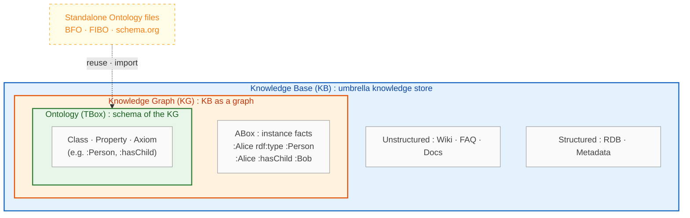
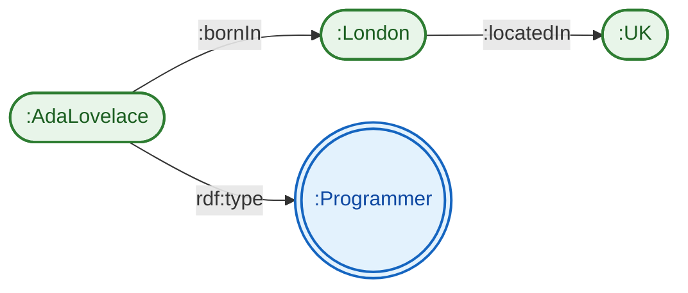
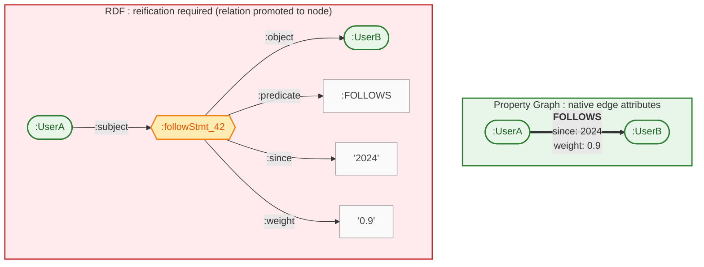
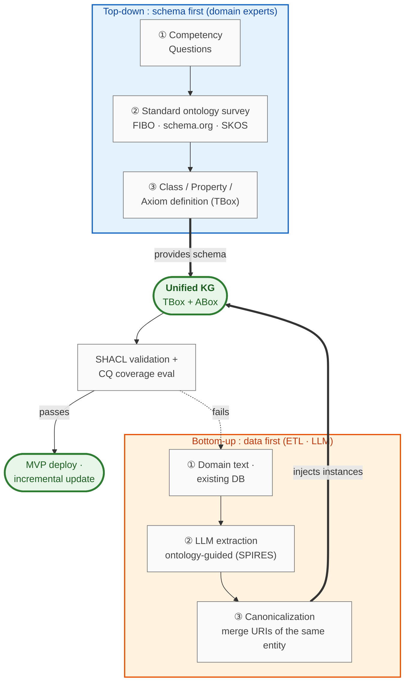
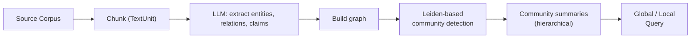
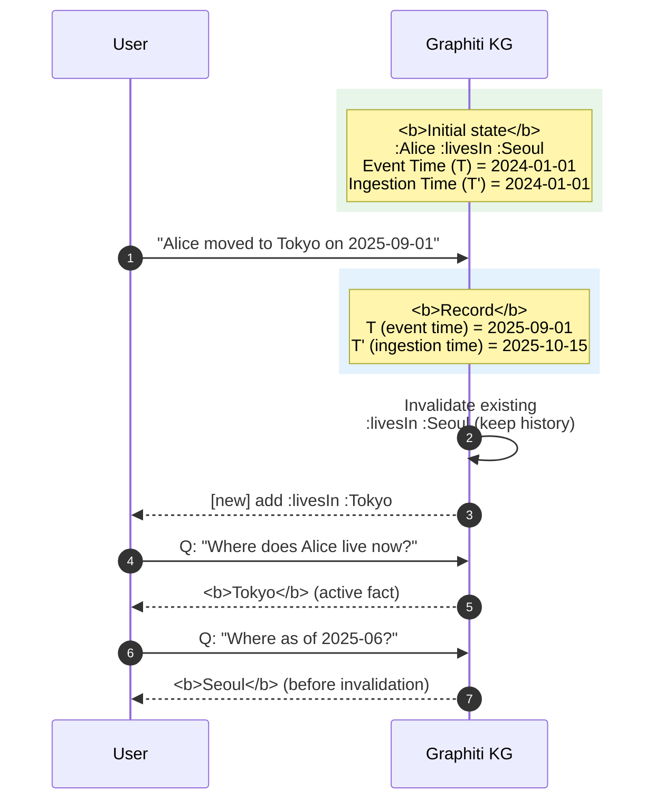
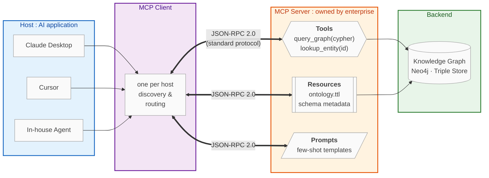
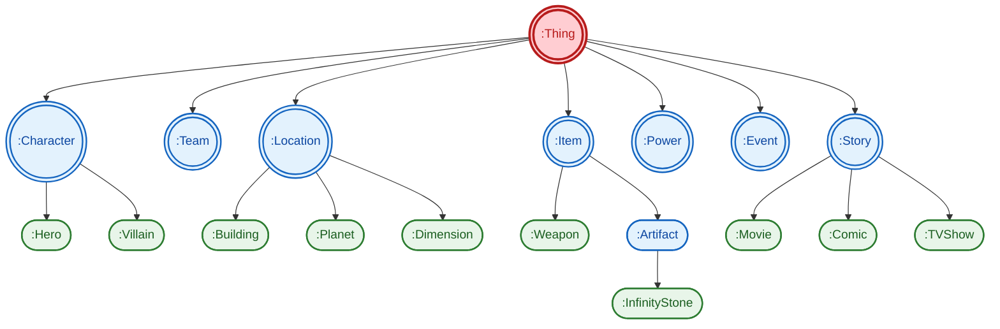
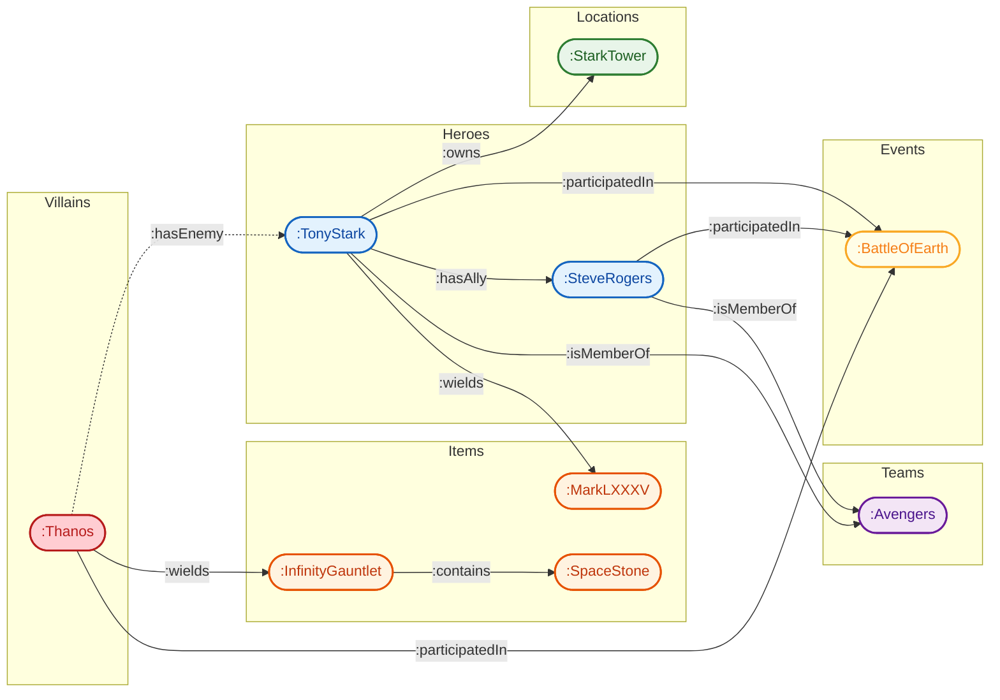

> A practical overview of Knowledge Graphs and Ontologies in the AI Agent era — the concepts, internal components, construction methodologies, and the latest techniques combining them with LLMs and agents. This post was re-organized and re-interpreted from the publicly available materials cited in the footnotes, with AI assistance (Gemini Deep Research + Claude Code). All rights to external materials belong to the original authors; please confirm specific numbers and specs with the primary sources.

### Introduction

Knowledge Graphs (KG) and Ontologies are not new ideas. They have existed since the early 2000s when the Semantic Web was taking shape, and after Google publicized the term *Knowledge Graph*[^1] in 2012, they became a go-to technique for enterprise data integration. More recently, with the rise of LLM-based Agents, KGs and Ontologies are drawing renewed attention as a way to compensate for the limits of plain vector search (Vector RAG) and to supply **structured knowledge** to agents.[^2][^3]

The three terms are often used interchangeably, but they are strictly different.[^4][^5]

- **Knowledge Base (KB)**: A knowledge repository grouped by topic — FAQs, wikis, Confluence pages, etc. Typically accessed by keyword search.[^5]
- **Knowledge Graph (KG)**: **Graph-based data** where entities are nodes and relations are edges. Instance-centric.[^4][^6]
- **Ontology**: A **formal schema** that specifies the concepts, relations, and constraints of a domain. Model-centric and relatively stable over time.[^4][^7]

> **Ontology is the schema; Knowledge Graph is the result of applying that schema to real data.**

The relationship between the three is better understood as **three roles at different abstraction levels**, not as a simple containment hierarchy. By scope of terminology, `KB ⊇ KG ⊇ Ontology` holds, but Ontologies circulate and are reused as standalone schema files even without a KG (BFO, FIBO, schema.org are the canonical examples).



- **KB** is the most general umbrella term, covering Wikis, RDBs, and KGs alike.
- **KG** sits inside that as the **graph-structured implementation** of a KB.
- **Ontology** corresponds to the schema (TBox) of a KG, but can exist as a standalone file outside any KG.

Where Vector RAG injects "semantically similar document chunks" into the prompt, KG+Ontology-based approaches retrieve "precise facts by traversing explicit relations."[^8][^9] The former is easy to build and strong on unstructured data, but **structurally weak at multi-hop reasoning and explainability**.[^9] When an agent must answer something like "top 3 subsidiaries of company A by revenue in country B," vector similarity alone cannot guarantee correctness.[^8][^9]

From an agent perspective, KG+Ontology delivers three core capabilities.[^2][^32]

1. **Persistent Memory**: Goes beyond stateless LLM calls — past workflow outputs, user preferences, and system change history are stored and queried as nodes and edges. This enables stateful agents that maintain state over weeks to months.[^32]
2. **Hallucination control and explainable reasoning**: Every response is **anchored** to specific graph relations, so the reasoning path can be reconstructed as a sequence of nodes and edges (audit trail).[^2][^32] This is decisive in finance, healthcare, and legal domains where accuracy and compliance matter.
3. **Multi-hop reasoning + fine-grained access control**: Multi-piece queries can be answered via graph traversal, and **fine-grained access control** can be enforced at the graph layer. Tied to enterprise identity, the agent can be structurally constrained to only data within the user's permission scope.[^9][^32]

This post covers:

- **Background terminology** and standards (RDF/OWL/SPARQL, Property Graph) needed to understand KGs and Ontologies.
- **Construction methodologies** (METHONTOLOGY, NeOn, competency questions) and real enterprise cases (Google, LinkedIn, Uber, Amazon).
- **LLM-based automated construction** (GraphRAG, OntoGPT) and **KGs as agent memory** (Zep/Graphiti).

### Basics

##### Terminology

Key terms that recur throughout the post.

**Data model**

- **Entity / Node / Vertex**: A point in the graph — a person, product, place, event, etc.
- **Edge / Relationship / Relation**: A directed connection (e.g. `bornIn`, `hasAuthor`).
- **Triple**: `<subject, predicate, object>` — the atomic fact unit (RDF's basic form).
- **Literal**: A raw value that is not a URI (string, number, date).
- **URI / IRI**: Global identifier for entities and properties.

**Schema / Ontology**

- **Class / Instance**: Type (`Person`) / specific instance (`AdaLovelace`).
- **Property / Predicate**: Attribute or relation. **Datatype** (→ literal) vs **Object** (→ entity).
- **Domain / Range**: Class constraints on a property's subject and object.
- **Axiom / Constraint**: Logical axioms (e.g. subclass) / instance-level constraints (cardinality, disjointness).
- **TBox / ABox**: Schema-level knowledge / instance-level facts.
- **Reasoning / Inference / Entailment**: The process and result of deriving new facts from axioms.
- **Reasoner**: An engine that computes entailment (HermiT, Pellet, ELK).

**W3C Semantic Web Stack**

- **RDF**: Resource Description Framework — triple-based graph data model.
- **RDFS**: RDF Schema — lightweight schema with class, subClassOf, domain, range.
- **OWL**: Web Ontology Language — Description Logic-based ontology language.
- **SPARQL**: Query language for RDF (a recursive acronym).
- **SHACL / SKOS / GQL**: shape validation / taxonomy vocabulary / ISO query language for Property Graphs.

**Graph DB · Misc**

- **Triple Store vs Property Graph (LPG)**: RDF storage DB (Jena, Stardog) vs nodes/edges with native properties (Neo4j, Memgraph).
- **Named Graph / Reification**: Attaching graph context / promoting a relation to a node so metadata can hang on it.
- **Competency Question (CQ)**: A list of natural-language questions the ontology must answer.
- **Canonicalization**: Collapsing different spellings of the same entity into one canonical URI.

##### Entity, Relation, Triple

The basic unit of a KG is a **triple**, a binary proposition of the form `<subject, predicate, object>`.[^10][^11] For example, "Ada Lovelace is a programmer and was born in London" becomes:

```
<:AdaLovelace, rdf:type, :Programmer>
<:AdaLovelace, :bornIn, :London>
<:London, :locatedIn, :UK>
```

These three triples form the graph below. Shapes distinguish **Instance (rounded rectangle)** from **Class (circle)**.



Subject and predicate are global identifiers (URIs); object can be a URI or a literal.[^11] A collection of triples forms an **RDF graph**, and because they share the same shape, **data from different domains and sources can be merged into a single graph** — the whole point of the Semantic Web's "web of linked data" vision.[^11]

##### RDF, RDFS, OWL, SPARQL

The W3C stack surrounding RDF is called the **Semantic Web stack**. Each layer adds expressive power.[^11][^12]

| Layer | Role | What you can express |
|---|---|---|
| **RDF** | Data model | Entities and relations as triples |
| **RDFS** | Lightweight schema | class, subClassOf, domain, range |
| **OWL** | Rich ontology language | cardinality, disjointness, equivalence, inverse, etc. |
| **SPARQL** | Query language | Graph pattern matching, aggregation, federated queries |
| **SHACL** | Shape validation | Data integrity (schema validation) |

**RDFS** provides the basic type system (class, subClassOf, domain, range),[^12] and **OWL** adds description-logic axioms like cardinality, disjointness, and inverse.[^7] Thanks to these axioms, a reasoner can infer facts that were never stated explicitly. For instance, given the axiom "`:hasMother` is the inverse of `:hasChild`," the fact "Alice is Bob's mother" automatically entails "Bob is Alice's child."[^7]

**SPARQL** is the SQL-like query language for RDF graphs.[^13]

```sparql
PREFIX : <http://example.org/>
PREFIX rdf: <http://www.w3.org/1999/02/22-rdf-syntax-ns#>

SELECT ?person ?city
WHERE {
  ?person rdf:type :Programmer .
  ?person :bornIn ?city .
  ?city :locatedIn :UK .
}
```

Pattern matching lets you traverse multi-step relations in a single query.[^13] With an ontology-based **entailment regime** (RDFS/OWL reasoner) turned on, the result set includes facts that were not stored explicitly.[^12]

##### TBox vs ABox

- **TBox**: **Schema-level** knowledge — class hierarchy, property constraints, axioms.
- **ABox**: **Data-level** facts about specific instances, like "Alice is a Programmer."

> Ontology usually refers to the TBox; Knowledge Graph refers to TBox + ABox together.[^4][^7] TBox is relatively stable, while ABox is continuously updated via ETL and LLM extraction.[^3][^14]

##### RDF Graph vs. Property Graph

When picking a "graph database" in practice, you're choosing between RDF-family and **Property Graph**-family systems.[^15][^16]

| Criterion | RDF Graph (Triple Store) | Property Graph |
|---|---|---|
| **Edge attributes** | Not native (reification required) | Native |
| **Standards** | W3C standards (RDF, OWL, SPARQL) | De facto only (openCypher, GQL in progress) |
| **Query language** | SPARQL | Cypher (Neo4j), Gremlin (TinkerPop), GQL |
| **Identifier** | Global URIs (strong interop) | Local IDs (in-app) |
| **Reasoning** | Easy to couple with OWL reasoners | Not native (done in app / ML) |
| **Representative products** | Apache Jena, Stardog, GraphDB, AllegroGraph | Neo4j, TigerGraph, Memgraph, Amazon Neptune (supports both) |

**Property Graph** lets you attach attributes directly to edges — `(:User)-[:FOLLOWS {since: 2024}]->(:User)` — which is convenient for application modeling.[^15] **RDF**, on the other hand, requires reification (promoting the relation to a node) to express edge attributes, so the same fact takes a bit more structure. In exchange, RDF's URI-based global identifiers give it excellent **interoperability**, and its standard ontology ecosystem (OWL reasoners, FIBO, etc.) is rich.[^15][^17] Because of that, in domains like pharma and finance where multi-party integration matters, a hybrid pattern — "RDF for the knowledge layer, Property Graph for the algorithm layer" — is becoming the norm.[^15]

The edge-attribute difference looks like this. To express the same fact ("UserA follows UserB since 2024 with weight 0.9"), **PG needs one edge**, while **RDF needs an extra node + three triples**.



Rule of thumb: **app-centric, fast-iteration** → Property Graph; **standards, reasoning, multi-party integration** → Triple Store; **large enterprise data fabric** → hybrid.

### Common Practice

##### Construction methodologies: METHONTOLOGY, NeOn, Competency Questions

The classical ontology-engineering methodologies are **METHONTOLOGY** and its successor **NeOn**.[^18][^19] NeOn is a scenario-based method that combines nine optional scenarios (ontology reuse, collaborative development, etc.), and its common phases are:[^18][^19]

1. **Requirements specification** — define purpose and scope.
2. **Competency Questions (CQ)** — list natural-language questions the ontology must answer.
3. **Conceptualization → Formalization** — implement classes, properties, and constraints in OWL/RDFS.
4. **Evaluation** — verify CQ coverage and SHACL integrity.
5. **Maintenance** — keep up with domain change.

**Competency Questions** are the key deliverable of the design phase.[^20] They turn abstract requests like "let's turn our company knowledge into an ontology" into **verifiable questions** like "the list of payment-failure cases in the Korea region in 2024 Q3 classified as merchant-account issues." A survey reports that 85% of ontology-engineering practitioners use CQs; it is the de facto standard for quality assessment.[^20]

##### Top-down vs. Bottom-up vs. Hybrid

Three strategies dominate real-world KG/Ontology construction.[^3][^14]

| Strategy | Description | Pros | Cons |
|---|---|---|---|
| **Top-down** | Domain experts design the ontology (TBox) first, then map data | Polished schema, high reasoning quality | High upfront cost, risk of divergence from real data |
| **Bottom-up** | Extract entities/relations from data/text, normalize later | Fast start, reflects real data | Schema duplication/inconsistency, hard governance |
| **Hybrid** | Start from a standard ontology (FIBO, schema.org) and extend | Standard compliance + speed balance | Learning cost for standards |

Most success stories are **hybrid**.[^14] For example, a finance project imports the relevant subset of **FIBO** (Financial Industry Business Ontology)[^17], and a search/commerce project starts from **schema.org**[^21] product/review types and extends domain-specific classes.



##### Real cases

- **Google Knowledge Graph**[^1][^22]: Announced in 2012. A graph holding 500B+ facts that powers the "entity cards" in search results and backs Google Assistant's Q&A.
- **LinkedIn Economic Graph + LIquid**[^22][^33]: A huge graph that represents the global economy (workers, skills, companies, schools, job postings) with **270 billion edges**. The original RDBMS hit a wall with hundreds of JOINs causing cross-product explosions, so LinkedIn built **LIquid**, a custom distributed in-memory graph DB, now in its 4th generation. With a single **Datalog-based declarative query** it handles **2M QPS**, enabling real-time connection analyses like PYMK (People You May Know) at a level the previous stack could not reach.[^33] The key design choice: making edges first-class citizens and supporting live schema extension.
- **Amazon Product Graph**[^22]: Products modeled as a graph rather than a category tree, making relations like "compatible parts," "substitutes," and "frequently bought together" first-class. Directly improves recommendation and search quality.
- **Uber Databook + CRISP**[^22][^23][^34]: To tackle data silos across thousands of microservices and heterogeneous stacks (Hive, Kafka, Cassandra, …), Uber built **Databook**, a KG-based metadata catalog. Instead of a plain wiki they chose a KB model to automate data ownership and quality checks.[^34] On top of that, they generate service-dependency graphs from Jaeger distributed-tracing RPC logs and use **CRISP** to visualize the **critical path** of end-to-end request latency, pinpointing performance bottlenecks.[^34] A case that shows KGs being used not just for knowledge storage but also as an **observability tool** for distributed architectures.
- **Uber Eats Food KG**[^23]: A food graph connecting restaurants, cuisines, menu items, and ingredients — captures user intent precisely to improve search and recommendations.
- **Airbnb, eBay, Facebook**, etc., also run KGs as core infrastructure in commerce and social domains.[^22]

Common lessons converge on three: **start with concrete KPIs**, **reuse standard ontologies**, **introduce SHACL-based governance early**.

##### KG vs Ontology: matching the problem

| Problem type | Better fit | Why |
|---|---|---|
| Product recommendation (tens of millions of instances, frequent updates) | **Knowledge Graph** focus | Instance scale and update frequency dominate |
| Regulatory reasoning (finance, healthcare) | **Ontology** focus (OWL reasoner) | Requires formal-logic derivation of rules |
| Agent long-term memory | **Temporal KG** | Track how facts change over time |
| Document Q&A (large unstructured corpus) | **Vector RAG first**, supplement with KG | Structuring cost outweighs benefit |
| Multi-hop analytics (BI, fraud detection) | **Knowledge Graph** | The value IS relation traversal |
| Data integration (many sources, schema drift) | **Ontology-centric KG** | Align via a shared concept system |

### Recent Techs

##### LLM-based KG

Historically the main blocker for KG construction was the cost of **information extraction** — entity and relation extraction required hand-built rule parsers, span classifiers, and relation classifiers per domain. LLMs fundamentally changed that cost structure.[^3][^14]

**GraphRAG (Microsoft Research)**[^24][^25] was open-sourced in 2024 and quickly became a de facto reference. A simplified flow:



1. Split input documents into fixed-size chunks (officially called **TextUnits**).
2. Extract **Entities** and **Relationships** from each TextUnit via an LLM prompt. In the official GraphRAG knowledge model, "claim"-like information is covered by a separate **optional** extraction step called **Covariate**.
3. Run **Leiden community detection** on the resulting graph to build hierarchical clusters, then have the LLM summarize each community. Leiden fixes Louvain's disconnected-community issue and optimizes modularity more stably.[^36]
4. At query time, the community summaries power **global sensemaking** questions — the kind plain vector RAG struggles with.

The current standard pattern for squeezing more quality out of extraction is to use automated prompt optimizers like **DSPy · TextGrad**. Instead of hand-tuning prompts, you provide a handful of few-shot examples and the system learns the optimal prompt on its own.[^14]

On benchmarks (the original paper evaluates on Podcast transcripts and News articles, each ~1M tokens), GraphRAG clearly beats plain RAG on **Comprehensiveness and Diversity** with a 72–83% win rate.[^24] A follow-up survey[^40] notes, however, that it is **weaker on time-sensitive queries that require real-time updates** — around 16.6% lower accuracy than baseline RAG in that setting — and that the cost of community recomputation and re-summarization is a **major production bottleneck** in tokens and latency.

The follow-up architecture built to address this cost is **LightRAG**[^37]. Rather than rebuilding the whole graph every time, it runs **two-level retrieval** — low-level for specific entities and high-level for topic areas — in parallel, and handles new documents with an **incremental update** that touches only the related nodes. According to the paper, token consumption per query drops by thousands of times compared to GraphRAG (e.g., 100 tokens vs 600K+), and cost falls to $0.15 vs $4–$7.[^37] As a result, in environments where data changes frequently, it is quickly becoming the go-to alternative to GraphRAG.

**Ontology-guided extraction** is another active direction. A representative example is **SPIRES** (Structured Prompt Interrogation and Recursive Extraction of Semantics), proposed by **OntoGPT**[^26]. It does not let the LLM freely extract arbitrary entities. Instead, it **pre-injects the existing ontology's classes and properties into the prompt**, constraining the model to "only extract instances of the defined classes, and only link them via the defined properties."[^26] Whereas vanilla GraphRAG accepts any relation the LLM deems relevant, ontology-guided extraction yields results that stay faithful to the domain's standards.[^3]

In domains where a standard already exists (e.g., finance with FIBO), ontology-guided extraction is especially effective.[^17][^26] In domains without an ontology, a **two-step loop** is practical: bottom-up LLM extraction → clustering-based ontology candidate → human review/curation → ontology-guided re-extraction.[^3][^14]

##### KG as Agent Memory

Memory for agents — long conversations, per-user profiles, per-user facts — was a big theme in 2024–2025. Embedding dialogue logs into a vector store and retrieving by similarity was the default, but it struggles with **facts that change over time** (e.g., "user Alice: Seoul → Tokyo in 2025") and with **relation-based queries**.[^27]

**Zep (getzep) and its core engine Graphiti**[^27][^28] solve this with a **Temporal Knowledge Graph**. The key design is **bi-temporal modeling**.[^27]

- **Event Time (T)**: when the fact actually happened / held.
- **Ingestion Time (T′)**: when the system observed or recorded the fact.

Because every node and edge carries both axes, you can distinguish "Alice's residence as known on 2025-06-30" from "Alice's residence as of now."[^27] When a new fact arrives, conflicting prior facts are **invalidated**, but history is preserved.[^27][^28]



According to the paper, on the **Deep Memory Retrieval (DMR)** benchmark Zep edges out MemGPT (94.8% vs 93.4%), and on **LongMemEval** it reports up to +18.5% accuracy with −90% response latency vs the baseline.[^27] The Graphiti implementation combines semantic embeddings + BM25 keyword search + graph traversal as a **hybrid search** and achieves P95 ~300ms retrieval.[^28]

| Aspect | Plain vector memory | Temporal KG (Zep/Graphiti) |
|---|---|---|
| **Data structure** | embedding + document chunk | entity/relation graph + embedding |
| **Time-changing facts** | Old embeddings surface together (conflicts) | Bi-temporal specifies "as-of when" |
| **Multi-hop relations** | Weak | Natural graph traversal |
| **Schema** | Implicit | Explicit (prescribed) + learned |
| **Latency** | Very low | Low (reported P95 ~300ms) |
| **Implementation complexity** | Low | Medium+ |

Graphiti also ships an **MCP (Model Context Protocol) server**, so MCP-capable agents (Claude Desktop, Cursor, etc.) can plug it in directly as a memory backend.[^28] It is becoming a practical choice for attaching "structured long-term memory" to LLM agents.

##### Agent–KG integration patterns

Three patterns are consolidating as the standard ways to connect agents and KGs.[^29]

1. **Tool-based access**: Expose `query_graph(cypher | sparql)` as a tool and let the agent call it. Most intuitive, but the agent must handle the query language directly.
2. **Retrieval-augmented**: Extract a relevant subgraph and inject it into the prompt context. GraphRAG's local search is an example.
3. **Graph-based tool/agent routing**: Organize the available tools and sub-agents as a graph, then trace the capability path required by the query to select the right tool. The **Agent-as-a-Graph**[^29] paper reports **+14.9%p Recall@5 and +14.6%p nDCG@5** over the previous SOTA on LiveMCPBench.

The third pattern is drawing extra attention as the **MCP (Model Context Protocol)**[^38] ecosystem grows. MCP is a JSON-RPC 2.0-based open standard following a host (AI application) ↔ client ↔ MCP server structure. The server exposes three main **server-side primitives** — **Tools** (executable actions, e.g. `query_graph(cypher)`), **Resources** (context like ontology files and metadata), and **Prompts** (reusable instruction templates).[^38] (Client-side primitives — Sampling, Roots, Elicitation — exist separately.)

Build a single MCP server on top of your internal KG and any host (Claude Desktop, Cursor, etc.) can discover and connect to it the same way. This structurally resolves the "N×M integration explosion" problem.



Once you have hundreds of tools, "which tool to use when" becomes a search/reasoning problem itself, and KGs can provide structural hints for that selection.[^29] On the agent-orchestration side, **LangGraph** defines agent flow as a state-machine-style graph and allows **cycles**, making self-correction loops like "if the Cypher result is thin, revise and retry" natural to implement.[^39]

##### KG Embedding

Classical KGE techniques are relevant again in the LLM-combined world.[^30][^31]

- **TransE**[^30]: Train embeddings so that $\mathbf{h} + \mathbf{r} \approx \mathbf{t}$ for a triple $(h, r, t)$. Models relations as "translations in vector space." Simple, but weak at 1:N relations.
- **Node2Vec**[^31]: Learn node embeddings that preserve neighborhood structure via biased random walks. Still a strong baseline for link prediction and KG completion.
- **ComplEx, RotatE, ULTRA**: Extend to complex numbers, rotations, and multi-relational structure to better capture symmetric/asymmetric relations.

KGE remains valuable in the LLM era because **LLM embeddings encode natural-language meaning but do not directly reflect graph-structural relations**.[^31] You can combine both in retrieval, or use KGE for **link prediction to fill in the gaps of an ontology (KG completion)**.[^31]

##### Github Projects

KG/Agent-related open-source projects with **more than 10k GitHub stars, production-proven as of April 2026**. If you're starting fresh, mixing and matching these is the realistic path.

| Category | Project | Stars | Purpose |
|---|---|---:|---|
| **Graph-based RAG** | [microsoft/graphrag](https://github.com/microsoft/graphrag) | 32k | LLM-generated KG + Leiden-based global summary[^25] |
| | [HKUDS/LightRAG](https://github.com/HKUDS/LightRAG) | 33k | Lightweight alternative to GraphRAG, two-level retrieval[^37] |
| | [infiniflow/ragflow](https://github.com/infiniflow/ragflow) | 78k | RAG·Agent engine with GraphRAG |
| **Agent Memory / KG** | [getzep/graphiti](https://github.com/getzep/graphiti) | 25k | Temporal KG, bi-temporal modeling[^28] |
| | [mem0ai/mem0](https://github.com/mem0ai/mem0) | 53k | Generic agent memory layer |
| **Agent orchestration** | [langchain-ai/langchain](https://github.com/langchain-ai/langchain) | 134k | De facto LLM orchestration standard |
| | [langchain-ai/langgraph](https://github.com/langchain-ai/langgraph) | 30k | State-machine/cyclic agent graphs[^39] |
| | [crewAIInc/crewAI](https://github.com/crewAIInc/crewAI) | 49k | Role-based multi-agent collaboration |
| | [run-llama/llama_index](https://github.com/run-llama/llama_index) | 49k | Data/KG indexing framework |
| **LLM programming** | [stanfordnlp/dspy](https://github.com/stanfordnlp/dspy) | 34k | Auto prompt optimization, useful for extraction pipelines |
| **MCP** | [modelcontextprotocol/servers](https://github.com/modelcontextprotocol/servers) | 84k | Official MCP reference server collection |
| | [modelcontextprotocol/python-sdk](https://github.com/modelcontextprotocol/python-sdk) | 23k | Official Python SDK |
| **Graph DB (Property Graph)** | [neo4j/neo4j](https://github.com/neo4j/neo4j) | 16k | Flagship Property Graph DB, Cypher |
| | [dgraph-io/dgraph](https://github.com/dgraph-io/dgraph) | 22k | Distributed GraphQL-based graph DB |
| | [vesoft-inc/nebula](https://github.com/vesoft-inc/nebula) | 12k | High-performance distributed graph DB |
| | [arangodb/arangodb](https://github.com/arangodb/arangodb) | 14k | Multi-model (graph + doc + KV) |
| **Graph ML / KGE** | [pyg-team/pytorch_geometric](https://github.com/pyg-team/pytorch_geometric) | 24k | Standard GNN/KGE library |
| | [dmlc/dgl](https://github.com/dmlc/dgl) | 14k | Deep Graph Library |
| **Visualization** | [cytoscape/cytoscape.js](https://github.com/cytoscape/cytoscape.js) | 11k | Interactive KG visualization |

> Plenty of useful projects have fewer than 10k stars — JanusGraph, Apache AGE (Postgres graph extension), KuzuDB, Memgraph, OntoGPT, etc. The curated "battle-tested" list above is simply a safer starting point.

### Practical Roadmap

Recommended order for introducing KG/Ontology in production.

1. **Problem definition**: Spell out queries that Vector RAG alone cannot handle (multi-hop, time-varying, regulatory, explainability).
2. **Competency Questions**: Define 10–30 natural-language questions the system must answer.
3. **Standards reuse**: Check applicability of schema.org, FIBO, SKOS, BFO, etc.
4. **MVP graph**: Start small with 20–30 core entities/relations.
5. **Extraction pipeline**: Ontology-guided LLM extraction (SPIRES) + canonicalization.
6. **Governance**: SHACL validation, schema review, versioning.
7. **Agent integration**: Expose via tool-based or GraphRAG pattern; use Graphiti/Zep for long-term memory.
8. **Continuous improvement**: Expand CQs; use KGE to auto-suggest missing relation candidates.

### Conclusion

KG and Ontology are old tech, but their practical value is being re-evaluated in the LLM/Agent era where demand for "trustworthy structured knowledge" is growing. The key takeaways:

- **Ontology = TBox, KG = TBox + ABox**. Nailing the terminology keeps design discussions coherent.
- **RDF/OWL vs Property Graph** is an interop ↔ app-convenience trade-off. Enterprise integration → former; fast app dev → latter.
- **Start construction from Competency Questions**, and go **Top-down + Bottom-up hybrid**.
- **LLMs lowered construction cost**, but ontology-guided extraction wins on both quality and maintainability.
- **Temporal KG** (Zep/Graphiti) is a compelling option for agent long-term memory that complements plain vector memory.

If Vector RAG is "similarity-based memory" and KG is "relation-based memory," the real-world standard is likely to be a **hybrid** of the two. It matters as much *how knowledge is connected* as *what is known.*

### Example

As a concrete example, let's sketch how to design the **Marvel/Avengers IP universe** as a KG/Ontology, intended as a knowledge dictionary for agents to consult. With countless characters, places, items, and events tangled across comics, films, and shows, and with facts that shift along time and universe axes (Civil War, the Snap, the multiverse…), KGs fit especially well.

##### Ontology Sketch (TBox)

Start by defining the core classes and properties. 20–30 items is a practical starting point.



> Circle (◯) = abstract class (has sub-classes), rounded rectangle (▭) = concrete leaf class.

```
Core Property:
  :hasAlias            Character → Literal
  :hasPower            Character → Power
  :wields              Character → Item
  :isMemberOf          Character → Team        (temporal)
  :hasAlly / :hasEnemy Character → Character   (symmetric)
  :locatedIn           Building → Location
  :appearedIn          Character → Story
  :participatedIn      Character → Event
  :occurredAt          Event → Location

Example axioms:
  :InfinityStone rdfs:subClassOf :Artifact
  :Character owl:disjointWith :Item
  :hasEnemy a owl:SymmetricProperty
```

##### ABox example

Populating the TBox above with actual instances yields the graph below. Instances of the same class are grouped and color-coded.



##### Pin down requirements with Competency Questions

Representative questions the Marvel KG must answer. This list doubles as the **schema-validation and agent-evaluation set**.

- "Who are the characters that held an Infinity Stone at some point?"
- "Which characters' Avengers membership changed across Civil War?"
- "Among heroes who directly fought Thanos, who died in Phase 4?"
- "Which non-Stark-aligned characters used equipment made by Stark Industries?"

The first demands **time-axis tracking** on `:wields`/`:hadItem`; the second demands **bi-temporal modeling**. Writing CQs first naturally exposes needs like "`:isMemberOf` should carry a time interval, not just a single edge."

##### Handling time and multi-universes

The IP-universe-specific challenge is **branching in time and across universes**. Death-and-revival (Snap, Endgame), time travel, multiverse (What If, Spider-Verse) — all coexist. A **Temporal KG + Named Graph** combo handles this nicely.

- Attach event time to each fact: `:TonyStark :status "deceased" @t=2024-Endgame`.
- Split by universe/timeline as named graphs: `<Earth-616>`, `<Earth-199999(MCU)>`, `<Earth-TRN734>` are distinct contexts.
- With Graphiti's **bi-temporal modeling** applied, queries like "MCU Earth-199999's Avengers lineup at the end of Phase 4" stay clean.

##### Construction strategy

1. **Top-down (TBox first)**: Define ~20–30 core classes as above. Reuse parts of `schema.org` (`Person`, `CreativeWork`, `Place`) and add IP-specific classes on top.
2. **Bottom-up (LLM extraction)**: Run ontology-guided extraction (SPIRES) over the Fandom **Marvel Database** wiki text to harvest instances at scale, followed by canonicalization.
3. **Absorb external KGs**: **Wikidata** already has rich Marvel character/actor/film data, and since everything is URI-based you can connect via `owl:sameAs`. Marvel's official API serves as a supplementary source.

##### Implementation stacks and references

- **Neo4j (Property Graph)**: `(c:Character)-[:WIELDS {since:"IronMan1", movie:"M001"}]->(i:Item)` — **edge properties** make it easy to attach context, a fit for fan apps and games.
- **Triple Store + SPARQL**: Good if you need Wikidata federated queries and OWL reasoning. Absorb external URIs like `wd:Q7747` directly.
- **Expose through an MCP server**: Wrap the graph with tools like `lookup_character` and `find_shared_events` as an MCP server, and hosts like Claude Desktop and Cursor can call it directly.

Real references worth studying: Meta AI's **LIGHT** (a fantasy world modeled as a KG for agent training), **the Marvel Cinematic Universe subgraph on Wikidata**, and the fan-community-run **Fandom/Marvel Database**. None is complete, so a realistic pattern is "absorb multiple sources into shared canonical URIs → add domain-specific relations and time axes."

##### Anticipated agent use cases

- **Fan Q&A bot**: "How many Mark suit versions does Tony Stark have?" → from `:TonyStark` follow `:wields` and count nodes of `rdf:type :IronManArmor`.
- **Spoiler-aware answers**: Record the user's "latest watched point" in the graph → combine `:appearedIn` with release order to hide facts beyond that point.
- **Content recommendation**: Favorite-character vector + multi-hop traversal on `:appearedIn` to suggest unwatched works where that character plays a key role.
- **Screenwriter's aid**: Instantly query "common past events of these two characters" as multi-hop.

### Reference

[^1]: [Introducing the Knowledge Graph: things, not strings (Google, 2012)](https://blog.google/products/search/introducing-knowledge-graph-things-not/)
[^2]: [From RAG to Knowledge Graphs: Why the Agent Era Is Redefining AI Architecture](https://dev.to/sreeni5018/from-rag-to-knowledge-graphs-why-the-agent-era-is-redefining-ai-architecture-3fgc)
[^3]: [From LLMs to Knowledge Graphs: Building Production-Ready Graph Systems in 2025](https://medium.com/@claudiubranzan/from-llms-to-knowledge-graphs-building-production-ready-graph-systems-in-2025-2b4aff1ec99a)
[^4]: [What's the Difference Between an Ontology and a Knowledge Graph? (Enterprise Knowledge)](https://enterprise-knowledge.com/whats-the-difference-between-an-ontology-and-a-knowledge-graph/)
[^5]: [Knowledge Base vs Knowledge Graph (Tom Sawyer Software)](https://blog.tomsawyer.com/knowledge-base-vs-knowledge-graph)
[^6]: [What Is a Knowledge Graph? (IBM)](https://www.ibm.com/think/topics/knowledge-graph)
[^7]: [OWL 2 Web Ontology Language Primer (W3C)](https://www.w3.org/TR/owl2-primer/)
[^8]: [Graph RAG vs Vector RAG: 3 differences, pros and cons, and how to choose (Instaclustr)](https://www.instaclustr.com/education/retrieval-augmented-generation/graph-rag-vs-vector-rag-3-differences-pros-and-cons-and-how-to-choose/)
[^9]: [Knowledge Graph vs. Vector RAG: Benchmarking & Optimization (Neo4j)](https://neo4j.com/blog/developer/knowledge-graph-vs-vector-rag/)
[^10]: [Resource Description Framework (Wikipedia)](https://en.wikipedia.org/wiki/Resource_Description_Framework)
[^11]: [RDF 1.1 Primer (W3C)](https://www.w3.org/TR/rdf11-primer/)
[^12]: [RDF Schema 1.1 (W3C)](https://www.w3.org/TR/rdf-schema/)
[^13]: [SPARQL 1.1 Query Language (W3C)](https://www.w3.org/TR/sparql11-query/)
[^14]: [LLM-empowered knowledge graph construction: A survey (2025)](https://arxiv.org/html/2510.20345v1)
[^15]: [RDF vs. Property Graphs: Choosing the Right Approach for Knowledge Graphs (Neo4j)](https://neo4j.com/blog/knowledge-graph/rdf-vs-property-graphs-knowledge-graphs/)
[^16]: [Graph Databases & Query Languages in 2025 — A Practical Guide](https://medium.com/@visrow/graph-databases-query-languages-in-2025-a-practical-guide-39cb7a767aed)
[^17]: [FIBO — Financial Industry Business Ontology (EDM Council)](https://spec.edmcouncil.org/fibo/)
[^18]: [Methodology for ontology design and construction (SciELO, 2019)](https://www.scielo.org.mx/scielo.php?script=sci_arttext&pid=S0186-10422019000500015)
[^19]: [NeOn Methodology for Building Ontology Networks](https://oa.upm.es/5475/1/INVE_MEM_2009_64399.pdf)
[^20]: [Use of Competency Questions in Ontology Engineering: A Survey (2023)](https://www.inf.ufes.br/~monalessa/wp-content/papercite-data/pdf/use_of_competency_questions_in_ontology_engineering__a_survey_2023.pdf)
[^21]: [schema.org](https://schema.org/)
[^22]: [7 Knowledge Graph Examples (PuppyGraph)](https://www.puppygraph.com/blog/knowledge-graph-examples)
[^23]: [Building an Enterprise Knowledge Graph @Uber: Lessons from Reality](https://www.slideshare.net/joshsh/building-an-enterprise-knowledge-graph-uber-lessons-from-reality)
[^24]: [From Local to Global: A Graph RAG Approach to Query-Focused Summarization (Microsoft, 2024)](https://arxiv.org/abs/2404.16130)
[^25]: [GraphRAG GitHub (Microsoft)](https://github.com/microsoft/graphrag)
[^26]: [OntoGPT: LLM-based ontological extraction tools (Monarch Initiative)](https://github.com/monarch-initiative/ontogpt)
[^27]: [Zep: A Temporal Knowledge Graph Architecture for Agent Memory (2025)](https://arxiv.org/abs/2501.13956)
[^28]: [Graphiti: Knowledge Graph Memory for an Agentic World (Neo4j Blog)](https://neo4j.com/blog/developer/graphiti-knowledge-graph-memory/)
[^29]: [Agent-as-a-Graph: Knowledge Graph-Based Tool and Agent Retrieval (2025)](https://arxiv.org/html/2511.18194)
[^30]: [Translating Embeddings for Modeling Multi-relational Data (TransE, Bordes et al., 2013)](https://proceedings.neurips.cc/paper/2013/hash/1cecc7a77928ca8133fa24680a88d2f9-Abstract.html)
[^31]: [node2vec: Scalable Feature Learning for Networks (Grover & Leskovec, 2016)](https://arxiv.org/abs/1607.00653)
[^32]: [How knowledge graphs work and why they are key to context for enterprise AI (Glean)](https://www.glean.com/blog/knowledge-graph-agentic-engine)
[^33]: [LIquid: A Large-Scale Relational Graph Database (LinkedIn Engineering / QCon)](https://engineering.linkedin.com/teams/data/data-infrastructure/graph)
[^34]: [Turning Metadata Into Insights with Databook & CRISP Critical Path Analysis (Uber)](https://www.uber.com/us/en/blog/metadata-insights-databook/)
[^35]: [Automated Knowledge Graph Construction with LLMs and Sentence Complexity (CoDe-KG, 2025)](https://arxiv.org/html/2509.17289v1)
[^36]: [Community detection — GraphRAG docs (Leiden)](https://mintlify.com/microsoft/graphrag/concepts/community-detection)
[^37]: [LightRAG: Simple and Fast Retrieval-Augmented Generation](https://lightrag.github.io/)
[^38]: [Model Context Protocol — Architecture Overview](https://modelcontextprotocol.io/docs/learn/architecture)
[^39]: [LangGraph: Stateful, Cyclic Orchestration for LLM Agents](https://langchain-ai.github.io/langgraph/)
[^40]: [When to use Graphs in RAG: A Comprehensive Analysis for Graph Retrieval-Augmented Generation (arXiv 2506.05690)](https://arxiv.org/abs/2506.05690)
