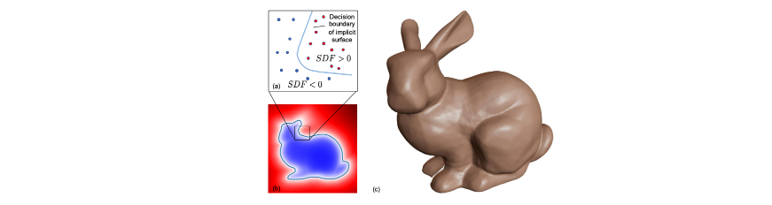
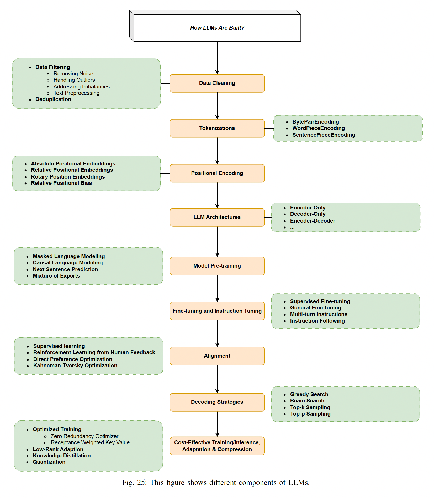
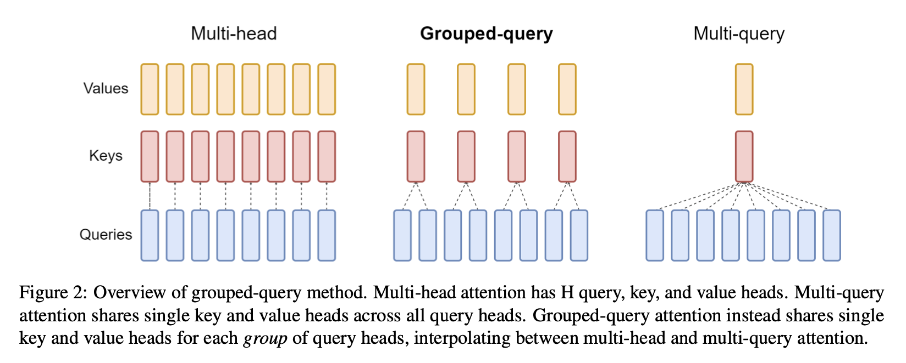

새롭게 알게 된 지식 중에서 하나의 포스팅으로 만들기에는 부담스러운 내용들을 이곳에 모아둡니다. 매일 공부한 내용을 기록하기보다는 아무때나 비정기적으로 내용을 업데이트 하고 있습니다. 본 포스팅에서는 AI/ML과 관련된 기술스택 내용을 쌓고 있습니다. 최근에 작성한 내용들이 하단에 위치하도록 배열하였습니다.

##### 🧩 ML library

*2021.04.25* 

[텐서플로우 공식문서](https://www.tensorflow.org/versions/r1.15/api_docs/python/tf/map_fn)의 `tf.map_fn` 함수에 대한 설명을 읽었습니다. dimension 0에서 unpack된 elems이라는 tensor list의 요소들을 fn에 map합니다. 

```python
tf.map_fn(fn, elems, dtype=None, parallel_iterations=None, back_prop=True,
    	  swap_memory=False, infer_shape=True, name=None)
```

MAML을 구현 할 때 meta-batch에 대한 cross entropy를 병렬적으로 계산하기 위해서 아래와 같은 코드를 사용할 수 있습니다. 여기서 xs의 shape은 [meta-batch size, nway\*kshot, 84\*84\*3] 입니다.

```python
cent, acc = tf.map_fn(lambda inputs: self.get_loss_single(inputs, weights),
					 elems=(xs, ys, xq, yq),
				 	 dtype=(tf.float32, tf.float32),
				 	 parallel_iterations=self.metabatch)
```

##### 🧩  ML library

*2021.04.27*

모델 그래프를 빌드하는 함수에서 for loop를 많이 사용하면 이게 그대로 모델 training 단계에서도 매번 for loop가 적용되어 모델의 학습이 느려지겠구나라고 생각했었는데 곰곰히 생각해보니까 아니더라구요. 

빌드하는 단계에서는 for loop가 여러 번 돌더라도, 그래프의 각 노드들이 연결되고 난 뒤에는 빌드 된 그래프 구조 자체가 중요하지, 빌드 단계에서의 for loop는 관련이 없게 됩니다. 꽤나 오랫동안 아무렇지 않게 착각하고 있었어서 이 곳에 기록합니다. 그럼 map\_fn은 특히 어떤 경우에 메리트를 가질까 궁금하긴 하네요 🧐

##### 🧩  ML library

*2021.05.02*

TensorFlow 1.15로 코드를 짜다가 `softmax_cross_entropy_with_logits`는 loss에 대한 2nd-order 계산을 지원하지만 `sparse_softmax_cross_entropy_with_logits`는 loss에 대한 2nd-order 계산을 지원하지 않는다는걸 알게 되었습니다. 이 둘의 차이는 label이 one-hot 형태로 주어지냐 아니냐의 차이밖에 없는데 이런 결과를 나타냈다는게 이상해서 찾아보다가 tensorflow repository에 [관련 이슈](https://github.com/tensorflow/tensorflow/issues/5876)가 올라왔던 것을 발견했습니다.

요약하자면 일부 indexing 작업에 대한 도함수 계산이 아직 제대로 구현되지 않았거나, 몇 가지 operation에 대해서 2차 미분 계산이 개발자들도 아직 해결하지 못한 오류를 가진다고 말하고 있습니다(구체적인 원인은 모르겠습니다). 0.2 버전에서 1.15 까지 개발이 진행되면서도 TensorFlow 팀이 지속적으로 해결하지 못하고 있는 문제점이 있다는 것이 신기했습니다.

##### 🤖 ML & DL

*2021.05.10*

[PR-317: MLP-Mixer: An all-MLP Architecture for Vision](https://www.youtube.com/watch?v=KQmZlxdnnuY) 영상을 통해 CNN과 MLP가 별로 다르지 않다는 것을 알았습니다. 영상에서 이진원님은 CNN weight이 Fully-Conneted weight과 다른 점 두 가지가 weight sharing과 locally connected라고 설명하고 있습니다. 시각화된 자료만 봐도 이렇게 간단하게 이해되는 내용인데 왜 지금까지 깨닫지 못했을까라는 생각이 들었고, CNN에 몇 개의(사실은 엄청 많은 양이지만) weight을 추가하는 것만으로도 Fully-Connected와 완전히 동일한 구조로 만들수 있다는 것을 이해했습니다.

##### 🧩  ML library

*2021.05.11*

`tf.contrib.layers.batch_norm` 함수를 사용할 때 `is_traning` 아규먼트 설정에 주의해야 합니다. Batch normalization을 사용할 때 학습 상황인지 테스트 상황인지에 따라서 mean과 variance로 사용하는 statistics의 출처가 달라지기 때문에 `is_traning`를 잘못 설정한다면 정확도는 높게 나오더라도 그 실험이 잘못된 결과일 수 있습니다.

`is_training`이 True인 경우에는 moving_mean 텐서와 moving_variance 텐서에 statistics of the moments(미니 배치 평균과 분산)을 exponential moving average 식에 따라 축적합니다. BN 계산에는 미니배치의 평균과 분산을 사용합니다.  `is_training`이 False인 경우에는 그동안 축적하였던 moving_mean 텐서와 moving_variance 텐서 값을 가져와 BN 계산에 사용합니다. 

Few-shot learning setting에서 support set과 query set에 대해서 둘 다 `is_training`을 True로 설정하면 이는 transductive setting이 됩니다. 즉 query를 추정하기 위해서 support 뿐만 아니라 query 분포의 정보까지 사용하겠다는 것을 의미합니다. Few-shot learning에서는 대부분 transductive setting이 non-transductive에 비해 3%정도의 성능 향상을 보이기 때문에 본인의 실험 상황에 알맞게 아규먼트 값을 설정해야 합니다. 

`tf.contrib.layers.group_norm` 같은 instance-based normalization 방식은 미니배치에 대한 running statistics를 사용하지 않기 때문에 `is_trainable` 파라미터가 존재하지 않습니다.

##### 🤖 ML & DL

*2021.05.14*

Moment[^1]는 물리학에서 특정 물리량과 distance의 곱을 통해 물리량이 공간상 어떻게 위치하는지를 나타내며 Force, Torque, Angular momentum 등을 예로 들 수 있습니다. Moment of mass에 대해서 zeroth moment는 total mass, 1st moment는 center of mass, 2nd moment는 moment of inertia를 의미합니다.

수학에서는 함수의 특징을 나타내기위해 moment라는 워딩을 사용합니다. 함수가 확률분포 형태인 경우 first moment는 확률 분포의 기댓값을 의미하며, 이를 moments about zero라고도 말합니다. 또한 second central moment로는 variance, third standardized moment는 skewness(비대칭도),  fourth standardized moment는 kurtosis(첨도, 뾰족한 정도) 등이 있습니다.

##### 🧩 ML library

*2021.09.20*

[PyTorch 공식 문서](https://pytorch.org/docs/stable/generated/torch.unsqueeze.html#torch.unsqueeze)를 참고하여 가장 기본적인 torch Tensor 기능들을 정리합니다.

- squeeze: 차원이 1인 차원을 제거하는 함수입니다. 따로 옵션을 주지 않으면 차원이 1인 모든 차원을 제거합니다.
- unsqueeze: 특정 위치에 1인 차원을 추가하는 함수힙니다.
- view: 텐서의 shape을 변경해주는 함수입니다.

##### 🤖 ML & DL

*2021.11.13*

위키피디아의 Signed Distance Function(SDF)[^4]에 대한 설명을 읽었습니다. 먼저, SDF는 다음과 같이 정의됩니다.

- If $\Omega$ is a subset of a metric space and $b$ is the boundary of $\Omega$ the signed distance function $f$ is defined by

$$
f(x)=
\begin{cases}
d(x, \partial \Omega) & \text{if } x \in \Omega \\
-d(x, \partial \Omega) & \text{if } x \in \Omega^c
\end{cases}
$$

SDF는 어떤 boundary까지의 거리를 표현하는 함수입니다. 만약 어떤 점 $x$가 boundary 안 쪽에 위치하게 되면 function 값은 양수를 갖게 되며, 이 점이 boundary와 점점 가깝게 이동할 수록 function 값은 0에 가까워 지다가, boundary에 위치하는 경우에는 0이 됩니다. 반대로 $x$가 boundary 바깥 쪽에 위치하는 경우에는 function 값이 음수를 갖습니다.

위에서는 SDF 함수의 식에 대해서 boundary 안 쪽인 경우에 양수라고 표기하였지만 boundary 안 쪽을 음수로 두어 반대로 사용하는 경우도 존재합니다. 아래 사진은 DeepSDF[^5]라는 논문에서 가져온 SDF의 예시이며 해당 논문에서는 boundary 안 쪽을 음수로 두었습니다.



과거의 surface 추정이나 3D reconstruction 같은 task에서는 주로 voxel, point, mesh를 사용하는 방식으로 접근했다면, 최근에는 SDF 사용하려는 시도가 늘어나고 있는 것 같습니다. 특히 Implicit Neural Representation 연구와 SDF를 결합한 연구 결과들이 흥미로워 보였습니다.

Implicit Neural Representation은 이미지나 3D 데이터를 pixel, voxel 단위의 matrix 형태로 표현하는 것이 아니라, (x, y) 값을 받았을 때 (r, g, b) 값을 출력하는 어떤 함수 하나로써 표현하려는 연구입니다(함수 1개는 데이터 1개를 의미하고, 따라서 학습 입력 1개는 픽셀 값 1개로 주어지게 될 듯 합니다). 데이터를 연속적인 함수의 형태로 표현하기 때문에 자연스럽게 super resolution이 가능하다는 장점이 있는데, 최근에 이 방식과 SDF를 결합하여 최종 output을 매우 매끄럽게 만들어내고자 하는 연구가 많이 진행되고 있습니다.

##### 🤖 ML & DL

*2021.12.02*

지금까지는 아무 생각 없이 continuous distribution에서도 single point에 특정 확률이 존재한다고 생각했습니다. 예를 들어 $\mathcal N (0, 1)$에 대해서 point $x=1$이 관측될 확률이 특정 값으로 존재한다고 잘못 생각하고 있었습니다.

[이 곳](https://www.itl.nist.gov/div898/handbook/eda/section3/eda361.htm)[^6]을 참고하니 continuous probability function은 continuous interval의 무한 points에 대해 정의되기 때문에 single point의 확률은 언제나 0이며, 따라서 continuous probability function에서 확률은 특정 interval에 대해서 측정하고 single point에 대해선 측정하지 않는다고 합니다.

어찌보면 간단한 것이었지만 자세히 생각해보지는 않아서 헷갈렸던 듯 합니다. 추가적으로, 그러면 어떻게 0이 모여 1이 되는 것 인지까지 궁금해지면서 수학을 당장 근본부터 다시 공부해야하나 싶었지만, 시간은 한정되어 있고 할 일은 많으니 길게 보고 천천히 공부하자는 결론으로 돌아왔습니다 🥲

##### 🧩 ML library

*2021.12.08*

PyTorch에 특정 weight만 freeze하는 기능이 구현되어 있는지 살펴보았습니다.

Layer 단위로 freezing 하는 경우에는 `required_grad=False`를 사용해서 구현했었는데, layer 내 특정 weight만 골라서 freeze하는 기능은 따로 본 적이 없는 것 같아 찾아보다가 [해당 링크](https://discuss.pytorch.org/t/how-do-i-freeze-the-specific-weights-in-a-layer/104722/2)를 읽게 되었습니다. 작성자 분이 설명하기로는 아래와 같은 두 가지 임시방편이 있다고 합니다.

- `.step()`를 호출하기 전에 freeze 하고자하는 weight에 대해서 `grad=0` 할당. 다만 momentum, weight decay를 사용하는 optimizer의 경우엔 `grad=0`이더라도 `.step()` 호출 시 weight을 변형하기 때문에 원하는대로 동작하지 않을 수 있음
- Freeze하고 싶은 weight을 미리 copy 해두고 `.step()` 을 호출하여 weight을 업데이트한 뒤에, 복사했던 weight을 업데이트된 weight에 덮어씌우기

##### 🤖 ML & DL

*2022.01.15*

[링크](https://omoindrot.github.io/triplet-loss)[^7]를 참고하여 triplet loss 관련 용어를 숙지하였습니다. 

- Easy triplets: $d(a, p) + \text{margin} < d(a, n)$
- Hard triplets: $d(a,n) < d(a, p)$
- Semi-hard triplets: $d(a, p) < d(a, n) < d(a,p) + \text{margin}$

##### 🧩 ML library

*2022.02.28*

Random seed를 고정할 때 가장 먼저 고려하면 좋을 것들을 기록하였습니다.

```python
random.seed(args.seed)
np.random.seed(args.seed)
torch.manual_seed(args.seed)
torch.cuda.manual_seed_all(args.seed)
```

##### 🤖 ML & DL

*2022.04.10*

연구를 하며, 모델 학습의 안정성에 있어서 residual connection이 유용하다는 경험적인 팁을 얻었습니다. ResNet과 같이 모델 구조에서 residual connection을 활용하는 것 뿐만 아니라, 어떤 값을 조심스럽게 바꾸고 싶을 때 residual connection을 가진 구조가 비교적 높은 성능을 보이는 것을 확인하였습니다.

예를 들어 GNN을 통해 embedding vector를 업데이트하고 싶을 때 $V_{t+1} = G(V_t)$의 형태를 사용하는 것 보다 $V_{t+1} = V_t + G(V_t)$의 형태를 사용하는 것이 좋으며, 현재 실험 중인 것 중에서는 few-shot으로 distribution의 mean을 잘 추정해보려는 내용이 있는데, 이 경우에도 $\hat \mu = f_\theta(\text{few-shot})$ 보다는 $\hat \mu = \text{mean of few-shot} +  f_\theta(\text{few-shot})$ 형태에서 더 좋은 결과를 얻었습니다.

아무래도 일반적으로 parameter가 0에 가까운 가우시안으로 초기화되기 때문에, residual connection을 사용한 경우에 초기 loss가 더 작아져 비교적 학습이 안정적인 것이 아닐까 싶습니다. (*정말로 그런 것인지 찾아보고 내용 추가하기*)

##### 🤖 ML & DL

*2022.05.16*

Moore–Penrose inverse(=Pseudo inverse)[^8]에 대해서 정리합니다.

- $A\mathrm  x =\mathrm b$의 형태의 linear system을 풀 때, $A$가 정방 행렬이 아니라면 아래의 두 가지 상황이 존재.

1. Underdetemined (n < m): 가로로 긴 A. Infinitely many solution given $\mathrm b$ in general
2. Overdetermined (n > m): 세로로 긴 A. Zero solution for given $\mathrm b$ in general

- $A$에 대해서 singular value decomposition을 수행하면 아래와 같이 전개가 가능함

$$
A \mathrm x = b \\
U \Sigma V^\top \mathrm  x =\mathrm b \\
V \Sigma ^{-1} U^\top U \Sigma V^\top \mathrm  x =V \Sigma ^{-1} U^\top \mathrm b \\
\tilde {\mathrm x} = V \Sigma ^{-1} U^\top \mathrm b := A^+ \mathrm  b
$$

- 여기서 $A^+ = V \Sigma ^+ U^\top $를 A의 pseudo inverse라 함
- $\Sigma = \text{diag}_{n,m}(\lambda_1, \cdots, \lambda_{\min\{ n, m \}})$일 때, $\Sigma^+ = \text{diag}_{m,n}(\lambda_1^+, \cdots, \lambda^+_{\min\{ n, m \}})$ where $\lambda^+= 
  \begin{cases}
      \lambda^{-1},& \lambda \neq 0 \\
      0,              & \lambda = 0
  \end{cases}$

Moore–Penrose inverse를 사용하면 선형대수학의 많은 부분을 쉽게 서술 및 증명 가능함

1. Underdetemined(해가 여러 개 존재)에서 $A^+ \mathrm b$는 유클리드 노름 $||\tilde {\mathrm x} ||_2$을 최소화하는 해임
2. Overdetermined에서 $||A \tilde {\mathrm  x} - \mathrm b||_2 = ||A A^+ \mathrm b - \mathrm b||_2$는 최소제곱법의 최적해임

##### 🤖 ML & DL

*2022.05.27*

Linear combination에 대해서 계수가 양수이고 계수의 합이 1인 경우, 이를 convex combination이라고 함

Convex set의 정의와 연관지어 보면, 어떤 집합 C에 속하는 임의의 점들의 convex combination이 C에 속하면 그 집합은 convex set이라고 말할 수 있으며, 마찬가지로 convex set C에 속하는 점들의 convex combination은 항상 C에 속함.

##### 🤖 ML & DL

*2022.05.28*

다양한 Data Augmentation 방법들에 대해서 [이곳](https://cse-study.github.io/ai/2022-05/220527-data-augmentation/)에 정리하였습니다.

##### 🤖 ML & DL

*2022.06.29*

Upper bound, Lower bound, Supremum, Infimum에 대한 수학적 정의를 [이곳](https://web.math.ucsb.edu/~agboola/teaching/2021/winter/122A/rudin.pdf)을 참고하여 정리합니다.

- Upper bound (상계): 어떤 실수 $\beta$가 있을 때, $E$의 모든 원소 $x$에 대해서 $x < \beta$를 만족할 때, $\beta$를 $E$의 upper bound라고 함. 이 때 $E$는 ***bounded above***라고 함. (Lower bound도 동일한 방식으로 정의 됨)
- Supremum, Least upper bound (상한): $\alpha = \sup E$ 이려면, $\alpha$가 $E$의 upper bound이며, $\gamma < \alpha$인 모든 $\gamma$가 $E$의 upper bound가 아니어야 함. 즉, **upper bound 중 least가 supermum**임
- Infimum, Greatest lower bound (하한): $\alpha = \inf E$ 이려면, $\alpha$가 $E$의 lower bound이며,  $\beta > \alpha$인 모든 $\beta$가 $E$의 lower bound가 아니어야 함. 즉, **lower bound 중 greatest가 infimum**임

##### 🤖 ML & DL

*2022.10.06*

10월 6일에 진행된 AI workshop 내용을 기록합니다. 먼저, Federated Learning과 관련된 내용입니다.

1. Federated Learning (FL)
   - Central server에 client의 data를 업로드할 수 없는 상황에 어떻게 모델을 학습할 수 있을지?
   - Client에서 각자 업데이트된 '모델'을 서버로 올리고, 평균을 취해서 다시 client에게 뿌리는 방식이 제일 일반적 (FedAvg)
   - 하지만 이런 방식은 non-IID setting(heterogeneous)에서 매우 크게 성능이 떨어지게 됨: PFL 연구의 배경
2. Personalized Federated Learning (PFL): Client specific weights이 도입됨
3. PFL via Meta-learning: PFL의 컨셉과 Meta-learning(MAML)의 컨셉이 매우 유사하다는 점에서 고안됨

Imitation learning 관련 내용입니다.

1. Reinforcement Learning (RL)
   - Purpose: Find an optimal policy $\pi*$ that miximize $V$
   - Require domain knowledge for real-world application
   - 드론을 예로 들면, 실제 드론은 매우 쉽게 부숴지므로 Sim2Real learning을 고려해야 하고, 드론 physics에 많은 perturbation이 존재하므로 Robust learning도 고려해야 함
2. Imitation Learning (IL)
   - Behavior cloning (BC), Inverse RL (IRL), IRL + RL 등의 방법이 존재
   - BC는 많은 양의 데이터가 필요하고 compounding error에 취약하므로, 이런 점에서는 IRL이 장점을 가짐
3. Generative Adversariel Imitation Learning (GAIL)
   - Real data로는 expert actions를 제공하고, Fake data로는 policy actions를 제공하여 expert의 policy를 흉내내도록 학슴
   - Limitation: Real envrionment danger와 environment perturbation에 대해서는 잘 모델링하지 않음. 따라서 domain-adpative IL이 필요
4. Simulation-based Learning: Domain Adaptive IL
   - Simulation(source) env.에서 information을 뽑아, target env의 policy에 도움을 주도록, information extraction 과정이 중요

##### 🤖 ML & DL

*2022.10.06*

레딧을 읽다가 "학습이 너무 오래걸리는 경우엔 하이퍼파리미터 튜닝을 어떻게 해야하는가?"에 대한 글이 있어, 글에 달린 코멘트와 개인적인 생각들을 기록합니다.

- 모델 스케일을 줄인 상태로 하이퍼 파라미터 튜닝을 진행하거나, 데이터셋을 일부만 사용한 학습을 통해 하이퍼 파라미터 튜닝을 진행
- e.g., ResNet152라고 한다면 ResNet18 같이 작은 모델 사용하거나, ImageNet이라고 한다면 100개 class만 사용하여 학습 수행
- 이 방법은 당연히 sub-optimal이긴 하겠지만 학습이 너무 오래걸리는 경우에 충분히 활용해 볼만 한 방법이라고 생각했음
- 사실 제일 좋은 것은 GPU 자원을 병렬로 충분히 활용할 수 있게 엔지니어링을 거친 후에 학습하는 것. 왜냐면 big model과 small model 사이에 하이퍼 파라미터에 따른 모델의 동작에 분명히 차이가 존재할 것이기 때문에, 원래 스케일대로 실험하는게 제일 좋음

##### 🤖 ML & DL

*2022.10.14*

ML 분야에서의 "Grokking"이라는 단어의 의미를 기록합니다.

- Overparameterized된 뉴럴넷 모델이, small training dataset에 대해서 overfit 되어 있다가, 매우 많은 시간(optimization step)이 지난 후에 어느 지점에 갑자기 좋은 generalization 성능(validation loss 감소)을 달성하는 현상
- OpenAI의 ["Grokking: Generalization Beyond Overfitting on Small Algorithmic Datasets"](https://mathai-iclr.github.io/papers/papers/MATHAI_29_paper.pdf) 논문에서 명명

##### 🤖 ML & DL

*2022.10.21*

- The stability-plasticity dilemma: 새로운 지식을 얻기 위해 모델의 영구 변형이 요구되면서도, 동시에 기존의 지식을 잊어버리지도 않아야 한다는 점
- Learning in a parallel and distributed system requires plasticity for the integration of new knowledge but also stability in order to prevent the forgetting of previous knowledge.[^10]

##### 🤖 ML & DL

*2022.12.03*

Noisy label이란 무엇을 의미하는가?

- 데이터 셋 내에 데이터의 labeling이 잘 못 되어있는 경우를 noisy label 혹은 labeling noise라고 함. Large scale dataset에 대해서는 label을 확인하는 과정이 힘들다 보니까(돈과 시간이 많이 소요), 이러한 noisy label이 충분히 존재할 수 있음
- 종종 semi-supervised learning 분야에서도 사용되는데, 이 때는 pseudo label 기반의 self-training model이 unlabeled dataset에 잘못 pseudo labeling 한 것을 noisy label이라고 부르는 듯 함

Ad-hoc이란 무엇을 의미하는가?

- 일반적으로는 '오로지 특정 하나의 목적만을 위해 고안된 방법' 정도로 해석해볼 수 있음

##### 🤖 ML & DL

*2023.01.01*

Anomaly detection 관련 용어정리, ChatGPT를 활용해보았음.

- Target(positive) class가 강아지라고 가정할 때, 새로운 데이터에 대해 발생할 수 있는 상황들
  1. 강아지이지만, 이전에 본 적 없는 새로운 종의 강아지를 발견한 경우
  2. 고양이 데이터 등과 같이 아예 새로운 클래스를 발견한 경우
  3. 강아지 데이터이지만 손상된/오염된 데이터를 발견한 경우
- Novelty detection: Unseen data point를 발견하는 경우나, **새로운 트렌드나 경향성**을 발견하는 경우에 주로 사용하는 용어
- Outlier detection: 기존 데이터와 매우 차이나는 data point를 발견하는 경우나, 제거해야 할 **오염되거나 손상된 데이터**를 발견하는 경우에 주로 사용하는 용어
- Anomaly detection: Novelty detection과 Outlier detection의 경우를 모두 포함하는 상대적으로 넓은 범위의 용어
- 다만 위의 세 가지 용어들이 매우 자주 혼용되므로, 논문이나 상황에 맞게 유동적으로 이해해야 함

##### 🤖 ML & DL

*2023.01.11*

Object detection과 관련된 용어를 정리합니다. 먼저 문제 상황들을 나열하였습니다.

- Localization: **Single object**, 해당 object가 사진 내에서 어느 위치에 존재하는지 bounding box 설정
- Object detection: **Multiple object**, 여러 objects가 사진 내에서 어느 위치에 존재하는지 bounding box 설정하고 각각의 class 정보까지 부여
- Segmentation: **Multiple object**, 여러 objects가 사진 내에서 어느 위치에 존재하는지를 '픽셀 단위로' class 정보 부여
- 2-Stage 방식: 물체가 존재할 것 같은 위치를 제안한 다음에(**Region proposal**, localization), 해당 위치 정보를 기반으로 feature를 추출하고 class 부여
- 1-Stage 방식: Localization과 classification을 한 번에 수행. 2-Stage에 비해 성능은 낮지만 속도는 빠름
- Region proposal 방식
  1. Sliding window: Window를 슬라이딩하며 window 내에 object가 존재하는지 확인
  2. Selective search: 인접한 영역끼리 유사성을 측정해 큰 영역으로 차례대로 통합
- NMS: 여러 bounding box가 같은 class로 겹쳐있다면, 하나의 class로 통합하는 방법
- RoI = Region of Intereset = Region proposal

2-Stage detector를 간단히 정리합니다.

- R-CNN: Selective search를 통해 2000개 정도의 region proposal 찾음. 각각의 crop 이미지를 모두 CNN에 입력한 뒤에, feature vector 추출. 마지막으로는 Regressor를 통해 bounding box를 설정하고, SVM을 통해 classification
- Fast R-CNN: Selective search를 통해 2000개 정도의 region proposal 찾음 
- Faster R-CNN: 이전까지는 CPU 기반의 selective search 였다면, 본 알고리즘은 GPU 기반의 Region Proposal Network(RPN)을 제안하여 속도 향상. 그 외에는 Fast R-CNN와 동일

1-Stage detector를 간단히 정리합니다.

- YOLO: 이미지를 NxN 그리드로 분할하여 예측 텐서(Prediction tensor) 생성
- SSD: 테두리 상자 조정을 위해 픽셀이나 특징들을 재 추출하지 않음

##### 🤖 ML & DL

*2023.01.14*

Bayesian Inference에 대해 간단히 정리합니다.

- Bayesian Inference: 추론 대상의 사전 확률과 추가적인 정보를 통해 해당 대상의 사후 확률을 추론하는 방법
- 일반적으로 우리의 목적은 $p(x^* | X)$를 계산하는 것임. 즉, given data $X$를 기반으로 test data $x^*$에 대한 올바른 예측을 할 수 있어야 함
- $p(x^* | X) = \int p (x^* | \theta) p(\theta | X) d \theta$로 계산 할 수 있으며, 여기서 $p(\theta | X)$는 Bayes rule에 의해 $p(\theta | X) = \frac{p(X|\theta)p(\theta)}{P(X)}$임

##### 🤖 ML & DL

*2023.02.22*

CLIP에 대해 간단히 정리합니다

- **Natural language supervision**: 이미지와 텍스트가 짝을 이루는 데이터셋을 활용하여 이미지 모델을 학습시키는 것

1. Contastive pre-training: Batchsize 만큼의 이미지와 그에 해당하는 텍스트(문장)에 대해 이미지와 텍스트 임베딩을 각각 뽑아내고, 서로 짝이 맞는 임베딩간 유사도가 높아지도록 모델 학습
2. Target dataset에 대해 class label 임베딩을 모두 뽑는데, 이 때 텍스트로는 'a photo of a {class labe}'를 입력으로 줌 (Prompt engineering!)
3. 최종적으로, 테스트 이미지의 임베딩과 target dataset의 'a photo of a {class labe}' 임베딩 사이에 유사도가 제일 높은 것을 확인함

##### 🤖 ML & DL

*2023.03.24*

- Domain generalization: source domain으로 학습한 뒤 바로 target domain에 일반화
- Domain adaptation: target domain에도 어느정도 label이 존재하여 재학습이 가능
- Style-based generalization: Gram matrix, Maximum Mean Discrepancy(MMD), Mean Var 등을 style로 여겨서 활용
- 일반적으로 CNN은 texture를 잘 잡는 high pass filter(고주파 위주로 전달), Transfomer는 contour를 잘 잡는 low pass filter의 특성을 보인다고 함. 따라서 CNN에 대해 adversarial attack 할 때도 특정 이미지에 다른 texture 입히면 예측 성능 떨어짐

##### 🤖 ML & DL

*2023.04.03*

Stable diffusion에 대한 간단한 기록

- Text2Image를 위해 text encoder(CLIP의 text encoder)와 image generator 사용
- Image generator: Image information creator (UNet + Scheduler)와 image decoder (Autoencoder decoder)로 구성됨
  - Image information creator: latent space to latent space. Diffusion process 수행
  - Image decoder: latent space to image space
- Text conditioning: UNet 내부의 resnet block 사이에 attention layer를 추가하고, token embedding을 각 attention layer의 입력으로 주어 conditioning

##### 🤖 ML & DL

*2023.04.08*

Random thought of AI tech.

- 최근에 나온 논문인 Segment Anything과 PIX2STRUCT를 읽으며 든 (이전부터 자주 했지만 더 강해진) 생각은, '학습을 위한 task를 어떻게 정의하는지', 그리고 '수많은 양의 training 데이터를 어떻게 모아야하는지' 고민하는 것이 powerful한 모델을 만드는 제일 중요한 기반이 될 것이라는 것
- 관련하여 Video PreTraining (VPT)도 이런 생각을 기반으로 연구되었음

##### 🧩 ML library

*2023.05.05*

Lightning에서 Distributed Data Parallel 사용할 때 참고할 점에 대해 기록합니다.

- 참고 링크:  https://github.com/Lightning-AI/lightning/discussions/6501#discussioncomment-553152
- `sync_dist=True` 옵션을 사용하면 모든 process에 대해 sync 맞춤. 기본 옵션은 reduced mean
- 다만, torchmetrics과 관련해서는 own sync code가 있기 때문에 `self.log(...)`의 `sync_dist`, `sync_dist_op`, `sync_dist_group`, `reduce_fx`, `tbptt_reduce_fx` flags가 metric logging에는 전혀 영향을 주지 않음
- Metric sync는 `metric.compute()` 함수 호출시 동작함

##### 🤖 ML & DL

*2023.05.05*

Reinforcement Learning from Human Feedback (RLHF)에 대해 기록합니다

- 영상 링크: https://www.youtube.com/watch?v=2MBJOuVq380
- 논문 링크: https://arxiv.org/pdf/2203.02155.pdf
- RL을 이용하여 human feedback으로부터 model을 학습시키는 방법. 다만 2~3 단계를 통해 실제로 왜 학습이 되는지에 대해 제대로 이해하지 못해서 다시 공부할 필요 있음.

1. Pretraining a language model (LM)
2. Gathering data and training a reward model
3. Fine-tuning the LM with reinforcement learning

##### 🤖 ML & DL

*2023.05.05*

VQ-VAE에 대해 기록합니다.

- AutoEncoder: latent variable $z$를 잘 추출하기 위한 구조
- VAE: $z$ encoding의 distribution이 prior로 주어짐
- VQ-VAE
  - AutoEncoder와 같은 구조이긴 하나, $z$ 기반으로 codebook(K개의 embeddings) 내 가장 가까운 embedding을 가져와서 decoder input으로 사용함. codebook을 거쳐 가져오기 때문에 vector quantization임 (codebook에 대한 설명은 [이 블로그 포스팅](https://zerojsh00.github.io/posts/Vector-Quantization/) 참고)
  - Posterior와 prior가 categorical distribution임
  - 한가지 의문: K는 image 샘플 수와 같은지가 궁금함
  - Forward pass: 위에서 말한대로 codebook에서 유사한 embedding을 가져와서 decoder에 feed forward
  - Backward pass: decoder는 그대로 backward propagation 수행하는데, codebook에서 embedding 고르는 부분은 argmin에 의해 backprop 될 수 없기 때문에, decoder의 gradient를 encoder 끝단에 그대로 가져옴
  - Loss: (encoder-decoder에 대한 reconstruction error) + (codebook embedding이 encoder output과 유사해지도록 돕는 l2 loss) + (encoder output이 codebook embedding과 유사해지도록 돕는 l2 loss)

##### 🤖 ML & DL

*2023.05.12*

Meta에서 5월 9일에 발표한 ImageBind에 대해서 기록합니다.

- 6 mocailities(Image/Video, Text, Heatmap, Depth, Audio, IMU)로 학습된 모델이 one modaility specialist model의 성능을 넘김
- 특히, 이 뿐만 아니라 여러 modality 기반으로 다른 modality로의 전이, 예를 들어 audio 기반으로 image 생성 등의 multi-modality 연구로 확장 가능
- Cross-modal retrieval, embedding-space arithmetic, audio-to-image generation 등 가능
- 최근 Meta의 open source AI tool들의 집합체임. DINO v2, SAM 등을 포함하고 있음
- For the four additional modalities (audio, depth, thermal, and IMU readings), ImageBind use naturally paired self-supervised data. 즉, image 혹은 video를 다른 modaility와 pair 시킴으로써 6개의 modality를 모두 combine 할 수 있다는 것을 ImageBind가 보임

##### 🤖 ML & DL

*2023.05.15*

ViT와 CNN에 대한 비교: [How Do Vision Transformers Work?](https://arxiv.org/abs/2202.06709)

- ViT 즉, Multi-head Self Attention(MSA)은 shape(structure) biased = low-pass filter
- ResNet 즉, ConvNet은 texture biased = high-pass filter

CL ViT와 MIM ViT에 대한 비교: [What Do Self-Supervised Vision Transformers Learn?](https://arxiv.org/abs/2305.00729)

- CL: self-attentions collapse into homogeneity 발생 / utilizes the low-frequency signals / a crucial role in the later layers
- MIM: utilizes high-frequency signals / focuses on the early layers

##### 🤖 ML & DL

*2023.05.20*

- Hyper-parameter tuning 고민: shell script 짜서 미리 정한 rule에 따라 실험 옵션 여러 개 돌리고, wandb runs에서 원하는 options들만 띄워서 표 형태로 보는게 제일 편리한듯

##### 🤖 ML & DL

*2023.05.20*

서비스 가능한 AI는 어떤 기준으로 결정되는지에 대한 질문에 대해 ChatGPT가 답변한 내용. 충분히 고민해볼만한 내용인 것 같아 기록함

1. Define requirements: Clearly identify the specific tasks or problems the AI model needs to address. Determine the desired input-output behavior, performance metrics, scalability, and any other relevant criteria.
2. Training and validation data: The data should cover various scenarios that the AI model will encounter in real-world usage.
3. Model selection: Consider factors like the model's architecture, complexity, size, computational requirements, and availability of resources.
4. Model evaluation: Common metrics include accuracy, precision, recall, F1 score, or domain-specific metrics relevant to the task.
5. Testing and validation: Deploy the AI model in a controlled or limited production environment. Validate its performance against real-world data or simulated scenarios, including edge cases and corner cases.
6. Iterative improvement: Continuously monitor and evaluate the AI model's performance in a live or simulated environment. Collect user feedback and address any issues or limitations through iterative updates, such as fine-tuning, retraining, or architecture modifications.
7. Ethical considerations: Evaluate the AI model's compliance with ethical guidelines, privacy requirements, and legal regulations.
8. Scalability and resource requirements: Assess the AI model's scalability and resource demands, such as computing power, memory, or network bandwidth.
9. Robustness and reliability: Test the AI model's robustness by subjecting it to adversarial attacks, noisy or incomplete data, or other challenging conditions. Assess its reliability by measuring its performance over an extended period, considering factors like model drift or degradation.
10. Cost considerations: Evaluate the total cost of deploying and maintaining the AI model, including infrastructure, licensing, data storage, and ongoing support. Consider the model's value proposition and its impact on productivity, efficiency, or revenue generation.

##### 🤖 ML & DL

DINO와 DINO v2에 대해서 간단히 정리합니다.

- Self-supervised ViT의 특징: scene layout 경계 파악 잘하며, feature만 가지고 k-NN classifier 만들어도 성능 좋음
- 다만 k-NN classifier 성능 위해서는, momentum encoder, multi-crop augmentation, small patches가 요구되는 것 발견
- DINO: momentum encoder 기반 BYOL 방식 차용. 여기에 loss 식에 조금 차이 가지고, teacher-student 구조 동일함
- DINO v2: Image level로는 서로 다른 이미지 구분, patch level 같은 이미지 내 서로 다른 patch 구분. 이 외에도 많은 양의 ‘퀄리티 좋은’ 데이터와 빠르고 효율적인 학습 방법 제안

##### 🧩 ML library

*2023.08.12*

- Apache Arrow: 직렬화와 역직렬화의 오버헤드가 높다는 것은 데이터 다룰 때 자주 발생하는 문제점임. Apach Arrow는 직렬화 과정이 없는 zero-copy read가 가능한데, 일반적인 방법인 객체를 가지고 작업하는 방식이 아닌 직렬화된 데이터 자체를 가지고 작업하기 때문에 이것이 가능
  - Main purpose: Language-independent open standards and libraries to accelerate and simplify in-memory computing
- Huggingface datasets w. arrow: 위에서 언급한 것 처럼 Arrow는 많은 양의 데이터에 대한 처리와 이동을 빠르게 가능하게 함 (Arrow format은 zero-copy read 가능하기에 직렬화 오버헤드를 없애주기 때문). 따라 Huggingface datasets은 arrow 활용함. 또한 column-oriented이기 때문에 querying이나 slicing 등 처리 속도 빠름

##### 🧩 ML library

*2024.05.30*

- 스크랩: [[python] OpenCV, PIL, Numpy, PyTorch 타입 분석, 타입 변환 정리](https://mvje.tistory.com/97 )

##### 🤖 ML & DL

*2024.08.05*



**Attention**

- Attention: Scaled dot-product attention mechanism의 식은 아래와 같습니다. Query와 key 사이의 유사도를 구하고, 해당 유사도를 key와 맵핑되어있는 각 value에 반영하는 방식입니다. Self-attention이라고 한다면, (1) 입력이 Wq, Wk, Wv matrix를 각각 거쳐서 query, key, value embedding으로 변하고 (2) 해당 query, key, value embedding 간 attention을 수행하게 됩니다.

$$
\operatorname{Attention}(Q, K, V)=\operatorname{softmax}\left(\frac{Q K^T}{\sqrt{d_k}}\right) V
$$



- Multi-Head Attention (MHA): Attention을 하나가 아닌 여러 개 사용함으로써 입력 데이터의 다양한 subspace에서의 문맥 정보를 포착하고 복잡한 패턴을 더 잘 이해할 수 있도록 돕습니다. 한번의 attention 연산을 위해 각각 하나의 query, key, value head가 필요하므로, H번의 연산을 위해서는 각 H개의 query, key, value head가 필요합니다.
- Multi-Query Attention (MQA): MQA는 key, value head를 오로지 하나만 두는 변형입니다. 
- Grouped-Query Attention (GQA): GQA는 H개의 query를 G개의 그룹으로 나누어 어텐션 연산을 수행합니다. GQA-G는 G group의 key, value head를 가지는데, 따라서 GQA-H는 MHA와 동일하고 GQA-1은 MQA와 동일하게 됩니다. MHA의 체크포인트를 GQA의 체크포인트로 변환하기 위해서, 각 그룹에 속하는 기존 head를 mean pooling 하여 새로운 key, value head를 만듭니다. GQA는 MQA만큼 빠르면서도 MHA 성능에 근접합니다.

**Pre-Training**

- Mixture of Experts (MoE): 여러 전문가 서브네트워크가 데이터의 다른 측면에 특화되도록 학습합니다. 추론 중에는 이러한 전문가 중 일부만 활성화되어 계산 부담을 줄이면서도 높은 성능을 유지합니다.

- Mixture of Depth (MoD): 학습 및 추론 중 모델의 깊이를 동적으로 조정하는 접근 방식입니다. 

**Instruction Tuning**

- Multi-Turn Instructions: Multi-Turn Instructions는 여러 대화 턴에 걸쳐 응답을 이해하고 생성하는 모델을 학습시키는 것을 포함합니다. 이 튜닝 방법은 모델이 확장된 상호작용 과정에서 문맥과 일관성을 유지할 수 있는 능력을 향상시켜 챗봇과 같은 프로그램에 유용합니다.

- Instruction Following: Instruction Following은 주어진 지시 사항을 이해하고 실행하는 모델을 학습시키는 과정입니다. 이 기술은 모델이 복잡한 지시를 정확하게 따를 수 있는 능력을 향상시키는 데 중요하여, 정밀하고 신뢰할 수 있는 작업 완료를 요구하는 응용 프로그램에서 더 유용합니다.

**Alignment**

- Reinforcement Learning from Human Feedback

  1. Initial Training of the Language Model (Pre-training): 먼저, LLM은 일반적으로 대량의 텍스트 데이터로 사전 학습(pre-training)됩니다. 이 단계에서는 언어 모델이 언어의 통계적 패턴을 학습하고, 다양한 텍스트 생성 및 이해 능력을 갖추게 됩니다.
  2. Supervised Fine-tuning: LLM이 사전 학습된 후, 주로 인간이 레이블링한 데이터셋을 사용하여 모델을 특정 작업에 맞게 미세 조정합니다. 이 단계는 모델이 특정 형식의 질문에 대답하거나 특정 스타일로 글을 작성하는 등 특정 작업을 더 잘 수행하도록 합니다.
  3. Collecting Human Feedback: 모델이 어느 정도 성능을 갖추게 되면, 생성된 텍스트에 대해 인간으로부터 피드백을 수집합니다. 피드백은 일반적으로 텍스트의 품질, 정확성, 관련성 등을 평가하는 형태로 제공됩니다. 이 데이터를 사용하여 reward model을 학습합니다.
  4. Training the Reward Model: 수집된 인간 피드백 데이터를 기반으로 reward model을 학습합니다. 이 모델은 주어진 텍스트에 대해 점수를 매기며, 텍스트의 품질이나 사용자 의도와의 일치도를 평가합니다.
  5. Reinforcement Learning (RL) Fine-tuning: 학습된 reward model을 사용하여 LLM을 강화 학습(Reinforcement Learning) 방식으로 미세 조정합니다. 이 단계에서 주로 사용하는 알고리즘은 Proximal Policy Optimization (PPO)입니다. 다음과 같은 절차로 진행됩니다:
     - Policy Generation: 현재 LLM을 사용하여 텍스트를 생성합니다.
     - Reward Evaluation: 생성된 텍스트를 reward model을 통해 평가하여 보상(reward)을 계산합니다.
     - Policy Update: 보상을 최대화하도록 LLM의 파라미터를 업데이트합니다. 이 과정에서 PPO 알고리즘을 사용하여 안정적으로 정책을 최적화합니다.
  6. Iterative Improvement: 강화 학습을 통해 모델이 지속적으로 개선됩니다. 필요하면 더 많은 인간 피드백을 수집하여 reward model을 업데이트하고, 이를 다시 LLM의 강화 학습에 반영하여 모델을 반복적으로 향상시킬 수 있습니다.

- Direct Preference Optimization:

**Decoding Strategies**

- Greedy Search: Greedy search는 모델이 각 단계에서 가장 높은 확률의 토큰을 선택하는 단순한 디코딩 전략입니다. 빠르고 직관적이지만 미래의 가능성을 고려하지 않아 최적의 결과를 놓칠 수 있습니다.

- Beam Search: Beam search는 각 단계에서 여러 후보 시퀀스(빔)를 유지하는 더 정교한 디코딩 전략입니다. 여러 경로를 동시에 탐색함으로써 그리디 서치보다 더 최적의 솔루션을 찾을 가능성이 높아지지만, 계산 비용이 더 많이 듭니다.

- Top-k Sampling: Top-k 샘플링은 모델이 다음 토큰을 상위 k개의 가장 확률이 높은 후보 중에서 선택하는 확률적 디코딩 전략입니다. 이 방법은 다양성을 도입하고 반복적이거나 결정론적인 출력을 줄여, 생성된 텍스트의 자연스러움과 다양성을 향상시킵니다.

- Top-p Sampling: Top-p 샘플링(누클리어스 샘플링)은 누적 확률이 특정 임계값 p를 초과하는 가장 작은 후보 집합에서 다음 토큰을 선택합니다. 이 방법은 샘플링 풀의 동적 조정을 가능하게 하여, 생성된 텍스트의 다양성과 일관성 사이의 균형을 맞춥니다.

**Efficient Tuning**

- Low-Rank Adaptation: pretrained model weight를 모두 freeze 한 뒤에, downstream task fine-tuning을 위한 rank decomposition matrice를 추가하여 효율적 fine-tuning을 수행합니다.

### References

[^1]: Wikipedia contributors. (2021, April 12). Moment (mathematics). In Wikipedia, The Free Encyclopedia. Retrieved 12:08, May 24, 2021, from https://en.wikipedia.org/w/index.php?title=Moment_(mathematics)&oldid=1017468752
[^2]: JinWon Lee - PR-317: MLP-Mixer: An all-MLP Architecture for Vision. https://www.youtube.com/watch?v=KQmZlxdnnuY
[^3]: JoonYoung Yi - Slideshare, Dynamically Expandable Network (DEN). https://www.slideshare.net/ssuser62b35f/180808-dynamically-expandable-network

[^4]: Wikipedia contributors. (2021, August 1). Signed distance function. In *Wikipedia, The Free Encyclopedia*. Retrieved 00:41, November 14, 2021, from https://en.wikipedia.org/w/index.php?title=Signed_distance_function&oldid=1036639454
[^5]: Park, Jeong Joon, et al. "Deepsdf: Learning continuous signed distance functions for shape representation." *Proceedings of the IEEE/CVF Conference on Computer Vision and Pattern Recognition*. 2019.
[^6]: 1.3.6.1.What is a Probability Distribution., *NIST/SEMATECH e-Handbook of Statistical Methods*, http://www.itl.nist.gov/div898/handbook/, December 2, 2021.

[^ 7]: Olivier Moindrot. "Triplet Loss and Online Triplet Mining in TensorFlow". https://omoindrot.github.io/triplet-loss, Mar 19, 2018.

[^8]: Wikipedia contributors. (2022, April 27). Moore–Penrose inverse. In *Wikipedia, The Free Encyclopedia*. Retrieved 06:08, May 16, 2022, from [https://en.wikipedia.org/w/index.php?title=Moore%E2%80%93Penrose_inverse&oldid=1085006448](https://en.wikipedia.org/w/index.php?title=Moore–Penrose_inverse&oldid=1085006448)
[^9]: https://github.com/onnx/onnx/blob/main/docs/Overview.md
[^10]: Mermillod, Martial, Aurélia Bugaiska, and Patrick Bonin. "The stability-plasticity dilemma: Investigating the continuum from catastrophic forgetting to age-limited learning effects." *Frontiers in psychology* 4 (2013): 504.
