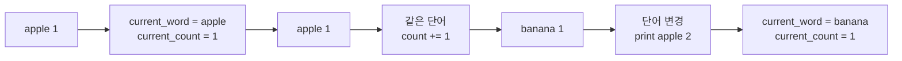
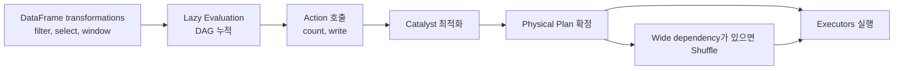
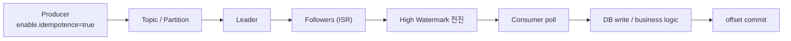
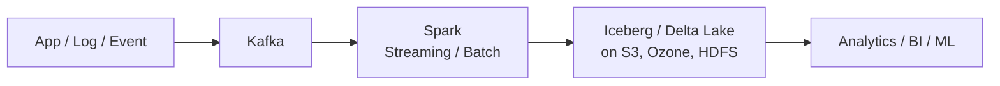

> Hadoop이 왜 나왔고, Spark가 왜 뒤를 이었고, Kafka가 왜 그 앞단을 맡게 되었는지를 단일 노드 Python 개발자 관점에서 정리합니다. HDFS와 YARN, Spark의 DAG와 Catalyst, Kafka의 zero-copy와 exactly-once 패턴까지 한 흐름으로 묶었습니다. Gemini Deep Research로 초안을 작성하고, GPT 5.4로 정리되었습니다.

Python의 단일 노드 생태계는 강력합니다. Pandas로 데이터를 다루고, `asyncio`로 I/O를 비동기 처리하고, `multiprocessing`으로 CPU를 병렬 활용하면 꽤 많은 워크로드를 소화할 수 있습니다.

문제는 데이터 규모가 TB, PB 단위로 커지고 초당 수백만 건의 이벤트가 들어오는 순간부터 시작됩니다. 그때는 GIL이나 단일 서버 메모리, 디스크 I/O 같은 로컬 한계보다 네트워크 셔플, 장애 복구, 저장과 연산의 분리 같은 분산 시스템 문제가 더 중요해집니다.

이 흐름에서 가장 먼저 등장한 해법이 Hadoop입니다. 값싼 범용 서버 여러 대를 묶어 데이터를 저장하고 병렬 처리하는 방식이 필요했기 때문입니다. 하지만 Hadoop MapReduce는 중간 결과를 매 단계 디스크에 써야 해서 반복 계산과 대화형 분석에 너무 느렸습니다. 그 한계를 밀어낸 엔진이 Spark입니다. 그리고 시스템이 마이크로서비스와 실시간 이벤트 중심으로 바뀌자, 이제는 "계산 전에 들어오는 이벤트를 안정적으로 받아두는 계층"이 따로 필요해졌습니다. 그 역할을 맡은 것이 Kafka입니다.

지금의 데이터 플랫폼은 이 셋을 경쟁 관계보다 역할 분담으로 보는 편이 더 정확합니다.

- **Hadoop**은 **분산 스토리지와 리소스 스케줄링의 철학**을 만들었습니다.
- **Spark**는 **대규모 분산 연산**을 훨씬 빠르게 만들었습니다.
- **Kafka**는 **실시간 이벤트 유입과 재처리**를 위한 로그 계층이 되었습니다.

### Hadoop First

하둡은 가장 먼저 "큰 데이터를 어디에 저장하고, 어떻게 여러 대의 서버로 처리할 것인가"를 풀었습니다. 2000년대 초 구글의 GFS와 MapReduce 논문에서 시작된 철학이 빅데이터 생태계의 출발점이 되었습니다.

- Role: 저비용 범용 하드웨어를 묶어 페타바이트급 데이터를 안정적으로 저장하고 병렬 처리합니다.
- Core idea: 데이터를 연산 노드로 옮기기보다, **연산을 데이터가 있는 노드로 보냅니다**. 즉, **데이터 지역성(`Data Locality`)**이 핵심입니다.
- Current relevance: 오늘날에는 HDFS 대신 S3나 Apache Ozone, MapReduce 대신 Spark나 Flink를 더 많이 쓰지만, 분산 저장과 스케줄링의 기본 개념은 여전히 하둡에서 시작합니다.

하둡의 핵심 설계는 아래 몇 가지로 정리할 수 있습니다.

- 큰 블록: 일반 파일 시스템보다 훨씬 큰 **기본 블록 단위인 `128MB`를 사용**해 HDD의 탐색 비용을 줄이고 순차 읽기 성능을 높입니다.
- 쓰기 패턴 단순화: **`Write Once, Read Many`를 전제**로 설계합니다. 파일 중간 수정은 허용하지 않고 **append 위주**로 다룹니다.
- 복제 기반 내결함성: 데이터 블록을 기본 **`3중 복제`**해 하드웨어 장애를 예외가 아니라 상수로 다룹니다.
- 범용 서버 기반 확장: 고가 장비 대신 **commodity hardware를 수평 확장**합니다.

하둡은 크게 `HDFS`와 `YARN`으로 나뉩니다.

- **HDFS: 분산 파일 시스템**입니다.
  - **`NameNode`**가 파일 이름, 권한, 블록 매핑 같은 메타데이터를 **RAM**에 올려 관리합니다.
  - **`DataNode`**가 실제 블록 데이터를 저장합니다.
  - 메타데이터를 메모리에 올리기 때문에 조회는 빠르지만, **NameNode 메모리가 전체 파일 수의 상한이 되고 병목**이 되기도 합니다.
  - DataNode는 **Heartbeat로 상태를 보고**합니다.
  - 복제는 Rack Awareness를 고려합니다. 같은 랙과 다른 랙에 나눠 배치해 스위치 장애 같은 물리적 문제까지 견딥니다.
- **YARN: 클러스터 리소스 관리자**입니다.
  - `ResourceManager`가 클러스터 전체 자원을 봅니다.
  - 내부적으로 스케줄러와 애플리케이션 생명주기 관리 역할이 분리됩니다.
  - 각 워커에는 **`NodeManager`**가 떠 있고, 작업은 **`Container` 단위로 배정**됩니다.
  - 작업이 들어오면 `ApplicationMaster`가 먼저 올라와 필요한 리소스를 협상하고 태스크 실행을 조율합니다.

최근에는 YARN보다 Kubernetes 위에 Spark를 올리는 구성이 더 자연스럽습니다.

| 비교 속성 | Spark on YARN | Spark on Kubernetes |
| :---- | :---- | :---- |
| 의존성 관리 | 모든 노드에 Python과 라이브러리를 미리 맞춰야 함 | Docker 이미지에 환경을 통째로 패키징 가능 |
| 작업 격리 | 클러스터 단위 분리 한계가 큼 | Namespace와 컨테이너 단위로 깔끔하게 격리 가능 |
| 버전 공존 | 서로 다른 Spark/Python 버전 공존이 까다로움 | 한 클러스터에서 여러 버전 운영이 쉬움 |
| 비용/유연성 | 유휴 자원과 일시적 클러스터 비용 관리가 불리함 | 오토스케일링과 세밀한 자원 분할이 쉬움 |
| 관측성 | 하둡 생태계 도구 의존성이 큼 | Prometheus, Fluentd 같은 클라우드 네이티브 도구와 잘 맞음 |

하둡이 JVM 기반이라고 해서 Python 개발자가 반드시 Java를 써야 하는 것은 아닙니다. `Hadoop Streaming`을 쓰면 표준 입출력 기반으로 Python 스크립트를 매퍼와 리듀서로 붙일 수 있습니다.

여기서 중요한 점이 하나 있습니다. 아래의 `mapper.py`, `reducer.py` 자체는 그냥 Python 스크립트입니다. 이것만 단독으로 보면 하둡 코드가 아닙니다. 하둡 예제가 되는 이유는, **하둡이 이 스크립트들을 직접 mapper / reducer 프로세스로 실행하고, 입력 분할, shuffle, sort, 분산 실행을 바깥에서 담당하기 때문**입니다.

- Mapper는 `stdin`으로 들어온 데이터를 읽고 `key\tvalue` 형태로 `stdout`에 씁니다.
- 프레임워크는 중간 결과를 정렬하고 셔플합니다.
- Reducer는 이미 정렬된 스트림을 읽으므로 메모리에 큰 해시맵을 들고 있지 않아도 집계가 가능합니다.

즉, Python 코드는 "비즈니스 로직"만 담고 있고, 분산 처리 자체는 하둡이 맡습니다.

여기서 한 번 더 짚고 넘어가면, MapReduce는 하둡의 고전적인 분산 처리 모델입니다.

- Map: 입력을 읽고 `key-value` 형태로 잘게 풀어냅니다.
- Shuffle / Sort: 하둡이 같은 key끼리 자동으로 모으고 정렬합니다.
- Reduce: 같은 key에 모인 값들을 최종 집계합니다.

Word Count로 보면 이렇게 이해하면 됩니다.

| 단계 | 하는 일 | 예시 결과 |
| :---- | :---- | :---- |
| Input | 원본 문장을 읽음 | `apple banana apple` |
| Map | 단어를 볼 때마다 `(word, 1)` 발급 | `(apple, 1)`, `(banana, 1)`, `(apple, 1)` |
| Shuffle / Sort | 같은 단어끼리 모음 | `apple -> [1, 1]`, `banana -> [1]` |
| Reduce | 같은 단어의 숫자를 더함 | `apple -> 2`, `banana -> 1` |

여기서 말하는 Map은 Python 내장 함수 `map()`과는 다른 개념입니다. Reduce도 `functools.reduce()` 같은 이름과 닮았지만, 여기서는 "같은 key에 모인 값들을 합치는 분산 처리 단계"에 더 가깝습니다.

가장 기본적인 Word Count 예제는 아래처럼 볼 수 있습니다.

입력이 `"apple banana apple"` 이라면, mapper는 이를 바로 세지 않고 `apple\t1`, `banana\t1`, `apple\t1` 같은 중간 결과로 잘게 쪼개서 출력합니다. 그 다음 하둡이 같은 단어끼리 모아 정렬해 reducer에게 넘기면, reducer가 그 숫자들을 더해 최종 개수를 만듭니다.


`mapper.py`

`mapper.py`는 "단어를 세는 코드"라기보다 "단어를 하나 볼 때마다 1장을 발급하는 코드"에 가깝습니다.

```python
#!/usr/bin/env python3
import sys


def run_mapper():
    for line in sys.stdin:
        line = line.strip()
        if not line:
            continue

        for word in line.split():
            print(f"{word}\t1")


if __name__ == "__main__":
    run_mapper()
```

`reducer.py`

반대로 `reducer.py`는 하둡이 이미 같은 단어끼리 모아둔 입력을 받아, 바로 앞 단어와 현재 단어만 비교하면서 합계를 계산합니다.

핵심은 reducer가 전체 데이터를 한 번에 들고 있지 않아도 된다는 점입니다. 정렬된 입력만 들어오면, 현재 단어와 개수만 들고 계속 흘려가며 계산할 수 있습니다.



```python
#!/usr/bin/env python3
import sys


def run_reducer():
    current_word = None
    current_count = 0

    for line in sys.stdin:
        line = line.strip()

        try:
            word, count = line.split("\t", 1)
            count = int(count)
        except ValueError:
            continue

        if current_word == word:
            current_count += count
        else:
            if current_word is not None:
                print(f"{current_word}\t{current_count}")
            current_word = word
            current_count = count

    if current_word is not None:
        print(f"{current_word}\t{current_count}")


if __name__ == "__main__":
    run_reducer()
```

즉 이 예제의 흐름은 `문장 읽기 -> 단어별로 1 붙이기 -> 하둡이 같은 단어끼리 정렬 -> 숫자 합치기` 입니다.

실제로는 이런 식으로 Hadoop Streaming으로 연결해서 실행합니다.

```bash
hadoop jar $HADOOP_HOME/share/hadoop/tools/lib/hadoop-streaming-*.jar \
  -input /data/input \
  -output /data/output \
  -mapper mapper.py \
  -reducer reducer.py \
  -file mapper.py \
  -file reducer.py
```

이 명령에서 하둡이 하는 일은 아래와 같습니다.

- 입력 파일을 여러 조각으로 나눕니다.
- 각 조각마다 `mapper.py`를 실행합니다.
- mapper 출력 결과를 모아 같은 key끼리 shuffle / sort 합니다.
- 그 결과를 `reducer.py`에 넘깁니다.
- 최종 결과를 HDFS에 저장합니다.

이 패턴은 개념을 이해하기엔 좋지만, 프로세스 간 통신 비용이 있고 중간 결과를 디스크에 계속 써야 합니다. 바로 그 지점 때문에 다음 단계로 Spark가 등장합니다.

### Spark Next

Spark는 "분산 계산을 더 빠르게" 만들기 위해 나왔습니다. **Hadoop MapReduce의 가장 큰 약점**은 **모든 중간 결과가 셔플을 위해 디스크를 거쳐야 한다는 점**이었습니다. 반복 계산이 많은 머신러닝이나 빠른 응답이 필요한 대화형 쿼리에서는 이 구조가 너무 느렸습니다.

- Role: 인메모리 중심의 범용 분산 컴퓨팅 엔진입니다.
- Why it mattered: **중간 결과를 RAM에 유지**해 하둡 MapReduce 대비 훨씬 빠른 성능을 냅니다.
- Ecosystem: 배치 처리, SQL, 스트리밍, 머신러닝, 그래프 연산을 하나의 API 체계로 묶었습니다.

Spark가 중요한 이유는 단순히 "빠르다"에 있지 않습니다. 데이터 원천이 HDFS든, S3든, Iceberg든, Delta Lake든 상관없이 하나의 쿼리 엔진처럼 다룰 수 있다는 점이 더 큽니다. 최근 데이터 레이크하우스 아키텍처가 표준처럼 자리 잡은 이유도 여기에 있습니다.

PySpark를 처음 보면 "내 Python 코드가 그대로 각 노드의 Python 프로세스에서 실행되겠지"라고 생각하기 쉽습니다. 실제로는 조금 다릅니다.

- PySpark는 본질적으로 선언적 래퍼에 가깝습니다.
- 사용자가 원하는 결과를 표현하면, **실제 최적화와 물리 실행은 JVM 기반 Spark 엔진**이 담당합니다.
- 그 중심에 **`Catalyst Optimizer`와 `Tungsten`**이 있습니다.

Spark의 바닥 추상화는 **`RDD`**(Resilient Distributed Dataset)입니다.

- RDD는 immutable한 분산 데이터셋입니다.
- Spark는 변환 연산을 바로 실행하지 않고 DAG에 누적합니다.
- `count()`, `collect()`, `write()` 같은 **액션이 호출될 때 비로소 실제 실행 계획이 확정**됩니다.
- `map`, `filter` 같은 좁은 의존성은 비교적 싸지만, `join`, `groupBy` 같은 넓은 의존성은 셔플을 유발해 비싸집니다.
- 분산 환경에서는 결국 셔플을 얼마나 줄이느냐가 성능의 핵심입니다.

Catalyst는 대략 아래 흐름으로 동작합니다.

| 단계 | 설명 | 의미 |
| :---- | :---- | :---- |
| Unresolved Logical Plan | 작성한 코드를 AST 수준에서 파싱 | 구조적 유효성 확인 |
| Analyzed Logical Plan | 카탈로그와 스키마를 조회해 컬럼, 타입, 테이블 참조를 해석 | 추상 심볼을 실제 데이터 모델에 연결 |
| Optimized Logical Plan | Predicate Pushdown, Column Pruning, Constant Folding 같은 규칙 기반 최적화 수행 | 읽을 데이터와 논리 비용을 줄임 |
| Physical Plan / CBO | 여러 물리 실행 후보를 비교하고 Broadcast Join 같은 전략을 선택 | 분산 자원을 가장 효율적으로 쓰는 계획 결정 |

여기에 `AQE(Adaptive Query Execution)`까지 켜면 런타임에 실제 셔플 결과를 보고 파티션을 병합하거나 데이터 스큐를 완화하는 쪽으로 플랜을 더 다듬을 수 있습니다.

Spark의 실행 흐름을 아주 단순화하면 아래와 같습니다. 핵심은 transform 코드를 쓴다고 바로 실행되는 것이 아니라, action이 호출될 때까지 DAG만 쌓인다는 점입니다.



PySpark에서 자주 겪는 실무 문제는 메모리입니다. 특히 Python 프로세스와 JVM 프로세스가 같이 움직이기 때문에 감으로 잡으면 금방 OOM이 납니다.

- `spark.executor.memoryOverhead`:
  - Python worker 프로세스, 네트워크 버퍼, 프레임워크 오버헤드가 여기서 나갑니다.
  - Python UDF나 Pandas 변환이 많으면 기본값으로는 자주 부족합니다.
- Unified Memory:
  - JVM 힙 안에서 Storage Memory와 Execution Memory가 동적으로 나눠 씁니다.
  - 캐시와 조인/정렬용 중간 버퍼가 서로 경쟁합니다.
- Spill:
  - 실행 메모리가 부족하면 스파크는 디스크로 spill합니다.
  - 성능이 갑자기 무너질 때 가장 먼저 의심할 포인트입니다.

실무에서 자주 나오는 패턴은 중복 제거입니다. 이력 테이블에서 같은 키에 대해 "가장 최신 상태만 남기기" 같은 요구가 계속 나옵니다. 이때 `dropDuplicates()`만 믿거나 self-join으로 푸는 방식은 셔플 비용이 커질 수 있습니다. 보통은 `Window + row_number()`가 더 명확하고 안정적입니다.

여기서 `window`는 "각 행이 비교할 로컬 범위" 정도로 이해하면 됩니다. `groupBy`가 그룹당 결과를 1개로 줄이는 쪽이라면, window는 원래 행을 유지한 채 같은 그룹 안에서 순위나 최신값을 계산할 때 자주 씁니다.

```python
from pyspark.sql import SparkSession
from pyspark.sql.window import Window
import pyspark.sql.functions as F

spark = (
    SparkSession.builder
    .appName("Optimized_Deduplication_Pipeline")
    .config("spark.sql.adaptive.enabled", "true")
    .config("spark.sql.adaptive.coalescePartitions.enabled", "true")
    .getOrCreate()
)

df = spark.read.parquet("s3a://enterprise-data-lake/raw/transactions/")

window_spec = (
    Window.partitionBy("customer_id", "transaction_date")
    .orderBy(
        F.col("updated_timestamp").desc(),
        F.col("transaction_id").desc(),
    )
)

deduplicated_df = (
    df.withColumn("row_num", F.row_number().over(window_spec))
      .filter(F.col("row_num") == 1)
      .drop("row_num")
)

deduplicated_df.cache()

final_record_count = deduplicated_df.count()
print(f"중복 제거가 완료된 최종 유효 트랜잭션 수: {final_record_count}")

deduplicated_df.write.format("iceberg").mode("overwrite").save(
    "catalog.db.clean_transactions"
)
```

이 방식이 좋은 이유는 분산 엔진이 한 번의 셔플과 정렬로 문제를 풀 수 있게 설계를 도와주기 때문입니다.

이 코드를 읽을 때는 아래 세 줄만 먼저 보면 됩니다.

- `partitionBy(...)`: 어떤 레코드들을 서로 중복 후보로 볼지 묶습니다.
- `orderBy(...)`: 그 그룹 안에서 무엇을 최신으로 볼지 순서를 정합니다.
- `row_number() == 1`: 각 그룹에서 1등 레코드만 남깁니다.

이 패턴은 정확한 실무 패턴이 맞지만, Window 기반 dedup도 결국 셔플과 정렬은 필요합니다. 포인트는 "셔플이 없다"가 아니라, self-join 같은 방식보다 의도가 더 분명하고 물리 플랜도 더 예측 가능하다는 점입니다.

하지만 Spark가 빠른 계산 엔진이라고 해도, 들어오는 이벤트를 오래 보관하고 여러 소비자가 되감아 다시 읽는 문제까지 해결해주지는 않습니다. 실시간 서비스 환경에서는 그 앞단 계층이 별도로 필요합니다. 그게 Kafka입니다.

### Kafka Then

Kafka는 "실시간으로 밀려드는 이벤트를 어떻게 안정적으로 받아두고, 여러 시스템이 서로 느슨하게 연결된 상태로 소비하게 만들 것인가"를 풀었습니다.

전통적인 큐 시스템은 보통 메시지를 소비하면 지워버립니다. Celery + RabbitMQ, Redis 같은 조합은 여전히 유용하지만, 아주 큰 규모에서 재처리와 장기 보관, 다수 컨슈머 그룹, 높은 처리량을 동시에 만족시키기엔 구조적 한계가 있습니다.

Kafka의 핵심은 메시징 시스템을 거대한 **`분산 커밋 로그`**로 다시 정의했다는 점입니다.

- Producer와 Consumer는 느슨하게 분리됩니다.
- **메시지는 소비되어도 바로 사라지지 않습니다.**
- **retention 기간**이나 **디스크 한도**까지 데이터를 디스크에 남겨둡니다.
- 따라서 장애가 나도 오프셋을 되감아 **과거 이벤트를 다시 처리**할 수 있습니다.

Kafka가 고성능인 이유는 **애플리케이션 레벨의 트릭보다 OS 커널 레벨 최적화**에 더 가깝습니다.

- **Zero-Copy:**
  - 전통적인 서버는 디스크 버퍼, 사용자 공간 버퍼, 소켓 버퍼를 오가며 복사를 반복합니다.
  - Kafka는 `sendfile` 같은 **시스템 콜로 사용자 공간 복사를 최소화**합니다.
  - 결과적으로 CPU와 메모리 복사 비용을 크게 줄입니다.
- **Page Cache**:
  - Kafka는 데이터를 굳이 JVM 힙에 오래 올려두지 않습니다.
  - **OS 페이지 캐시**에 쓰고, 읽기도 가능한 한 거기서 바로 서빙합니다.
  - 그래서 큰 힙 GC 지연이 상대적으로 덜합니다.

저장 구조도 단순하지만 강력합니다.

- **Topic**: **논리적** 데이터 흐름입니다.
- **Partition**: **물리적** 병렬 단위입니다.
- **Offset**: 파티션 안에서 **순차 증가하는 ID**입니다.
- **Segment**: **파티션을 여러 로그 파일 조각**으로 나눈 것입니다.
- **Append-only**: 파일 중간 수정 없이 끝에만 씁니다. 순차 쓰기 성능을 극대화합니다.

데이터 무결성은 복제와 리더-팔로워 구조로 보장합니다.

- **각 파티션은 하나의 Leader와 여러 Follower 복제본**을 가집니다.
- Leader와 충분히 동기화된 복제본 집합을 **`ISR(In-Sync Replicas)`**라고 합니다.
- 리더는 ISR에 복제가 확인된 지점까지만 **`High Watermark`**를 전진시킵니다.
- 컨슈머는 이 지점 이하의 커밋된 메시지만 읽습니다.

또 하나의 큰 변화는 **`KRaft`**입니다.

- 예전 Kafka는 메타데이터 관리와 리더 선출을 ZooKeeper에 의존했습니다.
- 최근 버전에서는 Kafka 내부 Raft 기반인 KRaft로 옮겨가면서 ZooKeeper 의존성이 사라졌습니다.
- 이 덕분에 운영 복잡도와 메타데이터 병목이 많이 줄었습니다.

기본 개념도 짚고 넘어가야 합니다.

- Topic / Partition:
  - 순서 보장은 클러스터 전체가 아니라 **"단일 파티션 안에서만" 성립**합니다.
  - **순서가 중요한 키는 같은 파티션**으로 보내야 합니다.
- Consumer Group:
  - 같은 `group.id`를 공유하는 여러 컨슈머가 하나의 논리 그룹처럼 동작합니다.
  - 같은 파티션은 같은 그룹 내에서 정확히 한 컨슈머만 읽습니다.
  - 이 구조 덕분에 순서 엉킴과 중복 소비 문제를 비교적 단순하게 제어할 수 있습니다.

Kafka를 쓸 때는 전달 보장 수준을 정확히 구분해야 합니다.

| 보장 수준 | 설명 | 장애 시 특징 |
| :---- | :---- | :---- |
| **At-most-once** | 응답을 기다리지 않거나 재시도하지 않음 | 유실 가능성이 있음 |
| **At-least-once** | 저장 확인까지 재시도 | 중복 처리 가능성이 있음 |
| **Exactly-once** | 재시도와 장애가 있어도 최종 결과에 한 번만 반영되도록 설계 | 가장 복잡하지만 **금융/결제**에서 중요 |

Python에서 Kafka를 붙일 때는 순수 Python 구현체보다 **`librdkafka`를 감싼 `confluent-kafka`**를 쓰는 편이 일반적으로 더 낫습니다. 비동기 I/O, 멱등성, 트랜잭션 API 지원 측면에서 장점이 큽니다.

코드로 들어가기 전에 Kafka의 핵심 흐름을 아주 단순하게 그리면 이렇습니다.



먼저, 중복 전송을 막는 멱등성 프로듀서 패턴입니다.

```python
import json
from confluent_kafka import Producer

conf = {
    "bootstrap.servers": "kafka-broker1:9092,kafka-broker2:9092",
    "client.id": "payment-idempotent-producer",
    "enable.idempotence": True,
    "acks": "all",
    "retries": 2147483647,
    "max.in.flight.requests.per.connection": 5,
}

producer = Producer(conf)


def delivery_report(err, msg):
    if err is not None:
        print(f"데이터 유실 경고: 메시지 전송 실패: {err}")
    else:
        print(
            f"안전하게 커밋 완료: 토픽 {msg.topic()} "
            f"파티션 {msg.partition()} 오프셋 {msg.offset()}"
        )


payload = {
    "transaction_id": "TXN-2026-991A",
    "user_id": 4251,
    "amount": 150000.0,
}

producer.produce(
    topic="secure-payments-stream",
    key=str(payload["user_id"]),
    value=json.dumps(payload).encode("utf-8"),
    on_delivery=delivery_report,
)

producer.flush()
```

여기서 중요한 건 세 가지입니다.

- `enable.idempotence=True`: 재시도로 같은 메시지가 두 번 반영되는 문제를 막습니다.
- `acks='all'`: ISR 전체에 기록될 때까지 기다립니다.
- key 설계: 같은 `user_id`는 같은 파티션으로 가도록 해 사용자 단위 순서를 보장합니다.

다음은 컨슈머 쪽입니다. 컨슈머에서 가장 흔한 사고는 "비즈니스 로직이 끝나기 전에 오프셋이 먼저 커밋되는 것"입니다. 그러면 장애가 났을 때 메시지가 영원히 누락됩니다. 그래서 자동 커밋을 끄고, 외부 작업이 성공한 뒤에만 수동 커밋하는 패턴이 중요합니다.

```python
import json
from confluent_kafka import Consumer, KafkaError, KafkaException

conf = {
    "bootstrap.servers": "kafka-broker1:9092,kafka-broker2:9092",
    "group.id": "payment-db-writer-group",
    "auto.offset.reset": "earliest",
    "enable.auto.commit": False,
    "isolation.level": "read_committed",
}

consumer = Consumer(conf)
consumer.subscribe(["secure-payments-stream"])

BATCH_SIZE = 100
message_buffer = []


def process_batch_transactions(messages):
    for msg in messages:
        payload = json.loads(msg.value().decode("utf-8"))
        # DB transaction / external API call
        pass


try:
    while True:
        msg = consumer.poll(timeout=1.0)

        if msg is None:
            if not message_buffer:
                continue
        elif msg.error():
            if msg.error().code() == KafkaError._PARTITION_EOF:
                continue
            raise KafkaException(msg.error())
        else:
            message_buffer.append(msg)

        if len(message_buffer) >= BATCH_SIZE or (msg is None and message_buffer):
            try:
                process_batch_transactions(message_buffer)
                consumer.commit(asynchronous=False)
            except Exception as e:
                print(f"치명적 오류 발생, 커밋 스킵: {e}")
                raise
            finally:
                message_buffer = []
except KeyboardInterrupt:
    print("정상 종료 시퀀스 진입")
finally:
    consumer.close()
```

이 패턴의 요점은 명확합니다.

- `enable.auto.commit=False`: 제어권을 애플리케이션이 직접 가집니다.
- 비즈니스 로직 성공 후 커밋: 실패하면 커밋하지 않고 재처리합니다.
- `read_committed`: 트랜잭션이 롤백된 메시지는 읽지 않습니다.
- 즉, "읽자마자 커밋"이 아니라 "외부 작업까지 끝난 뒤 커밋"으로 가야 유실을 줄일 수 있습니다.

다만 이 예제는 외부 DB까지 포함한 strict EOS 예제는 아닙니다. 여기까지는 Kafka 쪽 안전성을 높인 패턴, 혹은 유실을 줄이는 at-least-once 패턴에 더 가깝습니다. 외부 DB까지 truly exactly-once에 가깝게 만들려면 DB 쪽 idempotent upsert, unique key 기반 중복 방지, offset과 DB 반영을 함께 다루는 트랜잭션 전략 같은 요소가 추가로 필요합니다.

즉, 이 예제의 정확한 위치는 아래처럼 보는 편이 맞습니다.

- Producer 예제: 멱등성 프로듀서 예제로 적절함
- Consumer 예제: 수동 커밋 기반 안전한 소비 패턴 예제로 적절함
- 외부 DB까지 포함한 strict EOS 예제: 아님

이런 방식으로 최소 한 번 처리 특성을 안전하게 활용하고, 더 나아가 Spark Structured Streaming과 트랜잭션을 조합하면 진짜 end-to-end EOS 파이프라인으로 확장할 수 있습니다.

### One Pipeline

이제 세 기술을 하나의 흐름으로 다시 보면 그림이 더 단순해집니다.

1. `Kafka`가 가장 앞에서 폭주하는 이벤트를 흡수합니다.
2. `Spark`가 그 이벤트를 읽어 실시간 집계, 정제, 피처 추출, 배치 분석을 수행합니다.
3. 최종 결과는 하둡 철학을 계승한 분산 스토리지, 즉 HDFS나 S3/Ozone 같은 객체 스토리지와 Iceberg/Delta Lake 같은 테이블 포맷 위에 안착합니다.



즉, 현대 데이터 플랫폼에서는 보통 Kafka가 진입로를 맡고, Spark가 계산을 맡고, Hadoop은 그 뿌리 철학을 저장소와 스케줄링 개념으로 남깁니다.

단일 노드 Python 개발자가 분산 시스템으로 넘어갈 때 중요한 것은 API 암기가 아닙니다. 아래 개념을 몸에 익히는 것이 더 중요합니다.

- 데이터 지역성과 셔플 비용
- 지연 평가와 DAG 기반 실행
- 메모리 오버헤드와 spill
- append-only 로그와 오프셋
- 복제, 멱등성, 수동 커밋, 재처리

이 개념이 잡히면 단순히 라이브러리를 쓰는 수준을 넘어, 장애와 트래픽 급증에도 버티는 데이터 파이프라인을 설계할 수 있게 됩니다.
