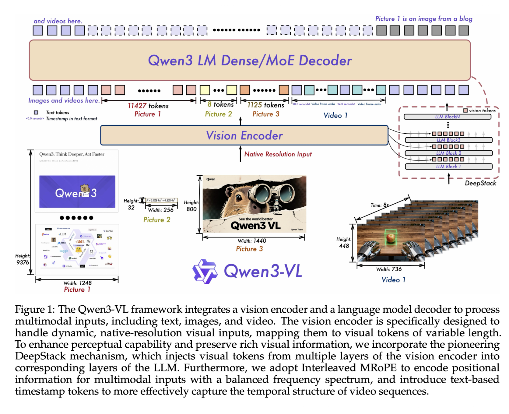
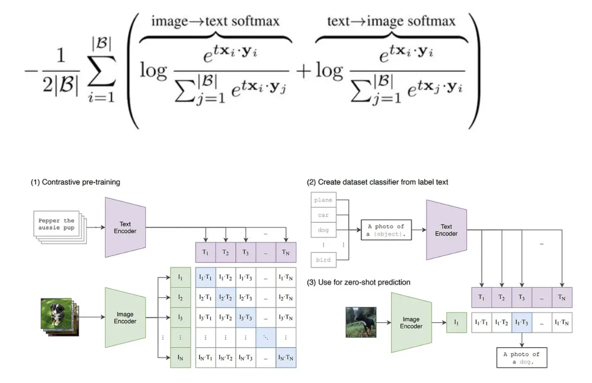
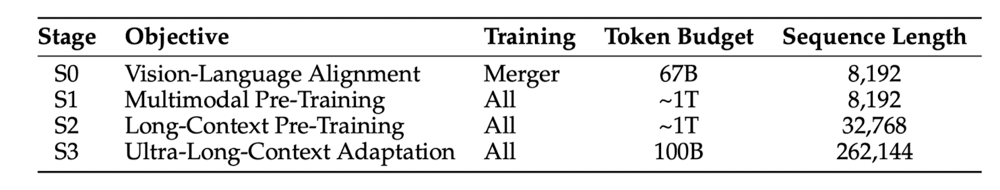

> Qwen3-VL Technical Report Review를 빠르게 훑고 주요 내용을 정리합니다.

### Introduction

Qwen3-VL은 다음과 같은 문제들을 해결하기 위해 설계됨

- Vision 능력을 향상시키는 과정에서 Text 처리 능력이 저하되는 catastrophic forgetting 개선
- 긴 비디오나 대용량 문서 등 처리 불가능한 context window 제한이거나, positional encoding의 해상도가 떨어지는 문제 개선

이를 해결하기 위해 **Qwen3 언어 모델을 backbone**으로 사용하여, **visual training 이후에도 텍스트 성능이 저하되지 않도록 최적화**됨

- Dense 모델은 2B ~ 32B 파라미터를 가짐
- MoE 모델은 30B A3B와 225B A22B가 있음
  - A3B: active parameter 3B
  - A22B: active parameter 22B

### Architecture

Qwen2.5-VL의 3 module 구조를 계승하면서도 세 가지 핵심적인 아키텍쳐 업그레이드 진행.

1. vision encoder
2. LLM
3. vision-language merger

##### Vision Encoder & Dynamic Resolution

구글의 **SigLIP-2**를 비전인코더로 채택. SigLIP은 기존 CLIP 대비 더 나은 의미론적 이해와 localization 능력을 제공하는 것으로 알려져 있음

- CLIP은 아래 식으로 계산. 모든 배치 내 텍스트 / 이미지 사이에 cross entropy 계산

  - 식 해석: 배치 내에 같은 pair의 이미지 텍스트 사이에 ‘**상대적**’ 유사도 높아지도록 최적화. 즉 다른 pair 이미지 혹은 텍스트 보다, 정답 이미지, 텍스트에 ‘상대적’으로만 가까우면 됨

  

- SigLIP은 softmax 대신 sigmoid 사용

  - 비대칭적이지 않으며 전역 정규화 인자도 필요하지 않음. 각 **이미지, 텍스트 pair가 독립적으로 평가**됨. 즉, 상대적 유사도라기 보다는 절대적으로 유사해야 함. 그래서 데이터 batch가 어떻게 구성되는지에 영향 덜 받을듯

다양한 입력 이미지 해상도에 대해 잘 적응하기 위해 **2D-RoPE** 와 입력 크기에 따라 **absolute position embedding을 interpolate** 하는 방식 활용. RoPE(Rotary Positional Embedding)는 [이곳](https://medium.com/@hugmanskj/mastering-llama-rotary-positional-embedding-rope-이해하기-9b1963a22852)에 정말 잘 설명되어 있음

2B, 4B 모델은 경량화를 위해 SigLIP2-Large를 사용하고, 8B이상의 모델은 SigLIP2-SO-400M 변형을 사용

**MLP-based Vision Language Merger**로는 2-layer MLP 사용. vision encoder 에서 나온 **2x2 visual feature를 single visual token으로 compress**

##### Interleaved MRoPE

MRoPE는 Qwen2-VL에서 처음으로 도입. 시간(t), 높이(h), 너비(w) 차원을 단순히 분할하여 회전 주파수를 할당하는 방식**.** 임베딩 벡터의 앞부분은 시간, 중간은 높이, 뒷부분은 너비 정보를 담당하는 식

하지만 연구팀은 이 방식이 주파수 스펙트럼 불균형(imbalanced frequecy spectrum)을 초래한다는 것을 발견함. 따라서 이를 해결하기 위해 interleaved MRoPE 제안. 이를 통해 **각 차원(time, h, w)이 저주파수 대역과 고주파수 대역에 모두 균일하게 분포**. 이로 인해 모델이 국소적인 텍스쳐 정보(고주파수)와 전역적인 구조정보(저주파수)를 모든 차원에서 균형있게 학습할 수 있게 하여, 비디오 이해 및 긴 문맥 처리 성능을 크게 향상

- imbalanced frequecy spectrum: 특정 차원의 정보가 고주파수 대역에만 집중되거나 저주파수 대역에만 집중되어. 긴 비디오 시퀀스 장기 의존성을 학습하는데 방해. 그래서 embedding vector 안에 값 중, 앞 부분일수록 일정 각도 변할 때 마다 값이 빠르게 변함

- 메커니즘: 시간(t), 높이(h), 너비(w) 성분을 임베딩 차원 전반에 걸쳐 **교차배치**(interleave). 즉 벡터의 차원 d에 대해서 [**t, h, w, t, h, w, ...**] 순서로 정보를 인코딩

##### **DeepStack**

**전통적인 VLM은 비전 인코더(ViT)의 마지막 레이어 출력만을 projection하여 LLM에 주입** (e.g., LLAVA). 하지만 비전 인코더의 마지막 레이어는 고도로 추상화된 의미 정보만 담고있기에 OCR 같은 미세 객체 식별과 같은 저수준 정보가 소실될 수 있음. 따라서 이를 위해 **DeepStack** 매커니즘 제안. 이 방식은 추가적인 context token 길이를 늘리지 않으면서도 (visual token 수는 유지), LLM이 저수준 텍스쳐 정보부터 고수중 의미 정보까지 풍부한 시각적 신호를 활용할 수 있게 함.

- 매커니즘: ViT의 마지막 레이어 뿐만 아니라 **중간 레이어들에서도 visual feature을 추출**. 추출된 multi-level feature들은 각각 별도의 MLP merger를 통과한 후. LLM의 서로 다른 레이어에 주입 (주로 초기 레이어들)

##### Explicit Video Timestamp

Qwen2.5-VL은 시간 동기화된 **positional embedding을 통해 비디오의 시간정보를 암묵적으로 처리**. 하지만 이는 긴 비디오에서 위치 ID가 지나치게 커지고 sparse 해지며, 다양한 FPS 데이터를 처리할 때 비효율적. Qwen3-VL는 이를 **텍스트 기반의 timestamp token**으로 대체하는 변화를 시도

- 구현 방식: 비디오의 각 temporal patch 앞에 `<3.0 seconds>`와 같은 명시적인 **텍스트 string형태의 timestamp를 삽입**
- 학습 전략: 훈련 데이터에서 seconds 단위로 **H, M, S(시분초) 형식을 모두 생성**하도록 유도하여, 모델이 다양한 시간 표현을 자연어 처럼 이해하게 함

컨텍스트 길이는 소폭 증가하지만, 모델이 시간 흐름을 텍스트로 직접 인지하게 됨으로써 '비디오의 3분 20초에 무슨 일이 일어났는가?'와 같은 temporal grounding 질문에 대해 훨씬 정확한 답변을 생성. 이는 dense captiong & event localization 성능을 비약적으로 높임

##### Square-root Reweighting

Qwen3-VL에는 **square-root normalized per-token loss**를 적용했다고 함. 이는 **텍스트 전용 데이터와 멀티모달 데이터간 학습 기여도를 동적으로 조절**하여 텍스트 능력을 훼손하지 않으면서 멀티모달 성능을 극대화하는데 기여. 즉, Loss 값을 그대로 쓰지 않고, Square-root을 활용해 조절(Reweighting). 즉, Square-root으로 깍아서 줄여주거나 균형을 맞춤

### Pre-training

Pre-training은 모델의 역량을 단계적으로 확장하기 위해 4단계로 순차적으로 진행되며, 총 2조 토큰 이상의 방대한 데이터를 학습

##### Stage 0: Vision-Text Alignment

- 목적: **vision encoder와 LLM 간 modality 차이를 좁히기 위한 초기 정렬**
- 방법: Vision encoder와 LLM backbone은 freeze한 상태에서 오직 **MLP 기반의 merger parameter만 학습**
- 데이터: 약 67B 토큰 규모의 고품질 image-caption pair, visual knowledge data, OCR data를 사용. 시퀀스 길이는 8192로 설정

##### Stage 1: Multi-modal Pre-training

- 목적: 대규모 데이터를 통한 시각적 지식의 광범위한 습득
- 방법: **모든 파라미터를 trainable** 하게 두고 **end-to-end 학습**을 수행
- 데이터: 약 1T(조) 토큰 규모 데이터셋 사용. 텍스트 능력 보존을 위해 텍스트 전용 데이터와 멀티모달 데이터를 혼합. 시퀀스 길이는 여전히 8192
  - 멀티모달 데이터 종류: interleave documents, textual grounding, VQA, STEM 등

##### Stage 2: Lont-Context Pre-training

- 목적: 긴 시퀀스 처리 능력 및 비디오/에이전트 작업 능력 배양
- 방법: **시퀀스 길이를 32K(32768)로 4배 확장하여 전체 파라미터를 학습**
- 데이터: 약 1T(조) 토큰 데이터를 추가로 학습. 장문 텍스트 이해를 위한 **텍스트 데이터 비중을 높이고**, 멀티모달 데이터에서는 **비디오 데이터와 에이전트 지시 수행 데이터의 비중을 대폭 강화**

##### Stage 3: Ultra-Long-Context Adaptation

- 목적: 극한의 컨텍스트 길이(256K) 처리 능력 확보
- 방법: **시퀀스 길이를 256K(262144)까지 확장**
- 데이터: 약 100B(억) 토큰의 고도로 선별된 데이터를 사용. 주로 **장문 비디오 요약, 전체 도서 분석**과 같은 작업에 초점

### Training Data

##### Image Caption & Interleaved Data

단순한 웹 크롤링 데이터는 노이즈가 많고 설명이 빈약

- **Recaptioning**: Qwen2.5-VL-32B 모델 fine-tuning 하여 대규모 이미지 캡션 데이터 셋을 다시 생성. 주요 object 뿐만 아니라 속성, 공간적 배치, 맥락적 의미 풍부하게 기술
- **Interleaved data**: 논문, 잡지, 교과서 등 **텍스트와 이미지가 함께 등장하는 문서 데이터**를 대량으로 확보. 페이지 순서를 유지하며 256K 토큰 길이로 병합하는 전처리 과정 거침. 광고나 저품질 컨텐츠 필터링 위한 domain 분류기와 score model 활용

##### Knowledge & OCR

- **Entitiy-based sampling**: 동물, 식물, 랜드마크, 상품 등 10여개 카테고리의 엔티티 정의 후, long-tailed entity 포괄하도록 importance base sampling 수행
- **다국어 OCR**: 기존 10개 언어에서 29개 언어 추가하여 39개의 언어에 대한 OCR 능력 확보. 이를 위해 3천만개의 내부 수집 이미지와 합성 데이터 활용.

##### Grounding & Counting

- **Bbox** 뿐만 아니라 **point** 기반의 grounding data 대량 생산함
- **Grounding DINO**와 같은 전문 모델과 Qwen2.5-VL 활용하여, 레이블 없는 이미지에 대해 고품질 객체 위치 주석을 자동으로 생성하고 검증하는 파이프라인 구축. 좌표계는 normalization 하여 resolution 변화에 강건하도록 제작

##### Spatial Understanding & 3D Recognition

3D 공간도 이해하기 위해 데이터 추가

- **공간 관계**: '노트북 뒤의 책', '왼쪽의 컵'과 같은 상대적 위치 관계 학습하는 데이터 셋 구축
- **3D grounding**: monoculr image에서 객체의 3차원 위치 추정하는 데이터 포함. Omni3D 데이터셋을 가상 카메라 좌표계로 통일하여 다양한 센서 소스간 차이 극복

##### Code & Agent

- **Multimodal Coding**: UI 스크린 샷을 HTML/CSS로 변환하거나, 다이어그램을 python 코드로 구현하는 등의 멀티모달 코딩 데이터 대폭 강화
- **GUI Agent**: 데스크탑, 모바일, 웹 환경에서의 trajectory 데이터를 수집. 단순한 클릭을 넘어, planning과 self-correction 과정을 포함하는 CoT 데이터 합성하여 agent 지능 높임

##### Video

- **Dense Caption Synthesis**: 긴 video에 대해 timestamp가 포함된 스토리 레벨의 caption 생성. 짧은 클립에 대한 설명을 먼저 생성하고, 이를 순서대로 병합하여 일관성 있는 긴 설명 만드는 전략 사용
- **Length adaptive sampling**: 훈련 단계별로 프레임 수와 FPS를 동적으로 조절하여, 짧은 비디오의 디테일과 긴 비디오 전반적 맥락 모두 학습할 수 있게 함

##### STEM & Math

- 합성 다이어그램: 코드를 사용하여 기하학 도형, 함수 그래프 등을 렌더링하고 이에 대한 질문 (교차점, 각도 등)을 생성하여 시각적 정밀도 높임
- 추론 데이터: 6천만 개 이상의 K-12 및 대학 수준 수학/과학 문제를 정제하여 사용. 풀이 과정을 단계별로 기술하는 CoT 형식을 표준화하여 모델의 논리적 사고력을 배양

### Post-training

Post-training은 사용자 의도에 맞게 지식을 정렬하고 전문화 하는 과정임. Qwen3-VL은 이 단계에서 Thinking와 Non-Thinking라는 두 가지 모드의 모델로 나뉨. 약 120만개의 고품질 instruction tuning 데이터를 사용

- Thinking 모델: **추론 과정을 명시적으로 생성하는 Long CoT 데이터**를 집중적으로 학습. 시각적 정보 없이 풀 수 있는 문제는 제거하여 멀티모달 사고력 극대화
- Non-Thinking 모델: **표준적인 QA 형식**의 데이터 사용

32K 길이 데이터로 1차 훈련 후, 256K 길이의 장문 데이터와 혼합하여 2차 훈련을 진행

### Conclusion

여러 지표에서 Gemini 2.5 Pro나 GPT-5와 유사하거나 능가했는데 자세한 지표는 논문을 직접 확인해보면 좋음

여담으로 오늘이 논문 올라온지 3주 쯤 되었는데, 벌써 2800회나 인용되었을 정도로 핫한 것을 보니 Qwen 팀이 대단하긴 한듯

### Reference

- https://github.com/QwenLM/Qwen3-VL
- https://arxiv.org/abs/2511.21631
