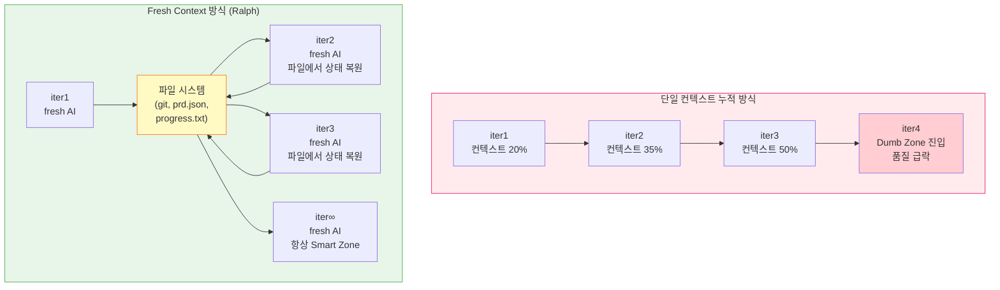
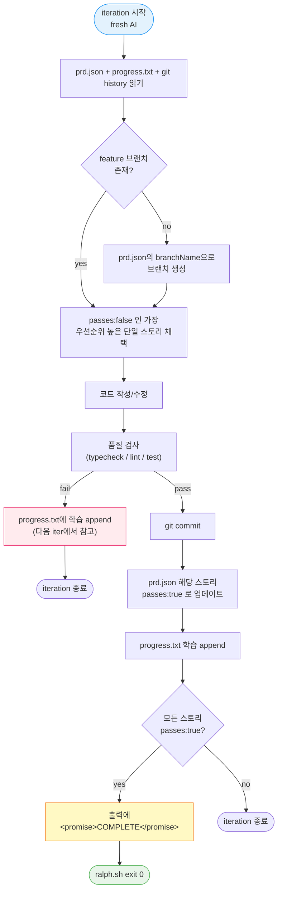
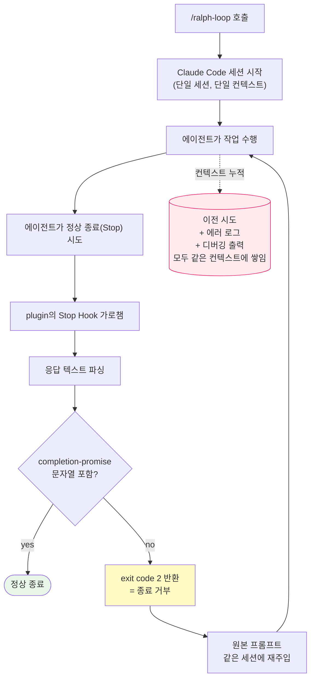

> Geoffrey Huntley의 원형 Ralph 패턴부터 snarktank/ralph, Claude Code Ralph Loop 플러그인, OpenAI Codex `/goal`까지 — 장시간 실행 코딩 에이전트가 컨텍스트 부패를 어떻게 우회하고 종료를 어떻게 정의하는지 정리합니다. 본 포스팅은 서로 다른 에이전트가 ralph loop 방식으로 작성한 초안들을 병합한 결과물입니다.

### What is Ralph?

2025년 하반기, 호주의 개발자 [Geoffrey Huntley](https://ghuntley.com/ralph/)가 한 줄짜리 bash 스크립트를 제안하였습니다.

```bash
while :; do cat PROMPT.md | claude-code ; done
```

이게 전부입니다. AI 에이전트가 "구현 끝났습니다"라고 말해도 무시하고, 같은 프롬프트를 무한히 다시 집어넣는 단순한 무한 루프입니다. Huntley는 이 패턴에 심슨가족 캐릭터 이름을 붙였습니다 — **Ralph Wiggum**, 똑똑하지는 않지만 끈질기게 포기하지 않는 그 캐릭터입니다.

단순하다고 무시할 게 아닙니다. YC 해커톤에서 한 팀이 이 스크립트를 GCP 인스턴스에 올려놓고 잠들었더니 아침에 6개 레포지토리에 1,100개 커밋이 찍혀 있었다고 합니다. Browser Use를 Python에서 TypeScript로 거의 다 포팅했고, 비용은 800달러로 시간당 10.50 USD 개발자를 고용한 셈이었습니다. Huntley 본인도 같은 패턴으로 50k USD짜리 컨트랙트 결과물(MVP + 테스트 + 리뷰 포함)을 297 USD에 납품해 168배 비용 절감을 입증했습니다.

Huntley가 강조하는 핵심은 다음 한 줄로 요약됩니다.

> "Ralph is a technique. In its purest form, Ralph is a Bash loop."

여러 에이전트가 서로 통신하는 마이크로서비스 구조 대신, 하나의 OS 프로세스가 수직으로 확장되는 모놀리식 접근법입니다. 비결정적인 LLM 여러 개가 상호작용하며 만드는 통제 불가능한 혼란을 배제하고, 소프트웨어를 한 에이전트가 지속적으로 빚어내며 다듬게 하자는 철학적 전환이었습니다.

##### Ralph Wiggum 비유의 의미

이름의 어원은 심슨 가족에 등장하는 캐릭터 Ralph Wiggum입니다. Ralph는 영리하지 않습니다. 같은 미끄럼틀에서 같은 방식으로 점프하고, 같은 실수를 반복합니다. 그러나 놀이터에 "미끄럼틀에서는 내려와라, 점프하지 말라, 주위를 둘러보라"는 표지판을 충분히 세워두면, Ralph는 결국 안전하게 놀이터를 빠져나옵니다.

LLM 한 번의 호출은 비결정적입니다. 같은 프롬프트도 매번 다른 답을 내놓고, 종종 헛소리를 합니다. 하지만 루프 자체가 결정적이고, 매 반복마다 깨끗한 컨텍스트로 시작하기 때문에, 충분히 좋은 표지판(프롬프트, 명세, 테스트)이 있으면 출력은 점진적으로 정답에 수렴합니다. 똑똑한 한 번의 호출이 아니라 멍청한 백 번의 호출이 작동의 토대가 된다는, 직관에 다소 반하는 주장이 비유의 핵심입니다.

### Why Does It Work?: Context Rot

Ralph Loop가 작동하는 이유를 이해하려면 LLM의 본질적 한계인 **Context Rot** 현상을 먼저 봐야 합니다. 언어 모델의 컨텍스트 윈도우는 두 구역으로 나뉩니다.

- **Smart Zone (앞쪽 ~40%)**: 모델이 예리하고, 시스템 프롬프트와 요구사항을 완벽히 이해하며, 아키텍처적으로 건전한 결정을 내리는 구간
- **Dumb Zone (나머지 ~60%)**: 디버깅 로그, 컴파일 오류, 이전 턴의 실패 흔적이 누적되면서 어텐션이 핵심 목표에서 분산되는 구간. 같은 실수를 반복하고 환각이 늘어나며 무의미한 코드를 출력하는 교착 상태에 빠짐

Huntley가 가장 길게 강조하는 한 줄은 다음입니다.

> "The more you use the context window, the worse the outcomes you'll get."

근거는 두 가지입니다. 

1. 컨텍스트 윈도우 자체가 한정된 자원입니다. 하나의 컨텍스트 윈도우 안에서 명세·도구·중간 결과·실패 흔적이 모두 경쟁합니다.
2. 한 세션이 길어질수록 모델은 자신이 앞서 만든 거짓말과 잘못된 가정까지 누적해 들고 갑니다. 

이 둘이 합쳐지면 **세션의 후반부 출력이 전반부보다 일관되게 더 나빠지는** 현상이 생깁니다.

좋은 자율 루프 시스템의 본질은 모델이 얼마나 똑똑한 코드를 짜느냐가 아니라, 작업 내내 어떻게 모델을 **Smart Zone에 강제로 머무르게 할 것인가**입니다. 그리고 가장 단순하고 효과적인 답이 — **매 iteration마다 프로세스를 죽이고 새로 띄우기**입니다.



진행 상황을 LLM 컨텍스트가 아니라 **파일과 git에 저장**하면, 컨텍스트가 차오를 일이 없습니다. 차면 새 에이전트를 띄우면 됩니다. fresh한 에이전트가 파일시스템 상태를 읽고 이어서 작업하니까요. **메모리 책임을 비싼 토큰에서 무료인 디스크로 오프로딩한 셈**입니다.

##### One Item Per Loop

같은 맥락에서 Huntley가 한 번 더 못 박는 규칙이 **"한 루프에 한 작업(One item per loop)"** 입니다.

> "One item per loop. I need to repeat myself here—one item per loop. You may relax this restriction as the project progresses, but if it starts going off the rails, then you need to narrow it down to just one item."

작업을 잘게 쪼갤수록 한 컨텍스트 윈도우 안에서 끝낼 수 있고, 끝나면 다음 루프가 깨끗한 상태로 다시 시작합니다. 이게 fresh-context 패턴이 누적-세션 모델을 이기는 실질적인 이득입니다.

### Spec Beats Execution

Ralph 사이클은 '코드를 짠다'가 아니라 **생성(Generate)과 역압(Backpressure)의 두 페이즈**로 짜입니다. 생성 단계에서 LLM이 코드를 만들고, 역압 단계에서 명세·테스트·우선순위 큐가 그 코드를 걸러냅니다.

> "Generating code is now cheap, and the code that Ralph generates is within your complete control through your technical standard library and your specifications."

> "As code generation is easy now, what is hard is ensuring that Ralph has generated the right thing."

코드 작성은 더 이상 병목이 아닙니다. 진짜 일은 **무엇을 짤지를 명확하게 적어두는 일** — 즉 명세(Spec)를 쓰는 일이 됩니다. 이 패턴에서 명세가 실행을 이긴다는 말은 "루프는 단순할수록 좋고, 단순한 루프가 매번 읽어가는 외부 상태(명세·우선순위·진행 로그)에 모든 지능을 박아두라"는 의미입니다.

Huntley는 LLM 메모리 대신 세 종류의 파일에 진실을 적어 둡니다.

- **specs/** — 합의된 사양. *"Specs are formed through a conversation with the agent at the beginning phase of a project."*
- **fix_plan.md** — 우선순위 큐. *"The TODO list is what I'm watching like a hawk. And I throw it out often."*
- **AGENT.md** — 런타임에 발견한 학습. *"When you learn something new ... make sure you update @AGENT.md using a subagent but keep it brief."*

다음 절에서 볼 [snarktank/ralph](https://github.com/snarktank/ralph)는 이 셋을 그대로 자기 포맷에 흡수했습니다.

| ghuntley 에세이 | snarktank/ralph 구현 |
| --- | --- |
| `specs/*` 사양 디렉터리 | `prd.json.userStories[].acceptanceCriteria` |
| `fix_plan.md` 우선순위 큐 | `prd.json.userStories[].priority` + `passes` |
| `AGENT.md` 런타임 학습 | `progress.txt` (append-only) |
| `while :; do cat PROMPT.md \| claude-code ; done` | `scripts/ralph/ralph.sh`의 `for i in $(seq 1 $MAX_ITERATIONS)` 루프 |
| "until specs.md is satisfied" 종료 | `<promise>COMPLETE</promise>` 토큰 grep으로 종료 |

표의 마지막 줄이 두 도구를 가르는 작은 차이입니다. ghuntley의 한 줄짜리 루프는 **사람이 Ctrl+C로 멈출 때까지** 도는 반면, snarktank/ralph는 모델이 모든 acceptance criteria를 통과시켰다고 판단하면 stdout으로 **합의된 토큰 `<promise>COMPLETE</promise>`을 출력**하고, `ralph.sh`가 이 문자열을 `grep`으로 잡아 정상 종료합니다. 이 한 줄이 "사람이 직접 끝맺는 도구" 를 "스스로 끝맺는 도구" 로 바꿉니다.

### snarktank/ralph

Ralph 패턴의 철학을 가장 충실하게 실용 코드로 옮긴 오픈소스가 [snarktank/ralph](https://github.com/snarktank/ralph)입니다.

단순한 bash 한 줄을 PRD 기반의 자율 개발 파이프라인으로 확장한 형태이며, 사용자가 손으로 작성하는 것은 사실상 **`prd.json` 한 파일** 뿐이고 나머지 — 루프 스크립트와 프롬프트 템플릿 — 는 저장소에서 그대로 복사해 씁니다.

##### Prerequisites 

- Claude Code(`npm install -g @anthropic-ai/claude-code`) 또는 [Amp](https://ampcode.com/)
- `jq` — `ralph.sh`가 PRD JSON에서 `branchName`을 읽을 때 씁니다 (`brew install jq`)
- git 저장소 — 매 반복이 커밋을 남기기 때문에 깨끗한 워킹 트리에서 시작하는 게 안전합니다

##### Installation

가장 단순한 옵션은 저장소를 클론한 뒤 `ralph.sh`와 프롬프트 템플릿을 작업 중인 프로젝트로 복사하는 방식입니다.

```bash
# 1) Ralph 저장소 클론
git clone https://github.com/snarktank/ralph.git /tmp/ralph

# 2) 작업 중인 프로젝트 루트로 이동
cd /path/to/your-project
mkdir -p scripts/ralph

# 3) 루프 스크립트 + 프롬프트 템플릿 복사
cp /tmp/ralph/ralph.sh scripts/ralph/
cp /tmp/ralph/CLAUDE.md scripts/ralph/    # Claude Code용
# 또는
cp /tmp/ralph/prompt.md scripts/ralph/    # Amp용

# 4) 실행 권한 부여
chmod +x scripts/ralph/ralph.sh
```

실행은 다음과 같습니다.

```bash
# Amp (기본)
./scripts/ralph/ralph.sh [max_iterations]

# Claude Code
./scripts/ralph/ralph.sh --tool claude [max_iterations]
```

기본 반복 횟수는 10회이며 인수 한 개로 덮어씁니다. 매 반복마다 `=== Ralph Iteration N of M ===` 헤더가 stderr에 찍히고, 모델이 모든 acceptanceCriteria를 충족했다고 판단하면 stdout에 `<promise>COMPLETE</promise>` 토큰을 흘려 종료를 합의합니다. 첫 실행은 한 자릿수 반복으로 동작 확인부터 하는 게 안전합니다.

##### Core Logic

`scripts/ralph/ralph.sh:84-108` ([6c53cb0](https://github.com/snarktank/ralph/blob/6c53cb0b831ebe8739c6a003e22af14902d8b0b5/ralph.sh#L84-L108))의 본문은 매우 단순합니다. 길어 보이지만 인자 파싱과 archive 처리 빼면 사실상 for 루프 한 덩어리입니다.

```bash
for i in $(seq 1 $MAX_ITERATIONS); do
  echo ""
  echo "==============================================================="
  echo "  Ralph Iteration $i of $MAX_ITERATIONS ($TOOL)"
  echo "==============================================================="

  # Run the selected tool with the ralph prompt
  if [[ "$TOOL" == "amp" ]]; then
    OUTPUT=$(cat "$SCRIPT_DIR/prompt.md" | amp --dangerously-allow-all 2>&1 | tee /dev/stderr) || true
  else
    # Claude Code: use --dangerously-skip-permissions for autonomous operation, --print for output
    OUTPUT=$(claude --dangerously-skip-permissions --print < "$SCRIPT_DIR/CLAUDE.md" 2>&1 | tee /dev/stderr) || true
  fi

  # Check for completion signal
  if echo "$OUTPUT" | grep -q "<promise>COMPLETE</promise>"; then
    echo ""
    echo "Ralph completed all tasks!"
    echo "Completed at iteration $i of $MAX_ITERATIONS"
    exit 0
  fi

  echo "Iteration $i complete. Continuing..."
  sleep 2
done
```

핵심은 세 줄입니다. 디스패치 두 줄이 매 반복마다 `amp` 또는 `claude` CLI를 **새 프로세스**로 띄워 — 따라서 컨텍스트가 자동으로 깨끗하게 리셋된 채 — `prompt.md` 또는 `CLAUDE.md`를 stdin으로 흘려보내고, `grep -q "<promise>COMPLETE</promise>"`이 stdout 한 줄로 LLM과 셸이 "끝났다" 를 합의하는 단일 인터페이스이며, 그게 잡히지 않으면 `sleep 2`를 거쳐 `for` 루프가 다음 반복으로 자동 진입합니다. 25줄 안에서 디스패치·캡처·종료 판정·페이싱이 모두 닫힙니다.

##### prd.json

매 iteration에서 "내가 이번에 무엇을 해야 하는가" 는 `prd.json` 한 파일에 다 들어 있습니다. 한 user story의 최소 형태는 다음과 같습니다.

```json
{
  "project": "MyApp",
  "branchName": "ralph/task-priority",
  "description": "Task Priority System - Add priority levels to tasks",
  "userStories": [
    {
      "id": "US-001",
      "title": "Add priority field to database",
      "description": "As a developer, I need to store task priority so it persists across sessions.",
      "acceptanceCriteria": [
        "Add priority column to tasks table: 'high' | 'medium' | 'low' (default 'medium')",
        "Generate and run migration successfully",
        "Typecheck passes"
      ],
      "priority": 1,
      "passes": false,
      "notes": ""
    }
  ]
}
```

`passes: false`인 스토리만 큐에 남고, 모두 `true`가 되면 `<promise>COMPLETE</promise>`가 출력됩니다.

한 스토리가 가지는 필드는 `id`·`title`·`description`·`acceptanceCriteria[]`·`priority`(작은 값이 우선)·`passes`·`notes` 일곱 개뿐이며, 에이전트는 매 반복에서 **`passes: false`인 가장 높은 우선순위 항목 하나만 골라 처리**합니다. AI가 보기에 prd.json은 **TODO 리스트 + 정답지** 역할을 동시에 합니다. 핵심은 "acceptanceCriteria가 곧 LLM에 흘러갈 사양" 이라는 점입니다.

> "Each PRD item should be small enough to complete in one context window. If a task is too big, the LLM runs out of context before finishing and produces poor code."

한 항목이 한 컨텍스트 윈도우 안에서 끝낼 수 있을 만큼 작아야 하고, 모호한 표현 대신 **자동 검증 가능한 항목**(예: "타입체크 통과", "테스트 통과")을 적어두는 게 권장 패턴입니다.

##### progress.txt

`progress.txt`는 더 단순합니다. **append-only 텍스트 파일**입니다. 매 iteration의 fresh AI가 이 파일에 그날 알아낸 코드베이스 정보를 한두 줄씩 기록하고, 다음 iteration의 fresh AI가 시작할 때 이걸 읽어서 같은 지뢰를 다시 밟지 않습니다.

```text
# Ralph Progress Log
Started: Tue May 6 23:18:00 KST 2026
---
[iter 3] 라우팅이 app/router.go에 모여있고, 모든 핸들러는 RegisterRoutes로 등록해야 함
[iter 4] FTS 인덱스가 search_index 테이블에 이미 존재 - 새로 만들지 말 것
[iter 6] make test 가 환경변수 TEST_DATABASE_URL 없으면 panic. .env.test 참고
[iter 7] legacy/ 디렉토리는 PRD에서 명시적으로 건드리지 말라고 함
```

이게 Ralph 패턴의 **외장 두뇌(external brain)** 입니다. LLM 컨텍스트 윈도우가 비싼 휘발성 메모리라면, progress.txt는 무료의 영구 저장소입니다.

##### CLAUDE.md / prompt.md

`ralph.sh`가 매번 자식 프로세스에 파이프하는 그 프롬프트 파일이 `CLAUDE.md`(또는 Amp의 `prompt.md`)입니다. 이 파일이 Ralph의 "agent 헌법" 역할을 합니다. snarktank/ralph 의 `CLAUDE.md:7-16` ([6c53cb0](https://github.com/snarktank/ralph/blob/6c53cb0b831ebe8739c6a003e22af14902d8b0b5/CLAUDE.md#L7-L16))의 verbatim입니다.

```markdown
1. Read the PRD at `prd.json` (in the same directory as this file)
2. Read the progress log at `progress.txt` (check Codebase Patterns section first)
3. Check you're on the correct branch from PRD `branchName`. If not, check it out or create from main.
4. Pick the **highest priority** user story where `passes: false`
5. Implement that single user story
6. Run quality checks (e.g., typecheck, lint, test - use whatever your project requires)
7. Update CLAUDE.md files if you discover reusable patterns (see below)
8. If checks pass, commit ALL changes with message: `feat: [Story ID] - [Story Title]`
9. Update the PRD to set `passes: true` for the completed story
10. Append your progress to `progress.txt`
```

이 짧은 markdown 파일이 모든 마법의 진원지입니다. **순서**(read state → pick → implement → verify → commit → log)를 못박고, **외장 두뇌 갱신 의무**(progress.txt append)를 강제하고, 무엇이 *"learning for future iterations"* 으로 가치 있는지를 가르칩니다.

4단계("최우선 `passes:false` 골라라")와 9단계("끝났으면 `passes:true`로 갱신해라")는 위 PRD JSON과 정확히 같은 키를 참조합니다. 지능은 이 마크다운과 JSON 안에 박혀 있고, `ralph.sh`는 그저 둘을 비결정적인 LLM에 매번 새로 흘려넣는 결정적 셸 루프 역할만 합니다.

이걸 매 iteration의 백지 상태 AI한테 주입함으로써 "멍청하지만 일관되게 똑같은 일을 잘 하는" Ralph가 만들어집니다. OpenClaw가 만든 "soul document" 라는 개념도 이것의 더 정교한 버전입니다 — 에이전트의 성격, 행동 원칙, 금지 사항을 markdown 한 장에 묶어 매 세션에 주입하는 방식이죠.

##### Flowchart of One Iteration

스크립트 자체는 이렇게 단순하지만, 실제 한 iteration 안에서 일어나는 일은 인간 개발자의 작업 흐름을 거의 그대로 모사합니다.



이 다이어그램의 진가는 **상태가 어디 있는가**에 있습니다. AI는 매번 죽고 다시 뜨지만, `prd.json`의 `passes` 플래그, git commit history, append-only인 `progress.txt`, 그리고 매번 새로 주입되는 `CLAUDE.md` — 이 네 가지가 누적된 진행 상황과 행동 규칙을 보존합니다. 다음 iteration의 백지 AI는 이걸 읽고 "내가 어디까지 했고, 무엇을 알아냈고, 어떻게 행동해야 하는지" 를 역설계해서 그대로 이어서 작업합니다. 메모리가 LLM이 아니라 디스크에 있다는 게 이런 의미입니다.

##### Notes

위 흐름을 실제 프로젝트에서 굴리기 전에 다음 네 가지는 짚고 넘어가야 합니다.

- **권한 우회 플래그가 켜져 있다.** `ralph.sh`는 Amp에는 `--dangerously-allow-all`, Claude에는 `--dangerously-skip-permissions`를 붙여 호출합니다. 즉 LLM이 `rm -rf` 같은 명령을 던져도 사용자에게 묻지 않습니다. 컨테이너·VM·Devcontainer 등 격리 환경에서 돌리는 게 안전합니다.
- **CI/피드백 루프가 없으면 무용지물이다.** Ralph는 매 반복마다 새 컨텍스트로 들어오기 때문에, 직전 반복이 잘못 짠 코드는 typecheck·테스트가 잡지 못하면 다음 반복으로 그대로 누적됩니다. README는 *"Ralph only works if there are feedback loops"* 라고 명시합니다.
- **한 사이클에 한 스토리.** PRD를 잘게 쪼개야 하는 이유는 가독성이 아니라 컨텍스트 윈도우가 유한하기 때문입니다. 한 스토리가 한 반복 안에서 끝나지 않으면 다음 반복은 미완성 상태에서 시작해 더 망가지기 쉽습니다.
- **결제와 토큰 소모.** 한 번 돌리면 LLM CLI를 수십 번 새 프로세스로 호출하므로 API 사용량이 빠르게 쌓입니다. `MAX_ITERATIONS`를 작게 잡고 `prd.json`의 첫 스토리부터 검증하는 게 좋습니다.

### Claude Code Ralph Loop Plugin

Ralph 패턴의 인기에 편승해 Anthropic이 공식 플러그인으로 정식 출시한 것이 [Ralph Loop](https://claude.com/plugins/ralph-loop) 플러그인입니다. 같은 사상을 **Claude Code 세션 내부**로 가져와, 사용자가 직접 셸 루프를 짜지 않아도 같은 채팅 창 안에서 자기참조 루프가 돌도록 패키징한 결과물입니다. 외부 셸 루프 대신 Claude Code의 **Stop Hook**이 종료를 가로채 동일 프롬프트를 다음 iteration으로 되돌려 보내는 구조입니다.

##### Installation

Claude Code의 플러그인 시스템은 마켓플레이스를 등록한 뒤 그 안의 플러그인을 설치하는 두 단계 흐름입니다. 처음 사용 시점에 다음 두 줄을 차례로 실행합니다.

```text
/plugin marketplace add claude-plugins-official
/plugin install ralph-loop@claude-plugins-official
```

설치가 끝나면 슬래시 커맨드 3종(`/ralph-loop`, `/cancel-ralph`, `/help`)과 Stop Hook(`hooks/hooks.json` → `hooks/stop-hook.sh`)이 자동으로 등록됩니다. 플러그인 파일은 `~/.claude/plugins/cache/claude-plugins-official/ralph-loop/1.0.0/` 경로에 캐시됩니다.

루프는 슬래시 커맨드 한 줄로 시작합니다.

```text
/ralph-loop "Build a todo API" --completion-promise "DONE" --max-iterations 20
```

플래그는 두 개뿐입니다.

- `--max-iterations`: 안전 상한
- `--completion-promise`: 에이전트 응답에 이 문자열이 포함되면 루프 종료. snarktank/ralph가 `<promise>COMPLETE</promise>`를 합의된 토큰으로 쓰는 것과 같은 패턴이지만, 호출마다 자유롭게 지정할 수 있습니다 — Stop Hook은 `<promise>X</promise>` 형태가 정확히 나타날 때만 루프를 끝냅니다

`--max-iterations`를 생략하면 **기본값이 무제한**이라 두 옵션을 모두 지정하고 시작하는 게 안전합니다. 진행 중인 루프 중단은 같은 세션에서 `/cancel-ralph`로 합니다 — 내부적으로 `.claude/ralph-loop.local.md` 상태 파일을 삭제하는 것뿐이며, 다음 Stop 이벤트가 발생하면 훅이 "활성 루프 없음" 으로 판단해 정상 종료를 허용합니다.

##### How Does It Work?

원본 Ralph가 외부 bash 스크립트로 자식 프로세스를 매번 새로 띄우는 것과 달리, 공식 플러그인은 Claude Code 내부의 **Stop Hook** 메커니즘을 이용해 같은 세션 안에서 루프를 흉내냅니다.



README는 한 문장으로 못 박습니다 — *"The loop happens **inside your current session** - you don't need external bash loops. The Stop hook in `hooks/stop-hook.sh` creates the self-referential feedback loop by blocking normal session exit."*

안전장치 면에서는 동시에 여러 Claude Code 세션을 띄워둔 상황에서도 다른 세션의 Stop Hook이 잘못된 상태 파일을 건드리지 못하도록 `session_id`를 비교하는 가드가 들어 있어, raw Ralph에는 없는 멀티 세션 격리가 기본 제공됩니다.

##### Single Context

문제는 매 iteration의 모든 작업 내역이 **같은 컨텍스트 윈도우**에 무한정 누적된다는 것입니다. 매번 프로세스를 깨끗하게 죽이고 새로 띄워서 fresh context를 확보하던 snarktank/ralph 철학과 정반대입니다. aihero.dev의 측정에 따르면:

- iter1: 컨텍스트 ~20% 사용
- iter2: ~35%
- iter3: ~50% — 이미 절반이 과거의 실패 로그와 cruft
- iter4 이후: 모델이 빠르게 Dumb Zone으로 진입, 환각과 같은 실수 반복 폭증

루프가 길어질수록 토큰 비용은 직선적으로 늘어나는데 결과 품질은 거꾸로 떨어집니다. 게다가 Claude Code 내부의 컨텍스트 자동 압축(compaction)과 Stop Hook이 충돌하는 케이스가 보고되고 있어, 사용자가 중간에 개입해 수동으로 압축해줘야 하는 상황이 빈번합니다.

이런 이유로 aihero.dev 같은 비판적 리뷰는 "공식 플러그인 대신 원본 bash 패턴을 쓰라" 고 권합니다. 설치는 한 줄로 편하지만 그 편의성이 곧 아키텍처적 한계로 직결될 수 있기 때문입니다. 다만 글 한 편 쓰는 정도의 task처럼 5~10 iter 안에 충분히 끝나는 작업이라면 Dumb Zone에 도달하기 전에 마무리되므로 실용적으로는 충분합니다 — 며칠짜리 코드 마이그레이션이라면 외부 셸 루프형 구현이 더 예측 가능할 것입니다.

### OpenAI Codex Goal Command

로컬/컨테이너 기반의 Ralph 계열 도구들과 다른 결로 등장한 것이 OpenAI Codex CLI의 [`/goal` 명령어](https://github.com/openai/codex)입니다. 2026년 4월 v0.128.0에 추가되었고, 작성 시점에는 `goals` feature flag가 `under development`로 노출된 기능입니다. 공식 문서가 아직 따라오는 중이므로, 여기서는 단순한 자율 루프를 넘어 **Codex 세션 안에서 장기 목표를 계속 추적하는 lifecycle 기능**으로 다룹니다.

snarktank/ralph가 외부 bash 루프로 매번 새 LLM 프로세스를 띄우고 Claude `ralph-loop`가 같은 세션 안에서 Stop Hook으로 자기참조 루프를 만든다면, `/goal`은 **하나의 Codex thread 내부에서** 매 턴 종료 직후 시스템이 자동으로 audit 프롬프트를 주입해 모델 스스로 "정말 다 끝났는가" 를 판단하게 만드는 형태입니다.

##### Activation

`/goal`은 0.128.0 이후의 Codex CLI에 들어온 기능이지만 기본 활성 상태가 아니라 `Feature::Goals` 플래그로 게이트되어 있습니다. 사용자가 직접 토글하는 방법은 두 가지입니다.

```toml
# ~/.codex/config.toml
[features]
goals = true
```

```bash
# 같은 결과를 명령 한 줄로 적용
codex features enable goals
```

##### How to Use

활성화 이후의 호출 문법은 슬래시 커맨드 한 줄입니다. 소스가 직접 정의하는 사용법은 다음과 같습니다.

```text
Usage: /goal <objective>
Example: /goal improve benchmark coverage
```

루프가 시작된 뒤에는 같은 슬래시 커맨드 패밀리로 상태를 조작합니다.

```text
/goal pause
/goal resume
/goal clear
```

내부 `ThreadGoalStatus` enum은 정확히 4개 상태(`Active` / `Paused` / `BudgetLimited` / `Complete`)이며, 위 슬래시 커맨드와 자동 전이가 이 enum을 갱신합니다.

##### System Prompt Injection

`/goal`의 핵심은 매 턴 종료 시 백엔드가 자동으로 주입하는 두 시스템 프롬프트 템플릿입니다.

| 템플릿 | 역할 |
|---|---|
| `goals/continuation.md` | 이전 행동 결과 + 디렉토리 상태 분석 → 목표 달성 여부 자가 평가 → 다음 단계 계획 |
| `goals/budget_limit.md` | 사용자 사전 정의 토큰 예산 임계치 도달 시 발동 → 목표 미완료라도 즉시 모든 후속 루프 차단, `BudgetLimited` 상태로 동결 |

`continuation.md`가 못 박는 핵심 한 줄은 다음입니다.

> "Treat uncertainty as not achieved; do more verification or continue the work."

같은 템플릿이 이어서 강조하는 또 한 줄은 `update_goal` 도구의 호출 권한이 audit 통과에만 의존한다는 사실입니다.

> "Do not call update_goal unless the goal is complete. Do not mark a goal complete merely because the budget is nearly exhausted or because you are stopping work."

종료는 모델이 `update_goal(status="complete")` 도구를 호출해야 일어나며, 그 도구의 머리 주석은 *"create_goal starts an active objective, while update_goal can only mark the existing goal complete"* 라고 의도를 못 박습니다 — **루프를 끝낼 권한 자체가 의도적으로 분리**되어 있습니다.

또 하나의 종료 경로는 **토큰 예산**입니다. 사용자가 `create_goal`에 `token_budget` 인자를 함께 넘기면 토큰이 소진되는 시점에 `BudgetLimited` 상태로 강제 전이되고, `goals/budget_limit.md` 템플릿이 1회 주입되어 *"do not start new substantive work for this goal. Wrap up this turn soon"* 라고 모델에게 마무리를 지시합니다. 장기 실행 자율 에이전트의 가장 큰 공포는 "교착 상태에 빠져서 천문학적 토큰 청구서를 만들어내는" 시나리오인데, 이 템플릿이 강제 안전장치 역할을 합니다.

##### Meta Prompting

`/goal`을 실제로 잘 돌리는 핵심 기법은 **메타 프롬프팅(Meta Prompting)** 입니다. Aditya Bawankule의 가이드는 짧은 목표가 의도적으로 실패하기 쉽다고 지적합니다.

> "the agent fills in the blanks itself, and the blanks compound" — *"We're talking hours of continuous work."*

인간이 직접 임무 지시서를 작성하는 대신, Claude나 ChatGPT 같은 다른 강력한 추론 모델에게 "장기 실행 에이전트가 이해할 수 있는 완벽한 임무 지시서를 작성하라" 고 위임합니다. 좋은 `/goal` 프롬프트가 가져야 할 5가지는 다음과 같습니다.

1. **Scope** — 영향 범위, 어떤 파일/모듈
2. **Constraints** — 조작해선 안 되는 부분, 기술/스타일 제약
3. **Files in play** — 구체적 파일 경로 명시
4. **Definition of Done** — 논란 없는 완료 정의
5. **Validation** — 자동화된 체크리스트, 테스트, lint, 사람 리뷰

한 줄짜리 모호한 지시("리팩터 좀 해줘")로 `/goal`을 띄우면 며칠치 컴퓨팅을 태워먹고 엉뚱한 PR이 나옵니다. 반대로 위 5요소가 촘촘히 정의된 메타 프롬프트가 들어가면, 인간 감독 없이 밤새 마이그레이션을 끝내고 아침에 PR을 제출합니다.

실제 메타 프롬프트는 대략 다음과 같은 형태입니다.

```text
/goal

## Scope
- packages/api/src/handlers 하위 모든 Express 라우트를 Hono 라우터로 마이그레이션
- 외부 contract(URL, request/response 형태)는 변경 금지

## Constraints
- packages/web, packages/shared 는 절대 수정 금지
- 의존성 추가 금지 (이미 hono@4.x 가 package.json에 있음)
- 새 미들웨어 발명 금지, 기존 packages/api/middleware/* 만 활용

## Files in play
- packages/api/src/handlers/**/*.ts
- packages/api/src/server.ts (라우터 마운트 지점)
- packages/api/test/**/*.spec.ts (모든 기존 테스트는 그대로 통과해야 함)

## Definition of Done
- pnpm --filter api test 통과 (1개도 빠짐없이)
- pnpm --filter api typecheck 0 error
- pnpm --filter api lint 0 warning
- 수정된 파일에 `import { Router } from 'express'` 가 0건

## Validation
1. 위 4개 명령 모두 0으로 종료
2. git diff 가 packages/api/ 만 건드림을 확인
3. 통합 테스트 (test/integration/api.spec.ts) 의 모든 케이스 통과
```

이런 프롬프트가 들어가면 Codex는 `continuation.md`를 매 턴 자가검증하면서 "5번 validation 중 3번이 아직 안 됐네, 계속해야지"와 같은 판단을 스스로 합니다. 그리고 토큰 예산이 다하면 `budget_limit.md`가 강제 종료시키므로 비용도 통제됩니다.

##### Goal vs. Ralph

종료 전략 한 줄 비교입니다. snarktank/ralph는 매 반복마다 새 Claude 프로세스를 띄워(즉 컨텍스트가 항상 깨끗하게 시작) 출력에 합의된 토큰 `<promise>COMPLETE</promise>`이 등장하는지 grep로 검사합니다 — **종료 판정의 권한이 외부 셸 스크립트에 있습니다**.

Codex `/goal`은 반대로 한 thread 안에서 컨텍스트를 누적시키되 매 턴 끝마다 시스템이 audit 프롬프트를 주입해 모델 스스로 "끝났는가" 를 결정하게 합니다 — **종료 판정이 모델의 도구 호출**(`update_goal(status="complete")`)에 있고, 그 도구는 audit이 통과했을 때만 호출하라는 자연어 계약으로 보호됩니다.

### Comparison

여기까지 본 도구들을 한 표에 정리하면 차이가 또렷해집니다. 종료 판정의 권한이 어디 있는가가 가장 큰 분기점입니다.

| 비교 축 | snarktank/ralph | Claude Plugin Ralph Loop | Codex `/goal` |
| --- | --- | --- | --- |
| **계통** | PRD 기반 외부 Bash 루프 | Anthropic 공식 Claude Code 플러그인 | OpenAI Codex 목표 lifecycle |
| **구동 환경** | 로컬 Git repo + bash | Claude Code 단일 세션 내부 | Codex CLI 세션 / 실행 환경 |
| **트리거** | `./scripts/ralph/ralph.sh --tool claude N` | 슬래시 `/ralph-loop "<prompt>"` | 슬래시 `/goal <objective>` |
| **루프 제어** | 외부 `for` 루프, 자식 프로세스 강제 리셋 | Stop Hook + exit code 2 (세션 가로채기) | 매 턴 `continuation.md` / `budget_limit.md` 자동 주입 |
| **컨텍스트 모델** | **Fresh Context** (매 iter 백지) | **Single Context 누적** (Dumb Zone 위험) | **Persistent Goal** (긴 윈도우 + self-audit) |
| **상태 보존** | git + `prd.json` + `progress.txt` | 세션 내부 컨텍스트 + 상태 파일 | thread goal state + token/time accounting |
| **종료 조건** | `<promise>COMPLETE</promise>` grep | `--completion-promise` 매칭 또는 max-iterations | `update_goal(status="complete")` 호출 또는 토큰 예산 한계 |
| **종료 판정 권한** | 외부 셸 | 세션 내 Stop Hook | 모델 자신의 도구 호출 |
| **안전장치** | max iterations, CI 스크립트 | max-iterations | **토큰 예산 강제 중단**, 실행 환경 격리 |
| **잘 맞는 작업** | PRD로 쪼갠 다단계 정형 프로젝트 | 작은 반복 수정, 명확한 성공 문자열 | 며칠짜리 비동기 마이그레이션, 인프라 전환 |
| **약점** | 모니터링 UI 부족, 텍스트 가시성만 | **Dumb Zone 조기 진입** — 컨텍스트 누적 | 메타프롬프팅 작성 능력 요구, 공식 docs 미비 |

### Conclusion

Ralph류 루프를 실제로 돌릴 때 제일 중요한 것은 "반복" 이 아니라 "종료" 입니다. 무한 루프는 누구나 만들 수 있습니다. 어려운 것은 끝났다는 증거를 정의하는 일입니다. 좋은 종료 조건은 이런 모양입니다.

- `pnpm test`가 통과한다
- `pnpm typecheck`가 통과한다
- 특정 API 응답이 fixture와 일치한다
- Playwright가 주요 UI 플로우를 통과한다
- `prd.json`의 모든 story가 `passes=true`다
- 최종 문서가 지정된 파일 경로에 존재한다

나쁜 종료 조건은 이런 모양입니다.

- "괜찮아질 때까지"
- "최대한 좋게"
- "알아서 완성"
- "전체를 리팩터링"

에이전트 루프는 목표가 애매하면 비용과 시간을 태웁니다. 반대로 **목표가 작고 검증이 빠르면, 굉장히 무식한 반복문도 꽤 강력한 자동화**가 됩니다.

운용 시 추가로 챙기면 좋은 것들입니다.

- **테스트가 빠르게 돌아야 한다.** Ralph는 실패를 반복으로 흡수하는 구조이므로, 검증 루프가 느리면 전체 시스템이 느려집니다. Rust처럼 컴파일이 무거운 프로젝트라면 단위 테스트 범위를 잘게 나누고, 프론트엔드라면 타입체크와 핵심 브라우저 검증을 분리하는 편이 낫습니다.
- **`progress.txt`와 `AGENTS.md`가 중요하다.** 매 반복이 새 컨텍스트라면, 다음 에이전트가 꼭 알아야 하는 실행법, 금지사항, 프로젝트 관례는 파일로 남겨야 합니다.
- **격리 환경에서 돌리자.** `--dangerously-*` 플래그가 켜져 있으므로 컨테이너·VM·Devcontainer·Docker Sandbox 안에서 운용하는 것이 안전합니다.

상황별 도구 선택은 대략 이렇습니다.

- 미리 분해해 둔 **여러 단계의 정형 프로젝트**를 매번 fresh 컨텍스트로 차례차례 끝내고 싶다면 → **snarktank/ralph**
- 한 줄짜리 PROMPT.md만으로 **Ralph 패턴을 가장 단순한 형태로 체험**해보고 싶다면 → **ghuntley 원형 Ralph Loop** (교육·시연용)
- 이미 Claude Code 채팅창 안에서 작업 중이고 외부 터미널 없이 **현재 세션에서 그대로 자동 반복**을 돌리고 싶다면 → **Claude `ralph-loop` 플러그인**
- Codex CLI 사용자가 **수 시간 누적 컨텍스트로 단일 목표를 끝까지 추구**하면서 모델이 스스로 종료를 판정해주길 원한다면 → **Codex `/goal`**

LLM을 더 똑똑하게 만드는 방법이 아니라, LLM이 중간에 잊고 착각하고 대충 끝내는 특성을 인정한 뒤 그 바깥에 오래된 엔지니어링 장치를 두르는 방법 — Ralph라는 이름이 붙은 것들의 공통점은 여기에 있습니다. 파일 시스템은 기억이고, Git은 타임라인이고, 테스트는 반대 압력이고, PRD/task list는 상태 머신입니다. **에이전트의 말을 믿지 말고, 상태와 검증을 믿는 것. 그리고 끝났다는 증거가 나올 때까지 루프를 돌리는 것.** 초안이 한 번에 완성되지 않더라도, 다음 iteration이 파일에 남은 상태를 읽고 다시 밀고 갑니다. 끝났다는 증거가 나올 때까지요.

### References

- [Geoffrey Huntley — Ralph](https://ghuntley.com/ralph/) — 원형 Ralph 에세이
- [Geoffrey Huntley — Everything is a Ralph Loop](https://ghuntley.com/loop/)
- [ghuntley/how-to-ralph-wiggum](https://github.com/ghuntley/how-to-ralph-wiggum) — Clayton Farr의 Ralph Playbook
- [snarktank/ralph (GitHub)](https://github.com/snarktank/ralph) — PRD JSON 기반 운영 도구 저장소
- [Anthropic claude-plugins-public — `ralph-loop`](https://github.com/anthropics/claude-plugins-public/tree/main/plugins/ralph-loop)
- [Ralph Loop – Claude Plugin (Anthropic)](https://claude.com/plugins/ralph-loop)
- [PageAI ralph-loop](https://github.com/PageAI-Pro/ralph-loop) / [project site](https://ralphloop.sh/)
- [openai/codex — `goals.rs` 소스](https://github.com/openai/codex/blob/main/codex-rs/core/src/goals.rs) / [`continuation.md` 템플릿](https://github.com/openai/codex/blob/main/codex-rs/core/templates/goals/continuation.md)
- [GitHub Issue #20536](https://github.com/openai/codex/issues/20536) — Codex `/goal` lifecycle 명세
- [OpenAI Developers — Codex CLI](https://developers.openai.com/codex/cli)
- [aihero.dev — Why the Anthropic Ralph plugin sucks (use a bash loop instead)](https://www.aihero.dev/why-the-anthropic-ralph-plugin-sucks)
- [paddo.dev — Ralph Wiggum: Autonomous Loops for Claude Code](https://paddo.dev/blog/ralph-wiggum-autonomous-loops/)
- [sidbharath.com — The Dumbest Smart Way to Run Coding Agents](https://sidbharath.com/blog/ralph-wiggum-claude-code/)
- [HumanLayer — A Brief History of Ralph](https://www.humanlayer.dev/blog/brief-history-of-ralph)
- [Aditya Bawankule — *Codex /goal: How to Meta Prompt It For Days of Autonomous Work*](https://www.adityabawankule.io/blog/codex-goal-meta-prompting)
- [Ralph Wiggum 개발법 (daleseo)](https://daleseo.com/ralph-wiggum/)
- [GeekNews — Ralph Loop](https://news.hada.io/topic?id=27426) / [snarktank/ralph](https://news.hada.io/topic?id=26146) / [Codex CLI에 /goal 기능 추가](https://news.hada.io/topic?id=29158)
- [코딩 에이전트의 내부 아키텍쳐 (이전 포스팅)](https://yuhodots.github.io/deeplearning/26-03-09/)

