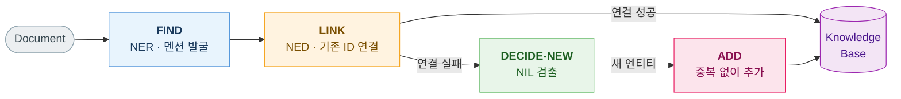
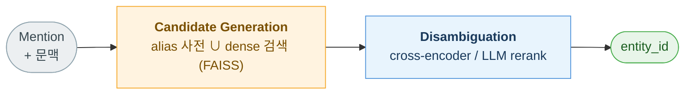
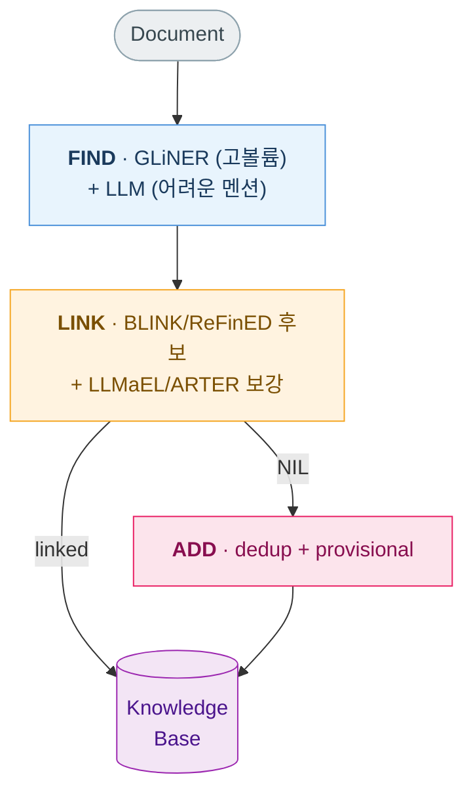

> 문서에서 엔티티를 찾고(NER), 그것을 지식베이스의 특정 ID에 연결하고(NED), 연결에 실패하면 새 엔티티를 추가하는 — 이 세 단계 파이프라인을 최신 LLM 기반 방법론 중심으로 정리합니다. 어떤 기법이 왜 등장했고, 실무에서는 무엇을 어떻게 조합하는지를 살펴봅니다. 본 글은 AI(LLM)를 활용해 관련 리서치 자료를 정리하고 초안을 작성한 뒤, 직접 검토·편집하여 완성하였습니다.

### What are NER and NED?

비정형 텍스트에서 지식을 뽑아내는 일은 보통 두 단계로 나뉩니다.

**NER(Named Entity Recognition, 개체명 인식)** 은 텍스트에서 의미 단위(사람·조직·장소·날짜 등)의 **경계(span)와 타입(type)** 을 찾아내는 작업입니다. 예를 들어 `"Apple released Vision Pro in Cupertino"` 라는 문장에서 `Apple`을 `ORG`, `Vision Pro`를 `PRODUCT`, `Cupertino`를 `LOCATION`으로 식별하는 것이 NER입니다.

**NED(Named Entity Disambiguation, 개체명 연결)** 는 — Entity Linking(EL)이라고도 부릅니다 — NER이 찾은 멘션을 지식베이스(Knowledge Base, KB)의 **특정 엔티티 ID에 결박**하는 작업입니다. 예컨대 `"Columbus"`라는 멘션은 NER 단계에서 `LOC`로 분류되고, NED 단계에서 그것이 Wikidata의 `Q16567`(오하이오주 콜럼버스 시)인지 `Q7195`(탐험가 크리스토퍼 콜럼버스)인지를 문맥으로 가려냅니다.

이 파이프라인은 (a) **지식그래프(Knowledge Graph)** 구축, (b) **RAG**에서 답변을 엔티티 단위 근거에 결박해 환각을 줄이는 grounding, (c) 엔티티 기반 검색·추천의 공통 토대입니다. "텍스트 → 엔티티 → ID → 그래프 트리플"로 이어지는 각 단계의 품질이 곧 다운스트림 시스템의 품질을 좌우합니다.

### Find → Link → Add Pipeline

실무에서 텍스트로부터 지식베이스를 채우는(KB population) 전체 흐름은 세 가지 연산으로 분해됩니다.



여기서 가장 중요한 통찰은, **"새 엔티티를 중복 없이 추가한다"는 것이 NED에 덧붙는 별개의 모듈이 아니라, 연결에 실패한 멘션에 적용하는 entity resolution(개체 정합) 그 자체**라는 점입니다. 그래서 현장의 파이프라인은 3단계가 아니라 사실상 4단계로 보는 편이 정확합니다: **FIND → LINK → DECIDE-NEW → ADD**.

이 글의 나머지는 이 네 단계를 차례로 따라갑니다.

### Before LLMs

LLM 이전의 표준 파이프라인은 **단계화된 지도학습 컴포넌트의 연쇄**였습니다. NER 쪽은 손으로 만든 피처(품사·대소문자·사전 등)를 점진적으로 제거해온 역사이고(POS → CRF → BiLSTM-CRF → BERT token-classification), EL 쪽은 "멘션 사전으로 후보 뽑기 → 문맥/링크그래프로 collective disambiguation"의 2단계였습니다(TagMe, AIDA 등).

이 계보의 공통 한계는 분명합니다.

- **라벨셋이 학습 시점에 고정** — 새 타입을 추가하려면 재학습이 필요합니다.
- **대규모 라벨링 코퍼스에 의존** — 도메인마다 비싼 주석 작업이 듭니다.
- **새 도메인·엔티티로의 전이가 취약** — OOD(out-of-domain)에 약합니다.
- **다단계 파이프라인이 오류를 전파** — 앞 단계의 누락이 뒤로 증폭됩니다.

LLM 기반 방식은 정확히 이 네 가지를 겨냥합니다. 인터페이스 자체가 달라집니다.

| 구분        | 고전 / encoder 기반   | LLM 기반 방식                      |
| ----------- | --------------------- | ---------------------------------- |
| 입력        | token sequence        | 문서 + 지시문 + 라벨 정의 + 예시   |
| 출력        | BIO tag, span list    | JSON / inline marker / 생성 텍스트 |
| 타입 확장   | 재학습 필요           | 자연어 정의로 zero/few-shot        |
| 도메인 적응 | 라벨링 데이터         | 프롬프트·검색·증류·LoRA            |
| 약점        | OOD 취약, 라벨셋 고정 | 환각, offset 오류, 비용·지연       |

다만 **LLM이 기존 방식을 완전히 대체하지는 않았습니다.** 인도메인 뉴스 벤치마크에서는 여전히 특화된 작은 모델이 천장을 잡고 있고, LLM은 라벨이 없거나 long-tail이거나 OOD인 상황에서 빛납니다. 그래서 실무의 지배적 패턴은 **하이브리드**입니다.

### Find: LLM-based NER

NER을 LLM으로 한다는 것은 본질적으로 **"시퀀스 라벨링 문제를 텍스트 생성 문제로 바꾸는 것"** 이며, 그 변환이 만들어내는 실패 모드(환각, span 오류)와 싸우는 일입니다. 먼저 가장 중요한 엔지니어링 규칙 하나를 못 박겠습니다.

##### 황금률: LLM에게 문자 offset을 요구하지 마라

LLM에게 `{"text": "Apple", "start": 0, "end": 5}` 처럼 **문자 단위 offset을 직접 출력하게 하면 성능이 붕괴**합니다. 한 연구(_Assessment of Generative NER_, 2026)의 비교에서, offset 기반 JSON 출력은 약 **29 F1**까지 떨어진 반면, 엔티티를 문장 안에 그대로 표시하는 inline 방식은 약 **90 F1**을 기록했습니다. 정밀한 문자 위치 계산은 텍스트를 생성하는 LLM의 본성과 맞지 않기 때문입니다.

> 처방은 간단합니다. **엔티티를 표면형 문자열이나 inline 마커로 받고, offset은 후처리에서 결정론적 문자열 검색으로 복원**하세요. (같은 문자열이 여러 번 등장하는 경우는 명시적으로 처리해야 합니다.)

##### 방법 1. Prompted Structured Extraction

가장 직접적인 방식은 문서와 스키마를 주고 엔티티 배열을 생성하게 하는 것입니다. 이때 핵심은 자유 형식 답변을 금지하고 **structured output / constrained decoding** 을 쓰는 것입니다. OpenAI의 `response_format`, Gemini의 `response_schema`, 또는 오픈모델용 Outlines·Instructor(Pydantic) 같은 도구가 출력이 JSON 스키마를 벗어나지 못하도록 매 토큰 단계에서 강제합니다.

```json
{
  "entities": [
    {
      "mention_text": "Apple",
      "entity_type": "organization",
      "confidence": 0.87
    }
  ]
}
```

주의할 점: 구조를 보장한다고 **내용의 정확성까지 보장되지는 않습니다.** 스키마는 맞지만 환각이거나 타입이 틀린 엔티티가 통과할 수 있으므로, 다운스트림에 검증 레이어를 둬야 합니다. 또한 타입은 enum으로 제한해 DB에 없는 타입을 만들지 못하게 합니다.

##### 방법 2. Generative NER (inline marker)

**GPT-NER** 는 시퀀스 라벨링을 생성으로 재구성한 대표 사례입니다. 문장을 다시 쓰면서 엔티티를 특수 마커로 감쌉니다.

```
입력 : Columbus is a city
출력 : @@Columbus## is a city      # @@ ## 가 해당 타입 엔티티를 감쌈
```

이후 마커를 파싱하고 문자열 검색으로 offset을 복원합니다. 다만 타입마다 별도 호출이 필요해 비용이 크고, 환각을 거르는 self-verification 단계가 추가로 듭니다.

##### 방법 3. Compact Open-type Model (GLiNER)

여기서 흔한 혼동 하나를 짚겠습니다. **GLiNER 계열은 생성형 디코더 LLM이 아니라 encoder-only span 매칭 모델**입니다. 양방향 transformer로 텍스트와 라벨을 같은 공간에 임베딩하고, span 임베딩과 라벨 임베딩을 매칭해 **병렬로** 점수를 매깁니다(자기회귀 디코딩이 없음). 이것이 LLM 프롬프팅보다 근본적으로 빠른 이유입니다.

```python
from gliner import GLiNER
model = GLiNER.from_pretrained("urchade/gliner_medium-v2.1")
ents = model.predict_entities(text, labels=["Person", "Award", "Date"], threshold=0.5)
# [{'text': ..., 'label': ..., 'start': ..., 'end': ...}, ...]  ← 실제 offset 반환
```

추론 시 자연어 라벨을 건네므로 고정 라벨셋 없는 zero-shot이 가능하고, **실제 character offset을 반환**해 앞서 말한 offset 문제를 우회합니다. 파라미터가 500M 미만으로 CPU에서도 돌아 고볼륨·저지연·온프레미스 환경의 기본값으로 많이 쓰입니다(Apache-2.0).

##### 방법 4. Distillation (UniversalNER)

API 비용이 부담되거나 로컬 추론이 필요하면, **큰 LLM을 teacher로 써서 작은 모델로 증류**하는 길이 있습니다. UniversalNER는 ChatGPT가 라벨링한 데이터로 7B/13B 모델을 학습시켜, 43개 데이터셋 zero-shot 평균에서 teacher인 ChatGPT를 능가했다고 보고합니다. "LLM 수준의 라벨 유연성"과 "작은 모델의 비용"을 모두 원할 때 유용합니다.

정리하면, NER은 **① 고볼륨이면 GLiNER 같은 compact encoder, ② 라벨이 없고 까다로우면 LLM 프롬프팅(inline marker), ③ 둘 다 필요하면 증류** — 상황에 맞춰 고릅니다.

### Link: LLM-based NED

NER이 멘션을 찾았다면, 이제 그것을 KB의 ID에 연결할 차례입니다. 현대 EL은 **retrieve-then-rerank(검색 후 재순위)** 2단계 패턴이 지배적입니다.

##### 왜 DB를 통째로 프롬프트에 넣지 않는가

수백만 개에 달하는 KB 엔티티를 모두 프롬프트에 넣을 수는 없습니다. 그래서 먼저 후보를 좁힙니다.



1단계 **candidate generation** 은 정확도(precision)보다 **재현율(recall)** 이 중요합니다. 정답이 후보 안에 들어와야 2단계에서 고를 수 있기 때문입니다. 보통 alias/anchor 사전 매칭과 dense bi-encoder 검색(**BLINK** 류, 엔티티 설명을 임베딩해 FAISS로 top-k 검색)을 **합집합**으로 씁니다. 2단계 **disambiguation** 에서는 cross-encoder나 LLM이 문맥과 후보 프로필을 비교해 최종 하나를 고릅니다.

##### 황금률: LLM에게 맨몸의 KB id를 묻지 마라

NER의 offset 규칙과 짝을 이루는 NED의 규칙입니다. LLM에게 제약 없이 canonical ID를 생성하게 하면, **DB에 존재하지도 않는 그럴듯한 이름을 지어내는 환각**이 발생합니다. 출력 공간을 반드시 제약해야 합니다. 두 가지 정석이 있습니다.

- **Generative + 제약 디코딩 (GENRE):** EL을 "엔티티 이름을 한 글자씩 생성하는" 문제로 재정의하되, KB의 모든 유효 이름으로 만든 **prefix trie**로 디코딩을 제약해 실재하는 엔티티만 생성하게 합니다. 엔티티 벡터 인덱스를 저장할 필요가 없어 메모리가 작고, 새 엔티티는 trie에 이름만 추가하면 됩니다. (단, GENRE는 CC-BY-NC 라이선스라 상업 적용에 제약이 있습니다.)
- **Retrieve-then-rerank (BLINK):** 위 다이어그램처럼 후보를 검색한 뒤 cross-encoder로 재순위. ReFinED처럼 검출·타이핑·연결을 단일 forward pass로 합친 빠른 변형도 있습니다.

##### LLM은 linker가 아니라 helper로

2024–2025의 핵심 흐름은 LLM을 연결기 자체로 쓰지 않고, **어려운 케이스 처리**나 **문맥 보강**에 쓰는 것입니다.

- **LLMaEL** — LLM에게 멘션 중심의 설명문을 생성하게 해 원 문맥에 덧붙이고, 그 보강된 입력을 기존 EL 모델(BLINK/GENRE/ReFinED)에 그대로 넣습니다. LLM은 long-tail 엔티티의 세계지식을 공급할 뿐, 연결기 자체는 아닙니다.
- **ARTER** — 쉬운 멘션과 어려운 멘션을 라우터로 분기합니다. 쉬운 것은 값싼 모델이 즉시 처리하고, 어려운 소수만 LLM이 후보 목록에서 객관식으로 고릅니다(자유 생성이 아니라 선택). 모든 멘션에 LLM을 쓴 시스템과 비슷한 정확도를 약 절반 토큰으로 달성했다고 보고합니다.

핵심 규칙 하나: LLM은 **후보 안에 정답이 포함되어 있어야만** 고를 수 있으므로, candidate 단계의 recall@k를 최종 정확도와 **별도로** 측정해야 합니다.

### Add: When the Entity is New

기성 연결기(BLINK·GENRE·ReFinED)는 FIND와 LINK만 합니다. **어느 것도 스스로 새 엔티티를 만들지 못합니다.** 세상의 정보는 멈춰 있지 않으므로(신조어·신약·신생 기업), 연결 실패를 단순 에러가 아니라 "새 엔티티 후보"로 다뤄야 합니다. 이 단계는 둘로 나뉩니다.

##### DECIDE-NEW: 정말 새것인가

연결에 실패한 멘션을 **NIL**(KB에 대응이 없음)로 판정합니다. 단, 점수가 임계값 아래라고 무조건 NIL로 퉁치면 위험합니다. 한 연구(_Learn to Not Link_)는 NIL이 단일하지 않음을 보였습니다.

- **Missing Entity** — KB에 없는 진짜 엔티티 → ADD 트리거
- **Non-Entity Phrase** — 애초에 엔티티가 아닌 문자열 → ADD 하면 안 됨

**전자만 다음 단계로 보내야** KB가 비-엔티티로 오염되지 않습니다. 또한 "후보 검색 실패"와 "실제로 DB에 없음"은 다릅니다. 성급히 생성하기 전에 alias 확장·재검색으로 retrieval miss를 줄여야 합니다.

##### ADD = Entity Resolution

새 엔티티 추가는 곧 **중복 없이 정규화해 삽입하는 entity resolution** 입니다. `"Joe's Building Company"`, `"Joe's Bldg Inc."`, `"Joe's LLC"` 가 모두 따로 들어가면 지식그래프가 순식간에 파편화됩니다. 실무에서는 다음을 지킵니다.

- **dedup 먼저:** 생성 전에 canonical name·alias·임베딩 유사도로 기존 엔티티를 검색합니다. 값싼 임베딩 검색(recall)과 비싼 LLM 검증(precision)을 짝지어 과병합을 막습니다(EDC, LLM-CER 같은 접근).
- **provisional 상태로 시작:** 자동 생성된 엔티티는 곧바로 `active`가 아니라 `provisional`로 두고, 중요 경로에서는 사람 검수 전까지 사용을 제한합니다.
- **provenance와 merge log:** 모든 산출물에 근거(어느 문서·span)를 붙이고, 나중에 중복으로 판명되면 삭제가 아니라 **merge**로 되돌릴 수 있게 이력을 남깁니다.

핵심은 **mention / entity / link decision / provenance / merge event를 분리해 저장하는 데이터 모델**입니다. LLM은 모호한 자연어 판단을 크게 개선하지만, ID를 안정적으로 관리하는 책임은 여전히 시스템 설계에 있습니다.

### Practical Recipe

실무의 지배적 답은 "LLM 하나로 끝"이 아니라 **계층별 조합**입니다.

| 단계       | 권장 도구                                       | 비고                       |
| ---------- | ----------------------------------------------- | -------------------------- |
| FIND (NER) | 고볼륨·저지연 → **GLiNER / NuNER Zero**         | 실제 offset 반환, CPU 가능 |
|            | 라벨 없음·long-tail → **frontier LLM 프롬프팅** | inline marker, offset 금지 |
| LINK (NED) | candidate gen → **alias 사전 ∪ BLINK(dense)**   | recall 우선                |
|            | disambiguation → **ReFinED / GENRE**            | 출력 공간 제약 필수        |
|            | long-tail·어려운 케이스 → **LLMaEL / ARTER**    | LLM은 helper로             |
| DECIDE-NEW | **NIL 분류** (Missing vs Non-Entity)            | 학습된 결과 > 손튜닝 임계  |
| ADD        | **canonicalize-or-create + dedup**              | provisional + merge log    |

비용 감각도 중요합니다. 인접 분류 태스크의 공개 수치를 보면 LLM 프롬프팅은 fine-tuned encoder 대비 **추론 비용이 25~381배, 지연이 3~10배** 더 들었습니다(정확도 차이는 미미). 그래서 원칙은 한 줄로 요약됩니다 — **값싼 모델이 흔한 케이스를 처리하고, LLM은 어려운 tail에만 예약**하라.



### Summary

- **파이프라인은 4단계로 보라:** FIND(NER) → LINK(NED) → DECIDE-NEW(NIL 검출) → ADD(정규화·중복 제거). 기성 연결기는 앞 두 단계만 하므로 뒤 두 단계는 직접 붙여야 합니다.
- **NER 황금률:** LLM에게 문자 offset을 요구하지 마라(90→29 F1 붕괴). inline marker/문자열로 받고 offset은 검색으로 복원하라. encoder-span(GLiNER) ≠ 생성 LLM 임을 구분하라.
- **NED 황금률:** 맨몸 KB id를 묻지 마라. 출력 공간을 제약(GENRE trie) 또는 후보로 한정(BLINK retrieve-rerank)해 환각을 구조적으로 제거하라. LLM은 라우팅·문맥 보강에 쓰라.
- **ADD = entity resolution:** NIL을 Missing-Entity와 Non-Entity로 나누고, dedup·provisional·merge log로 KB 무결성을 지켜라.
- **프로덕션 기본값은 하이브리드:** 고볼륨은 작은 모델, 어려운 tail만 LLM. 정확성·비용·지연을 단계별로 관리하라.

### References

- [GPT-NER (2023)](https://arxiv.org/abs/2304.10428) · [GLiNER (NAACL 2024)](https://arxiv.org/abs/2311.08526) ([GitHub](https://github.com/urchade/GLiNER)) · [UniversalNER (ICLR 2024)](https://arxiv.org/abs/2308.03279)
- [Assessment of Generative NER (2026)](https://arxiv.org/abs/2601.17898) · [NuNER Zero](https://huggingface.co/numind/NuNER_Zero)

- [BLINK (EMNLP 2020)](https://aclanthology.org/2020.emnlp-main.519/) · [GENRE (ICLR 2021)](https://arxiv.org/abs/2010.00904) · [ReFinED (NAACL 2022)](https://arxiv.org/abs/2207.04108)
- [EntGPT (2024)](https://arxiv.org/abs/2402.06738) · [LLMaEL (CIKM 2025)](https://arxiv.org/abs/2407.04020) · [ARTER (EMNLP 2025)](https://arxiv.org/abs/2510.20098)

- [Learn to Not Link (Findings of ACL 2023)](https://aclanthology.org/2023.findings-acl.690/) · [BLINKout (CIKM 2023)](https://arxiv.org/abs/2302.07189) · [EDC (EMNLP 2024)](https://arxiv.org/abs/2404.03868)

- [OpenAI Structured Outputs](https://platform.openai.com/docs/guides/structured-outputs) · [Outlines](https://github.com/dottxt-ai/outlines) · [Instructor](https://python.useinstructor.com/) · [spaCy-llm](https://spacy.io/usage/large-language-models)
