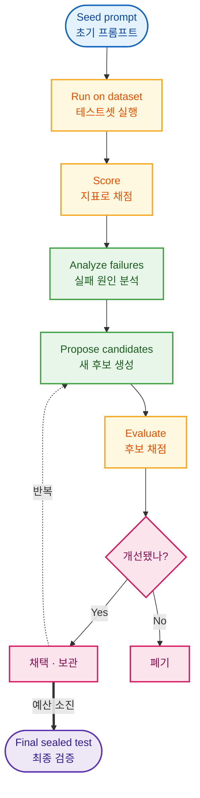
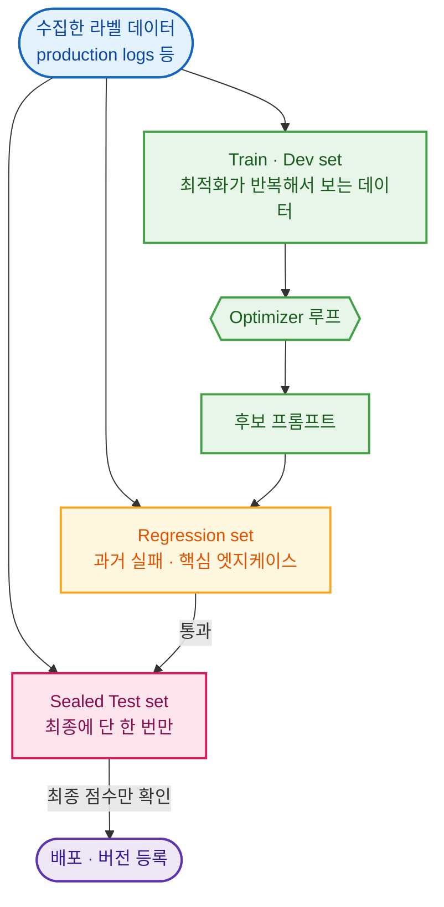
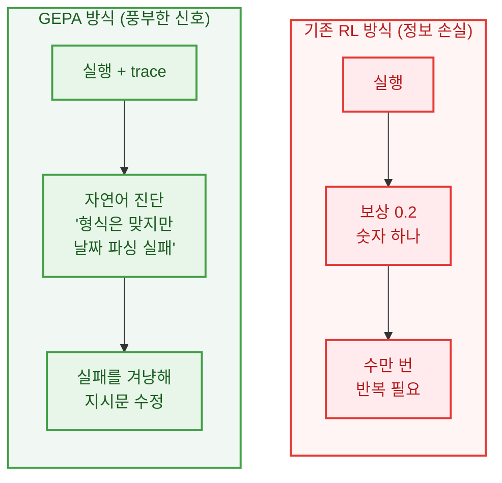

> 감으로 프롬프트를 고치는 대신, 테스트셋과 평가 지표를 정해두고 점수를 올리는 방향으로 LLM 프롬프트를 자동 개선하는 실무 방법론을 정리합니다. 공통 최적화 루프부터 대표적인 알고리즘(GEPA, OPRO, MIPROv2 등)과 도구(DSPy, Braintrust 등), 그리고 과적합을 막는 운영 프로토콜까지 초보자 눈높이로 다룹니다. 본 포스팅은 AI를 활용해 관련 자료를 리서치하고 작성하였습니다.

### From Vibes to Evals

프롬프트를 작성해본 사람이라면 누구나 이런 경험이 있을 겁니다. "한국어로만 답하세요"라는 문장을 추가했더니 어떤 케이스는 좋아졌는데, 다른 케이스가 망가집니다. 그래서 다시 고치면 또 다른 곳이 깨집니다. 이렇게 **직관과 시행착오에 의존하는 프롬프트 엔지니어링**은 케이스가 몇 개 안 될 때는 통하지만, 입력이 다양해지고 여러 단계가 얽힌 시스템이 되면 금방 한계에 부딪힙니다.

해결의 출발점은 관점을 바꾸는 것입니다. 프롬프트를 "잘 쓰면 좋은 글"이 아니라, 모델의 가중치나 하이퍼파라미터처럼 **점수로 측정하고 개선할 수 있는 파라미터**로 보는 것입니다. 그러려면 먼저 "좋다"를 숫자로 정의해야 합니다. 즉, **테스트셋(입력과 기대값의 모음)** 과 **평가 지표(metric)** 를 정해두고, 같은 기준으로 여러 후보 프롬프트를 채점해 더 높은 점수의 프롬프트를 찾습니다.

이 글에서 다루는 모든 방법은 결국 이 한 가지 아이디어의 변형입니다. **"데이터와 채점 함수가 있으면, 프롬프트 개선을 반복 가능한 최적화 문제로 만들 수 있다."**

### The Core Loop

테스트셋 기반 최적화는 방법이 무엇이든 거의 같은 폐루프(closed loop)로 수렴합니다. 그림으로 보면 직관적입니다.

각 단계를 풀어보면 이렇습니다.

1. **초기 프롬프트(seed)** 로 시작합니다. 지금 쓰고 있는 프롬프트면 됩니다.
2. 테스트셋에 대해 **실행**하고, 정해둔 **지표로 채점**합니다.
3. 틀린 케이스를 모아 **왜 실패했는지** 분석합니다.
4. 그 분석을 바탕으로 **새 후보 프롬프트들**을 만듭니다.
5. 후보들을 다시 채점해 **더 나은 것만 남깁니다.**
6. 예산(시도 횟수, 비용)이 소진되면, 최적화에 쓰지 않은 **별도 테스트셋으로 최종 검증**합니다.

방법론들의 차이는 결국 4번(후보를 어떻게 만드는가)과 3번(실패 정보를 얼마나 풍부하게 쓰는가)에서 갈립니다. 사람이 직접 고치면 수동 루프, LLM이 자동으로 고치면 자동 최적화입니다.

### Build Your Eval First

최적화 알고리즘을 고르기 전에, **평가 체계(eval)를 먼저 갖추는 것**이 훨씬 중요합니다. 좋은 데이터셋과 신뢰할 수 있는 지표가 없으면, 아무리 똑똑한 옵티마이저도 엉뚱한 방향으로 프롬프트를 망가뜨립니다.

##### 지표(metric)를 작업 종류에 맞게 정한다.

가능하면 정답과 기계적으로 비교할 수 있는 객관적 지표가 가장 좋습니다.

| 작업 | 좋은 지표 예시 |
|---|---|
| 분류(Classification) | exact match, F1, confusion matrix |
| 정보 추출(Extraction) | 필드별 F1, JSON 스키마 유효성 |
| RAG 질의응답 | 정답 정확도, 출처 근거(faithfulness), 검색 recall |
| 에이전트/도구 사용 | 최종 성공 여부, 도구 호출 유효성, 비용/지연 |
| 요약/생성 | 사람 라벨 기반 judge, 환각 패널티, 길이 |

정답을 숫자로 매기기 어려운 경우(친절함, 톤 등)에는 **LLM-as-judge**(LLM이 채점)를 쓰지만, 이 judge는 반드시 **사람이 매긴 점수와 맞는지 검증(calibration)** 해야 합니다. 검증 안 된 judge는 "장황한 답을 선호" 같은 편향으로 최적화를 오염시킵니다.

##### 데이터를 반드시 나눈다.

같은 데이터를 계속 보면서 프롬프트를 고치면, 그 데이터셋은 사실상 훈련셋이 되어버립니다. 그래서 최소한 다음처럼 분리합니다.

이 분리만 제대로 해도 "리더보드 점수만 높고 실사용은 별로인 프롬프트"를 상당히 걸러낼 수 있습니다.

### Manual Hill Climbing

가장 기본이자, 의외로 강력한 방법은 **사람이 직접 도는 루프**입니다. 자동 알고리즘을 도입하기 전에 이 루프부터 갖추는 것이 정석입니다.

1. baseline 프롬프트를 정한다.
2. 데이터셋과 채점기를 만든다.
3. 실행 후 **실패 케이스**를 모아 패턴을 찾는다.
4. 패턴별로 지시문·예시·출력 형식을 수정한다.
5. 같은 데이터셋에서 다시 채점해 개선/회귀를 비교한다.

자동 옵티마이저가 없어도, 이 루프만 있으면 "감으로 고치기"보다 훨씬 재현성이 높습니다. 그리고 여기서 쌓인 실패 케이스 모음과 채점기가 그대로 자동 최적화의 입력이 됩니다.

### Letting the LLM Optimize

수동 루프가 익숙해지면, 후보 생성을 **LLM에게 맡겨 자동화**할 수 있습니다. 대표적인 방법들은 크게 두 계열로 나뉩니다.

##### 진화/탐색 계역

프롬프트를 문자열로 보고, LLM이 여러 후보를 만들어 점수로 선택·반복합니다.
- **APE**: 입출력 예시로부터 LLM이 지시문 후보를 거꾸로 유도해 채점합니다. 초기 프롬프트가 거의 없을 때 좋습니다.
- **OPRO**: 지금까지 시도한 (프롬프트, 점수) 이력을 LLM에게 보여주면, 더 높은 점수를 낼 새 후보를 제안합니다. "Take a deep breath..." 지시문을 발견한 사례로 유명합니다.
- **PromptBreeder / EvoPrompt**: 유전 알고리즘처럼 변이·교차를 LLM이 수행해 세대별로 진화시킵니다.

##### 그래디언트 유사 계열

프롬프트를 미분 가능한 파라미터처럼 보고, 자연어 "피드백"을 역전파하듯 흘려 보냅니다.

- **ProTeGi / TextGrad**: 실패에 대한 LLM의 비평을 "텍스트 그래디언트"로 취급해 프롬프트를 그 반대 방향으로 수정합니다.

이름은 다양하지만, 전부 앞에서 본 공통 루프(Core Loop)의 후보 생성 방식을 바꾼 것뿐이라는 점을 기억하면 헷갈리지 않습니다.

### GEPA: Reflective Evolution

최근 가장 주목받는 방법은 2025년 공개되고 ICLR 2026 Oral로 채택된 **GEPA(Genetic-Pareto)** 입니다. 초보자가 이해하기 좋은 비교는 강화학습(RL)과의 대조입니다.

RL은 결과를 `0.2` 같은 **숫자 하나**로 압축하기 때문에 "왜 틀렸는지"를 잃어버리고, 그래서 엄청나게 많은 시도가 필요합니다. 반면 GEPA는 LLM 시스템의 실행 과정이 대부분 **자연어 기록(trace)** 으로 남는다는 점을 이용합니다. 핵심 아이디어는 세 가지입니다.

- **Reflection(반영형 변이)**: 강한 LLM이 실패한 실행 trace를 읽고 "무엇이 왜 실패했는지"를 자연어로 진단한 뒤, 그 진단을 반영한 새 지시문을 제안합니다. 숫자보다 훨씬 풍부한 학습 신호입니다.
- **Pareto frontier(다양성 유지)**: 평균 점수가 가장 높은 후보 하나만 키우면 국소 최적점에 갇히기 쉽습니다. 그래서 "어떤 케이스에서는 1등인" 후보들을 함께 보존해 다양성을 유지합니다.
- **Merge(시스템 인지 교차)**: 서로 다른 케이스에 강한 두 후보의 장점을 합쳐 새 후보를 만듭니다.

성능도 인상적입니다. 논문 기준 RL(GRPO) 대비 평균 약 +6%(최대 +20%)를 **rollout을 최대 35배 적게** 쓰고 달성했고, 기존 최강 옵티마이저 MIPROv2 대비로도 10%p 이상 앞섰습니다. 데이터가 적고 API 호출 비용이 부담스러운 실무 환경에서 특히 매력적입니다.

여기서 **흥미로운 역설**이 하나 있습니다. 보통 데이터가 많을수록 좋다고 생각하지만, GEPA의 실험에서는 500개 이상의 예제를 쓰면 오히려 성능이 떨어지고 프롬프트만 장황해졌습니다. **20~100개**의 대표 예제가 가장 좋았습니다. 프롬프트 최적화는 데이터를 통계적으로 외우는 게 아니라, 수많은 사례에서 **보편적인 규칙을 추출해 짧게 압축하는 과정**이기 때문입니다.

### DSPy and Beyond

이제 실무에서 무엇을 쓰면 되는지 봅시다. 도구는 크게 두 부류입니다.

**자동 최적화 알고리즘을 직접 돌려주는 쪽:**

- **DSPy**: LLM 파이프라인을 `question -> answer` 같은 시그니처로 선언하고, 프롬프트를 학습 대상 파라미터로 두는 사실상의 표준 프레임워크입니다. `dspy.GEPA`, `MIPROv2` 등 옵티마이저를 골라 쓸 수 있습니다.
- **gepa 라이브러리 / MLflow / DeepEval / Opik**: GEPA를 코어로 채택했거나 여러 옵티마이저를 제공합니다. 이미 쓰는 스택(MLflow registry, Python test 코드 등)에 맞춰 고르면 됩니다.

**평가·회귀 테스트 루프를 제공하는 쪽(사람이 루프를 돔):**

- **Braintrust / LangSmith / Promptfoo / Parea**: 데이터셋, 채점기, 실험 비교, 버전 관리, CI 품질 게이트를 묶어줍니다. 자동 재작성보다 운영형 eval과 배포 안전장치가 중요할 때 좋습니다.

| 상황 | 우선 검토 |
|---|---|
| 빠르게 eval 루프부터 만들고 싶다 | Promptfoo, Braintrust, LangSmith |
| Python 코드에서 자동 옵티마이저를 돌리고 싶다 | DSPy(GEPA/MIPROv2), gepa, DeepEval |
| 자연어 피드백과 trace가 풍부하다 | GEPA |
| 정답 라벨은 있지만 피드백은 약하다 | MIPROv2, PromptWizard |
| CLI/CI에서 회귀 테스트를 하고 싶다 | Promptfoo |

> GEPA와 MIPROv2 중 고민된다면 간단한 기준이 있습니다. **자연어 피드백·trace가 풍부하고 데이터가 적으면 GEPA**, **few-shot 예시까지 함께 튜닝하고 데이터·컴퓨팅이 충분하면 MIPROv2** 입니다.

### Avoiding Overfitting

테스트셋에 점수를 맞추는 작업에는 항상 **과적합과 judge 해킹**이라는 그림자가 따라옵니다. 마지막으로 실무에서 꼭 챙겨야 할 안전장치를 정리합니다.

- **데이터를 분리한다.** 최적화는 train/dev에서만, 최종 보고는 한 번도 안 본 sealed test에서. (가장 중요)
- **judge를 사람과 정렬한다.** 주관적 지표를 LLM judge에 맡길 때는, judge가 사람 점수와 일치하는지 먼저 검증합니다.
- **길이에 상한을 둔다.** 제약이 없으면 프롬프트가 엣지케이스마다 예외 조항을 덧붙이며 5,000자로 부풀어 비용·지연이 폭증합니다. 길이 제한은 일종의 정규화(regularization)입니다.
- **자원을 비대칭으로 쓴다.** 채점(자주 호출)은 저렴한 소형 모델로, 반영·제안(가끔 호출)은 비싸고 똑똑한 프론티어 모델로. GEPA가 RL 대비 비용을 크게 낮춘 비결입니다.
- **회귀 테스트로 등록한다.** 최적화한 프롬프트를 CI에 넣어, 모델 교체나 수정 때마다 점수 하락을 자동 감지합니다.

체크리스트로 요약하면 이렇습니다.

- eval 점수↑인데 실사용 품질↓ → 과적합/테스트셋 누수 의심
- 지표가 형식만 보고 의미를 못 봄 → judge rubric 보강
- 후보가 지나치게 장황 → 길이 제약, 지시문형(GEPA) 고려
- 옵티마이저/반영 모델이 약함 → 반영 단계엔 강한 모델 사용

### Wrapping Up

테스트셋 기반 프롬프트 최적화의 본질은 화려한 알고리즘이 아니라, **"프롬프트를 코드처럼 테스트하고, 모델처럼 검증하고, 제품처럼 배포 게이트를 거는 운영 체계"** 입니다. GEPA 같은 방법이 강력한 이유도 후보를 많이 만들어서가 아니라, 실패를 자연어 학습 신호로 바꾸고 다양성을 유지하기 때문입니다.

그래서 실무 도입 순서는 보통 다음이 맞습니다.

1. Promptfoo/Braintrust/LangSmith 등으로 **데이터 기반 eval 루프**를 먼저 만든다.
2. baseline 프롬프트와 **실패 유형(failure taxonomy)** 을 확보한다.
3. 현재 스택에 맞는 자동 옵티마이저(DSPy GEPA, MLflow 등)를 붙인다.
4. MIPROv2/OPRO 같은 대안을 **같은 데이터 분할**에서 비교한다.
5. sealed test와 canary 배포로 일반화 성능을 확인한 뒤 프롬프트를 승격한다.

결국 앞으로 AI 엔지니어의 핵심 역량은 "프롬프트를 유려하게 쓰는 능력"보다, **시스템의 진짜 목표를 재는 견고한 평가 지표와 좋은 테스트셋을 설계하는 능력**으로 옮겨갈 것입니다.

### References

- GEPA: [Reflective Prompt Evolution Can Outperform Reinforcement Learning (arXiv:2507.19457)](https://arxiv.org/abs/2507.19457), [gepa-ai/gepa](https://github.com/gepa-ai/gepa)
- DSPy: [Prompt Optimizing with GEPA](https://dspy.ai/getting-started/gepa-optimization/), [Choosing an Optimizer](https://dspy.ai/diving-deeper/choosing-an-optimizer/)
- OPRO: [Large Language Models as Optimizers (arXiv:2309.03409)](https://arxiv.org/abs/2309.03409)
- APE: [LLMs Are Human-Level Prompt Engineers (arXiv:2211.01910)](https://arxiv.org/abs/2211.01910)
- TextGrad: [Automatic "Differentiation" via Text (arXiv:2406.07496)](https://arxiv.org/abs/2406.07496)
- MIPROv2: [Optimizing Instructions and Demonstrations (arXiv:2406.11695)](https://arxiv.org/abs/2406.11695)
- Braintrust: [The prompt optimization loop](https://www.braintrust.dev/articles/prompt-optimization-loop)
- Promptfoo: [Getting started](https://www.promptfoo.dev/docs/getting-started/)
